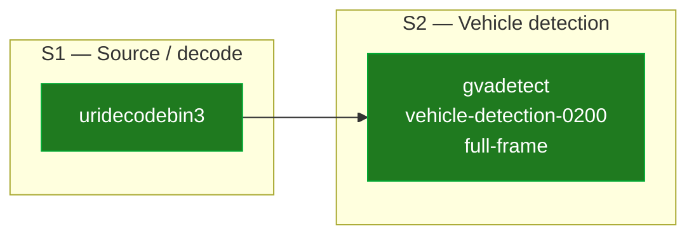
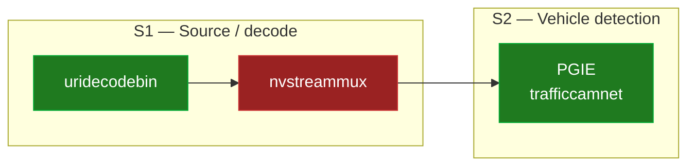

# Documentation Specification

Used by **step 7 (Document)** of [`convert-app.prompt.md`](../../../prompts/convert-app.prompt.md).

This file is the single source of truth for what the converted app's
documentation MUST contain. The agent MUST generate the README based on the
[README Template](../assets/README-template.md), adapted for C++, with **all**
the sections and tables specified below.

## 1. Required README sections (in order)

1. **Title + one-paragraph synopsis** — what the app does, what hardware it
   targets.
2. **Source application** — original repo URL, commit hash from
   `git rev-parse HEAD`, brief description of the source app's behavior.
3. **Prerequisites** — DL Streamer install, drivers (GPU/NPU), required
   models, any system packages, and the **full env-setup recipe**
   reproduced verbatim from
   [`conversion-bootstrap.md`](./conversion-bootstrap.md) §4.1. The README
   MUST include all four steps of that recipe (install detection,
   `set +u` / `source setup_dls_env.sh` / `set -u`, prepending
   `Release/lib` to both `GST_PLUGIN_PATH` and `LD_LIBRARY_PATH` plus
   `opencv/lib`, and `GST_PLUGIN_FEATURE_RANK=kmssink:NONE,...`) — not
   only the bare `source setup_dls_env.sh` line, which on its own does
   not produce a working environment on most installs.
4. **Build**

   ```bash
   cmake -S . -B build && cmake --build build -j$(nproc)
   ```

   This MUST be the exact command line documented in the README — it matches
   the build invocation enforced by
   [`validation-protocol.md`](./validation-protocol.md) §2 and the
   [`final-audit-checklist.md`](./final-audit-checklist.md). Do not document a
   different recipe (e.g. `mkdir build && cd build && cmake .. && make`) —
   that would diverge from what the validation step actually runs.

5. **Run** — exact command line with all arguments and a working example
   invocation, e.g.

   ```bash
   ./build/<app_name> --input videos/sample.mp4 --model models/<model>.xml --device GPU
   ```

   Also document the `run.sh` wrapper invocations:
   - `./run.sh` (defaults)
   - `./run.sh --sink display|file|fake`
   - `./run.sh --help`

6. **Command-Line Arguments** — table describing every CLI flag of the binary
   AND every flag/env var of the `run.sh` wrapper. Columns: name, type,
   default, description.
7. **Expected Output** — what the user should see (annotated video, JSON file,
   console logs, FPS counter line).
8. **Pipeline Comparison** — Mermaid diagram (spec in §2 below).
9. **Conversion Notes** — sub-sections detailed in §3 below.
10. **Observed Output** — clean-shell test results (spec in §4 below).

> **Section-numbering convention.** The `§N.M` headings inside §2, §3, and §4
> below number sub-rules **within this spec**, not the section numbers in the
> generated README. In the README, every numbered sub-section MUST be
> renumbered to match its parent README section from §1: e.g. the Pipeline
> Comparison sub-headings become `### 8.1`, `### 8.2`, `### 8.3`; the
> Conversion Notes sub-headings become `### 9.1` … `### 9.9`.

## 2. Pipeline Comparison diagram (mandatory)

Two Mermaid flowcharts that show the converted (DL Streamer) and the reference
(source) pipelines. The diagrams go in the README under a dedicated
`## 8. Pipeline Comparison` section (per the §1 ordering), **placed before**
`## 9. Conversion Notes`.

### 2.1 Layout rules (MANDATORY)

These layout rules exist so the diagrams render legibly on GitHub (which has
a fixed Mermaid viewport width) and so the two pipelines can be compared by
eye:

1. **Two separate ```` ```mermaid ```` blocks**, not one block with two
   `subgraph`s side-by-side. GitHub's Mermaid renderer auto-lays-out sibling
   subgraphs **horizontally**, which produces unreadably small nodes on real
   pipelines. Two top-level blocks are stacked vertically by the surrounding
   Markdown — the desired layout.
2. **DL Streamer block first**, **DeepStream / source block second**. The
   converted target is the primary subject of the document; the source is the
   reference. Use sub-section headings `### 8.1 DL Streamer / OpenVINO (this
   port)` and `### 8.2 <Source framework> (source)`.
3. **Each block uses `flowchart LR`** so element flow is **left → right**.
   Do **not** use `flowchart TB` for either block.
4. **Group elements into numbered logical stage boxes** (`subgraph S1["S1 —
   …"]`, …`Sn`). The stage boxes MUST be identical and identically numbered
   in both diagrams so that "stage N in DLS" ↔ "stage N in source" is
   unambiguous. Recommended canonical stages for a vision pipeline (omit any
   that do not apply to the specific app):

   | Stage | Purpose |
   |---|---|
   | **S1** | Source / decode |
   | **S2** | Primary detection (PGIE) |
   | **S3** | Tracking |
   | **S4** | Secondary detection (SGIE0) |
   | **S5** | Classification / OCR / SGIE1 |
   | **S6** | Overlay / metrics / OSD |
   | **S7** | Encode / sink |

5. **Add a Markdown stage-by-stage mapping table** (sub-section `### 8.3
   Stage-by-stage mapping` in the README) immediately after the second diagram. One row per
   stage box, columns: `Stage | DLS element(s) | Source element(s) | Notes`.
   This table is the textual counterpart of the diagrams and must always
   agree with them.
6. Place the **colour legend** in a separate Markdown table beneath the
   stage-mapping table, not as Mermaid nodes inside either diagram (legend
   nodes inflate the viewport and shrink the real pipeline).

### 2.2 Colour coding

Use colours to classify each node. Apply colours by `classDef` + `class …`
statements at the end of each Mermaid block (not inline `style` directives,
which fight with `classDef`):

- **Green** (`fill:#1f7a1f,color:#fff,stroke:#0a3`) — functionally equivalent
  stages present in both pipelines.
- **Red** (`fill:#9a2222,color:#fff,stroke:#c33`) — stages present in the
  reference pipeline but absent (N/A) in the converted pipeline, or vice
  versa. Only appears in the diagram that actually contains the element.
- **Orange** (`fill:#a55a00,color:#fff,stroke:#c70`) — stages that exist in
  both pipelines but differ significantly in implementation (e.g. different
  model architecture, different inference region, merged functionality).
- **Blue** (`fill:#1864ab,color:#fff,stroke:#36b`) — stages that are new in
  the converted pipeline with no direct counterpart in the reference
  (e.g. `vapostproc` for VA → system-memory transfer).

### 2.3 Required structure inside each diagram

- Each leaf node label MUST name the **concrete element/plugin** and, where
  meaningful, the model file and the inference region (e.g.
  `gvadetect<br/>vehicle-detection-0200<br/>full-frame`).
- Connect nodes with arrows (`-->`) showing data flow **between** stage boxes
  as well as inside multi-element stage boxes (e.g.
  `vapostproc --> gvawatermark --> gvafpscounter` inside `S6`).
- Both diagrams MUST cover the same stage set (boxes with no element in one
  pipeline may either be omitted or rendered with a single placeholder node
  classed `red`).

### 2.4 Anti-patterns (do NOT do these)

- ❌ A single ```` ```mermaid ```` block with `flowchart TB` and two sibling
  subgraphs that each set `direction LR` — GitHub renders the two subgraphs
  horizontally, defeating rule 1.
- ❌ Subgraphs with `direction TB` inside a `flowchart LR` outer — element
  flow becomes top-to-bottom inside each block, violating rule 3.
- ❌ Mixing the colour legend with pipeline nodes inside the Mermaid block.
- ❌ Element nodes without the concrete element/plugin name (e.g. labelling a
  node simply "OCR" instead of `gvaclassify<br/>ch_PP-OCRv4_rec_infer`).
- ❌ Reordering the two diagrams so the source pipeline appears first — the
  converted target is always primary.

### 2.5 Minimal skeleton

````markdown
## 8. Pipeline comparison

Both pipelines flow **left → right**. The two diagrams are rendered as
separate Mermaid blocks stacked vertically (DL Streamer on top — the converted
target — source pipeline below as the reference). Each element is grouped
into a numbered **logical stage box** (S1 … Sn); identical stage numbers in
the two diagrams identify functional counterparts.

### 8.1 DL Streamer / OpenVINO (this port)



### 8.2 NVIDIA DeepStream (source)



### 8.3 Stage-by-stage mapping

| Stage | DL Streamer (this port) | <Source framework> (source) | Notes |
|---|---|---|---|
| **S1** Source / decode | `uridecodebin3 caps=video/x-raw(ANY)` | `uridecodebin` → `nvstreammux` | DLS has no muxer — single-stream pipeline. |
| **S2** Vehicle detection | `gvadetect vehicle-detection-0200` (full-frame) | PGIE `trafficcamnet` | OpenVINO SSD replaces TAO model. |
| … | … | … | … |

**Legend**

| Colour | Meaning |
|---|---|
| 🟩 **green** | Functional equivalent present in both pipelines. |
| 🟧 **orange** | Element retained but behaviour differs (scope, region, etc.). |
| 🟦 **blue** | New DLS-only element required by the Intel stack. |
| 🟥 **red** | Source-only element with no DLS counterpart — intentionally omitted. |
````

## 3. Conversion Notes — required sub-sections

The `## 9. Conversion Notes` section MUST contain the following sub-sections
(any that do not apply may be marked "N/A — <reason>"). In the README, the
sub-section numbers below MUST be re-prefixed with `9.` to match the parent
section number from §1 — e.g. `### 9.1 Model substitutions`,
`### 9.2 Label file indexing`, … `### 9.9 Open issues / TODOs`.

### 3.1 Model substitutions

Table listing every model used by the source app and its Intel-compatible
replacement. Columns:

| Original model | Framework | Task | Replacement | Source URL | License | Character set / language | Precision | Equivalence rationale | Trade-offs |

The `Character set / language` column is **mandatory for OCR / text-recognition
models** (LPR, scene text, etc.). State explicitly: dictionary size, languages
supported (e.g. "English (A–Z, 0–9, CTC blank)"), and a note if the model is
**not** suited for inputs outside that language. See
[`model-sourcing.md`](./model-sourcing.md) for the rules.

### 3.2 Label file indexing

For every SSD-style detection model, document the verified mapping:

```
class_id 0 = background  → labels line 0 = "background"
class_id 1 = vehicle     → labels line 1 = "vehicle"
class_id 2 = license-plate → labels line 2 = "license-plate"
```

### 3.3 Inference mode selection

For every secondary detector that was a candidate for `inference-region=roi-list`,
record the A/B test result:

- Detection counts (full-frame vs. roi-list).
- Maximum confidence in each mode.
- Chosen mode and rationale.

See [`pipeline-implementation.md`](./pipeline-implementation.md) §3.

### 3.4 Inference device choice

Why `GPU` / `CPU` / `NPU` was chosen as the default, what fallback is wired in,
and how the user can override it.

### 3.5 Hardware encoder fallback

The runtime encoder priority list used by the C++ code
(`vah264enc` → `vah264lpenc` → `qsvh264enc` → `openh264enc`), and which
encoder was actually selected during the validation runs.

### 3.6 Deprecation discovery (run NNN)

Table built from the per-run deprecation scan (see
[`deprecation-discovery.md`](./deprecation-discovery.md)):

| Deprecated symbol/element/file/API | Source file:line | Documented replacement |

### 3.7 Deprecated API usage justification (only if applicable)

If a deprecated API was the only viable path, document for each occurrence:

- Exact API used.
- Deprecation source file + line found in the discovery scan.
- Replacement that was attempted and the concrete reason it failed.
- Code call site reference (file:line) where the matching `TODO:` comment
  lives.

### 3.8 Excluded features (from the source app)

List any feature dropped per the *Scope → Exclude* rules (GUI frameworks,
cloud SDKs, CUDA-only extensions, training code) and what — if anything —
replaces it.

### 3.9 Open issues / TODOs

Anything intentionally left unfinished, with a pointer to the relevant
`TODO:` comments in the code.

## 4. Observed Output — clean-shell test results

For **each** of the five clean-shell invocations from
[`validation-protocol.md`](./validation-protocol.md) §3a, fill the following
table. Columns: exact clean-shell command line (`env -i HOME="$HOME" PATH=…
bash -lc 'cd <output_dir> && ./run.sh <args>'`), exit code, FPS / artifact
snippet (the final `FpsCounter(overall …)` line is ideal), and any pitfall
from [`runsh-pitfalls.md`](./runsh-pitfalls.md) that was actually triggered
(with the fix applied).

| Invocation | Exit code | FPS / artifact | Pitfall triggered (if any) |
|---|---|---|---|
| `./run.sh --help` | 0 | usage printed | — |
| `./run.sh` (defaults) | 0 | 55 fps, lpr_output.mp4 | — |
| `./run.sh --sink fake` | 0 | 172 fps | — |
| `./run.sh --sink file` | 0 | lpr_output.mp4 (1.2 MB) | — |
| `./run.sh --sink invalid` | 2 | "ERROR: unknown sink: invalid" | — |

## 5. Source traceability comments (in the C++ code, not in README)

Every logically distinct section of the converted C++ code MUST carry a
`/* --- Ref: <source_file>:<function_or_line_range> — <brief> --- */` comment
that traces it back to the reference application. Full rule and examples in
[`pipeline-implementation.md`](./pipeline-implementation.md) §9. This is
enforced at code-review time, not in the README.
