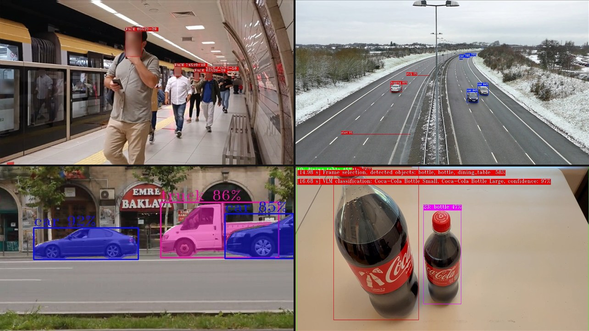

<div align="center">

# Deep Learning Streamer (DL Streamer)

**Hardware-accelerated video analytics pipelines — CPU, GPU, and NPU, from a single line of code to production-grade edge AI**

[](./LICENSE)
[](https://docs.openedgeplatform.intel.com/dev/edge-ai-libraries/dlstreamer/get_started/system_requirements.html)
[](https://docs.openedgeplatform.intel.com/dev/edge-ai-libraries/dlstreamer/get_started/system_requirements.html)
[](https://docs.openvino.ai)
[](https://gstreamer.freedesktop.org)
[](https://hub.docker.com/r/intel/dlstreamer)
[](https://github.com/open-edge-platform)



[Get Started](#-quick-start) • [Samples](./samples/gstreamer/README.md) • [Elements](https://docs.openedgeplatform.intel.com/dev/edge-ai-libraries/dlstreamer/elements/elements.html) • [Documentation](https://docs.openedgeplatform.intel.com/dev/edge-ai-libraries/dlstreamer/index.html) • [Contributing](./CONTRIBUTING.md)

</div>

---

## What is DL Streamer?

**DL Streamer** is an open-source media analytics framework built on [GStreamer](https://gstreamer.freedesktop.org). It lets you build video and audio intelligence pipelines — from a simple object detection command line to a multi-stream, multi-sensor production deployment — with minimal code.

- Powered by **[OpenVINO™](https://docs.openvino.ai)** for optimized inference on Intel CPU, GPU, and NPU.
- Pipelines are described as **simple strings** (or Python/C++ code) and executed with full hardware acceleration.
- Ships with **30+ ready-to-run samples** covering detection, classification, tracking, VLMs, LiDAR and more.
- Part of the **[Intel Open Edge Platform](https://github.com/open-edge-platform)**.

---

## Why DL Streamer?

| Benefit | Details |
|---|---|
| **One-line pipelines** | Build a working detection pipeline in a single `gst-launch-1.0` command |
| **Hardware acceleration** | Targets CPU, GPU, and NPU on Intel platforms from a single codebase |
| **VLM & GenAI ready** | Run Vision-Language Models (MiniCPM-V, CLIP, Whisper) in a GStreamer pipeline |
| **Production metadata** | Structured JSON output to MQTT, Kafka, or file with built-in elements |
| **Python-first extensibility** | Add custom logic as Python callbacks or full Python GStreamer elements — no C++ required |
| **Multi-stream, multi-sensor** | Mux/demux dozens of RTSP streams, LiDAR frames, and radar point clouds in one process |
| **Geti™ & ONNX support** | Deploy models from Intel Geti™ Studio or any ONNX/OpenVINO IR model directly |

---

## ⚡ Quick Start - Installation

### Option A — Docker (recommended, zero setup)

```bash
# Run once on the host to allow X11 forwarding from containers
xhost +local:docker

# Run Docker container in interactive mode
docker run -it --rm \
  --device /dev/dri \
  --group-add $(stat -c "%g" /dev/dri/render*) \
  -e DISPLAY=$DISPLAY \
  -e XDG_RUNTIME_DIR=/tmp \
  -v /tmp/.X11-unix:/tmp/.X11-unix \
  intel/dlstreamer:latest
```

### Option B — Native install (Ubuntu 24.04)

**Step 1 — Install GPU/NPU drivers** (one-time, detects your hardware automatically):

```bash
wget https://raw.githubusercontent.com/open-edge-platform/dlstreamer/main/scripts/DLS_install_prerequisites.sh
chmod +x DLS_install_prerequisites.sh
./DLS_install_prerequisites.sh
```

> This script detects your Intel GPU/NPU, installs the correct drivers for Ubuntu 22.04 or 24.04, and adds your user to the required groups. Use `--reinstall-npu-driver=yes` to force-reinstall the NPU driver. Run `./DLS_install_prerequisites.sh --help` for all options.

**Step 2 — Install DL Streamer**:

```bash
sudo -E wget -O- https://apt.repos.intel.com/intel-gpg-keys/GPG-PUB-KEY-INTEL-SW-PRODUCTS.PUB | gpg --dearmor | sudo tee /usr/share/keyrings/intel-gpg-archive-keyring.gpg > /dev/null
sudo -E wget -O- https://apt.repos.intel.com/edgeai/dlstreamer/GPG-PUB-KEY-INTEL-DLS.gpg | sudo tee /usr/share/keyrings/dls-archive-keyring.gpg > /dev/null
echo "deb [signed-by=/usr/share/keyrings/dls-archive-keyring.gpg] https://apt.repos.intel.com/edgeai/dlstreamer/ubuntu24 ubuntu24 main" | sudo tee /etc/apt/sources.list.d/intel-dlstreamer.list
sudo bash -c 'echo "deb [signed-by=/usr/share/keyrings/intel-gpg-archive-keyring.gpg] https://apt.repos.intel.com/openvino ubuntu24 main" | sudo tee /etc/apt/sources.list.d/intel-openvino.list'
sudo apt update && sudo apt-get install -y intel-dlstreamer
```

Full installation guide: [Install Guide for Ubuntu](https://docs.openedgeplatform.intel.com/dev/edge-ai-libraries/dlstreamer/get_started/install/install_guide_ubuntu.html) | [Windows](https://docs.openedgeplatform.intel.com/dev/edge-ai-libraries/dlstreamer/get_started/install/install_guide_windows.html)

---

## ⚡ Quick Start - Your First Pipeline

**Step 1 — Set up models and environment** (inside the container or on a native install):

```bash
export MODELS_PATH=~/models
export VIDEO=https://videos.pexels.com/video-files/1192116/1192116-sd_640_360_30fps.mp4

# Download yolo26n INT8 (one-time setup)
SCRIPT_DIR=/opt/intel/dlstreamer/scripts/download_models
python3 -m venv $SCRIPT_DIR/.venv && source $SCRIPT_DIR/.venv/bin/activate
curl -sLO https://raw.githubusercontent.com/openvinotoolkit/openvino.genai/refs/heads/releases/2026/1/samples/export-requirements.txt
pip install -q -r export-requirements.txt -r $SCRIPT_DIR/requirements.txt
python3 $SCRIPT_DIR/download_ultralytics_models.py \
  --model yolo26n.pt \
  --outdir $MODELS_PATH/yolo26n/INT8 \
  --int8
deactivate

source /opt/intel/dlstreamer/scripts/setup_dls_env.sh  # native install only
```

**Step 2 — Run the pipeline.** Change `device=GPU` to `device=CPU` or `device=NPU` — no other code changes needed.

```bash
gst-launch-1.0 \
  urisourcebin buffer-size=4096 uri=$VIDEO ! \
  decodebin3 ! \
  gvadetect model=$MODELS_PATH/yolo26n/INT8/yolo26n.xml device=GPU ! \
  queue ! \
  gvawatermark ! videoconvert ! \
  autovideosink sync=true
```

Output to JSON (works everywhere, including headless Docker):

```bash
gst-launch-1.0 \
  urisourcebin buffer-size=4096 uri=$VIDEO ! \
  decodebin3 ! \
  gvadetect model=$MODELS_PATH/yolo26n/INT8/yolo26n.xml device=GPU ! \
  queue ! \
  gvametaconvert format=json ! \
  gvametapublish file-format=json-lines file-path=output.json ! fakesink async=false
```

### Python API

Create a file `detect.py`:

```python
import gi
gi.require_version("Gst", "1.0")
from gi.repository import Gst
import os

Gst.init([])

video_url = "https://videos.pexels.com/video-files/1192116/1192116-sd_640_360_30fps.mp4"
models_path = os.environ.get("MODELS_PATH", os.path.expanduser("~/models"))
pipeline = Gst.parse_launch(f"""
    urisourcebin buffer-size=4096 uri={video_url} !
    decodebin3 !
    gvadetect model={models_path}/yolo26n/INT8/yolo26n.xml device=GPU !
    queue !
    gvametaconvert format=json !
    gvametapublish file-format=json-lines file-path=output_from_python.json ! fakesink async=false
""")

pipeline.set_state(Gst.State.PLAYING)
bus = pipeline.get_bus()
bus.timed_pop_filtered(Gst.CLOCK_TIME_NONE, Gst.MessageType.EOS | Gst.MessageType.ERROR)
pipeline.set_state(Gst.State.NULL)
```

Then run it and wait for results:

```bash
python3 detect.py
# Detection results are written to output_from_python.json as the pipeline processes frames
# Each line is a JSON object with detected objects, labels, and bounding boxes
cat output_from_python.json
```

---

## GStreamer Elements

DL Streamer provides purpose-built GStreamer elements for every stage of a media analytics pipeline:

### Inference

| Element | Purpose |
|---|---|
| [`gvadetect`](https://docs.openedgeplatform.intel.com/dev/edge-ai-libraries/dlstreamer/elements/gvadetect.html) | Object detection (YOLO, SSD, EfficientDet, …) |
| [`gvaclassify`](https://docs.openedgeplatform.intel.com/dev/edge-ai-libraries/dlstreamer/elements/gvaclassify.html) | Object classification, segmentation, pose estimation |
| [`gvainference`](https://docs.openedgeplatform.intel.com/dev/edge-ai-libraries/dlstreamer/elements/gvainference.html) | Raw inference output (any model) |
| [`gvagenai`](https://docs.openedgeplatform.intel.com/dev/edge-ai-libraries/dlstreamer/elements/gvagenai.html) | Vision-Language / GenAI models |
| [`gvaaudiotranscribe`](https://docs.openedgeplatform.intel.com/dev/edge-ai-libraries/dlstreamer/elements/gvaaudiotranscribe.html) | Audio transcription (Whisper) |

### Analytics & Routing

| Element | Purpose |
|---|---|
| [`gvatrack`](https://docs.openedgeplatform.intel.com/dev/edge-ai-libraries/dlstreamer/elements/gvatrack.html) | Zero-term or short-term object tracking |
| [`gvaanalytics`](https://docs.openedgeplatform.intel.com/dev/edge-ai-libraries/dlstreamer/elements/gvaanalytics.html) | Tripwires, zones, trajectory analytics |
| [`gvastreammux`](https://docs.openedgeplatform.intel.com/dev/edge-ai-libraries/dlstreamer/elements/gvastreammux.html) / [`gvastreamdemux`](https://docs.openedgeplatform.intel.com/dev/edge-ai-libraries/dlstreamer/elements/gvastreamdemux.html) | Multi-stream mux/demux |
| [`gvamotiondetect`](https://docs.openedgeplatform.intel.com/dev/edge-ai-libraries/dlstreamer/elements/gvamotiondetect.html) | Lightweight motion detection (VA-API accelerated) |

### Output & Visualization

| Element | Purpose |
|---|---|
| [`gvawatermark`](https://docs.openedgeplatform.intel.com/dev/edge-ai-libraries/dlstreamer/elements/gvawatermark.html) | Overlay bounding boxes, labels, and custom drawings |
| [`gvametaconvert`](https://docs.openedgeplatform.intel.com/dev/edge-ai-libraries/dlstreamer/elements/gvametaconvert.html) | Convert inference metadata to JSON |
| [`gvametapublish`](https://docs.openedgeplatform.intel.com/dev/edge-ai-libraries/dlstreamer/elements/gvametapublish.html) | Publish JSON to MQTT, Kafka, or file |
| [`gvafpscounter`](https://docs.openedgeplatform.intel.com/dev/edge-ai-libraries/dlstreamer/elements/gvafpscounter.html) | Per-stream and aggregate FPS measurement |

### 3D / Sensor Fusion

| Element | Purpose |
|---|---|
| [`g3dlidarparse`](https://docs.openedgeplatform.intel.com/dev/edge-ai-libraries/dlstreamer/elements/g3dlidarparse.html) | LiDAR point cloud parsing (BIN/PCD) |
| [`g3dinference`](https://docs.openedgeplatform.intel.com/dev/edge-ai-libraries/dlstreamer/elements/g3dinference.html) | PointPillars 3D object detection |
| [`g3dradarprocess`](https://docs.openedgeplatform.intel.com/dev/edge-ai-libraries/dlstreamer/elements/g3dradarprocess.html) | mmWave radar signal processing |

[View all elements →](https://docs.openedgeplatform.intel.com/dev/edge-ai-libraries/dlstreamer/elements/elements.html)

---

## Samples

30+ samples across Python, C++, and `gst-launch` command lines:

| Category | Samples |
|---|---|
| **Detection** | [YOLO detection](./samples/gstreamer/gst_launch/detection_with_yolo/README.md), [Face detection + classification](./samples/gstreamer/gst_launch/face_detection_and_classification/README.md), [Depth estimation](./samples/gstreamer/gst_launch/depth_estimation/README.md) |
| **Segmentation & Pose** | [Instance segmentation](./samples/gstreamer/gst_launch/instance_segmentation/README.md), [Human pose estimation](./samples/gstreamer/gst_launch/human_pose_estimation/README.md) |
| **Tracking** | [Vehicle & pedestrian tracking](./samples/gstreamer/gst_launch/vehicle_pedestrian_tracking/README.md), [Vehicle counter with tripwires](./samples/gstreamer/python/gvaanalytics_tripwire/README.md) |
| **VLM / GenAI** | [VLM video summarization](./samples/gstreamer/gst_launch/gvagenai/README.md), [VLM alerts](./samples/gstreamer/python/vlm_alerts/README.md), [VLM self-checkout](./samples/gstreamer/python/vlm_self_checkout/README.md) |
| **Multi-stream** | [Multi-camera deployment](./samples/gstreamer/gst_launch/multi_stream/README.md), [Stream mux/demux](./samples/gstreamer/gst_launch/stream_mux_and_demux/README.md) |
| **3D Sensors** | [LiDAR parsing](./samples/gstreamer/gst_launch/g3dlidarparse/README.md), [PointPillars 3D detection](./samples/gstreamer/gst_launch/g3dinference/README.md), [Radar processing](./samples/gstreamer/gst_launch/g3dradarprocess/README.md) |
| **Integration** | [ONVIF camera discovery](./samples/gstreamer/python/onvif_cameras_discovery/README.md), [Geti™ model deployment](./samples/gstreamer/gst_launch/geti_deployment/README.md), [Metadata to MQTT/Kafka](./samples/gstreamer/gst_launch/metapublish/README.md) |
| **Python extensibility** | [Custom Python GStreamer elements](./samples/gstreamer/gst_launch/python-elements/face_detection_and_classification/README.md), [Smart NVR with recording](./samples/gstreamer/python/smart_nvr/README.md) |

[Browse all samples →](./samples/gstreamer/README.md)

---

## Supported Platforms

| Hardware | CPU | GPU | NPU |
|---|:---:|:---:|:---:|
| Intel Core Ultra series 1–3 (Meteor / Lunar / Arrow / Panther Lake) | ✅ | ✅ | ✅ |
| Intel Arc discrete GPU (Alchemist, Battlemage) | — | ✅ | — |
| 11th–13th Gen Intel Core | ✅ | ✅ | — |

Operating systems: **Ubuntu 22.04 / 24.04**, **Windows 11**.

[Full system requirements →](https://docs.openedgeplatform.intel.com/dev/edge-ai-libraries/dlstreamer/get_started/system_requirements.html)

---

## Supported Models

DL Streamer runs models in **OpenVINO™ IR** and **ONNX** formats:

- **Detection:** YOLO (v5–v11, YOLO26, YOLOX, YOLOE), SSD, EfficientDet, FasterRCNN
- **Classification:** MobileNet, ResNet, EfficientNet
- **Segmentation:** Instance segmentation, semantic segmentation
- **Pose estimation:** Human pose (OpenPose, HigherHRNet)
- **VLMs:** MiniCPM-V, CLIP, Whisper
- **3D:** PointPillars (LiDAR), mmWave radar models
- **Geti™ models:** Anomaly detection, object detection, classification

[Full list of supported models →](https://docs.openedgeplatform.intel.com/dev/edge-ai-libraries/dlstreamer/supported_models.html)

---

## Documentation

| Resource | Link |
|---|---|
| Get Started (tutorial + install) | [Get Started](https://docs.openedgeplatform.intel.com/dev/edge-ai-libraries/dlstreamer/get_started/get_started_index.html) |
| Developer Guide | [Developer Guide](https://docs.openedgeplatform.intel.com/dev/edge-ai-libraries/dlstreamer/dev_guide/dev_guide_index.html) |
| Elements Reference | [Elements Reference](https://docs.openedgeplatform.intel.com/dev/edge-ai-libraries/dlstreamer/elements/elements.html) |
| API Reference | [API Reference](https://docs.openedgeplatform.intel.com/dev/edge-ai-libraries/dlstreamer/api_ref/api_reference.html) |
| Metadata Guide | [Metadata Guide](https://docs.openedgeplatform.intel.com/dev/edge-ai-libraries/dlstreamer/dev_guide/metadata.html) |

---

## Contributing

We welcome contributions! Please read [CONTRIBUTING.md](./CONTRIBUTING.md) and follow the [Code Style Guide](./CODESTYLE.md).

For security issues, see [SECURITY.md](./SECURITY.md).

---

## License

DL Streamer is licensed under the [MIT License](./LICENSE).

---

<div align="center">

*Intel, the Intel logo, OpenVINO, Intel Core, Intel Arc, and Intel Iris are trademarks of Intel Corporation or its subsidiaries.*
*GStreamer is a trademark of the GStreamer project.*

</div>
