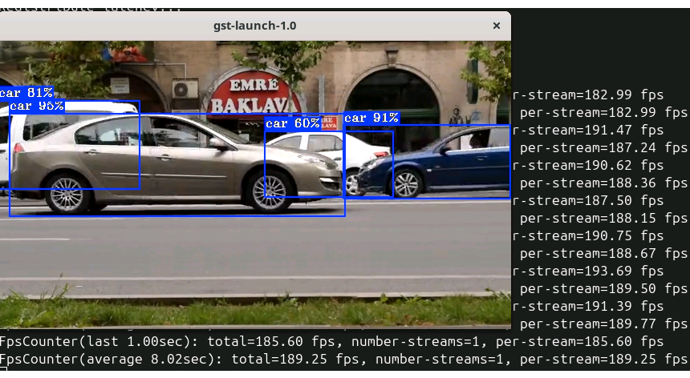
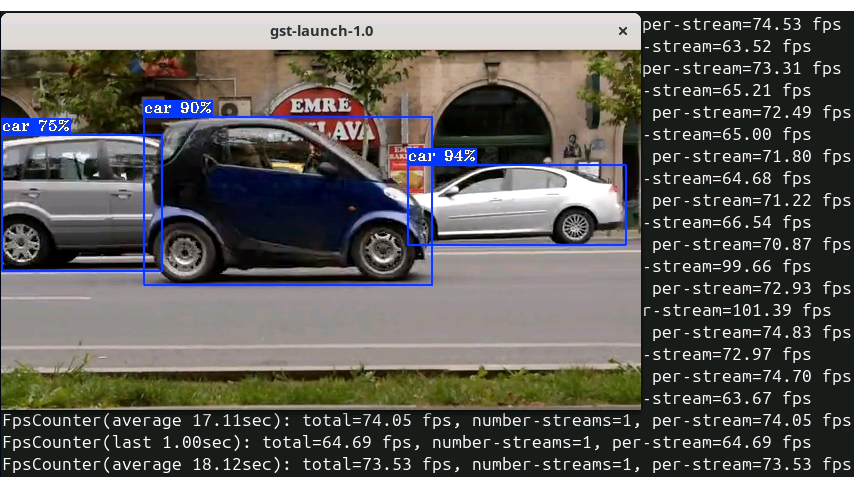
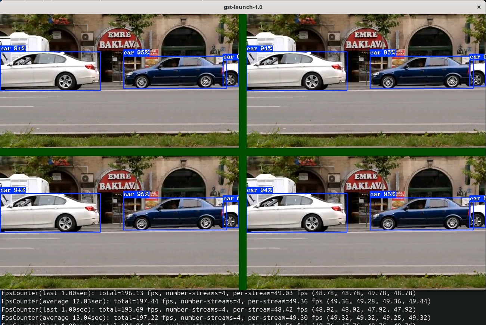

# Ultralytics YOLO26 on Intel Core Ultra Series 3 using DL Streamer Pipeline Framework and OpenVINO™ 

This comprehensive guide provides a detailed walkthrough for deploying [Ultralytics YOLO26](https://www.ultralytics.com/yolo/yolo26) on Intel Core Ultra Series 3 (codename Panther Lake) platforms using [DL Streamer Pipeline Framework](https://github.com/open-edge-platform/dlstreamer) and [OpenVINO™ toolkit](https://docs.openvino.ai/). Here we use OpenVINO™ to maximize inference performance on Intel CPUs, integrated and discrete GPUs, and NPUs.


<div align="center">

</div>

**Contents:** [What is Intel DL Streamer?](#what-is-intel-dl-streamer) • [Prerequisites](#prerequisites) • [YOLO26 Model Preparation](#yolo26-model-preparation) • [Running Inference with YOLO26](#running-inference-with-yolo26) • [Multi-Stream Setup](#multi-stream-setup) • [FAQ](#faq)


## What is Intel DL Streamer?

[Deep Learning Streamer (DL Streamer) Pipeline Framework](https://github.com/open-edge-platform/dlstreamer) is an open-source streaming media analytics framework based on the [GStreamer](https://gstreamer.freedesktop.org/) multimedia framework, designed for creating complex media analytics pipelines for the Cloud or at the Edge.

DL Streamer enables analysis of audio and video streams to detect, classify, track, identify, and count objects, events, and people. It is
optimized for Intel hardware and provides interoperability between GStreamer plugins built on various backend libraries:

- **Inference**: [OpenVINO™](https://docs.openvino.ai/) inference   engine, optimized for Intel CPU, GPU, and NPU
- **Video Encoding/Decoding**: GPU-acceleration via VA-API
- **Image Processing**: OpenCV
- **Metadata**: GStreamer Analytics for structured inference results
- **Ecosystem**: Hundreds of GStreamer plugins for media I/O,  muxing/demuxing, codec support, and more

DL Streamer supports many AI models including the full Ultralytics YOLO family (YOLOv5 through YOLO26), SSD, EfficientDet, RT-DETR, CLIP, VLMs, and many more (HF), all in OpenVINO™ format.

DL Streamer is being regularly validated with systems provided on [System Requirements — Open Edge Platform
Documentation](https://docs.openedgeplatform.intel.com/2026.0/edge-ai-libraries/dlstreamer/get_started/system_requirements.html)


## Prerequisites

Before you begin, ensure the following are installed and configured on your Intel system:

**Ubuntu 24.04** with Intel GPU/NPU drivers installed (check [installation guide](https://medium.com/openvino-toolkit/how-to-run-openvino-on-a-linux-ai-pc-52083ce14a98]))

Ensure also downloading the latest DL Streamer Ubuntu24 docker image.

```bash
docker pull intel/dlstreamer:latest
```

More installation options are available on [Installation Guide](https://docs.openedgeplatform.intel.com/dev/edge-ai-libraries/dlstreamer/get_started/install/install_guide_ubuntu.html#option-1-install-deep-learning-streamer-pipeline-framework-from-debian-packages-using-apt-repository)


## YOLO26 Model Preparation

DL Streamer uses models in [OpenVINO™ IR format](https://docs.openvino.ai/2026/documentation/openvino-ir-format.html). Ultralytics YOLO26 models are exported from PyTorch to OpenVINO IR using the Ultralytics exporter.

1.  Create `~/intel/dlstreamer_demo` folder 

```bash
mkdir -p ~/intel/dlstreamer_demo && cd ~/intel/dlstreamer_demo
```

2. Create and activate a virtual environment:

```bash
python3 -m venv .dls-venv && source .dls-venv/bin/activate
```

3.  Install OpenVINO and Ultralytics

```bash
pip install openvino==2026.2.0 ultralytics==8.4.57
```

4.  Download PyTorch YOLO26s model from Ultralytics, converts it to OpenVINO IR format, and generates INT8 precision variant.

```bash
python -c "
from ultralytics import YOLO
model = YOLO('yolo26s.pt')
model.export(format='openvino', dynamic=True, int8=True)"
```

Model should be downloaded to `~/intel/dlstreamer_demo/yolo26s_int8_openvino_model` folder.


### Video Input Preparation

DL Streamer Samples use the video files as input, for the purpose of running recommended `yolo_detect` Sample in the next section, download the following video file from Pexels database.

```bash
curl -L https://videos.pexels.com/video-files/1192116/1192116-sd_640_360_30fps.mp4 --output ~/intel/dlstreamer_demo/video1.mp4
```

## Running Inference with YOLO26

The DL Streamer sample application `yolo_detect.sh` provides a ready-to-use script for running YOLO26 inference pipelines. But first, run DL Streamer docker image in the interactive mode. Make sure you followed steps [YOLO26 Model Preparation](#yolo26-model-preparation) and [Video Input Preparation](#video-input-preparation), required for the proper folders mounting.

```bash
docker run -it --rm \
-v ~/intel/dlstreamer_demo/yolo26s_int8_openvino_model:/home/dlstreamer/models/public/yolo26s/INT8 \
-v ~/intel/dlstreamer_demo:/home/dlstreamer/videos \
-v "$HOME/.Xauthority:/root/.Xauthority:rw" \
-e DISPLAY=$DISPLAY \
-e XDG_RUNTIME_DIR=/tmp \
-v /tmp/.X11-unix:/tmp/.X11-unix \
--device /dev/dri \
--group-add $(stat -c "%g" /dev/dri/render*) \
--device /dev/accel \
--group-add $(stat -c "%g" /dev/accel/accel*) \
-e ZE_ENABLE_ALT_DRIVERS=libze_intel_npu.so \
intel/dlstreamer:latest
```

### Basic Usage

```bash
./dlstreamer/samples/gstreamer/gst_launch/detection_with_yolo/yolo_detect.sh <MODEL> <DEVICE> <INPUT> <OUTPUT_TYPE> <PPBKEND> <PRECISION>
```

**Parameters:**

| Parameter   | Default          | Description                                                        |
|-------------|------------------|--------------------------------------------------------------------|
| `MODEL`     | `yolox_s`        | Model name (e.g., `yolo26s`, `yolo26m`, `yolo26l`)                 |
| `DEVICE`    | `GPU`            | Inference device: `CPU`, `GPU`, or `NPU`                           |
| `INPUT`     | Sample video URL | Input video file, URL, or `/dev/video*` for webcam                 |
| `OUTPUT`    | `file`           | Output type: `file`, `display`, `fps`, `json`, `display-and-json`  |
| `PPBKEND`   | Auto             | Pre-processing backend: `ie`, `opencv`, `va`, `va-surface-sharing` |
| `PRECISION` | `INT8`           | Model precision: `FP32`, `FP16`, `INT8`                            |

**NOTE**: Before running `yolo_detect.sh`, ensure models (ie. yolo26s) is downloaded.

### INT8 Precision (Maximum Performance)

INT8 quantization delivers the highest throughput by reducing model weights to 8-bit integers. The Ultralytics exporter handles calibration automatically.

Set `MODELS_PATH` to the directory where downloaded models are stored — `yolo_detect.sh` uses this variable to locate model files:

```bash
export MODELS_PATH=~/models
```
   
### Run YOLO26s with INT8 on GPU 

```bash
./dlstreamer/samples/gstreamer/gst_launch/detection_with_yolo/yolo_detect.sh yolo26s GPU ~/videos/video1.mp4 display
```


<div align="center">

</div>

The generated GStreamer pipeline:

```console
gst-launch-1.0 filesrc location=/home/dlstreamer/videos/video1.mp4 ! decodebin3 ! gvadetect model=/home/dlstreamer/models/public/yolo26s/INT8/yolo26s.xml device=GPU pre-process-backend=va-surface-sharing ! queue ! vapostproc ! gvawatermark ! videoconvertscale ! gvafpscounter ! autovideosink sync=false
```

### Run YOLO26s with INT8 on GPU, save output to video file (yolo_video1_yolo26s_INT8_GPU.mp4)

```bash
./dlstreamer/samples/gstreamer/gst_launch/detection_with_yolo/yolo_detect.sh yolo26s GPU ~/videos/video1.mp4 file
```

### Run YOLO26s with INT8 on NPU

```bash
./dlstreamer/samples/gstreamer/gst_launch/detection_with_yolo/yolo_detect.sh yolo26s NPU ~/videos/video1.mp4 display
```


<div align="center">

</div>

## Multi-Stream Setup

DL Streamer supports multi-stream processing, where multiple video sources are decoded and inferred simultaneously. You can launch multiple pipelines in parallel using GStreamer’s `vacompositor` element to combine multiple streams.


### Running Multiple Pipelines in Parallel (GPU)

gst-launch-1.0 vacompositor name=comp sink_0::xpos=0 sink_0::ypos=0 sink_1::xpos=660 sink_1::ypos=0 sink_2::xpos=0 sink_2::ypos=380 sink_3::xpos=660 sink_3::ypos=380 ! autovideosink sync=false filesrc location=~/videos/video1.mp4 ! decodebin3 ! gvadetect model=~/models/public/yolo26s/INT8/yolo26s.xml device=GPU model-instance-id=inf0 scheduling-policy="latency" ! queue ! gvawatermark ! gvafpscounter ! comp.sink_0 filesrc location=~/videos/video1.mp4 ! decodebin3 ! gvadetect model=~/models/public/yolo26s/INT8/yolo26s.xml device=GPU model-instance-id=inf0 scheduling-policy="latency" ! queue ! gvawatermark ! gvafpscounter ! comp.sink_1 filesrc location=~/videos/video1.mp4 ! decodebin3 ! gvadetect model=~/models/public/yolo26s/INT8/yolo26s.xml device=GPU model-instance-id=inf0 scheduling-policy="latency" ! queue ! gvawatermark ! gvafpscounter ! comp.sink_2 filesrc location=~/videos/video1.mp4 ! decodebin3 ! gvadetect model=~/models/public/yolo26s/INT8/yolo26s.xml device=GPU model-instance-id=inf0 scheduling-policy="latency" ! queue ! gvawatermark ! gvafpscounter ! comp.sink_3


<div align="center">

</div>

##  FAQ

### How do I set up Ultralytics YOLO26 on an Intel platform with DL Streamer?

Install DL Streamer following the [Installation Guide](https://github.com/open-edge-platform/dlstreamer/blob/main/docs/user-guide/get_started/install/install_guide_ubuntu.md), set up the environment with `source /opt/intel/dlstreamer/scripts/setup_dls_env.sh`, install Ultralytics and OpenVINO™, download models using `download_ultralytics_models.sh`. Then run inference with the `yolo_detect.sh` sample script.

### What is the benefit of using OpenVINO™ with YOLO26 on Intel hardware?

OpenVINO™ optimizes the YOLO26 model specifically for Intel hardware through techniques such as graph optimization, layer fusion, and hardware-specific kernel tuning. Combined with DL Streamer’s VA-API accelerated decode and zero-copy `va-surface-sharing` pre-processing, the full video analytics pipeline achieves significantly higher throughput than unoptimized frameworks.

### Can I run YOLO26 with DL Streamer on different Intel devices?

Yes. DL Streamer supports inference on Intel CPUs (Core, Core Ultra, Xeon), integrated GPUs (Iris Xe, Arc), discrete GPUs (Arc A-Series, B-Series), and NPUs (AI Boost) across multiple Intel platform generations. Simply change the `DEVICE` parameter to `CPU`, `GPU`, or `NPU`.

### How do I choose between FP16 and INT8 precision?

**FP16** is recommended as the default for GPU inference — it provides near-FP32 accuracy with approximately 2x throughput improvement.
**INT8** delivers the highest performance (2–3x over FP32) with a small accuracy trade-off and is ideal when maximum throughput is the priority. INT8 models are automatically calibrated during Ultralytics export.

### What YOLO26 tasks are supported?

DL Streamer supports all YOLO26 task variants: - **Detection**: yolo26n, yolo26s, yolo26m, yolo26l, yolo26x - **Oriented Bounding Box (OBB)**: yolo26s-obb (and all size variants) - **Instance Segmentation**: yolo26s-seg (and all size variants) - **Pose Estimation**: yolo26s-pose (and all size variants) - **Classification**: yolo26s-cls (composite pipeline with detection)

### How can I export detections as structured data?

Use the `json` output option to write detection results as JSON-lines to a file:

```bash
./yolo_detect.sh yolo26s GPU input_video.mp4 json va-surface-sharing INT8
```

Alternatively, use the `gvametapublish` element in custom pipelines to publish metadata to files, MQTT, or Kafka.

## Additional Resources

- [DL Streamer GitHub Repository](https://github.com/open-edge-platform/dlstreamer)
- [DL Streamer Documentation](https://docs.openedgeplatform.intel.com/dev/edge-ai-libraries/dlstreamer/)
- [DL Streamer Elements](https://docs.openedgeplatform.intel.com/dev/edge-ai-libraries/dlstreamer/elements/elements.html)
- [OpenVINO™ Toolkit](https://docs.openvino.ai/)
- [Ultralytics YOLO26](https://www.ultralytics.com/yolo/yolo26)
- [GStreamer Framework](https://gstreamer.freedesktop.org/)
- [Supported Models Table](https://docs.openedgeplatform.intel.com/dev/edge-ai-libraries/dlstreamer/supported_models.html)
