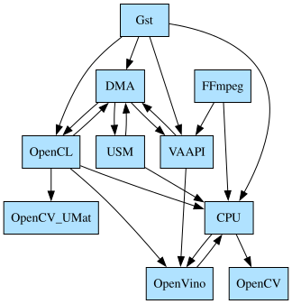
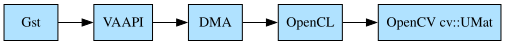

# Memory Interop and C++ abstract interfaces

Deep Learning Streamer (DL Streamer) provides an independent sub-component for zero-copy
buffer sharing and memory interop between various frameworks and memory
handles on the CPU and GPU.

- CPU memory `void*`
- GStreamer `GstBuffer` and `GstMemory`
- Level-Zero `USM pointers`
- OpenCL `cl_mem`
- OpenCV `cv::Mat`
- OpenCV `cv::UMat`
- OpenVINO™ `ov::Tensor` and `ov::RemoteTensor`
- SYCL `USM pointers`
- VA-API `VASurfaceID`

The memory interop sub-component is available via APT installation
`sudo apt install intel-dlstreamer-cpp` and on
[github](https://github.com/open-edge-platform/dlstreamer/tree/main/include/dlstreamer).

> **Note:** This sub-component is implemented as a C++ header-only library. Python
> bindings for this library will be coming in future releases.

## Why memory interop library?

Each media and compute framework with accelerators support (GPU, VPU)
defines own interfaces for device and context creation, memory
allocation and task submission. Most frameworks also expose
export/import interfaces to convert memory objects to/from other memory
handles:

- High-level media frameworks (GStreamer) support conversion
  to/from low-level media handles (VA-API and DirectX surfaces)
- Low-level media interfaces (VA-API, DirectX) support conversion
  to/from OS-specific general-purpose GPU memory handles such as DMA
  buffers on Linux and NT handles on Windows
- OpenCL 3.0 recently introduced extension for DMA buffers and NT
  handles import and export
- Intel® oneAPI Level Zero support conversion between USM device
  pointers (accessible on GPU only) and DMA buffers / NT handles

Together these interfaces allow zero-copy memory sharing between media
operations submitted via media frameworks and SYCL/OpenCL compute
kernels submitted into SYCL/OpenCL queue, assuming media and compute
queues created on same physical GPU device.

Despite multiple stages of memory handles conversion (GStreamer,
VA-API/DirectX, DMA/NT, Level-Zero, SYCL), all converted memory handles
refer to same physical memory block. Thus writing data into one memory
handle makes the data available in all other memory handles, assuming
proper synchronization between write and read operations.

Below is reference to some low-level interfaces used by Deep Learning
Streamer memory interop sub-components for zero-copy buffer sharing
between media frameworks and OpenCL/SYCL

1. (Linux) [VA-API to
   DMA-BUF](http://intel.github.io/libva/group__api__core.html#ga404be4f513f3a15b9a831ff561b1b179)
2. [DMA-BUF or NT-Handle to
   Level-zero](https://oneapi-src.github.io/level-zero-spec/level-zero/latest/core/PROG.html#external-memory-import-and-export)
3. [OpenCL extension
   cl_khr_external_memory](https://registry.khronos.org/OpenCL/specs/unified/html/OpenCL_API.html#cl_khr_external_memory)

## Memory interop in a few lines - using Deep Learning Streamer

Deep Learning Streamer hides complexity of dealing with low-level interfaces
and greatly simplifies memory interop by defining abstract interfaces
[Tensor](https://github.com/open-edge-platform/dlstreamer/blob/main/include/dlstreamer/tensor.h) and [MemoryMapper](https://github.com/open-edge-platform/dlstreamer/blob/main/include/dlstreamer/memory_mapper.h),
and providing header-only implementation of the `Tensor` interface for various frameworks and
`MemoryMapper` implementation for all technically feasible zero-copy mappings on CPU and GPU and mappings between CPU and GPU:



All memory mappers implemented under unified interface
[MemoryMapper](https://github.com/open-edge-platform/dlstreamer/blob/main/include/dlstreamer/memory_mapper.h) with
[TensorPtr](https://github.com/open-edge-platform/dlstreamer/blob/main/include/dlstreamer/tensor.h) or
[FramePtr](https://github.com/open-edge-platform/dlstreamer/blob/main/include/dlstreamer/frame.h) as input parameter, but each mapper from framework `AAA` to
framework `BBB` internally casts input pointer to specific class `AAA`
Tensor / `AAA` Frame and creates output as specific class `BBB` Tensor /
`BBB` Frame, see table below for each supported framework/library:

  | Framework / Library | Native memory object | Class implementing [Tensor](https://github.com/open-edge-platform/dlstreamer/blob/main/include/dlstreamer/tensor.h) |  Class implementing [Frame](https://github.com/open-edge-platform/dlstreamer/blob/main/include/dlstreamer/frame.h) |
  | --- | --- | --- | --- |
  |CPU (no framework)|void\*|[CPUTensor](https://github.com/open-edge-platform/dlstreamer/blob/main/include/dlstreamer/cpu/tensor.h)|[BaseFrame](https://github.com/open-edge-platform/dlstreamer/blob/main/include/dlstreamer/base/frame.h)|
  |GStreamer|GstMemory, GstBuffer|[GSTTensor](https://github.com/open-edge-platform/dlstreamer/blob/main/include/dlstreamer/gst/tensor.h)|[GSTFrame](https://github.com/open-edge-platform/dlstreamer/blob/main/include/dlstreamer/gst/frame.h)|
  |Level-zero|void\*|[USMTensor](https://github.com/open-edge-platform/dlstreamer/blob/main/include/dlstreamer/level_zero/usm_tensor.h)|[BaseFrame](https://github.com/open-edge-platform/dlstreamer/blob/main/include/dlstreamer/base/frame.h)|
  |OpenCL|cl_mem|[OpenCLTensor](https://github.com/open-edge-platform/dlstreamer/blob/main/include/dlstreamer/opencl/tensor.h)|[BaseFrame](https://github.com/open-edge-platform/dlstreamer/blob/main/include/dlstreamer/base/frame.h)|
  |OpenCV|cv::Mat|[OpenCVTensor](https://github.com/open-edge-platform/dlstreamer/blob/main/include/dlstreamer/opencv/tensor.h)|[BaseFrame](https://github.com/open-edge-platform/dlstreamer/blob/main/include/dlstreamer/base/frame.h)|
  |OpenCV|cv::UMat|[OpenCVUMatTensor](https://github.com/open-edge-platform/dlstreamer/blob/main/include/dlstreamer/opencv_umat/tensor.h)|[BaseFrame](https://github.com/open-edge-platform/dlstreamer/blob/main/include/dlstreamer/base/frame.h)|
  |OpenVINO™|ov::Tensor|[OpenVINOTensor](https://github.com/open-edge-platform/dlstreamer/blob/main/include/dlstreamer/openvino/tensor.h)|[OpenVINOFrame](https://github.com/open-edge-platform/dlstreamer/blob/main/include/dlstreamer/openvino/frame.h)|
  |SYCL|void\*|[SYCLUSMTensor](https://github.com/open-edge-platform/dlstreamer/blob/main/include/dlstreamer/sycl/sycl_usm_tensor.h)|[BaseFrame](https://github.com/open-edge-platform/dlstreamer/blob/main/include/dlstreamer/base/frame.h)|

Application can create `Tensor` and `Frame` objects by either passing
pre-allocated native memory object to C++ constructor (wrap already
allocated object) or passing allocation parameters to C++ constructor
(allocate new memory).

Many examples on how to allocate memory and create and use memory mappers
can be found by searching for the word `mapper` in [samples](https://github.com/open-edge-platform/dlstreamer/tree/main/samples)
and [src](https://github.com/open-edge-platform/dlstreamer/tree/main/src)
folders on github source code and almost every C++ element.

There is special mapper
[MemoryMapperChain](https://github.com/open-edge-platform/dlstreamer/blob/main/include/dlstreamer/memory_mapper_factory.h) implementing unified interface
[MemoryMapper](https://github.com/open-edge-platform/dlstreamer/blob/main/include/dlstreamer/memory_mapper.h) as arbitrary chain of multiple mappers. As examples,
GStreamer to OpenCV UMat is chain of the following mappers:



## Abstract interfaces for C++ elements

Additionally, this Deep Learning Streamer sub-component defines abstract
interfaces [Source](https://github.com/open-edge-platform/dlstreamer/blob/main/include/dlstreamer/source.h) ,
[Transform](https://github.com/open-edge-platform/dlstreamer/blob/main/include/dlstreamer/transform.h) and [Sink](https://github.com/open-edge-platform/dlstreamer/blob/main/include/dlstreamer/sink.h) used as base interfaces for all C++ and GStreamer elements.
These interfaces take unified pointers to
[Tensor](https://github.com/open-edge-platform/dlstreamer/blob/main/include/dlstreamer/tensor.h)
and [Frame](https://github.com/open-edge-platform/dlstreamer/blob/main/include/dlstreamer/frame.h) objects as input and output parameters in functions
[read], [process], [write] and allow to easily build chain of multiple operations. See next page
[C++ elements](cpp_elements).

## How to use in CMake build system

If application uses Deep Learning Streamer memory interop library and
application based on cmake build system, add `pkg_check_modules` and
`include_directories` statements like below:

```text
pkg_check_modules(DLSTREAMER dl-streamer REQUIRED)
include_directories(${DLSTREAMER_INCLUDE_DIRS})
```

For each framework involved in memory interop, add corresponding
`include_directories` and `link_libraries` statements as
required/documented by framework. For example if using memory interop
with OpenVINO™, cmake file should contain lines like below

```text
find_package(OpenVINO COMPONENTS runtime)
include_directories(${OpenVINO_INCLUDE_DIRS})
link_libraries(openvino::runtime)
```

## Files structure

Abstract interfaces are defined in the following header files and
installed by `sudo apt install intel-dlstreamer-cpp` under folder
`/opt/intel/dlstreamer/include/dlstreamer`:

```text
include/dlstreamer
├── audio_info.h
├── context.h
├── dictionary.h
├── element.h
├── frame.h
├── frame_info.h
├── image_info.h
├── image_metadata.h
├── memory_mapper_factory.h
├── memory_mapper.h
├── memory_type.h
├── metadata.h
├── sink.h
├── source.h
├── tensor.h
├── tensor_info.h
├── transform.h
└── utils.h
```

The following header files implement
[Tensor](https://github.com/open-edge-platform/dlstreamer/blob/main/include/dlstreamer/tensor.h)
interface memory objects in various frameworks and
[MemoryMapper](https://github.com/open-edge-platform/dlstreamer/blob/main/include/dlstreamer/memory_mapper.h) for memory mapping between frameworks. These header files
installed under corresponding subfolders of
`/opt/intel/dlstreamer/include/dlstreamer` by same package
`intel-dlstreamer-cpp`:

```text
include/dlstreamer
├── gst
│   ├── allocator.h
│   ├── context.h
│   ├── dictionary.h
│   ├── frame_batch.h
│   ├── frame.h
│   ├── mappers
│   │   ├── any_to_gst.h
│   │   ├── gst_to_cpu.h
│   │   ├── gst_to_dma.h
│   │   ├── gst_to_opencl.h
│   │   └── gst_to_vaapi.h
│   ├── metadata
│   │   ├── gva_audio_event_meta.h
│   │   ├── gva_json_meta.h
│   │   └── gva_tensor_meta.h
│   ├── metadata.h
│   ├── plugin.h
│   ├── tensor.h
│   └── utils.h
├── level_zero
│   ├── context.h
│   ├── mappers
│   │   ├── dma_to_usm.h
│   │   └── usm_to_dma.h
│   └── usm_tensor.h
├── opencl
│   ├── context.h
│   ├── mappers
│   │   ├── dma_to_opencl.h
│   │   ├── opencl_to_cpu.h
│   │   └── opencl_to_dma.h
│   ├── tensor.h
│   ├── tensor_ref_counted.h
│   └── utils.h
├── opencv
│   ├── context.h
│   ├── mappers
│   │   └── cpu_to_opencv.h
│   ├── tensor.h
│   └── utils.h
├── opencv_umat
│   ├── context.h
│   ├── mappers
│   │   └── opencl_to_opencv_umat.h
│   ├── tensor.h
│   └── utils.h
├── openvino
│   ├── context.h
│   ├── frame.h
│   ├── mappers
│   │   ├── cpu_to_openvino.h
│   │   ├── opencl_to_openvino.h
│   │   ├── openvino_to_cpu.h
│   │   └── vaapi_to_openvino.h
│   ├── tensor.h
│   └── utils.h
├── sycl
│   ├── context.h
│   ├── mappers
│   │   └── sycl_usm_to_cpu.h
│   └── sycl_usm_tensor.h
└── vaapi
    ├── context.h
    ├── frame_alloc.h
    ├── frame.h
    ├── mappers
    │   ├── dma_to_vaapi.h
    │   └── vaapi_to_dma.h
    ├── tensor.h
    └── utils.h
```
