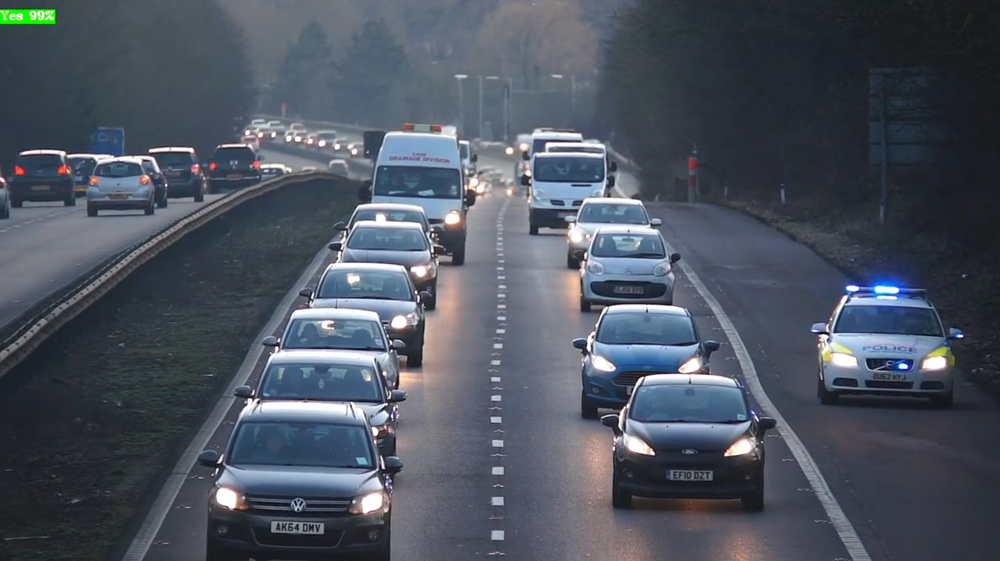
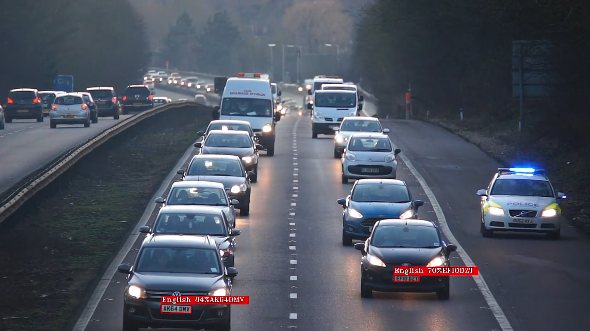
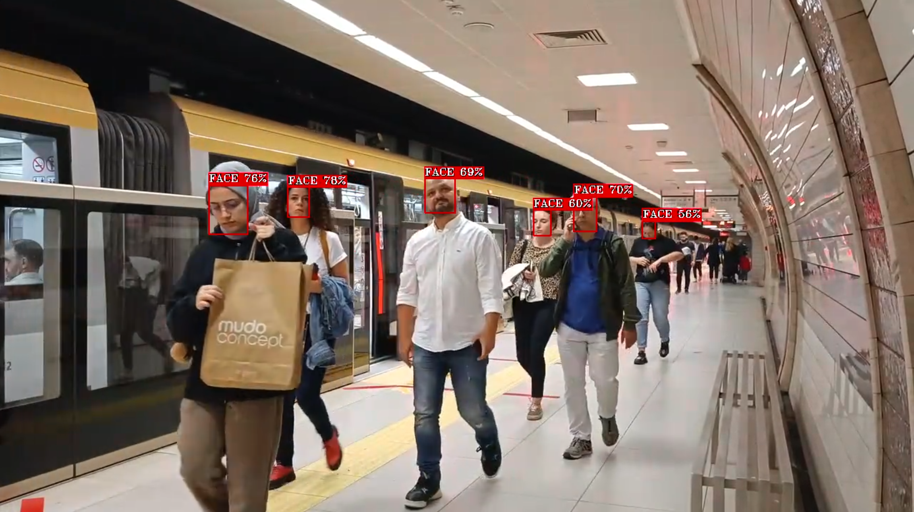
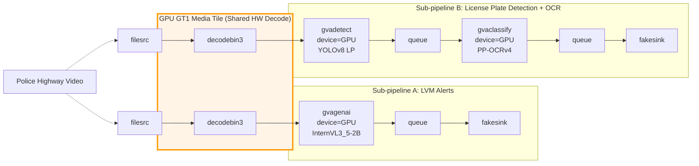
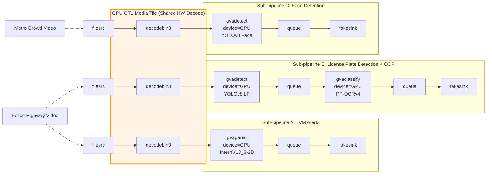

# Heterogeneous AI Inference on Intel Core Ultra processors

## Overview

Modern Intel Core Ultra processors integrate CPU, GPU and NPU on a single SoC die,
sharing a common power budget. Intel DL Streamer lets you assign individual GStreamer
pipeline sub-streams to specific devices using the `device=` property on inference
elements — enabling you to distribute workloads across all available compute engines
simultaneously.

This page demonstrates one practical configuration: a heavily loaded GPU running
multi-stream video analytics, while an additional stream is dispatched to the NPU.
The goal is to explain the principles behind workload distribution and show how to
build heterogeneous pipelines in DL Streamer. Actual throughput gains depend on
your own combination of models, resolutions, and pipeline structure — the results
shown here reflect one specific scenario and should not be generalized as universal
rules.

---

## Platform

The Intel Core Ultra SoCs integrate CPU, GPU and NPU on a single die.
All three compute engines share a common SoC power budget (TDP envelope).

The Intel integrated GPU on this platform is split into two tiles:

- **GT0** — render/compute tile: executes OpenVINO inference (OpenCL/SYCL)
- **GT1** — media tile: handles H.264/H.265 hardware video decode (VA-API) and
  post-processing

This separation is important: GT0 is busy with inference while GT1 independently
handles video decode, leaving the CPU largely free for pipeline orchestration.

---

## Workload Distribution Strategy

Assigning workloads to the right compute engine is the key design decision.
The principles below guided the configuration in this demo and can be applied
to your own pipelines.

### Route heavy workloads to GPU, lighter workloads to NPU

The GPU typically offers more raw compute power and is best suited for large,
complex models. The NPU is designed for sustained inference at lower power and
excels at workloads that are lighter in compute but run continuously. In this
demo the Large Vision Model occupies the GPU, while a detection model runs on
the NPU.

There is no universal rule that maps model types to devices. The right split
depends on how compute-heavy each workload is, how much capacity is available
on each device, and how the SoC power budget is shared. Profile your own
pipelines and adjust `device=` assignments accordingly.

### Use NPU to relieve GPU contention

When the GPU is already heavily loaded, adding more inference tasks to it
causes competition for compute resources — existing workloads lose throughput,
global frequencies may throttle, and the whole pipeline degrades. Offloading a
suitable workload to the NPU adds compute capacity without competing with the
GPU. The NPU runs in parallel and independently.

This demo demonstrates the effect concretely: with LVM and detection pipelines
already occupying GT0, adding face detection on the GPU degrades license plate
throughput. Moving face detection to the NPU fully recovers that loss while
sustaining the extra stream.

### Split independent tasks into separate sub-pipelines

When multiple models process the same video source, avoid chaining them inline
if their processing rates differ significantly. A slow model placed inline stalls
faster downstream elements — for example, a large vision model would throttle
a downstream detector capable of hundreds of fps.

Instead, use separate `filesrc ! decodebin3` paths (or a `tee` element) for each
task. In this demo, the LVM alert pipeline and the license plate pipeline each
have their own decode path from the same source file, so the LVM's low cadence
does not limit the license plate detector.

### Hardware video decode via decodebin3

`decodebin3` automatically selects the best available decoder. On platforms with
an Intel iGPU using the xe driver, it resolves to VA-API hardware decode running
on GT1 (the GPU media tile). Each active sub-pipeline opens its own decode
context; with three parallel sub-pipelines, three concurrent decode sessions run
on GT1.

HW decode on GT1 is fast and leaves GT0 free for inference. At high stream counts
or high resolutions, GT1 can become a bottleneck — monitor GT1 utilization to
detect this condition.

### Optimize sub-pipelines with the DL Streamer Optimizer

The [DL Streamer Optimizer](./optimizer.md)
can automatically tune inference parameters such as `nireq`, `batch-size` for each
sub-pipeline and target device. A standalone NPU workload that runs independently
is a particularly good candidate: its parameters can be tuned in isolation without
being constrained by adjacent GPU tasks.

---

## Example Scenario

This demo uses two video files representing different camera feeds in a city
surveillance scenario:

| Role | Video | Resolution | Frame Rate |
|------|-------|------------|------------|
| Main | Police highway scene | 1280×720 | 60 fps |
| Extra | Metro crowd scene | 1280×720 | 30 fps |

- Main video: [Pexels #2103099](https://videos.pexels.com/video-files/2103099/2103099-hd_1280_720_60fps.mp4)
- Extra video: [Pexels #18553046](https://videos.pexels.com/video-files/18553046/18553046-hd_1280_720_30fps.mp4)

---

## Pipeline Design

The full pipeline is composed of three independently running sub-pipelines
launched in a single `gst-launch-1.0` command. Sub-pipelines A and B process
the same source video via separate decode paths; sub-pipeline C processes a
different video feed.

### Sub-pipeline A — Large Vision Model (LVM) alert detection

Runs a large vision model at a low frame rate (0.5 fps) to answer a
natural-language question about the video content. This is the heaviest inference
task and the primary driver of GT0 utilization.

Based on the DL Streamer [VLM alerts sample](https://github.com/open-edge-platform/dlstreamer/blob/v2026.1.0/samples/gstreamer/python/vlm_alerts).

```
filesrc location=Videos/police_highway_1280_720_60fps_loop10.mp4 ! decodebin3
  ! gvagenai model-path=models/InternVL3_5-2B device=GPU
      prompt="Is there a police car? Answer yes or no."
      generation-config=max_new_tokens=1,num_beams=4
      chunk-size=1 frame-rate=0.5 metrics=true
  ! queue ! gvafpscounter ! fakesink sync=false
```

**Example output:**



### Sub-pipeline B — License plate detection + OCR

Runs at full video frame rate: object detection followed by OCR on cropped
plate regions. Runs in parallel with sub-pipeline A on its own decode path —
the LVM's low cadence does not limit its throughput.

```
filesrc location=Videos/police_highway_1280_720_60fps_loop10.mp4 ! decodebin3
  ! gvadetect model=models/yolov8_license_plate_detector/FP32/yolov8_license_plate_detector.xml
      device=GPU batch-size=2 model-instance-id=inf1
  ! queue
  ! gvaclassify model=models/ch_PP-OCRv4_rec_infer/FP32/ch_PP-OCRv4_rec_infer.xml
      device=GPU model-instance-id=inf2
  ! queue ! gvafpscounter ! fakesink sync=false
```

**Example output:**



### Sub-pipeline C — Face detection (extra workload)

Processes a separate video feed. This sub-pipeline demonstrates GPU vs NPU
dispatch: changing only the `device=` (and optionally other parameters) routes the same
model to a different compute engine.

Based on the DL Streamer [face detection and classification sample](https://github.com/open-edge-platform/dlstreamer/tree/v2026.1.0/samples/gstreamer/python/face_detection_and_classification).

**GPU variant (Case 2):**

```
filesrc location=Videos/metro_1280_720_30fps_loop10.mp4 ! decodebin3
  ! gvadetect model=models/YOLOv8-Face-Detection/INT8/YOLOv8-Face-Detection.xml
      device=GPU batch-size=2 model-instance-id=inf3
  ! queue ! gvafpscounter ! fakesink sync=false
```

**NPU variant (Case 3):**

```
filesrc location=Videos/metro_1280_720_30fps_loop10.mp4 ! decodebin3
  ! gvadetect model=models/YOLOv8-Face-Detection/INT8/YOLOv8-Face-Detection.xml
      device=NPU nireq=2 batch-size=2 model-instance-id=inf3
  ! queue ! gvafpscounter ! fakesink sync=false
```

**Example output (NPU):**



---

## Test Cases

Three configurations are compared by changing only which device runs sub-pipeline C.

### Case 1 — Main workload only (GPU baseline)

Sub-pipelines A and B run on GPU. No extra workload.

**Compute allocation:**

| Workload | Device |
|----------|--------|
| LVM (gvagenai) | GPU GT0 |
| License plate detection + OCR | GPU GT0 |
| Video decode (2 streams) | GPU GT1 |

**Pipeline architecture:**



**Observed behavior:**

- GPU compute tile (GT0) is heavily utilized by the combined LVM and
  detection workloads
- LVM dominates GT0 time; license plate detection runs alongside it,
  sharing GPU resources
- GPU operates at high frequency for this workload configuration
- CPU involvement is low — mostly GStreamer pipeline management
- NPU is idle

---

### Case 2 — Main + face detection, all on GPU

Sub-pipelines A, B and C (GPU variant) run together.

**Compute allocation:**

| Workload | Device |
|----------|--------|
| LVM (gvagenai) | GPU GT0 |
| License plate detection + OCR | GPU GT0 |
| Face detection (metro video) | GPU GT0 |
| Video decode (3 streams) | GPU GT1 |

**Pipeline architecture:**



**Observed behavior:**

- GT0 must now share resources among three competing inference tasks
- The license plate sub-pipeline loses throughput to the added face
  detection workload; the degradation is significant
- GPU frequency may throttle as the combined compute demand pushes the
  shared SoC power budget
- NPU remains idle

---

### Case 3 — Main on GPU, face detection on NPU (heterogeneous)

Sub-pipelines A and B remain on GPU. Sub-pipeline C uses the NPU variant.

**Compute allocation:**

| Workload | Device |
|----------|--------|
| LVM (gvagenai) | GPU GT0 |
| License plate detection + OCR | GPU GT0 |
| Face detection (metro video) | **NPU** |
| Video decode (3 streams) | GPU GT1 |

**Pipeline architecture:**


**Observed behavior:**

- GT0 is no longer shared with face detection — license plate throughput
  recovers to Case 1 levels
- NPU handles face detection independently, in parallel with GPU inference,
  adding capacity without affecting the GPU workloads
- GPU frequency is slightly lower than Case 1: the active NPU draws part
  of the shared SoC power budget — this is expected and does not negate
  the throughput advantage
- GT1 utilization increases noticeably compared to Case 2: with the NPU
  processing frames quickly there is no backpressure on the decoder, which
  now sustains higher decode throughput
- Total throughput across all three streams is the highest of all cases;
  package power is the lowest

---

## Results Summary

| | Case 1: MAIN/GPU | Case 2: MAIN+EXTRA/GPU | Case 3: MAIN+EXTRA/GPU+NPU |
|---|---|---|---|
| Extra workload | — | GPU | **NPU** |
| Total throughput | baseline | moderate gain | **highest** |
| LP detection throughput | baseline | significantly lower | **fully recovered** |
| Package power | highest | lower than Case 1 | **lowest** |
| GT0 utilization | high | high | high |
| GT0 frequency | highest | lower | slightly lower than Case 1 |
| GT1 utilization | low | moderate | **high** |
| NPU utilization | idle | idle | **active** |
| CPU utilization | low | higher | moderate |

---

## Key Takeaways

The following observations from the test cases reflect the design principles
described in the [Workload Distribution Strategy](#workload-distribution-strategy)
section.

### 1. NPU enables extra compute capacity when GPU is loaded

When the GPU is carrying a heavy workload, offloading a suitable task to the NPU
adds throughput without competing with GPU inference. This demo shows the effect
directly: face detection moved from GPU to NPU preserves the license plate pipeline
at full speed while sustaining the additional stream. How much benefit you gain
depends on how loaded the GPU already is and how well the offloaded workload fits
the NPU.

### 2. GPU handles heavier workloads; NPU handles lighter continuous workloads

In this demo the GPU runs a large vision model and a detect+classify chain (heavier
compute), while the NPU runs a single detection model (lighter compute). This split
works for this particular scenario. For different models or resolutions, the balance
point shifts — measure your own workloads before deciding on a device assignment.

### 3. Parallel sub-pipelines decouple tasks with different processing rates

By running the LVM alert pipeline and the license plate pipeline as separate
sub-pipelines (each with its own decode path), the slow LVM cadence does not
throttle the faster detection pipeline. This pattern applies whenever you have
models with very different processing rates sharing the same video source.

### 4. GPU and NPU share the SoC power budget

When the NPU becomes active, GPU frequency may decrease slightly — a direct
consequence of shared TDP management in the SoC. This is expected behavior.
In the results here the combined throughput of the system increases despite the
minor GPU clock reduction, because the NPU contributes additional parallel work.

### 5. Hardware video decode scales with stream count; monitor GT1

`decodebin3` resolves to VA-API hardware decode on GT1, which is efficient and
leaves GT0 free for inference. As stream count grows, GT1 utilization rises.
High GT1 utilization can indicate a fully utilized, well-balanced system — or
a decode bottleneck limiting downstream inference. Observing GT1 alongside GT0
helps distinguish these cases.

### 6. Optimize individual sub-pipelines with the DL Streamer Optimizer

Each sub-pipeline can be tuned independently using the
[DL Streamer Optimizer](./optimizer.md).
A standalone NPU sub-pipeline is a good starting point: its `nireq` and
`batch-size` can be tuned to maximize NPU throughput without affecting the
adjacent GPU workloads.

---

## Notes and Caveats

- GPU tile utilization (GT0/GT1) is measured via `gtidle/idle_residency_ms` sysfs
  counters (xe driver). These counters reflect periods when the entire tile is
  clock-gated idle. Short scheduling gaps between independent pipelines appear as
  idle time, so reported utilization may be slightly lower than actual compute
  activity.

- NPU frequency is read from sysfs immediately after pipeline completion, before
  the NPU returns to idle.

---

## References

- [DL Streamer Optimizer](./optimizer.md)
- [VLM Alerts Sample](https://github.com/open-edge-platform/dlstreamer/blob/v2026.1.0/samples/gstreamer/python/vlm_alerts)
- [Face Detection and Classification Sample](https://github.com/open-edge-platform/dlstreamer/tree/v2026.1.0/samples/gstreamer/python/face_detection_and_classification)
- [Intel OpenVINO](https://github.com/openvinotoolkit/openvino)
