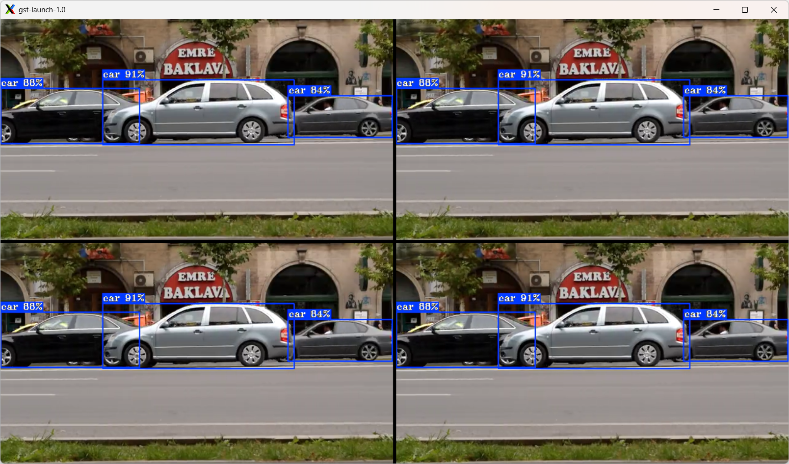

# vacompositor

## Using the GStreamer framework ***vacompositor*** element for merging many video displays into a single view

The GStreamer framework
[vacompositor](https://gstreamer.freedesktop.org/documentation/va/vacompositor.html)
element allows for merging multiple displays into one.

Add the **vacompositor** element along with its name e.g. `name=comp` and the **sink pad x,y coordinates**, e.g. `sink_0::xpos=0 sink_0::ypos=0` to GStreamer framework pipeline. Each output display requires a separate sink pad definition. The last component is `autovideosink sync=false`.

```bash
vacompositor name=comp sink_0::xpos=0 sink_0::ypos=0 sink_1::xpos=645 sink_1::ypos=0 ... ! autovideosink sync=false
```

The example below presents usage of the GStreamer framework **vacompositor** element for merging 4 output videos into a single display.

```bash
gst-launch-1.0 vacompositor name=comp  sink_0::xpos=0 sink_0::ypos=0 sink_1::xpos=645 sink_1::ypos=0 sink_2::xpos=0 sink_2::ypos=365 sink_3::xpos=645 sink_3::ypos=365 ! autovideosink sync=false \
filesrc location=${VIDEO_FILE_1} ! decodebin3 ! \
    gvadetect model=${MODEL_FILE} device=GPU pre-process-backend=va model-instance-id=inf0 batch-size=4 ! queue ! gvawatermark ! gvafpscounter ! comp.sink_0  \
filesrc location=${VIDEO_FILE_2} ! decodebin3 ! \
    gvadetect model=${MODEL_FILE} device=GPU pre-process-backend=va model-instance-id=inf0 batch-size=4 ! queue ! gvawatermark ! gvafpscounter ! comp.sink_1 \
filesrc location=${VIDEO_FILE_3} ! decodebin3 ! \
    gvadetect model=${MODEL_FILE} device=GPU pre-process-backend=va model-instance-id=inf0 batch-size=4 ! queue ! gvawatermark ! gvafpscounter ! comp.sink_2 \
filesrc location=${VIDEO_FILE_4} ! decodebin3 ! \
    gvadetect model=${MODEL_FILE} device=GPU pre-process-backend=va model-instance-id=inf0 batch-size=4 ! queue ! gvawatermark ! gvafpscounter ! comp.sink_3
```


