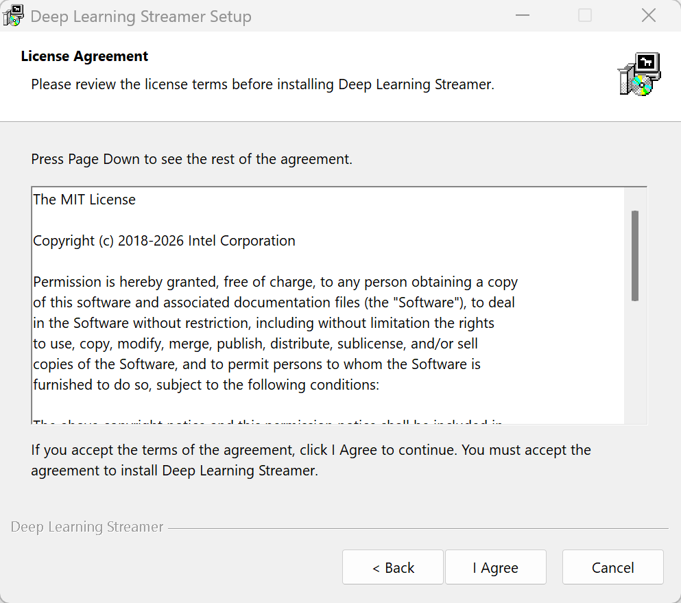
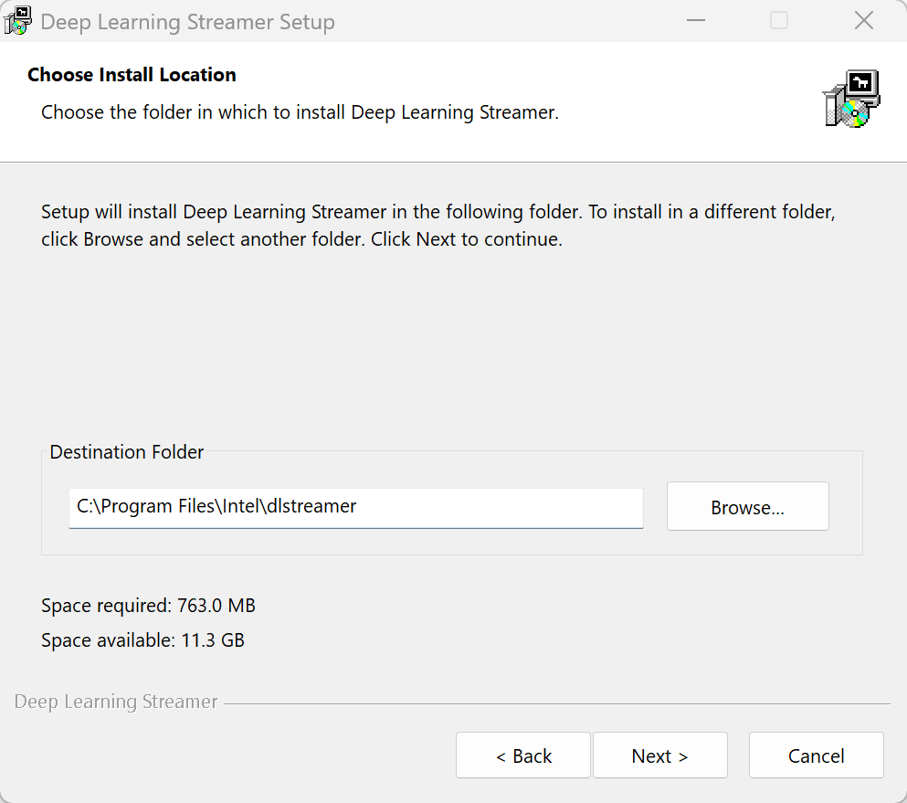
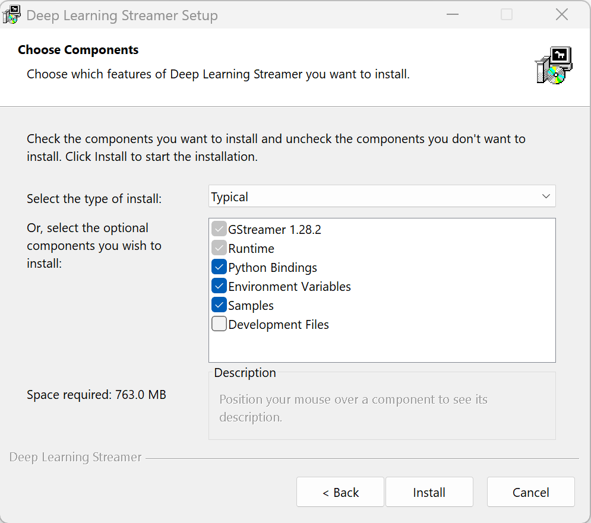

# Install Guide Windows

This page describes steps required to install Deep Learning Streamer Pipeline
Framework on Windows.

For building Deep Learning Streamer Pipeline Framework from source code,
follow the [advanced installation guide](../../dev_guide/advanced_install/advanced_install_guide_windows_compilation.md).

## Prerequisites

- Windows 11 x64 or later
- Download and update GPU and NPU drivers from
[Intel® Driver & Support Assistant](https://www.intel.com/content/www/us/en/support/detect.html)

## Step 1: Download the Installer

Go to DL Streamer [releases page on GitHub](https://github.com/open-edge-platform/dlstreamer/releases). 
Navigate to the **Assets** section and download the installer package named `dlstreamer-<version>-win64.exe`.

## Step 2: Run the Installer

Run the `dlstreamer-<version>-win64.exe` file and follow the on-screen instructions.

The installer also supports silent installation via command line, follow the instructions in the [advanced installation guide](../../dev_guide/advanced_install/advanced_install_guide_windows_command_line.md) for details.

### License Agreement
DL Streamer is licensed under the MIT License. 
Accept the license agreement and proceed with the installation.



### Choose Install Location
The default installation folder is `%ProgramFiles%\Intel\dlstreamer`,
you can choose a different location.



### Choose Components
The installer provides the following components:

| Component | Description |
|---|---|
| **GStreamer** | GStreamer multimedia framework (system-wide installation). |
| **Runtime** | DL Streamer runtime libraries and plugins. |
| **Python Bindings** | Python binding library and files. |
| **Environment Variables** | Set up `DLSTREAMER_DIR`, `GST_PLUGIN_PATH`, and `PATH` environment variables for the current user. |
| **Samples** | Sample applications and scripts. |
| **Development Files** | Header files and import libraries for building C++ applications with DL Streamer. |

Three installation types are available:
**Typical** (default): All default components; **Full**: All components including Development Files; **Minimal**: Only required components.

> **Note:** Incompatible GStreamer installations (MinGW or 32-bit
> variants) must be uninstalled before proceeding.



### Installation Process
Click "Install" to start the installation process. The installer will copy files,
set environment variables, and perform necessary configurations.

The installer configures the following for the current user if selected
(values shown for default install path):

| Variable | Value |
|---|---|
| `DLSTREAMER_DIR` | `C:\Program Files\Intel\dlstreamer` |
| `GST_PLUGIN_PATH` | `C:\Program Files\Intel\dlstreamer\bin` |
| Added to `PATH` | `C:\Program Files\gstreamer\1.0\msvc_x86_64\bin` |
| Added to `PATH` | `C:\Program Files\Intel\dlstreamer\bin` |

Alternatively, use the PowerShell script to set up the environment variables for the current session.
```powershell
.\scripts\setup_dls_env.ps1
```

## [Optional] Step 3: Setup Python Environment

**DL Streamer Python bindings (`gstgva`)** support **Python 3.9 and above**.
The **`gvapython`** GStreamer element used with `gst-launch-1.0` requires **Python 3.12**.

Download and install Python from the [official website](https://www.python.org/downloads/windows/).
Make sure to select the option to add Python to `PATH` during installation.

### Install Python Dependencies

```powershell
cd $env:DLSTREAMER_DIR
python -m pip install -r requirements.txt
```

### Run the Python environment setup script

```powershell
cd $env:DLSTREAMER_DIR
.\scripts\setup_python_env.ps1
```

The script will auto-configure the **current PowerShell session** by setting:
- `PYTHONPATH` to include `<gstreamer_python>\Lib\site-packages` and the `gstgva` directory.
- `PYGI_DLL_DIRS` to the GStreamer `bin` folder (`$env:GSTREAMER_1_0_ROOT_MSVC_X86_64\bin`).
- `GI_TYPELIB_PATH` to the DL Streamer typelib directory (`lib\girepository-1.0`).

The environment changes apply to the current session only. Re-run the
script for new sessions.

## Next Steps

You are ready to use Deep Learning Streamer. For further instructions to run
sample pipeline(s), please go to the [tutorial](../tutorial.md).
There is need to manually download models.

------------------------------------------------------------------------

> **\*** *Other names and brands may be claimed as the property of
> others.*
