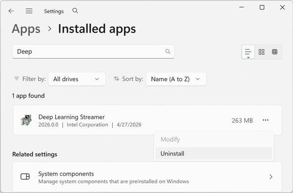
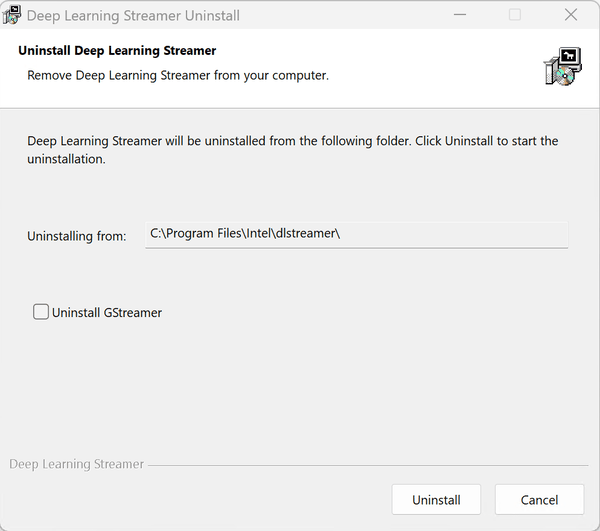

# Uninstall Guide Windows

Open **Windows Settings > Apps > Installed apps**, then search for "Deep Learning Streamer".
Click on the three dots menu and select "Uninstall".



Follow the on-screen instructions to complete the uninstallation process.
The uninstaller removes all files, environment variables, and registry keys.
There is an option to uninstall GStreamer from the system.



The uninstaller also supports silent mode via command line:

```ps1
& "C:\Program Files\Intel\dlstreamer\Uninstall.exe" /S
```

------------------------------------------------------------------------

> **\*** *Other names and brands may be claimed as the property of
> others.*
