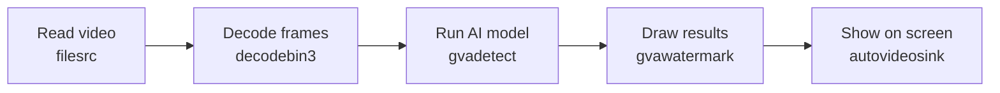
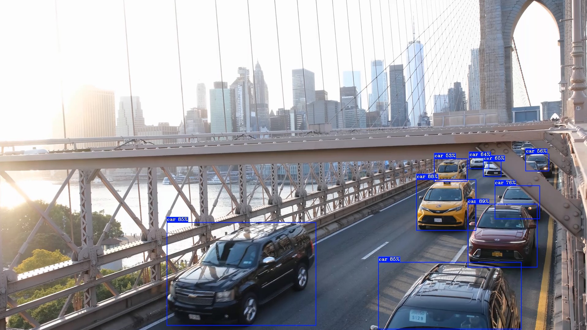
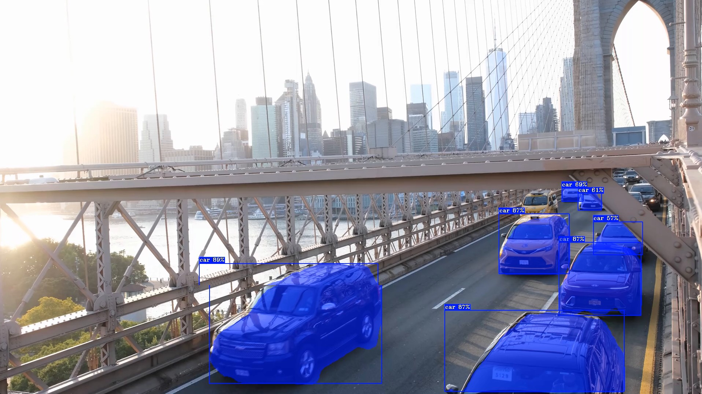
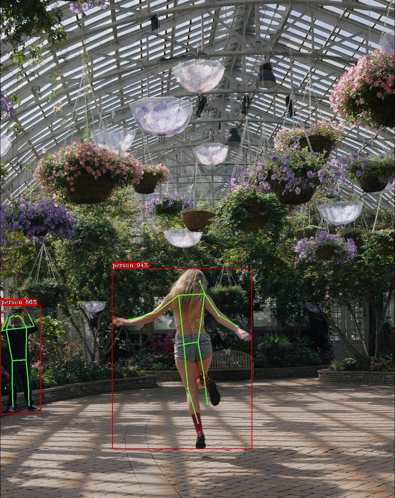
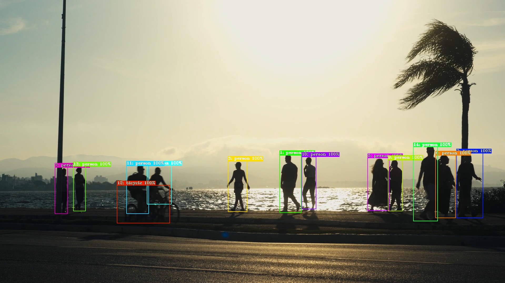
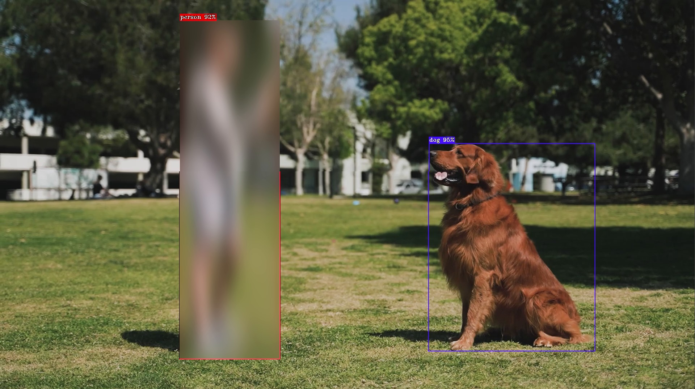

# Tutorial

Welcome! This tutorial takes you from a clean Ubuntu\* 24.04 machine to running
real, hardware-accelerated video analytics with **Deep Learning Streamer
(DL Streamer)** — using nothing but copy/paste. No prior experience with
DL Streamer, GStreamer\*, or AI is required.

By the end you will have detected objects, segmented them pixel-by-pixel,
estimated human body poses, tracked and anonymized people, and even searched a
video for a specific object using plain English — each with a **single command**.

- [What is DL Streamer?](#what-is-dl-streamer)
- [What is a pipeline?](#what-is-a-pipeline)
- [Step 1 - Install DL Streamer on Ubuntu 24.04](#step-1---install-dl-streamer-on-ubuntu-2404)
- [Step 2 - Prepare your environment](#step-2---prepare-your-environment)
- [Step 3 - Run your first YOLO pipelines](#step-3---run-your-first-yolo-pipelines)
- [Step 4 - Go further with DL Streamer](#step-4---go-further-with-dl-streamer)
- [Step 5 - Run in Docker (GPU/NPU passthrough)](#step-5---run-in-docker-gpunpu-passthrough)
- [Where to next?](#where-to-next)

---

## What is DL Streamer?

**DL Streamer** is an open-source framework for building **video and audio
analytics** applications. It lets you take a video — from a file, a camera, or a
network stream — run AI models on every frame, and do something useful with the
results: draw boxes on screen, count people, anonymize faces, save data to a
file, or send alerts — all **without writing any code**.

It runs on **Intel® CPUs, GPUs, and NPUs**, automatically taking advantage of
your hardware to run fast. The same command works on any of these devices — you
just change one word.

> **In short:** DL Streamer turns "I want AI on my video" into a single command
> you can copy, paste, and run.

## What is a pipeline?

A **pipeline** is a chain of small building blocks called **elements**. Each
element does one job and passes its result to the next, like an assembly line.
You connect elements with an exclamation mark `!`.

A typical video AI pipeline looks like this:



Written as a DL Streamer command, that same idea becomes:

```text
gst-launch-1.0  filesrc ! decodebin3 ! gvadetect ! gvawatermark ! autovideosink
```

This is still a concept, not a runnable command — each element needs its
**properties** to do real work. Properties are written as `key=value` right after
the element name, for example `filesrc location=<video>` and
`gvadetect model=<model.xml> device=<GPU|NPU|CPU>`. You'll see complete,
ready-to-run commands with all properties filled in starting in
[Step 3](#step-3---run-your-first-yolo-pipelines).

The elements that start with **`gva`** (like `gvadetect`, `gvaclassify`,
`gvatrack`, `gvawatermark`) are the AI-powered elements provided by DL Streamer.
Everything else comes from GStreamer, the proven multimedia framework DL Streamer
is built on.

> **Pipelines vs. ready-made samples:** In this tutorial we mostly build
> pipelines **by hand** so you learn the building blocks. DL Streamer also ships
> **30+ ready-to-run sample scripts** for common use cases — we use one of them
> in [Step 4.3](#43-find-anything-with-plain-english-prompt-based-detection).
> Once you understand the pieces, the samples are a great shortcut.

That's the whole concept. Now let's see it in action.

---

## Step 1 - Install DL Streamer on Ubuntu 24.04

Open a terminal and copy/paste each block.

### 1.1 Install the hardware drivers (GPU & NPU)

This script detects your Intel® hardware and installs the right **GPU and NPU**
drivers — needed to accelerate inference on `device=GPU` and `device=NPU`. The
`--reinstall-npu-driver=yes` flag makes sure the Intel® **NPU** driver is
installed so you can use `device=NPU` later. We'll keep everything for this
tutorial in a single folder, `~/dlstreamer_demo`.

```bash
mkdir -p ~/dlstreamer_demo
cd ~/dlstreamer_demo
wget -O DLS_install_prerequisites.sh https://raw.githubusercontent.com/open-edge-platform/dlstreamer/main/scripts/DLS_install_prerequisites.sh
chmod +x DLS_install_prerequisites.sh
./DLS_install_prerequisites.sh --reinstall-npu-driver=yes
```

### 1.2 Add the DL Streamer software repository

```bash
sudo -E wget -O- https://apt.repos.intel.com/intel-gpg-keys/GPG-PUB-KEY-INTEL-SW-PRODUCTS.PUB | gpg --dearmor | sudo tee /usr/share/keyrings/intel-gpg-archive-keyring.gpg > /dev/null
sudo -E wget -O- https://apt.repos.intel.com/edgeai/dlstreamer/GPG-PUB-KEY-INTEL-DLS.gpg | sudo tee /usr/share/keyrings/dls-archive-keyring.gpg > /dev/null
echo "deb [signed-by=/usr/share/keyrings/dls-archive-keyring.gpg] https://apt.repos.intel.com/edgeai/dlstreamer/ubuntu24 ubuntu24 main" | sudo tee /etc/apt/sources.list.d/intel-dlstreamer.list
sudo bash -c 'echo "deb [signed-by=/usr/share/keyrings/intel-gpg-archive-keyring.gpg] https://apt.repos.intel.com/openvino ubuntu24 main" | sudo tee /etc/apt/sources.list.d/intel-openvino.list'
```

### 1.3 Install DL Streamer

```bash
sudo apt update
sudo apt-get install -y intel-dlstreamer
```

**That's it — DL Streamer is installed!** This single package also pulls in
everything it needs, including the OpenVINO™ toolkit and GStreamer.

> **Other systems?** For Windows\*, WSL2\*, Docker\*, or Ubuntu 22.04, see the
> full [Install Guide](./install/install_guide_index.md). (Docker is also covered
> in [Step 5](#step-5---run-in-docker-gpunpu-passthrough) of this tutorial.)

---

## Step 2 - Prepare your environment

### 2.1 Activate DL Streamer in your terminal

Run this **once in every new terminal** before running a pipeline. It tells your
shell where DL Streamer lives.

```bash
source /opt/intel/dlstreamer/scripts/setup_dls_env.sh
```

Now, inside that same `~/dlstreamer_demo` folder, create two subfolders — one for
demo videos and one for AI models — and remember them:

```bash
mkdir -p ~/dlstreamer_demo/videos ~/dlstreamer_demo/models
export VIDEOS_PATH="$HOME/dlstreamer_demo/videos"
export MODELS_PATH="$HOME/dlstreamer_demo/models"
```

### 2.2 Download the demo videos

We'll use three short, freely licensed clips from [Pexels\*](https://www.pexels.com/),
downloaded in **Full HD (1080p)**. Copy/paste to download all three:

```bash
wget -O ${VIDEOS_PATH}/bridge.mp4     "https://www.pexels.com/download/video/34129177/?w=1920&h=1080"
wget -O ${VIDEOS_PATH}/skateboard.mp4 "https://www.pexels.com/download/video/34622113/?w=1920&h=1080"
wget -O ${VIDEOS_PATH}/dance.mp4      "https://www.pexels.com/download/video/37957592/?w=1080&h=1920"
wget -O ${VIDEOS_PATH}/beach.mp4      "https://www.pexels.com/download/video/32192786/?w=1920&h=1080"
wget -O ${VIDEOS_PATH}/girl_dog.mp4   "https://www.pexels.com/download/video/7516659/?w=1920&h=1080"
```

| File | Content | Used for |
|---|---|---|
| `bridge.mp4` | Cars crossing the Brooklyn Bridge | Detection & segmentation |
| `skateboard.mp4` | A skateboarder (and a dog!) in an autumn park | Prompt detection & JSON export |
| `dance.mp4` | A person dancing in a greenhouse | Human pose estimation |
| `beach.mp4` | People walking along a sunset beach | Object tracking |
| `girl_dog.mp4` | A girl playing with her dog | Privacy blur |

> **Credits:** Videos by *ubeyonroad*, *Rec Everywhere*, and *Airam Dato-on* on
> Pexels. Free to use under the [Pexels License](https://www.pexels.com/license/).

### 2.3 Download the AI models

We'll use three **YOLO11** models from Ultralytics\* and convert them to the
OpenVINO™ format DL Streamer uses.

**Good news — you don't need to clone anything.** The conversion scripts ship
with DL Streamer at `/opt/intel/dlstreamer/scripts/download_models/`. We just
need a small Python environment for the one-time conversion:

```bash
python3 -m venv ~/dlstreamer_demo/.dls-venv
source ~/dlstreamer_demo/.dls-venv/bin/activate
pip install --upgrade pip
pip install openvino==2026.2.0 nncf==3.0.0 ultralytics==8.4.57
```

Now download and convert the three models into `~/dlstreamer_demo/models`:

```bash
DL="/opt/intel/dlstreamer/scripts/download_models/download_ultralytics_models.py"
python3 $DL --model yolo11s.pt      --outdir ${MODELS_PATH} --half
python3 $DL --model yolo11s-seg.pt  --outdir ${MODELS_PATH} --half
python3 $DL --model yolo11s-pose.pt --outdir ${MODELS_PATH} --half
```

When they're done, leave the Python environment:

```bash
deactivate
```

You now have three ready-to-use models. The script organizes each one as
`<name>/FP16/<name>.xml` under `${MODELS_PATH}`:

| Model | File | What it does |
|---|---|---|
| `yolo11s` | `${MODELS_PATH}/yolo11s/FP16/yolo11s.xml` | Detects objects (boxes + labels) |
| `yolo11s-seg` | `${MODELS_PATH}/yolo11s-seg/FP16/yolo11s-seg.xml` | Detects **and** outlines objects pixel-by-pixel |
| `yolo11s-pose` | `${MODELS_PATH}/yolo11s-pose/FP16/yolo11s-pose.xml` | Detects people and their body keypoints |

---

## Step 3 - Run your first YOLO pipelines

You're ready for the fun part. Each example below is a **single copy/paste
command**. A window will open showing the video with AI results drawn on top, and
the live frames-per-second (FPS) will be printed in your terminal.

> **One device, one word.** Every command uses `device=GPU`. Want to use the
> **NPU** instead? Just change it to `device=NPU`. Prefer the **CPU**? Use
> `device=CPU`. Same command, different hardware — the drivers you installed in
> [Step 1.1](#11-install-the-hardware-drivers-gpu--npu) make this possible.

### 3.1 Object detection on the bridge video

Detect and label cars, people, and more with `yolo11s`:

```bash
gst-launch-1.0 \
  filesrc location=${VIDEOS_PATH}/bridge.mp4 ! decodebin3 ! \
  gvadetect model=${MODELS_PATH}/yolo11s/FP16/yolo11s.xml device=GPU ! queue ! \
  gvawatermark ! gvafpscounter ! videoconvert ! autovideosink sync=false
```

**What you'll see:** the bridge video with colored boxes and labels around each
detected vehicle and person.

<p align="center">
  
  <br/>
  <em>Object detection with <code>yolo11s</code> on the bridge video.</em>
</p>

Here's what each element in the pipeline does:

| Element | Job |
|---|---|
| `filesrc` | Reads the video file |
| `decodebin3` | Decodes it into raw video frames |
| `gvadetect` | Runs the YOLO model and finds objects |
| `gvawatermark` | Draws boxes and labels on the frames |
| `gvafpscounter` | Prints the live FPS in the terminal |
| `autovideosink` | Shows the result on your screen |

### 3.2 Instance segmentation on the bridge video

Same video, but now outline each object precisely — just by swapping in the
`yolo11s-seg` model:

```bash
gst-launch-1.0 \
  filesrc location=${VIDEOS_PATH}/bridge.mp4 ! decodebin3 ! \
  gvadetect model=${MODELS_PATH}/yolo11s-seg/FP16/yolo11s-seg.xml device=GPU ! queue ! \
  gvawatermark ! gvafpscounter ! videoconvert ! autovideosink sync=false
```

**What you'll see:** each vehicle covered by a colored mask that follows its exact
shape — not just a rectangle.

<p align="center">
  
  <br/>
  <em>Instance segmentation with <code>yolo11s-seg</code> on the bridge video.</em>
</p>

> **Notice how little changed?** Only the model file. The same `gvadetect`
> element automatically handles detection, segmentation, and pose models. That's
> the power of DL Streamer.

### 3.3 Human pose estimation on the dance video

Now estimate body keypoints with `yolo11s-pose`:

```bash
gst-launch-1.0 \
  filesrc location=${VIDEOS_PATH}/dance.mp4 ! decodebin3 ! \
  gvadetect model=${MODELS_PATH}/yolo11s-pose/FP16/yolo11s-pose.xml device=GPU ! queue ! \
  gvawatermark ! gvafpscounter ! videoconvert ! autovideosink sync=false
```

**What you'll see:** a live skeleton overlaid on the dancer, tracking arms, legs,
and joints as they move.

<p align="center">
  
  <br/>
  <em>Human pose estimation with <code>yolo11s-pose</code> on the dance video.</em>
</p>

---

## Step 4 - Go further with DL Streamer

You've run detection, segmentation, and pose estimation. Here are four more things
DL Streamer makes easy.

### 4.1 Track objects across frames

Detection finds objects in each frame independently. **Tracking** gives each
object a stable ID so you can follow it through the video — and it boosts
performance, because you don't have to run the AI model on every single frame.

We add `gvatrack` and tell `gvadetect` to only run every 3rd frame with
`inference-interval=3`:

```bash
gst-launch-1.0 \
  filesrc location=${VIDEOS_PATH}/beach.mp4 ! decodebin3 ! \
  gvadetect model=${MODELS_PATH}/yolo11s/FP16/yolo11s.xml device=GPU inference-interval=3 ! queue ! \
  gvatrack tracking-type=short-term-imageless ! queue ! \
  gvawatermark ! gvafpscounter ! videoconvert ! autovideosink sync=false
```

**What you'll see:** each person on the beach keeps the same ID as they move, and
the FPS in your terminal goes up compared to detecting on every frame.

<p align="center">
  
  <br/>
  <em>Object tracking with <code>gvatrack</code> on the beach video.</em>
</p>

### 4.2 Anonymize people with a privacy blur

Need to protect privacy? `gvawatermark` can **blur** detected objects — great for
anonymizing faces, people, or license plates. Here we blur every detected
`person` in the girl-and-dog video:

```bash
gst-launch-1.0 \
  filesrc location=${VIDEOS_PATH}/girl_dog.mp4 ! decodebin3 ! \
  gvadetect model=${MODELS_PATH}/yolo11s/FP16/yolo11s.xml device=GPU ! queue ! videoconvert ! \
  gvawatermark displ-cfg=enable-blur=true,show-blur-roi=person ! \
  gvafpscounter ! videoconvert ! autovideosink sync=false
```

**What you'll see:** the girl is automatically blurred out for privacy, while her
dog and everything else stay sharp — no manual editing required.

<p align="center">
  
  <br/>
  <em>Privacy blur of every <code>person</code> with <code>gvawatermark</code> on the girl-and-dog video.</em>
</p>

> **Note:** The blur is applied by `gvawatermark`. To blur *everything* instead
> of just people, drop the `show-blur-roi=person` part and use
> `displ-cfg=enable-blur=true`.

### 4.3 Find anything with plain English (ready-made sample)

This is where the ready-made samples shine. This step runs the **prompt-based
detection sample** that ships with DL Streamer — it uses an *open-vocabulary*
model: you describe what to find in plain English, and it detects only that. Our
skateboard clip has a dog wandering in — let's find it.

Set up the sample's Python environment inside a dedicated `prompted_detection`
subfolder of `~/dlstreamer_demo` (the sample lives under `/opt`, which is
read-only). Running from its own folder keeps the files the sample creates — the
downloaded model, the exported OpenVINO model, and the output video — neatly in
one place. The `--system-site-packages` flag lets the environment **reuse the
GStreamer Python bindings (PyGObject) already installed on your system**, so we
only need to add `ultralytics`:

```bash
source /opt/intel/dlstreamer/scripts/setup_dls_env.sh
mkdir -p ~/dlstreamer_demo/prompted_detection
cd ~/dlstreamer_demo/prompted_detection
python3 -m venv --system-site-packages .prompt-venv
source .prompt-venv/bin/activate
pip install --extra-index-url https://download.pytorch.org/whl/cpu ultralytics==8.4.57
```

> **Note:** Don't `pip install PyGObject` here — building it from source needs
> extra system libraries. Thanks to `--system-site-packages`, the version that
> ships with your system is used automatically. If running the sample later fails
> with `No module named 'gi'`, install the bindings once with
> `sudo apt install -y python3-gi python3-gi-cairo`.

Now search the skateboard video for a `dog` and save an annotated video:

```bash
python3 /opt/intel/dlstreamer/samples/gstreamer/python/prompted_detection/prompted_detection.py \
  ${VIDEOS_PATH}/skateboard.mp4 "dog" GPU file
deactivate
```

**What you'll see:** a new file `skateboard_output.mp4` in
`~/dlstreamer_demo/prompted_detection`,
with the dog boxed and labelled — and nothing else. Try other prompts like
`"white shoes"` or `"backpack"`!

<p align="center">
  
  <br/>
  <em>Prompt-based detection searching the skateboard video for <code>"dog"</code>.</em>
</p>

> **Why a sample here?** Open-vocabulary detection needs a bit of Python glue to
> turn your prompt into a model. The sample handles that for you — see its
> [README](https://github.com/open-edge-platform/dlstreamer/tree/main/samples/gstreamer/python/prompted_detection)
> for details.

### 4.4 Save results to a file instead of the screen

AI results aren't only for viewing — you can export them as structured **JSON**
data to feed a database, dashboard, or alerting system. Here we replace the
screen with a file writer:

```bash
gst-launch-1.0 \
  filesrc location=${VIDEOS_PATH}/skateboard.mp4 ! decodebin3 ! \
  gvadetect model=${MODELS_PATH}/yolo11s/FP16/yolo11s.xml device=GPU ! queue ! \
  gvametaconvert format=json ! \
  gvametapublish method=file file-path=${HOME}/dlstreamer_demo/results.json ! \
  fakesink sync=false
```

When it finishes, peek at the results:

```bash
head ${HOME}/dlstreamer_demo/results.json
```

**What you'll see:** one JSON object per frame, listing every detected object with
its label, confidence, and bounding box — ready for further processing.

---

## Step 5 - Run in Docker (GPU/NPU passthrough)

Prefer containers? DL Streamer ships a ready-made Docker image. The key trick is
**passing your Intel® GPU and NPU devices into the container** so inference stays
hardware-accelerated.

Run the container, mounting your models and videos and forwarding both devices.
We also set `MODELS_PATH` and `VIDEOS_PATH` right in the `docker run` command, so
they're ready to use inside the container:

```bash
docker run -it --rm \
  -v ${MODELS_PATH}:/home/dlstreamer/models \
  -v ${VIDEOS_PATH}:/home/dlstreamer/videos \
  --env MODELS_PATH=/home/dlstreamer/models \
  --env VIDEOS_PATH=/home/dlstreamer/videos \
  --device /dev/dri \
  --group-add $(stat -c "%g" /dev/dri/render*) \
  --device /dev/accel \
  --group-add $(stat -c "%g" /dev/accel/accel*) \
  --env ZE_ENABLE_ALT_DRIVERS=libze_intel_npu.so \
  intel/dlstreamer:latest
```

What the device flags do:

| Flag | Purpose |
|---|---|
| `--device /dev/dri` | Gives the container access to the Intel® **GPU** |
| `--group-add $(stat -c "%g" /dev/dri/render*)` | Grants non-root permission to the GPU |
| `--device /dev/accel` | Gives the container access to the Intel® **NPU** |
| `--group-add $(stat -c "%g" /dev/accel/accel*)` | Grants non-root permission to the NPU |
| `--env ZE_ENABLE_ALT_DRIVERS=...` | Enables the NPU driver inside the container |

Now, **inside the container**, run a pipeline. Since a container is typically
headless, we output to a file:

```bash
gst-launch-1.0 \
  filesrc location=${VIDEOS_PATH}/bridge.mp4 ! decodebin3 ! \
  gvadetect model=${MODELS_PATH}/yolo11s/FP16/yolo11s.xml device=GPU ! queue ! \
  gvawatermark ! gvafpscounter ! \
  vah264enc ! h264parse ! mp4mux ! filesink location=${VIDEOS_PATH}/bridge_detected.mp4
```

**What you'll get:** `bridge_detected.mp4` appears back on your host in
`~/dlstreamer_demo/videos/` (thanks to the volume mount), annotated with detections —
proof that GPU acceleration worked inside the container. Swap `device=GPU` for
`device=NPU` to run the same pipeline on the NPU.

> **Tip:** To see live video from a container on a Linux desktop, you also need
> to forward the X11 display (`--env DISPLAY -v /tmp/.X11-unix:/tmp/.X11-unix`).
> Saving to a file, as above, works everywhere.

---

## Where to next?

Congratulations — you built and ran real video AI pipelines with DL Streamer! 🎉

Great places to continue:

- **[Elements reference](../elements/elements.md)** — the full catalog of `gva`
  elements you can mix and match (classification, audio, GenAI, and more).
- **[Samples](https://github.com/open-edge-platform/dlstreamer/tree/main/samples/gstreamer)** —
  30+ ready-to-run examples: multi-stream, face analysis, LiDAR, radar,
  Vision-Language Models, and Kafka/MQTT publishing.
- **[Supported models](../supported_models.md)** — the 70+ models you can run out
  of the box.
- **[How to create a model-proc file](../dev_guide/how_to_create_model_proc_file.md)** —
  for integrating your own custom models.

Ideas to try right now by editing the commands above:

- Change `device=GPU` to `device=NPU` or `device=CPU`.
- Replace `filesrc location=...` with `v4l2src device=/dev/video0` to run on your
  **webcam** in real time.
- Replace `filesrc location=...` with
  `urisourcebin buffer-size=4096 uri=<RTSP_or_HTTP_URL>` to run on a **network
  stream**.
- Swap `yolo11s` for a larger model like `yolo11m` for higher accuracy.

------------------------------------------------------------------------

> **\*** *Other names and brands may be claimed as the property of others.*
