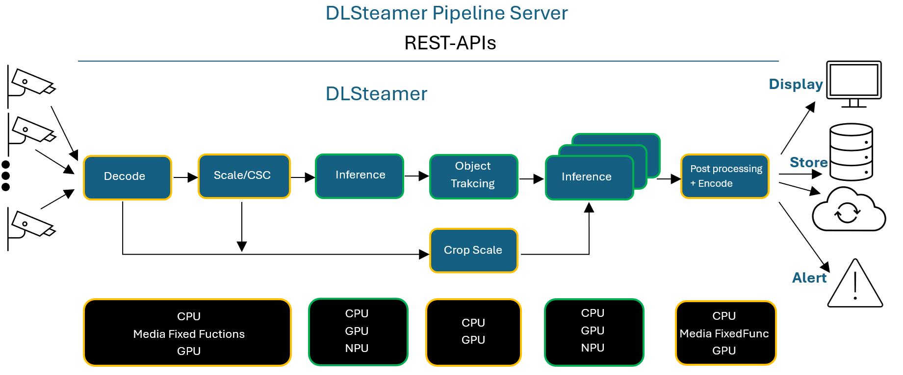
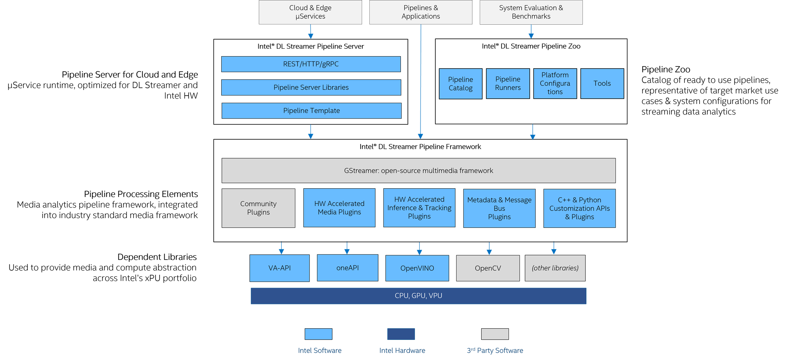
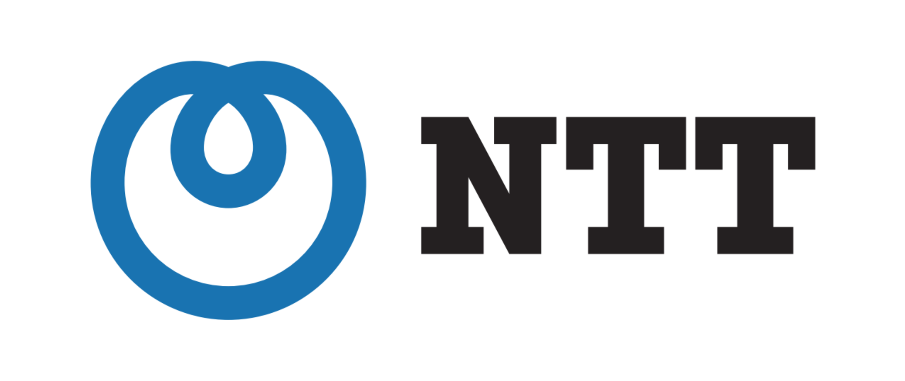

# Deep Learning Streamer

*Part of [Edge AI Libraries](https://docs.openedgeplatform.intel.com/dev/ai-libraries.html)*

<!--hide_directive

  <a class="icon_github" href="https://github.com/open-edge-platform/dlstreamer">
     GitHub
  </a>
  <a class="icon_document" href="https://github.com/open-edge-platform/dlstreamer/blob/main/README.md">
     Readme
  </a>

hide_directive-->

[System Requirements](./get_started/system_requirements.md) | [Install Guide](./get_started/install/install_guide_index.md) | [Tutorial](./get_started/tutorial.md) | [Elements](./elements/elements.md) | [Samples](https://github.com/open-edge-platform/dlstreamer/tree/main/samples/gstreamer) | [API Reference](./api_ref/api_reference.md) | [Release Notes](./release-notes.md)

**Deep Learning Streamer (DL Streamer)** is an open-source media analytics framework built on [GStreamer\*](https://gstreamer.freedesktop.org). It lets you build video and audio intelligence pipelines — from a simple object detection command line to a multi-stream production deployment — with minimal code, running on Intel® CPU, GPU, and NPU. DL Streamer consists of:

- [Deep Learning Streamer Pipeline
  Framework](https://github.com/open-edge-platform/dlstreamer/tree/main)
  for designing, creating, building, and running media analytics
  pipelines. It includes C++ and Python APIs.
- [Deep Learning Streamer Pipeline
  Server](https://github.com/open-edge-platform/edge-ai-libraries/tree/main/microservices/dlstreamer-pipeline-server)
  for deploying and scaling media analytics pipelines as
  micro-services on one or many compute nodes. It includes REST APIs
  for pipelines management.

Media analytics — the analysis of video and audio streams to detect, classify, track, and count objects, events, and people — powers a wide range of real-world applications: retail store and facility analytics, warehouse and parking management, industrial inspections, safety and regulatory compliance, and security monitoring. DL Streamer gives you the building blocks to bring these solutions to production without requiring deep expertise in hardware acceleration or inference optimization — a single pipeline runs on Intel® CPU, GPU, or NPU, letting you focus on your application logic while DL Streamer takes full advantage of the available Intel® hardware.

## Why DL Streamer?

| Benefit | Details |
|---|---|
| **One-line pipelines** | Build a working detection pipeline in a single `gst-launch-1.0` command |
| **Hardware acceleration** | Targets CPU, GPU, and NPU on Intel platforms from a single codebase |
| **Cross-platform** | Runs on Ubuntu 22.04/24.04 and Windows 11 |
| **VLM & GenAI ready** | Run Vision-Language Models (MiniCPM-V, CLIP, Whisper) in a GStreamer pipeline |
| **GstAnalytics compliance** | Supports the GStreamer industry metadata standard for interoperability |
| **Messaging integration** | Publish inference results to MQTT or Kafka with built-in elements — no extra code |
| **Python-first extensibility** | Add custom logic as Python callbacks or full Python elements — no C++ required |
| **30+ ready-to-run samples** | Covers detection, classification, tracking, VLMs, LiDAR, radar and more |
| **Multi-stream, multi-sensor** | Mux/demux dozens of RTSP streams, LiDAR frames, and radar point clouds in a single process |
| **Model hub support** | Deploy models from Geti™ Studio, Ultralytics, Hugging Face, or any ONNX/OpenVINO IR model directly |

**DL Streamer** uses OpenVINO™ Runtime inference back-end,
optimized for Intel hardware platforms and supports over
[70 NN Intel and open-source community pre-trained models](https://github.com/open-edge-platform/dlstreamer/blob/main/docs/scripts/supported_models.json), and models converted
[from other training frameworks](https://docs.openvino.ai/2026/openvino-workflow/model-preparation/convert-model-to-ir.html).
These models include object detection, object classification, human pose
detection, sound classification, semantic segmentation, and other use
cases: SSD, MobileNet, YOLO, Tiny YOLO, EfficientDet, ResNet,
FasterRCNN, and other models.

**DL Streamer** incorporates [GStreamer\* Analytics](https://gstreamer.freedesktop.org/documentation/analytics/index.html)
metadata library as the primary method for presenting inference results.
Find out more at [discourse.gstreamer.org](https://discourse.gstreamer.org/t/gstanalytics-adoption-in-dlstreamer-implementation-status-and-questions/5820)
and in [the documentation](./dev_guide/metadata.md).

**DL Streamer** provides over 30 samples, demos and
reference apps for the most common media analytics use cases. They are
included in
[Deep Learning Streamer Pipeline Framework](https://github.com/open-edge-platform/dlstreamer/tree/main),
[Deep Learning Streamer Pipeline Server](https://github.com/open-edge-platform/edge-ai-libraries/tree/main/microservices/dlstreamer-pipeline-server),
[Open Visual Cloud](https://github.com/OpenVisualCloud), and
[Intel® Edge Software Hub](https://www.intel.com/content/www/us/en/edge-computing/edge-software-hub.html)
The samples demonstrate C++ and/or Python based: Action Recognition, Face Detection and
Recognition, Drawing Face Attributes, Audio Event Detection, Vehicle and
Pedestrian Tracking, Human Pose Estimation, Vision-Language Models (VLMs),
Metadata Publishing, Smart City Traffic and Stadium Management, Intelligent Ad insertion,
single- & multi-channel video analytics pipelines benchmark, and other use cases.

**DL Streamer** offers a long list of models and samples
optimized for Intel hardware platforms, which can be used as a
reference or a starting point for a wide range of applications and
system configurations. These models and samples are a quick & easy way
to reach high performance, then benchmark and optimize your application
on your system.

**Deep Learning Streamer** is already used by many partners and customers
leading solutions, including [Open Visual
Cloud](https://github.com/OpenVisualCloud) Media Analytics services,
[NTT Software Innovation
Center](https://www.global.ntt/innovation/innovating-today/),
[Videonetics Technology Pvt. Limited](https://www.videonetics.com/),
AIVID TECHVISION and others.

## Testimonials

|  | “Deep Learning Streamer (OpenVINO™) is an easy-to-use and extensible application framework, which provides a well-organized set of classes and methods. In particular, Deep Learning Streamer allows us to add user-defined post processing with gvapython elements. This feature will help us develop AI-based video analytics applications for NTT's businesses, addressing various customer demands responsively.” — Takeharu Eda, Senior Research Engineer, NTT Software Innovation Center  |
|---|---|
|   | "Deep Learning Streamer Pipeline Server has helped TIBCO Software to develop and optimize Project AIR solution with less effort and shorter TTM, and to deliver better user experience that includes no-code data pipelines. Project AIR was able to easier deploy and expose optimized video analytics pipelines as microservices accessible for consumption via REST APIs." — Miguel Torres, Director of the Americas - Office of the CTO at TIBCO Software  |

------------------------------------------------------------------------

> **\*** *Other names and brands may be claimed as the property of
> others.*

<!--hide_directive
:::{toctree}
:hidden:

DL Streamer Home Page <https://docs.openedgeplatform.intel.com/dev/dlstreamer/index.html>

:::

:::{toctree}
:hidden:
:caption: Get Started

get_started/get_started_index
System Requirements <get_started/system_requirements>
Install Guide <get_started/install/install_guide_index>
Tutorial <get_started/tutorial>
Samples <https://github.com/open-edge-platform/dlstreamer/blob/main/samples/gstreamer/README.md>

:::

:::{toctree}
:hidden:
:caption: Developer Guide

dev_guide/dev_guide_index

:::

:::{toctree}
:hidden:
:caption: Reference

elements/elements
supported_models
elements/elements
dev_guide/dev_guide_index
api_ref/api_reference
architecture_2.0/architecture_2.0

:::

:::{toctree}
:hidden:
:caption: ----------------------

Release Notes <release-notes>

:::
hide_directive-->

