# Samples

DL Streamer ships with **40+ ready-to-run samples** that turn common media-analytics
tasks into working pipelines you can launch in minutes. They are the fastest way to
see an element or a full use case in action, and a great starting point to copy from
when building your own application.

Each sample lives in its own folder with a `README.md` and a run script. Browse them
online in the
[samples directory on GitHub](https://github.com/open-edge-platform/dlstreamer/tree/main/samples)
or, after installation, under `/opt/intel/dlstreamer/samples`.

> **Looking for a specific element?** See the [Elements](./elements/elements.md) page —
> most elements are demonstrated by one or more of the samples listed below.

## How to run

- Install DL Streamer first — see the [Get Started](./system_requirements.md) guide.
- Download the models the samples use with the conversion scripts under
  [scripts/download_models](https://github.com/open-edge-platform/dlstreamer/tree/main/scripts/download_models).
  They export models from Hugging Face, Ultralytics, TIMM and other sources to OpenVINO IR:
  - `download_hf_models.py` — Hugging Face models (VLMs, CLIP, Whisper, …).
  - `download_ultralytics_models.py` — Ultralytics YOLO models.
  - `download_timm_models.py` — TIMM image-classification models.
  - `download_other_models.sh` — other helper models (e.g. `centerface`, `hsemotion`, `deeplabv3`, `mars-small128`).

  See the [download_models README](https://github.com/open-edge-platform/dlstreamer/tree/main/scripts/download_models)
  for prerequisites, per-script requirements files and usage examples. Each sample's own
  `README.md` lists the exact model(s) it needs (see the **Models** column below).
- Samples with C/C++ code provide a `build_and_run.sh`; other samples provide a `.sh` script that builds and runs a `gst-launch-1.0` or Python command line.

> **Platform support:** Samples target **Linux (Ubuntu 22.04/24.04)** by default. A subset also ships a
> **Windows** variant (PowerShell/`.bat` scripts, D3D11/`ksvideosrc` backends). See the
> [Windows samples folder](https://github.com/open-edge-platform/dlstreamer/tree/main/samples/windows).

The **Language** column below indicates how each sample is implemented:
`CLI` (`gst-launch` command line), `Python`, or `C++`. The **Models** column lists the
default model(s) each sample runs — many samples let you swap in your own.

---

## Find a sample by what you want to do

### Object detection, classification & segmentation

| Preview | Sample | What it demonstrates | Key elements | Models | Language |
|---------|--------|----------------------|--------------|--------|----------|
| 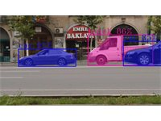 | [Detection with YOLO](https://github.com/open-edge-platform/dlstreamer/tree/main/samples/gstreamer/gst_launch/detection_with_yolo) | Object detection and classification with publicly available YOLO models | `gvadetect`, `gvaclassify` | `yolox_s` (default; many YOLO variants) | CLI |
| — | [Face Detection and Classification](https://github.com/open-edge-platform/dlstreamer/tree/main/samples/gstreamer/gst_launch/face_detection_and_classification) | Detect faces and estimate age, gender, emotions and facial landmarks | `gvadetect`, `gvaclassify` | `centerface`, `dima806_facial_age_image_detection`, `dima806_fairface_gender_image_detection`, `dima806_face_emotions_image_detection` | CLI |
| 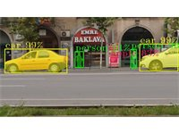 | [Instance Segmentation](https://github.com/open-edge-platform/dlstreamer/tree/main/samples/gstreamer/gst_launch/instance_segmentation) | Instance segmentation via the `object_detect` and `object_classify` bin elements | `object_detect`, `object_classify` | `yolo26s-seg` (default; also `yolo11s-seg`) | CLI |
| — | [Human Pose Estimation](https://github.com/open-edge-platform/dlstreamer/tree/main/samples/gstreamer/gst_launch/human_pose_estimation) | Full-frame human pose estimation | `gvaclassify` | `yolo26s-pose` | CLI |
| — | [Depth Estimation](https://github.com/open-edge-platform/dlstreamer/tree/main/samples/gstreamer/gst_launch/depth_estimation) | YOLO11n detection followed by Depth Anything V2 depth estimation on detected regions | `gvadetect`, `gvainference` | `yolo11n`, `Depth-Anything-V2-Small-hf` | CLI |
| — | [License Plate Recognition](https://github.com/open-edge-platform/dlstreamer/tree/main/samples/gstreamer/gst_launch/license_plate_recognition) | YOLO detector combined with an optical character recognition model | `gvadetect`, `gvainference` | `yolov8` license-plate detector, `PP-OCRv4` | CLI |
| 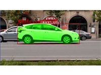 | [Prompt-based Object Detection](https://github.com/open-edge-platform/dlstreamer/tree/main/samples/gstreamer/python/prompted_detection) | Search a video for user-defined objects using an open-vocabulary model (YOLOE) | `gvadetect` | `yoloe-26s-seg` (text-prompt, class baked in at export) | Python |
| 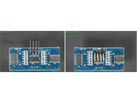 | [Deployment of Geti™ models](https://github.com/open-edge-platform/dlstreamer/tree/main/samples/gstreamer/gst_launch/geti_deployment) | Deploy Geti™-trained models for detection, anomaly detection and classification | `gvadetect`, `gvaclassify` | Geti™-trained (Padim / STFPM / UFlow) | CLI |
| — | [Motion Detect](https://github.com/open-edge-platform/dlstreamer/tree/main/samples/gstreamer/gst_launch/motion_detect) | Run detection only over motion ROIs (GPU and CPU paths) | `gvamotiondetect`, `gvadetect` | `yolov8n` | CLI |

### Object tracking & analytics

| Preview | Sample | What it demonstrates | Key elements | Models | Language |
|---------|--------|----------------------|--------------|--------|----------|
| — | [Vehicle and Pedestrian Tracking](https://github.com/open-edge-platform/dlstreamer/tree/main/samples/gstreamer/gst_launch/vehicle_pedestrian_tracking) | Object tracking across frames | `gvatrack`, `gvadetect`, `gvaclassify` | `yolo26s`, `dima806_vehicle_10_types_image_detection` | CLI |
| 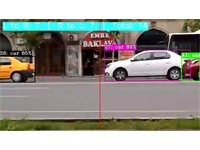 | [Vehicle Counter with gvaanalytics Tripwires](https://github.com/open-edge-platform/dlstreamer/tree/main/samples/gstreamer/python/gvaanalytics_tripwire) | Count vehicles crossing a virtual line in both directions using tripwires | `gvaanalytics`, `gvatrack` | `yolo11n` | Python |
| 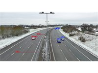 | [Smart NVR for Lane Hogging Detection](https://github.com/open-edge-platform/dlstreamer/tree/main/samples/gstreamer/python/smart_nvr) | Build an NVR with custom analytics and video storage to detect lane-hogging events | `gvaanalytics_py`, `gvarecorder_py` | `rtdetr_v2_r50vd` (RT-DETRv2) | Python |

### Vision-Language Models (VLM) & GenAI

| Preview | Sample | What it demonstrates | Key elements | Models | Language |
|---------|--------|----------------------|--------------|--------|----------|
| — | [Using VLM Models with gvagenai](https://github.com/open-edge-platform/dlstreamer/tree/main/samples/gstreamer/gst_launch/gvagenai) | Video summarization with MiniCPM-V | `gvagenai` | `MiniCPM-V`, `Phi-4-multimodal-instruct` or `Gemma-3` | CLI |
|  | [VLM Alerts](https://github.com/open-edge-platform/dlstreamer/tree/main/samples/gstreamer/python/vlm_alerts) | Edge alerting pipeline that generates structured JSON alerts per frame with annotated video | `gvagenai` | Configurable VLM (e.g. `Qwen2.5-VL`, `InternVL`) | Python |
| 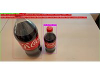 | [VLM-assisted Self Checkout](https://github.com/open-edge-platform/dlstreamer/tree/main/samples/gstreamer/python/vlm_self_checkout) | Combine CV object detection with a VLM for item classification, running both locally on edge | `gvadetect`, `gvagenai` | `yolo26s`, `MiniCPM-V-4_5` | Python |
| 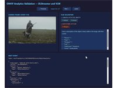 | [ONVIF Camera Analytics Validation](https://github.com/open-edge-platform/dlstreamer/tree/main/samples/gstreamer/python/onvif_camera_analytics_validation) | Use a VLM as an additional validation layer for ONVIF-enabled analytics cameras | `gvagenai` | Configurable VLM | Python |
| — | [Image Embeddings Generation with ViT](https://github.com/open-edge-platform/dlstreamer/tree/main/samples/gstreamer/gst_launch/lvm) | Generate image embeddings using the Vision Transformer component of a CLIP model | `gvainference` | `clip-vit-large-patch14` (CLIP ViT) | CLI |

### Audio analytics

| Sample | What it demonstrates | Key elements | Models | Language |
|--------|----------------------|--------------|--------|----------|
| [Audio Event Detection](https://github.com/open-edge-platform/dlstreamer/tree/main/samples/gstreamer/gst_launch/audio_detect) | Audio event detection, converting results to JSON | `gvaaudiodetect`, `gvametaconvert`, `gvametapublish` | `aclnet` | CLI |
| [Audio Transcription](https://github.com/open-edge-platform/dlstreamer/tree/main/samples/gstreamer/gst_launch/audio_transcribe) | Speech transcription using an OpenVINO GenAI Whisper model | `gvaaudiotranscribe` | `whisper` | CLI |

### 3D: LiDAR & radar

| Sample | What it demonstrates | Key elements | Models | Language |
|--------|----------------------|--------------|--------|----------|
| [PointPillars Inference with g3dinference](https://github.com/open-edge-platform/dlstreamer/tree/main/samples/gstreamer/gst_launch/g3dinference) | Complete LiDAR-only 3D detection pipeline | `g3dlidarparse`, `g3dinference` | `PointPillars` | CLI |
| [LiDAR Parse](https://github.com/open-edge-platform/dlstreamer/tree/main/samples/gstreamer/gst_launch/g3dlidarparse) | LiDAR parsing pipeline | `g3dlidarparse` | — (parsing only) | CLI |
| [Live LiDAR Capture](https://github.com/open-edge-platform/dlstreamer/tree/main/samples/gstreamer/gst_launch/g3dlidarsrc) | Real-time LiDAR capture from a physical device (RoboSense via rs_driver) | `g3dlidarsrc`, `g3dinference` | `PointPillars` | CLI |
| [Camera + 3D Object Fusion](https://github.com/open-edge-platform/dlstreamer/tree/main/samples/gstreamer/gst_launch/g3dobjectfuser) | Fuse 2D camera detections with 3D LiDAR detections | `g3dobjectfuser`, `gvastreammux` | `yolo11n`, `PointPillars` | CLI |
| [Radar Signal Process](https://github.com/open-edge-platform/dlstreamer/tree/main/samples/gstreamer/gst_launch/g3dradarprocess) | mmWave radar signal processing with point-cloud detection, clustering and tracking | `g3dradarprocess` | — (signal processing) | CLI |

### Cameras & input sources

| Preview | Sample | What it demonstrates | Key elements | Models | Language |
|---------|--------|----------------------|--------------|--------|----------|
| — | [RealSense™ Camera](https://github.com/open-edge-platform/dlstreamer/tree/main/samples/gstreamer/gst_launch/gvarealsense) | Capture a video stream from a 3D Intel RealSense™ Depth Camera | `gvarealsense` | — (capture only) | CLI |
| 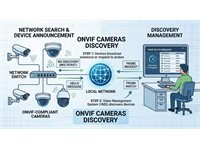 | [ONVIF Camera Discovery](https://github.com/open-edge-platform/dlstreamer/tree/main/samples/gstreamer/python/onvif_cameras_discovery) | Automatically discover ONVIF cameras on the network and launch pipelines for each | `gvadetect` | Configurable detector | Python |
| — | [Multi-camera deployments](https://github.com/open-edge-platform/dlstreamer/tree/main/samples/gstreamer/gst_launch/multi_stream) | Handle video streams from multiple cameras in a single application | `gvadetect`, `gvafpscounter` | `yolo11s` (many YOLO variants) | CLI |
| — | [Multi-Stream Mux/Demux](https://github.com/open-edge-platform/dlstreamer/tree/main/samples/gstreamer/gst_launch/stream_mux_and_demux) | Share a single inference pipeline across streams with per-source routing | `gvastreammux`, `gvastreamdemux` | Configurable detector | CLI |

### Metadata: publishing, access & visualization

| Preview | Sample | What it demonstrates | Key elements | Models | Language |
|---------|--------|----------------------|--------------|--------|----------|
| — | [Metadata Publishing](https://github.com/open-edge-platform/dlstreamer/tree/main/samples/gstreamer/gst_launch/metapublish) | Convert inference metadata to JSON and publish to file or Kafka/MQTT | `gvametaconvert`, `gvametapublish` | `centerface`, `dima806_fairface_gender_image_detection`, `dima806_facial_age_image_detection` | CLI |
| — | [gvaattachroi](https://github.com/open-edge-platform/dlstreamer/tree/main/samples/gstreamer/gst_launch/gvaattachroi) | Define the regions on which inference should be performed | `gvaattachroi`, `gvadetect` | `yolov8s` | CLI |
| — | [FPS Throttle](https://github.com/open-edge-platform/dlstreamer/tree/main/samples/gstreamer/gst_launch/gvafpsthrottle) | Throttle framerate independently of sink sync, without frame duplication or dropping | `gvafpsthrottle` | — | CLI |
| 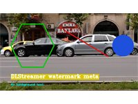 | [Watermark Metadata](https://github.com/open-edge-platform/dlstreamer/tree/main/samples/gstreamer/python/watermark_meta) | Attach custom drawing primitives (hexagons, lines, circles, text) and render them | `gvawatermark` | — (drawing only) | Python |
| — | [Draw Face Attributes (C++)](https://github.com/open-edge-platform/dlstreamer/tree/main/samples/gstreamer/cpp/draw_face_attributes) | Set a C callback to access frame metadata and visualize inference results | `gvadetect`, `gvaclassify` | `centerface`, `dima806_facial_age_image_detection`, `dima806_fairface_gender_image_detection`, `dima806_face_emotions_image_detection` | C++ |
| — | [Draw Face Attributes (Python)](https://github.com/open-edge-platform/dlstreamer/tree/main/samples/gstreamer/python/draw_face_attributes) | Set a Python callback to access frame metadata and visualize inference results | `gvadetect`, `gvaclassify` | `centerface`, `dima806_facial_age_image_detection`, `dima806_fairface_gender_image_detection`, `dima806_face_emotions_image_detection` | Python |
| 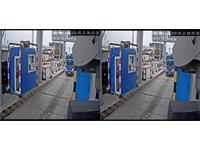 | [Open Close Valve](https://github.com/open-edge-platform/dlstreamer/tree/main/samples/gstreamer/python/open_close_valve) | Open/close a GStreamer `valve` branch from a callback based on detection results | `gvadetect`, `valve` | `yolo11s`, `dima806_vehicle_10_types_image_detection` | Python |
| 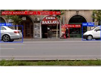 | [Hello DL Streamer](https://github.com/open-edge-platform/dlstreamer/tree/main/samples/gstreamer/python/hello_dlstreamer) | Build a detection pipeline, analyze metadata to count objects, and visualize results | `gvadetect`, `gvawatermark` | `yolo11n` | Python |

### Customization & extensibility

| Sample | What it demonstrates | Key elements | Models | Language |
|--------|----------------------|--------------|--------|----------|
| [Custom Post-Processing Library — Classification](https://github.com/open-edge-platform/dlstreamer/tree/main/samples/gstreamer/gst_launch/custom_postproc/classify) | Write a custom post-processing library that converts emotion-classification outputs to GstAnalytics metadata | `gvaclassify` | `centerface`, `hsemotion` | CLI, C++ |
| [Custom Post-Processing Library — Detection](https://github.com/open-edge-platform/dlstreamer/tree/main/samples/gstreamer/gst_launch/custom_postproc/detect) | Write a custom post-processing library that converts YOLOv11 tensor outputs to detection metadata | `gvadetect` | `yolo11s` | CLI, C++ |
| [gvapython — Face Detection and Classification](https://github.com/open-edge-platform/dlstreamer/tree/main/samples/gstreamer/gst_launch/gvapython/face_detection_and_classification) | Customize a pipeline with a Python script for inference post-processing | `gvapython`, `gvadetect`, `gvaclassify` | `centerface`, `dima806_fairface_gender_image_detection`, `dima806_facial_age_image_detection` | CLI, Python |
| [gvapython — Save Frames with ROI](https://github.com/open-edge-platform/dlstreamer/tree/main/samples/gstreamer/gst_launch/gvapython/save_frames_with_ROI_only) | Use `gvapython` to save video frames containing detected objects to disk | `gvapython`, `gvadetect` | `centerface` | CLI, Python |
| [python-elements — Face Detection and Classification](https://github.com/open-edge-platform/dlstreamer/tree/main/samples/gstreamer/gst_launch/python-elements/face_detection_and_classification) | Build a custom Python GStreamer element using the GstAnalytics metadata API | `gvaagelogger_py`, `gvadetect`, `gvaclassify` | `YOLOv8-Face-Detection`, `fairface_age_image_detection`, `fairface_gender_image_detection` | CLI, Python |
| [python-elements — Save Frames with ROI](https://github.com/open-edge-platform/dlstreamer/tree/main/samples/gstreamer/gst_launch/python-elements/save_frames_with_ROI_only) | Build a custom Python GStreamer element to save frames with detected objects | `gvaframesaver_py`, `gvadetect` | `YOLOv8-Face-Detection` | CLI, Python |
| [python-elements — Loitering Detection](https://github.com/open-edge-platform/dlstreamer/tree/main/samples/gstreamer/gst_launch/python-elements/loitering_detection) | Measure object dwell time with a custom Python element and render a visual alert when the threshold is exceeded | `gvaanalytics`, `gvawatermark` | `yolo11s` | CLI, Python |
| [Face Detection and Classification (Python)](https://github.com/open-edge-platform/dlstreamer/tree/main/samples/gstreamer/python/face_detection_and_classification) | Download models from Hugging Face, export to OpenVINO IR, and run inference | `gvadetect`, `gvaclassify` | `YOLOv8-Face-Detection`, `fairface` | Python |

### Performance & benchmarking

| Preview | Sample | What it demonstrates | Key elements | Models | Language |
|---------|--------|----------------------|--------------|--------|----------|
| — | [Benchmark](https://github.com/open-edge-platform/dlstreamer/tree/main/samples/gstreamer/benchmark) | Measure the performance of single- or multi-channel video analytics pipelines | `gvadetect`, `gvafpscounter` | `centerface` (configurable) | CLI, Python |
| 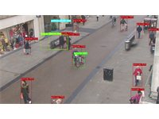 | [DL Streamer E2E Performance](https://github.com/open-edge-platform/dlstreamer/tree/main/samples/gstreamer/e2e_performance) | Compare DL Streamer vs. OpenCV + OpenVINO throughput with a YOLO26s INT8 model | `gvadetect` | `yolo26s` (INT8) | Python |

### Interoperability

| Sample | What it demonstrates | Key elements | Models | Language |
|--------|----------------------|--------------|--------|----------|
| [DL Streamer and DeepStream Coexistence](https://github.com/open-edge-platform/dlstreamer/tree/main/samples/gstreamer/python/coexistence) | Run pipelines on DL Streamer and/or NVIDIA DeepStream side by side | `gvadetect` | `yolov8` license-plate detector, `PP-OCRv4` | Python |
| — | [Coexistence Benchmark](https://github.com/open-edge-platform/dlstreamer/tree/main/samples/gstreamer/python/coexistence_benchmark) | Measure the maximum number of concurrent LPR streams on systems combining Intel and NVIDIA hardware | `gvadetect` | `yolov8` license-plate detector, `PP-OCRv4` | Python |

---

## Auto-generated reference applications

These end-to-end reference apps combine multiple elements into complete solutions.
Find them under
[samples/auto_generated_samples](https://github.com/open-edge-platform/dlstreamer/tree/main/samples/auto_generated_samples).

| Sample | What it demonstrates | Key elements | Models | Language |
|--------|----------------------|--------------|--------|----------|
| [DeepStream Test4 → DL Streamer Conversion](https://github.com/open-edge-platform/dlstreamer/tree/main/samples/auto_generated_samples/deepstream_python_conversion) | DL Streamer equivalent of NVIDIA's deepstream-test4 with YOLO11n detection and metadata publishing | `gvadetect`, `gvametaconvert`, `gvametapublish` | `yolo11n` | CLI |
| [DeepStream LPR App Conversion (C++)](https://github.com/open-edge-platform/dlstreamer/tree/main/samples/auto_generated_samples/deepstream_cpp_conversion) | C++ conversion of NVIDIA's DeepStream LPR app — license plate detection, tracking and text recognition | `gvadetect`, `gvatrack`, `gvaclassify` | YOLOv11, PaddleOCR | C++ |
| [License Plate Recognition](https://github.com/open-edge-platform/dlstreamer/tree/main/samples/auto_generated_samples/license_plate_recognition) | Detect license plates with YOLOv11 and recognize text with PaddleOCR | `gvadetect`, `gvainference` | `YOLOv11`, `PaddleOCR` | CLI |
| [Multi-Stream Compose](https://github.com/open-edge-platform/dlstreamer/tree/main/samples/auto_generated_samples/multi_stream_compose) | Multi-camera analytics with composite WebRTC output, on-demand recording and a 2x2 GPU-accelerated mosaic | `gvadetect`, `gvastreammux`, `gvawatermark` | `yolo11s` | CLI |
| [People Detection and Tracking with Deep SORT](https://github.com/open-edge-platform/dlstreamer/tree/main/samples/auto_generated_samples/people_detection_tracking) | Detect and track people using YOLO26m and Deep SORT with a Mars-Small-128 re-ID model | `gvadetect`, `gvatrack` | `yolo26m`, `mars-small128` | CLI |
| [Pose Estimation Compose](https://github.com/open-edge-platform/dlstreamer/tree/main/samples/auto_generated_samples/pose_estimation_compose) | Run 4 YOLO pose models in parallel on the same video and composite results into a 2x2 mosaic | `gvaclassify`, `gvawatermark` | `yolo26n-pose`, `yolo11n-pose`, `yolov8n-pose`, `yolov8l-pose` | CLI |
| [Safety Compliance Monitor](https://github.com/open-edge-platform/dlstreamer/tree/main/samples/auto_generated_samples/safety_compliance) | Detect and track workers and use Qwen2.5-VL to verify helmet and harness compliance | `gvadetect`, `gvatrack`, `gvagenai` | `yolo26m`, `Qwen2.5-VL-3B` | CLI |
| [Smart NVR — Event-Based Recording](https://github.com/open-edge-platform/dlstreamer/tree/main/samples/auto_generated_samples/smart_nvr) | Detect people with YOLO11n and record video only when a person is present | `gvadetect` | `yolo11n` | CLI |
