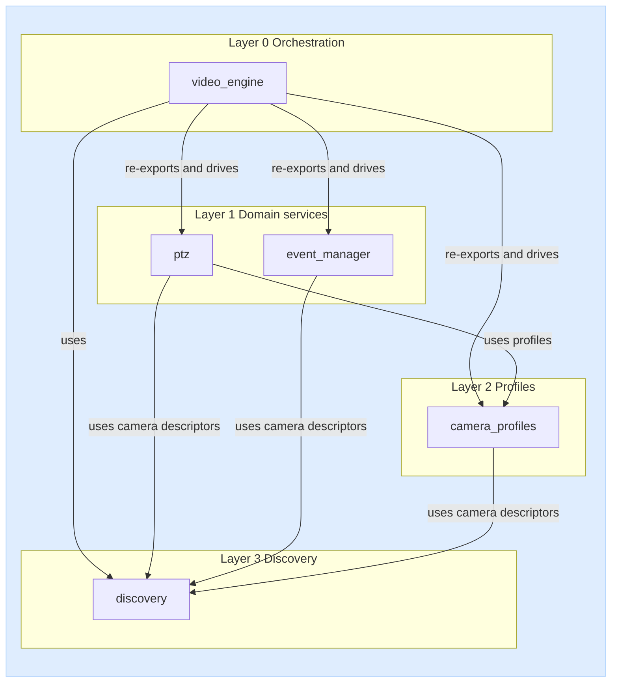

# dlstreamer.onvif - Suite Guide for DL Streamer Developer

This document aggregates the ONVIF suite public APIs, architecture notes, data
contracts, and sample usage from the libraries in this folder.

## Table of contents

- [Layered architecture (library-level blocks)](#layered-architecture-library-level-blocks)
- [Modules covered](#modules-covered)
- [discovery](#discovery)
- [camera_profiles](#camera_profiles)
- [ptz](#ptz)
- [event_manager](#event_manager)
- [video_engine](#video_engine)
- [video_engine_sample](#video_engine_sample)


## Modules covered

- `discovery` - WS-Discovery camera discovery layer.
- `camera_profiles` - ONVIF media profile discovery and data model.
- `ptz` - PTZ capability detection and camera control.
- `event_manager` - PullPoint event subscription and polling.
- `video_engine` - orchestration layer for discovery, pipelines, and events.
- `samples` - interactive sample applications for the suite.


## Layered architecture (library-level blocks)



Dependency notes (library-level):

- `camera_profiles` uses descriptors from `discovery`.
- `ptz` depends on `camera_profiles` for profile data and commonly consumes `discovery` output as input source.
- `event_manager` consumes descriptors from `discovery` and is independent from `ptz`.
- `video_engine` is the top-level orchestrator: it drives `discovery`, re-exports `camera_profiles`, `ptz` and `event_manager` public API, and starts/stops DL Streamer pipelines bound to discovered cameras.

---

## discovery

Source README: discovery/README.md

### Public functions

| Function | Signature | Input arguments | Return values | Description |
|---|---|---|---|---|
| discover_onvif_cameras | discover_onvif_cameras(verbose: bool = False) -> Iterator[dict] | verbose: bool = False | Iterator[dict], where each item has the form {"hostname": str, "port": int} | Synchronous generator that streams discovered cameras. |
| discover_onvif_cameras_async | discover_onvif_cameras_async(verbose: bool = False) -> AsyncIterator[dict] | verbose: bool = False | AsyncIterator[dict], where each item has the form {"hostname": str, "port": int} | Asynchronous generator (async for) that streams discovered cameras. |
| extract_xaddrs | extract_xaddrs(xml_string: str) -> Optional[str] | xml_string: str | Optional[str] (the XAddrs value or None) | XML helper that reads the XAddrs field from a ProbeMatch response. |
| parse_xaddrs_url | parse_xaddrs_url(xaddrs: str) -> dict | xaddrs: str | dict with keys: full_url, scheme, hostname, port, path, base_url | Parses the first URL from XAddrs and returns its components. |

### Data contract

Discovery result item:

```python
{"hostname": str, "port": int}
```

---

## camera_profiles

Source README: camera_profiles/README.md

### Public data model

| Type | Description |
|---|---|
| ONVIFProfile | Media profile object with video/audio/PTZ fields and RTSP URL. |
| CameraProfilesResult | Per-camera result wrapper: hostname, port, profiles, error, ok. |

### Public functions

| Function | Signature | Input arguments | Return values | Description |
|---|---|---|---|---|
| read_camera_profiles | read_camera_profiles(cameras: Iterable[dict], username: str = "", password: str = "", verbose: bool = False) -> Iterator[CameraProfilesResult] | cameras (iterable of camera descriptors), username, password, verbose | Iterator[CameraProfilesResult] | Reads profiles from a synchronous camera source and yields one result per camera. |
| read_camera_profiles_async | read_camera_profiles_async(cameras: Iterable[dict] \| AsyncIterable[dict], username: str = "", password: str = "", verbose: bool = False) -> AsyncIterator[CameraProfilesResult] | cameras (sync or async camera source), username, password, verbose | AsyncIterator[CameraProfilesResult] | Async variant that works with both sync and async camera sources. |

### Data contracts

Input camera descriptor:

```python
{"hostname": "10.0.0.15", "port": 80}
```

Per-camera result shape:

```python
{
    "hostname": "10.0.0.15",
    "port": 80,
    "profiles": [ONVIFProfile, ...],
    "error": None,
    "ok": True,
}
```

---

## ptz

Source README: ptz/README.md

### Public data model

| Type | Description |
|---|---|
| PTZVector | Pan/tilt/zoom vector used in PTZ operations. |
| PTZStatus | Snapshot of PTZ state (position, move status, error, time). |
| PTZPreset | Named PTZ preset entry. |
| PTZCapableProfile | Camera profile descriptor confirmed to support PTZ. |

### Public functions

| Function | Signature | Input arguments | Return values | Description |
|---|---|---|---|---|
| is_ptz_profile | is_ptz_profile(profile: ONVIFProfile) -> bool | profile (media profile) | bool | Returns True if the profile contains PTZ configuration. |
| find_ptz_capable_profiles | find_ptz_capable_profiles(cameras: Iterable[dict], username: str = "", password: str = "", verbose: bool = False) -> Iterator[PTZCapableProfile] | cameras (iterable of camera descriptors), username, password, verbose | Iterator[PTZCapableProfile] | Reads camera profiles and yields only PTZ-capable profiles (sync). |
| find_ptz_capable_profiles_async | find_ptz_capable_profiles_async(cameras: Iterable[dict] \| AsyncIterable[dict], username: str = "", password: str = "", verbose: bool = False) -> AsyncIterator[PTZCapableProfile] | cameras (sync or async camera source), username, password, verbose | AsyncIterator[PTZCapableProfile] | Async variant that yields PTZ-capable profiles from sync or async sources. |

### Public controller API

| Function | Signature | Input arguments | Return values | Description |
|---|---|---|---|---|
| PTZController (class) | PTZController(hostname: str, port: int, profile_token: str, username: str = "", password: str = "") | hostname, port, profile_token, username, password | PTZController instance | Controller for a single (camera, profile_token) pair. |
| PTZController.from_capable_profile | PTZController.from_capable_profile(profile: PTZCapableProfile, username: str = "", password: str = "") -> PTZController | profile, username, password | PTZController | Builds a controller directly from PTZCapableProfile. |
| PTZController.continuous_move | continuous_move(velocity: PTZVector, timeout: float \| None = None) -> None | velocity, timeout | None | Starts continuous move with velocity vector; optional auto-stop timeout. |
| PTZController.relative_move | relative_move(translation: PTZVector, speed: PTZVector \| None = None) -> None | translation, speed | None | Moves relatively from the current position. |
| PTZController.absolute_move | absolute_move(position: PTZVector, speed: PTZVector \| None = None) -> None | position, speed | None | Moves to an absolute PTZ position. |
| PTZController.stop | stop(pan_tilt: bool = True, zoom: bool = True) -> None | pan_tilt, zoom | None | Stops pan/tilt and/or zoom motion. |
| PTZController.goto_preset | goto_preset(preset_token: str, speed: PTZVector \| None = None) -> None | preset_token, speed | None | Moves camera to a saved preset. |
| PTZController.goto_home | goto_home(speed: PTZVector \| None = None) -> None | speed | None | Moves camera to home position. |
| PTZController.home_supported | home_supported() -> bool | - | bool | True when the PTZ node advertises `HomeSupported`; check before `goto_home`/`set_home` to avoid a SOAP fault on cameras without home support. |

### Data contracts

Input camera descriptor:

```python
{"hostname": "10.0.0.15", "port": 80}
```

PTZ-capable profile shape:

```python
{
    "hostname": "10.0.0.15",
    "port": 80,
    "profile_token": "Profile_1",
    "profile_name": "MainStream",
    "ptz_configuration_token": "PTZConf_1",
    "ptz_node_token": "PTZNode_1",
    "camera_id": "10.0.0.15:80",
}
```

---

## event_manager

Source README: event_manager/README.md

### Public data model

| Type | Description |
|---|---|
| EventNotification | Parsed ONVIF NotificationMessage (topic, utc_time, property_operation, source, data, raw). Supports both zeep objects and raw lxml Element payloads. |
| EventFilter | Topic-expression filter descriptor used for PullPoint subscription requests. |
| EventCapableCamera | Camera descriptor confirmed to expose ONVIF Events service. |
| SupportedEventTopic | One event type advertised by a camera (from GetEventProperties): `topic` path, `is_property` flag, and `source`/`data` maps of `{field_name: type}` describing the notification payload (e.g. `data={"IsMotion": "xsd:boolean"}`). |

### Public functions

| Function | Signature | Input arguments | Return values | Description |
|---|---|---|---|---|
| is_event_capable | is_event_capable(hostname: str, port: int, username: str = "", password: str = "", verbose: bool = False) -> bool | hostname, port, username, password, verbose | bool | Quick probe that returns True if camera responds to Events GetServiceCapabilities. |
| find_event_capable_cameras | find_event_capable_cameras(cameras: Iterable[dict], username: str = "", password: str = "", verbose: bool = False) -> Iterator[EventCapableCamera] | cameras (iterable of descriptors), username, password, verbose | Iterator[EventCapableCamera] | Reads camera descriptors and yields only event-capable cameras (sync). |
| find_event_capable_cameras_async | find_event_capable_cameras_async(cameras: Iterable[dict] \| AsyncIterable[dict], username: str = "", password: str = "", verbose: bool = False) -> AsyncIterator[EventCapableCamera] | cameras (sync or async source), username, password, verbose | AsyncIterator[EventCapableCamera] | Async variant that accepts both sync and async camera sources. |
| get_supported_event_topics | get_supported_event_topics(hostname: str, port: int, username: str = "", password: str = "", verbose: bool = False) -> list[SupportedEventTopic] | hostname, port, username, password, verbose | list[SupportedEventTopic] | Reads GetEventProperties and returns the event types a camera advertises, each with its topic path and Source/Data field schema (names + types, e.g. `IsMotion: xsd:boolean`) and the IsProperty flag. No subscription is created. |
| pull_events_once | pull_events_once(hostname: str, port: int, username: str = "", password: str = "", verbose: bool = False, timeout: str = "PT30S", limit: int = 100, termination_time: str = "PT1H", topic_filter: EventFilter \| None = None) -> list[EventNotification] | hostname, port, credentials, timeout, limit, termination_time, topic_filter | list[EventNotification] | Simplest sync call: subscribe, pull one batch, and close automatically. |
| stream_events | stream_events(hostname: str, port: int, username: str = "", password: str = "", verbose: bool = False, timeout: str = "PT30S", limit: int = 100, termination_time: str = "PT1H", topic_filter: EventFilter \| None = None, renew_every: float \| None = 300.0) -> AsyncIterator[EventNotification] | hostname, port, credentials, pull settings, optional filter, renew_every | AsyncIterator[EventNotification] | Simplest async stream with automatic subscribe/renew/close lifecycle. |

### Data contracts

Input camera descriptor:

```python
{"hostname": "10.0.0.15", "port": 80}
```

Event-capable camera shape:

```python
{
    "hostname": "10.0.0.15",
    "port": 80,
    "error": None,
    "camera_id": "10.0.0.15:80",
    "ok": True,
}
```

EventNotification fields:

| Field | Type | Description |
|---|---|---|
| topic | str | ONVIF topic (may be empty for some vendor cameras). |
| utc_time | str | UTC timestamp of the event (ISO 8601). |
| property_operation | str | "Initialized", "Changed", or "Deleted" (or empty). |
| source | dict[str, str] | Flattened Source/SimpleItem pairs (e.g. `{"Rule": "MyMotionDetectorRule"}`). |
| data | dict[str, str] | Flattened Data/SimpleItem pairs (e.g. `{"IsMotion": "true"}`). |
| raw | Any | Original zeep NotificationMessage object for advanced introspection. |

### Non-public advanced API

For full manual PullPoint lifecycle control, use:

```python
from dlstreamer.onvif.event_manager.engine import OnvifEventEngine
```

#### OnvifEventEngine

| Method / Property | Signature | Description |
|---|---|---|
| `__init__` | `OnvifEventEngine(hostname: str, port: int, username: str = "", password: str = "", verbose: bool = False)` | Create an engine for a single camera. |
| `from_capable_camera` | `OnvifEventEngine.from_capable_camera(camera: EventCapableCamera, username: str = "", password: str = "") -> OnvifEventEngine` | Build an engine from an `EventCapableCamera`. |
| `subscribe` | `subscribe(termination_time: str = "PT1H", topic_filter: EventFilter \| None = None) -> None` | Create a PullPoint subscription. |
| `pull` | `pull(timeout: str = "PT30S", limit: int = 100) -> list[EventNotification]` | Fetch one batch of notifications (long-polling). |
| `renew` | `renew(termination_time: str = "PT1H") -> None` | Extend the subscription before it expires. |
| `unsubscribe` | `unsubscribe() -> None` | Cancel the subscription and release PullPoint state. |
| `stream` | `stream(timeout: str = "PT30S", limit: int = 100, renew_every: float \| None = 300.0) -> AsyncIterator[EventNotification]` | Async generator that pulls continuously with auto-renew. |
| `get_service_capabilities` | `get_service_capabilities() -> dict` | Return EventServiceCapabilities as a flat dict. |
| `get_event_properties` | `get_event_properties() -> Any` | Return raw GetEventProperties response (topic set + dialects). |
| `get_supported_event_topics` | `get_supported_event_topics() -> list[SupportedEventTopic]` | Return the event types the camera advertises, each with its topic path and Source/Data field schema, parsed from the GetEventProperties TopicSet + MessageDescription. |
| `close` | `close() -> None` | Unsubscribe (best-effort) and release zeep clients. |
| `subscribed` (property) | `bool` | True while a PullPoint subscription is active. |
| `subscription_reference` (property) | `str` | Subscription reference URL from CreatePullPointSubscription. |
| `termination_time` (property) | `str` | Latest TerminationTime reported by the camera. |

Async wrappers (offload to thread, identical semantics):

| Method | Signature |
|---|---|
| `subscribe_async` | `subscribe_async(termination_time: str = "PT1H", topic_filter: EventFilter \| None = None) -> None` |
| `pull_async` | `pull_async(timeout: str = "PT30S", limit: int = 100) -> list[EventNotification]` |
| `renew_async` | `renew_async(termination_time: str = "PT1H") -> None` |
| `unsubscribe_async` | `unsubscribe_async() -> None` |
| `get_service_capabilities_async` | `get_service_capabilities_async() -> dict` |
| `get_event_properties_async` | `get_event_properties_async() -> Any` |
| `get_supported_event_topics_async` | `get_supported_event_topics_async() -> list[SupportedEventTopic]` |

#### Usage example (manual lifecycle)

```python
from dlstreamer.onvif.event_manager.engine import OnvifEventEngine

with OnvifEventEngine("10.91.106.65", 2020, "admin", "pass") as eng:
    eng.subscribe(termination_time="PT1H")
    while True:
        for note in eng.pull(timeout="PT30S", limit=100):
            print(note.topic, note.property_operation, note.source, note.data)
```

#### Implementation notes

- The PullPoint service is bound to the subscription reference URL returned by `CreatePullPointSubscription`, not to the generic events endpoint. This ensures that after `unsubscribe()` + `subscribe()` the engine always targets the new endpoint.
- Raw lxml `Element` payloads (common in vendor cameras like Hikvision) are parsed transparently — `EventNotification.source` and `.data` are populated correctly regardless of whether the camera returns zeep-native objects or raw XML elements.

---

## video_engine

Source: `video_engine/api.py`, `video_engine/engine.py`, `video_engine/types.py`

### Purpose

`video_engine` is a thin orchestrator that coordinates `discovery`, `camera_profiles`, `ptz`, and `event_manager` to manage ONVIF cameras and their DL Streamer pipelines. It exposes a module-level API backed by a shared default `VideoEngine` singleton plus a `create_video_engine()` factory for isolated instances. The `camera_profiles`, `ptz` and `event_manager` public APIs are re-exported from `dlstreamer.onvif.video_engine` for convenience.

### Public data model

| Type | Description |
|---|---|
| CameraIdentity | Normalized camera key (hostname, port, optional MAC) used for matching and state tracking. |
| PipelineBinding | Configured DL Streamer pipeline associated with a `CameraIdentity` (binding_id, pipeline command, optional events, optional profile_name, optional username/password used for `{rtsp_url}` resolution). |
| CameraRuntimeState | Live state for a discovered camera (status, last_seen, active pipeline binding IDs, error, cached profiles snapshot, template binding IDs). |
| VideoEngineEvent | Callback payload emitted by the engine (kind, camera, details, timestamp). |
| CameraEventDefinition | ONVIF event definition attached to a camera (name, camera, topic_filter, renew_every, metadata). |
| CameraMatcher | Opt-in template predicate matching a camera by `hostname`/`port`/`mac`/`mac_prefix`/`subnet` (CIDR). |
| PipelineTemplate | Opt-in recipe (matcher + placeholder pipeline + `profile_selector`) auto-instantiated into a `PipelineBinding` on every matching camera. |
| CameraProfileSnapshot | Cached ONVIF media profiles for one camera (profiles, fetched_at, mac_address, error, `ok`). |
| VideoEngine | Coordinator class; call `create_video_engine()` or `get_video_engine()` to obtain an instance. |

### Public factory and lifecycle functions

| Function | Signature | Description |
|---|---|---|
| create_video_engine | `create_video_engine(config_path: str \| Path \| None = None, *, discovery_time: int = 60, timeout: int = 120, verbose: bool = False) -> VideoEngine` | Creates a new independent `VideoEngine` instance. |
| get_video_engine | `get_video_engine() -> VideoEngine` | Returns the module-level default `VideoEngine` singleton driven by the module-level API. |
| start_video_engine | `start_video_engine() -> None` | Starts the default engine: launches discovery and pipeline orchestration. Safe to call repeatedly. |
| stop_video_engine | `stop_video_engine() -> None` | Stops discovery and terminates all active pipelines on the default engine. |
| destroy_video_engine | `destroy_video_engine() -> None` | Releases all discovery, pipeline, and event resources on the default engine. |

### Public discovery control

| Function | Signature | Description |
|---|---|---|
| discovery_start | `discovery_start() -> None` | Starts continuous ONVIF discovery on the default engine (without affecting existing pipelines). |
| discovery_stop | `discovery_stop() -> None` | Stops ONVIF discovery on the default engine. |

### Public configuration

| Function | Signature | Description |
|---|---|---|
| setTimeout | `setTimeout(sec: int) -> None` | Sets the camera-lost timeout: cameras not re-discovered within `sec` seconds are marked lost and their pipelines terminated. Minimum 1. |
| getTimeout | `getTimeout() -> int` | Returns the current camera-lost timeout in seconds. |
| setDiscoveryTime | `setDiscoveryTime(sec: int) -> None` | Sets how often ONVIF discovery re-scans the network, in seconds. Minimum 1. |
| getDiscoveryTime | `getDiscoveryTime() -> int` | Returns the current discovery re-scan interval. |
| load_config | `load_config(config_path: str \| Path, *, pipeline_library: dict[str, Any] \| None = None) -> None` | Loads or reloads JSON camera bindings on the default engine. Binding entries reference a pipeline by id (`pipeline_ref`) resolved against `pipeline_library`, or carry an inline `pipeline`. |
| save_config | `save_config() -> None` | Persists the current in-memory bindings back to the JSON configuration file. |

### Public camera pipeline management

| Function | Signature | Description |
|---|---|---|
| list_camera_pipeline_pairs | `list_camera_pipeline_pairs() -> list[dict]` | Returns all configured (camera, pipeline) bindings as dicts. |
| get_pipeline_for_camera | `get_pipeline_for_camera(hostname: str, port: int, mac: str \| None = None) -> list[dict]` | Returns all bindings matching the given camera identity. |
| set_camera_pipeline | `set_camera_pipeline(hostname: str, port: int, pipeline: Sequence[str] \| str, *, mac: str \| None = None, binding_id: str \| None = None, events: Iterable[str] \| None = None, persist: bool = False) -> PipelineBinding` | Registers a new pipeline binding for a camera; when `persist=True` writes the configuration back to disk. |

### Public auto-templates and auto-profile-fetch (opt-in)

| Function | Signature | Description |
|---|---|---|
| enable_auto_profile_fetch | `enable_auto_profile_fetch(enabled: bool = True, *, ttl_seconds: float = 300.0) -> None` | Toggles automatic ONVIF media-profile fetch (with TTL cache) on discovery for the default engine. |
| add_pipeline_template | `add_pipeline_template(template: PipelineTemplate \| dict) -> PipelineTemplate` | Registers a template that auto-instantiates a binding for every matching discovered camera. |
| remove_pipeline_template | `remove_pipeline_template(template_id: str) -> None` | Unregisters a template by id (does not stop bindings it already produced). |
| list_pipeline_templates | `list_pipeline_templates() -> list[dict]` | Returns the currently registered templates as dicts. |
| as_pipeline_template | `as_pipeline_template(payload: Any) -> PipelineTemplate` | Builds a `PipelineTemplate` from a dict payload. |

### Public camera events

| Function | Signature | Description |
|---|---|---|
| set_camera_event | `set_camera_event(hostname: str, port: int, event_name: str, *, mac: str \| None = None, topic_filter: str \| None = None, renew_every: float \| None = None, **metadata) -> CameraEventDefinition` | Defines an ONVIF event of interest for a camera. |
| list_camera_events | `list_camera_events(hostname: str, port: int, mac: str \| None = None) -> list[dict]` | Returns all event definitions registered for a given camera. |

### Public callbacks

| Function | Signature | Description |
|---|---|---|
| register_callback | `register_callback(callback: Callable[[VideoEngineEvent], None]) -> None` | Subscribes a callback to `VideoEngineEvent` notifications (discovered, matched, pipeline_started, pipeline_stopped, lost, error). |
| unregister_callback | `unregister_callback(callback: Callable[[VideoEngineEvent], None]) -> None` | Removes a previously registered callback. |

### Public state query

| Function | Signature | Description |
|---|---|---|
| get_active_cameras | `get_active_cameras() -> list[dict]` | Returns runtime state of all currently tracked cameras. |
| get_active_pipelines | `get_active_pipelines() -> list[dict]` | Returns `{binding_key, pid}` for every running pipeline subprocess. |

### Re-exported public API

For convenience, `dlstreamer.onvif.video_engine` re-exports the full public API of the three dependent libraries:

- from `dlstreamer.onvif.camera_profiles`: `ONVIFProfile`, `CameraProfilesResult`, `read_camera_profiles`, `read_camera_profiles_async`.
- from `dlstreamer.onvif.ptz`: `PTZVector`, `PTZStatus`, `PTZPreset`, `PTZCapableProfile`, `is_ptz_profile`, `find_ptz_capable_profiles`, `find_ptz_capable_profiles_async`, `PTZController`.
- from `dlstreamer.onvif.event_manager`: `EventCapableCamera`, `EventFilter`, `EventNotification`, `SupportedEventTopic`, `is_event_capable`, `find_event_capable_cameras`, `find_event_capable_cameras_async`, `get_supported_event_topics`, `pull_events_once`, `stream_events`.

These behave identically to the originals; see the [camera_profiles](#camera_profiles), [ptz](#ptz) and [event_manager](#event_manager) sections above.

### Data contracts

The `video_engine` module works with two JSON files that separate **pipeline
definitions** from the **cameras/rules** that use them.

**1. Engine binding config** (`VideoEngine.load_config`) — camera bindings that
reference a pipeline **by id** (`pipeline_ref`) resolved against the pipeline
library, keeping a single source of pipeline definitions (an inline `pipeline` is
still accepted for standalone configs). Each entry may carry `username`/`password`
used to resolve the `{rtsp_url}` placeholder:

```json
{
  "pipelines": [
    {
      "binding_id": "cam1_main",
      "camera": {"hostname": "10.0.0.15", "port": 80, "mac": null},
      "profile_name": "MainStream",
      "events": [],
      "username": "admin",
      "password": "secret",
      "pipeline_ref": "lab_cam1_main"
    }
  ]
}
```

The same file may also carry an optional `templates` list (opt-in auto-templates).
Each template pairs a `matcher` (`hostname`/`port`/`mac`/`mac_prefix`/`subnet`)
with a placeholder pipeline; matching cameras discovered later auto-start a
generated binding. Placeholders: `{rtsp_url}`, `{hostname}`, `{port}`, `{mac}`,
`{profile_name}`. `profile_selector` is `"first"` (default) or `"name=<value>"`:

```json
{
  "templates": [
    {
      "template_id": "any-h264-main",
      "matcher": { "subnet": "10.91.106.0/24" },
      "profile_selector": "name=MainStream",
      "pipeline": ["gst-launch-1.0", "rtspsrc", "location={rtsp_url}", "!", "..."],
      "username": "admin", "password": "r00tme", "auto_start": true
    }
  ]
}
```

**2. Pipeline library + rules** (used by `DynamicPipelineController`) — pipelines
are defined **once** in a library (no cameras) and referenced by id from rules
(which hold the cameras). Load the library with `load_pipeline_library()`, then
the rules with `load_rules()`:

```json
// video_engine_pipelines.json — definitions only (no cameras)
{ "pipelines": {
    "move_detected_ball_test": [
      "gst-launch-1.0", "-v", "videotestsrc", "pattern=ball", "!",
      "videoconvert", "!", "gvawatermark",
      "displ-cfg=ff-custom-txt='Move detected'", "!",
      "videoconvert", "!", "autovideosink"
    ]
} }
```

```json
// video_engine_event_mapping.json — cameras + pipeline_ref
{ "rules": [
    {
      "name": "run-ball-test-on-motion",
      "camera": { "hostname": "10.91.106.65", "port": 2020 },
      "trigger": { "data_equals": { "IsMotion": "true" } },
      "action": "add",
      "target_binding_id": "move_detected_ball_test",
      "pipeline_ref": "move_detected_ball_test",
      "username": "admin", "password": "r00tme"
    }
] }
```

An unknown `pipeline_ref` raises a `ValueError` at load time. When a rule/binding
omits `username`/`password`, the engine and controller fall back to the defaults
set with `set_default_credentials(user, pass)`.

The `{rtsp_url}` placeholder is resolved at pipeline-start time using ONVIF `GetStreamUri` with `profile_name`.

`PipelineBinding.to_dict()` shape (used by `list_camera_pipeline_pairs` and `get_pipeline_for_camera`) — note that `username`/`password` are **not** serialized:

```python
{
    "camera": {"hostname": str, "port": int, "mac": Optional[str]},
    "binding_id": str,
    "pipeline": list[str] | str,
    "events": list[str],
}
```

`get_active_pipelines()` element shape:

```python
{"binding_key": str, "pid": int}
```

### Lifecycle model (guarantees)

- `start_video_engine`, `stop_video_engine` and `discovery_*` calls are safe to invoke repeatedly without creating duplicate workers or duplicate camera entries.
- `destroy_video_engine` releases all discovery, pipeline, and event resources on the default engine.
- Pipelines are spawned as subprocesses of the `gst-launch-1.0` command in the configured binding; stdout/stderr are logged to `/tmp/video_engine_pipeline_<binding_id>.log`.
- Cameras that stop responding to discovery for longer than `getTimeout()` seconds are marked `lost` and their pipelines are terminated.

---

## video_engine_sample

### Running

Run all commands below from the repository root (`dlstreamer/`):

```bash
cd /path/to/dlstreamer

# 1. Create and activate a virtual environment (one-time)
python3 -m venv .venv
source .venv/bin/activate

# 2. Install the package (one-time)
pip install -e python/

# 3. Set environment variables
export ONVIF_USER="admin"
export ONVIF_PASSWORD="secret"

# 4. Run the application
python -m dlstreamer.onvif.samples.video_engine_sample

# or with a custom configuration file
python -m dlstreamer.onvif.samples.video_engine_sample --config /path/to/video_engine_pipelines.json
```

### Configuration files

The application uses three JSON files with separated responsibilities:

- `video_engine_static_mapping.json` — **static camera-pipeline bindings** (`pipelines`
  as a **list** of entries, each carrying a `camera` identity and a `pipeline_ref`
  that points at a pipeline id in `video_engine_pipelines.json` — the single
  source of pipeline definitions). Loaded via menu option **4) Load static
  camera-pipeline bindings (JSON)** (`VideoEngine.load_config`, resolving refs
  against the loaded pipeline library); view with **5) Show static camera-pipeline
  bindings**, unload with **6) Clear static camera-pipeline bindings**.
- `video_engine_pipelines.json` — the **pipeline library** (`id → definition`),
  with no camera information. Loaded via menu option **2) Load pipeline json
  file**; view with **3) Show loaded pipeline library**.
- `video_engine_event_mapping.json` — the **rules**: cameras + trigger + a `pipeline_ref`
  pointing at a pipeline in the library. Loaded via **7) Load dynamic
  event->action rules**, then **14) Start dynamic pipeline control** starts
  listening for events.

Static bindings and the pipeline library both use a top-level `pipelines` key,
but the static file is a **list** of bindings while the library is a **mapping**
`id → pipeline` — they are handled by different loaders.

To launch pipelines for loaded static bindings, start discovery with **12) Start
discovery and pipeline orchestration** and stop it with **13) Stop discovery and
pipelines**.

### Credentials (username / password)

- **Menu option 1) Configure ONVIF credentials** — prompts interactively for the
  username and password (`getpass`); they become the defaults for the engine and
  controller (fallback used when a binding/rule has none of its own).
- Alternatively: the `username`/`password` fields in a rule (or binding), or the
  `ONVIF_USER` / `ONVIF_PASSWORD` environment variables (used, among others, by
  options **19) List camera profiles** and **20) Preview stream**). The password
  is not serialized by `to_dict()`.
