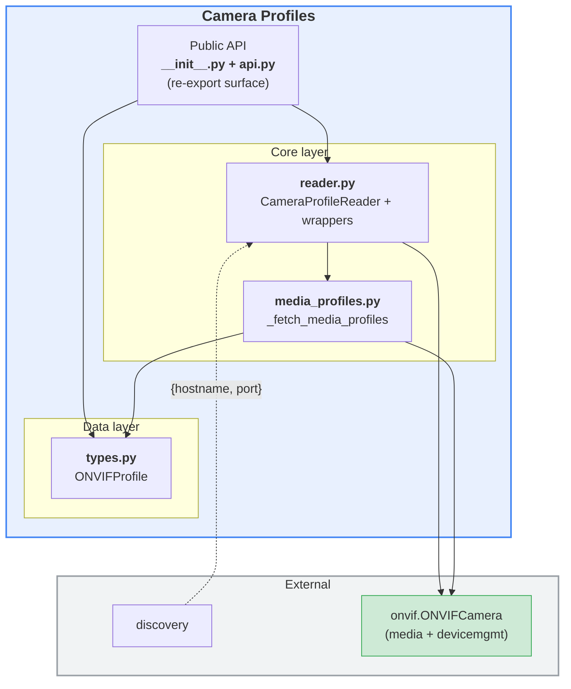
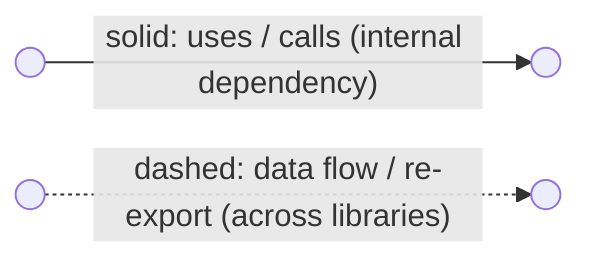
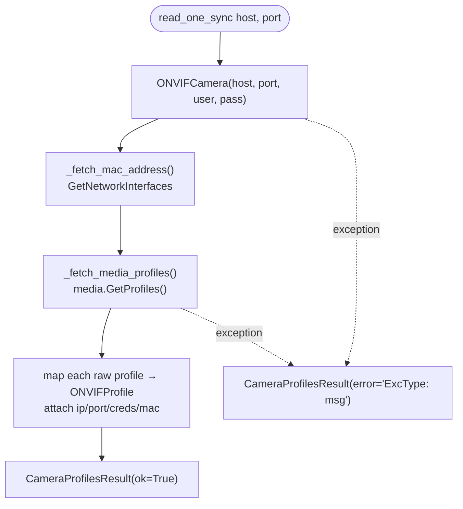
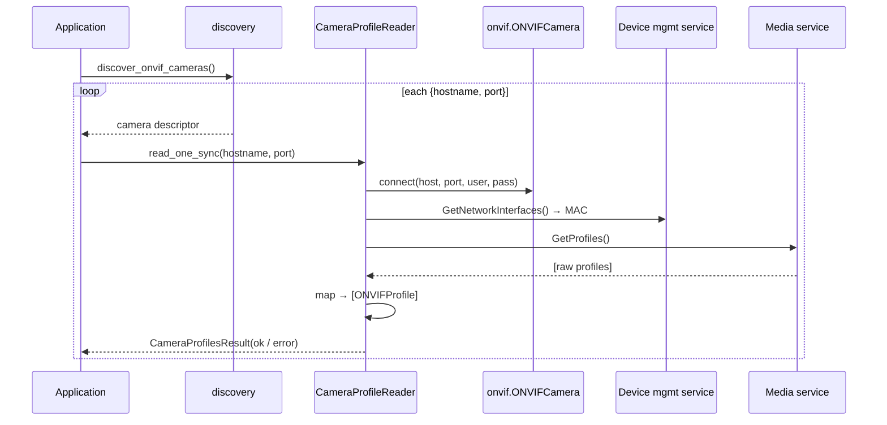

# `camera_profiles` library — overview

The `camera_profiles` library owns the ONVIF **media profile data model** and
reads profiles from cameras found by [`discovery`](../discovery/README.md). The
two libraries are complementary:

- `discovery` finds ONVIF cameras and yields `{"hostname": str, "port": int}`
  descriptors.
- `camera_profiles` (this library) consumes those descriptors and returns the
  media profiles (video/audio/PTZ/RTSP URL) reported by each camera, wrapped in
  a per-camera result so one failing camera does not abort the whole sweep.

## Layered architecture



### Diagram legend



- **Solid arrow** `-->`: an internal dependency — one module uses, calls or contains another.
- **Dashed arrow** `-.->`: a looser data flow between libraries (e.g. camera descriptors) or a re-export of another library's public API.
- Edge labels (e.g. `re-export`, `Probe / ProbeMatch`, `{hostname, port}`) name the concrete payload or operation.
- A **green** node marks a third-party library that is **not** part of the ONVIF suite (outside the `onvif` folder).

---

## 1. `__init__.py` — package shim

Re-exports the public symbols from `api.py`.

## 2. `api.py` — public surface

Declares the module docstring and re-exports `ONVIFProfile`,
`CameraProfilesResult`, `read_camera_profiles`, `read_camera_profiles_async`.

## 3. `types.py` — `ONVIFProfile` (data model)

A rich container for a single ONVIF media profile. Implemented as a
`@dataclass`, so every field is a plain attribute (e.g. `profile.name`,
`profile.rtsp_url`; `ip` is kept as an alias of `ip_address`). It stores
connection details (`ip`, `port`, `username`, `password`, `mac_address`) plus
these configuration categories:

- **ONVIF Profile**: `name`, `token`, `fixed`, `rtsp_url`.
- **Video Source Configuration (VSC)**: `vsc_name`, `vsc_token`, `vsc_bounds`, …
- **Video Encoder Configuration (VEC)**: `vec_encoding`, `vec_resolution`,
  `vec_quality`, `vec_rate_control`, `vec_multicast`, …
- **PTZ Configuration**: `ptz_name`, `ptz_token`, `ptz_node_token` (the presence
  of `ptz_token` is what the PTZ library uses to detect PTZ capability).
- **Audio Source/Encoder Configuration**: `asc_*`, `aec_*`.

## 4. `media_profiles.py` — profile extraction

`_fetch_media_profiles(client)` calls the ONVIF **media service**
(`GetProfiles()`) and maps each raw profile into an `ONVIFProfile`, copying
video source / encoder / PTZ / audio fields and resolving the RTSP stream URI.
It has no GStreamer dependencies.

## 5. `reader.py` — `CameraProfileReader` + convenience wrappers

Turns discovered camera descriptors into profiles:

- `CameraProfileReader` stores the ONVIF credentials once and offers
  `read_one_sync` / `read_one` (single camera) and `read_many_sync` /
  `read_many` (a stream of cameras). Each read also fetches the camera's MAC
  address via `GetNetworkInterfaces()` (`_fetch_mac_address`).
- Every read is wrapped in a `CameraProfilesResult` capturing `hostname`,
  `port`, `profiles`, `mac_address`, and `error` (with an `ok` property), so a
  transport-level failure on one camera is reported rather than raised.
- Module-level `read_camera_profiles()` / `read_camera_profiles_async()` are
  thin convenience wrappers over the reader.

### Flow chart — reading one camera



### Sequence chart — discovery → profiles pipeline



---

## Public API reference

The public API is defined in `api.py` and re-exported by `__init__.py`.

### Data model

| Type | Description |
|---|---|
| ONVIFProfile | Media profile object with video/audio/PTZ fields and RTSP URL. |
| CameraProfilesResult | Per-camera result wrapper: hostname, port, profiles, error, ok. |

### Functions

| Function | Signature | Input arguments | Return values | Description |
|---|---|---|---|---|
| read_camera_profiles | read_camera_profiles(**cameras: Iterable[dict], username: str = "", password: str = ""**, verbose: bool = False) -> Iterator[CameraProfilesResult] | cameras (iterable of camera descriptors), username, password, verbose | Iterator[CameraProfilesResult] | Reads profiles from a synchronous camera source and yields one result per camera. |
| read_camera_profiles_async | read_camera_profiles_async(**cameras: Iterable[dict] \| AsyncIterable[dict], username: str = "", password: str = ""**, verbose: bool = False) -> AsyncIterator[CameraProfilesResult] | cameras (sync or async camera source), username, password, verbose | AsyncIterator[CameraProfilesResult] | Async variant that works with both sync and async camera sources. |

## Usage examples

### 1) Read profiles from synchronous discovery

```python
from dlstreamer.onvif.discovery import discover_onvif_cameras
from dlstreamer.onvif.camera_profiles import read_camera_profiles

for result in read_camera_profiles(
    discover_onvif_cameras(),
    username="admin",
    password="secret",
):
    if result.ok:
        for profile in result.profiles:
            print(result.hostname, profile.name, profile.rtsp_url)
    else:
        print(result.hostname, result.error)
```

### 2) Read profiles from asynchronous discovery

```python
import asyncio
from dlstreamer.onvif.discovery import discover_onvif_cameras_async
from dlstreamer.onvif.camera_profiles import read_camera_profiles_async

async def main():
    async for result in read_camera_profiles_async(
        discover_onvif_cameras_async(),
        username="admin",
        password="secret",
    ):
        print(result.hostname, result.ok, len(result.profiles))

asyncio.run(main())
```

## Return value examples

### read_camera_profiles / read_camera_profiles_async

Successful per-camera item:

```python
CameraProfilesResult(
    hostname="10.0.0.15",
    port=80,
    profiles=[
        ONVIFProfile(
            name="Profile_1",
            token="ProfileToken_1",
            vec_encoding="H264",
            vec_resolution={"width": 1920, "height": 1080},
            rtsp_url="rtsp://10.0.0.15:554/stream1",
            ptz_token="PTZConfigToken_1",
        )
    ],
    error=None,
)
```

Failure per-camera item:

```python
CameraProfilesResult(
    hostname="10.0.0.99",
    port=80,
    profiles=[],
    error="TimeoutError: timed out",
)
```

## Data contracts

Input camera descriptor format:

```python
{"hostname": "10.0.0.15", "port": 80}
```

Per-camera result format:

```python
{
    "hostname": "10.0.0.15",
    "port": 80,
    "profiles": [ONVIFProfile, ...],
    "error": None,
    "ok": True,
}
```

## Notes

- One result is yielded per camera, so errors on one camera do not stop the whole sweep.
- This module performs ONVIF Media service calls and may require valid camera credentials.
- For camera discovery itself, use dlstreamer.onvif.discovery.
