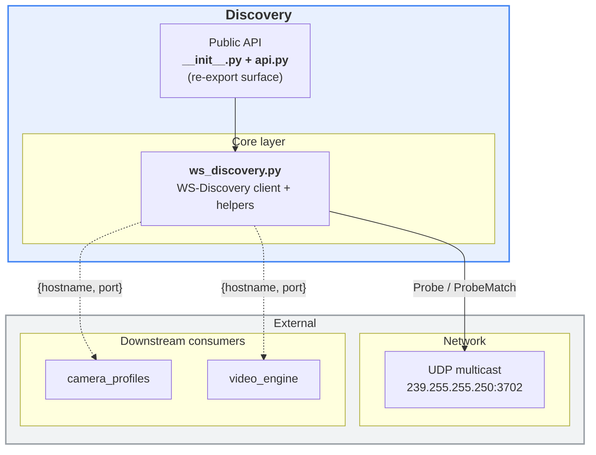
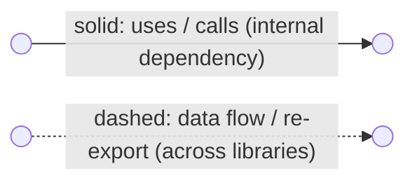
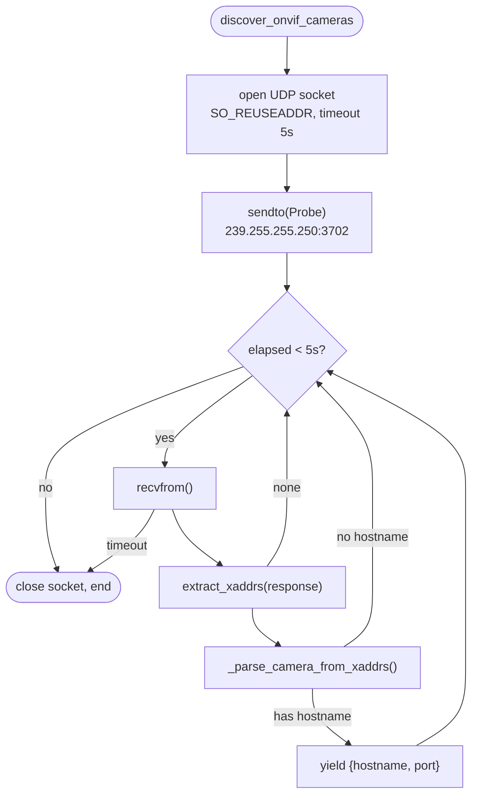
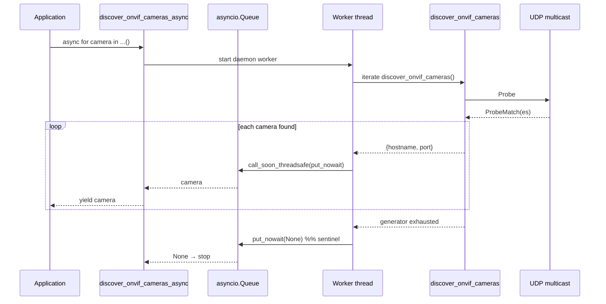

# `discovery` library — overview

The `discovery` library is a **pure WS-Discovery layer** (SOAP-over-UDP
multicast) that finds ONVIF-compliant cameras on the local network and yields
them as `{"hostname": str, "port": int}` descriptors. It has no ONVIF
media-service, GStreamer or configuration dependencies.

Media profile querying (video/audio/PTZ/RTSP URL) lives in the companion library
[`camera_profiles`](../camera_profiles/README.md), which consumes the
descriptors produced here.

## Layered architecture



### Diagram legend



- **Solid arrow** `-->`: an internal dependency — one module uses, calls or contains another.
- **Dashed arrow** `-.->`: a looser data flow between libraries (e.g. camera descriptors) or a re-export of another library's public API.
- Edge labels (e.g. `re-export`, `Probe / ProbeMatch`, `{hostname, port}`) name the concrete payload or operation.

---

## 1. `__init__.py` — package shim

A minimal file that re-exports the public symbols from `api.py`, so callers
write `from dlstreamer.onvif.discovery import ...`.

## 2. `api.py` — public surface

Declares the module docstring and re-exports the four public symbols from
`ws_discovery.py`: `discover_onvif_cameras`, `discover_onvif_cameras_async`,
`extract_xaddrs`, `parse_xaddrs_url`.

## 3. `ws_discovery.py` — WS-Discovery client

Implements the minimal ONVIF profile of WS-Discovery. Sends a multicast
`Probe` for `NetworkVideoTransmitter` devices and parses every `ProbeMatch`
response:

- **Constants**: multicast group `239.255.255.250`, port `3702`, socket timeout
  `5 s`, and the SOAP `Probe` template.
- **XML helpers**: `extract_xaddrs()` (reads `XAddrs` from a ProbeMatch, XML
  parsed with `defusedxml`) and `parse_xaddrs_url()` (splits the first URL into
  components). `_parse_camera_from_xaddrs()` reduces this to `{hostname, port}`
  (defaulting the port to `80`).
- **Sync generator** `discover_onvif_cameras()` — opens a UDP socket, sends one
  probe, and yields each camera **incrementally** as responses arrive until the
  timeout window closes.
- **Async generator** `discover_onvif_cameras_async()` — runs the blocking
  sync generator in a daemon thread and republishes cameras through an
  `asyncio.Queue`, so callers can process cameras before the sweep finishes.

### Flow chart — synchronous discovery



### Sequence chart — async discovery bridging thread → asyncio



---

## Public API reference

The public API is defined in `api.py` and re-exported by `__init__.py`.

### Functions

| Function | Signature | Input arguments | Return values | Description |
|---|---|---|---|---|
| discover_onvif_cameras | discover_onvif_cameras(verbose: bool = False) -> Iterator[dict] | verbose: bool = False | Iterator[dict], where each item has the form **{"hostname": str, "port": int}** | Synchronous generator that streams discovered cameras. |
| discover_onvif_cameras_async | discover_onvif_cameras_async(verbose: bool = False) -> AsyncIterator[dict] | verbose: bool = False | AsyncIterator[dict], where each item has the form **{"hostname": str, "port": int}** | Asynchronous generator (`async for`) that streams discovered cameras. |
| extract_xaddrs | extract_xaddrs(xml_string: str) -> Optional[str] | xml_string: str | Optional[str] (the XAddrs value or None) | XML helper that reads the XAddrs field from a ProbeMatch response. |
| parse_xaddrs_url | parse_xaddrs_url(xaddrs: str) -> dict | xaddrs: str | dict with keys: full_url, scheme, hostname, port, path, base_url | Parses the first URL from XAddrs and returns its components. |

## Usage examples

### 1) Synchronous function

```python
from dlstreamer.onvif.discovery import discover_onvif_cameras

for camera in discover_onvif_cameras(verbose=True):
    print(camera["hostname"], camera["port"])
```

### 2) Asynchronous function

```python
import asyncio
from dlstreamer.onvif.discovery import discover_onvif_cameras_async

async def main():
    async for camera in discover_onvif_cameras_async(verbose=False):
        print(camera)

asyncio.run(main())
```

## Data contract

Each discovery result has the form **{"hostname": str, "port": int}**.

## Notes

- Results are returned as a stream (camera by camera).
- The discovery module does not connect to ONVIF Media Service and does not read profiles.
- For profiles/RTSP, use `dlstreamer.onvif.camera_profiles`.
