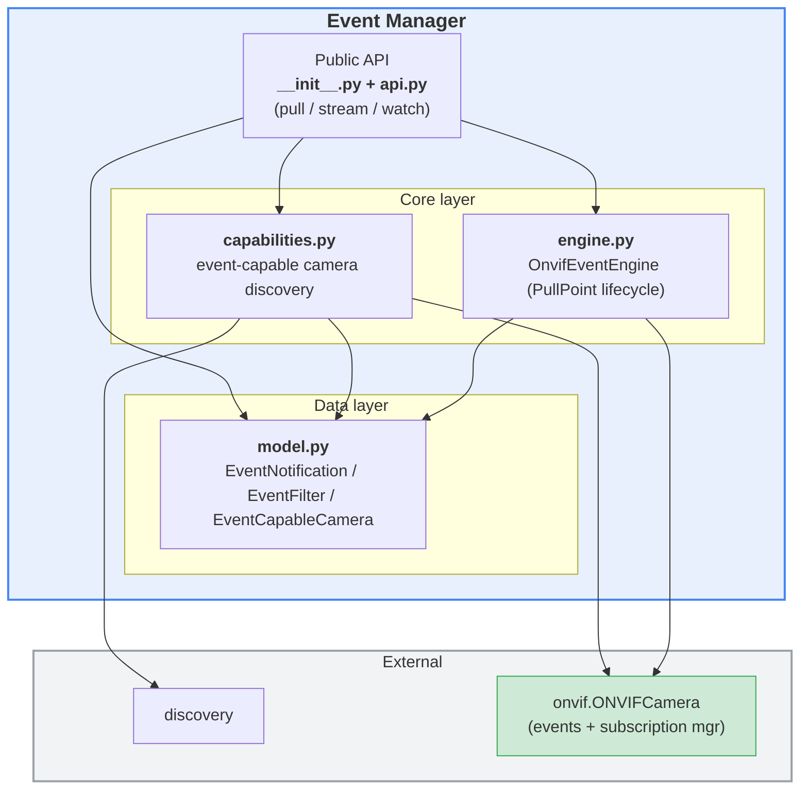
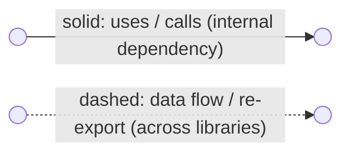
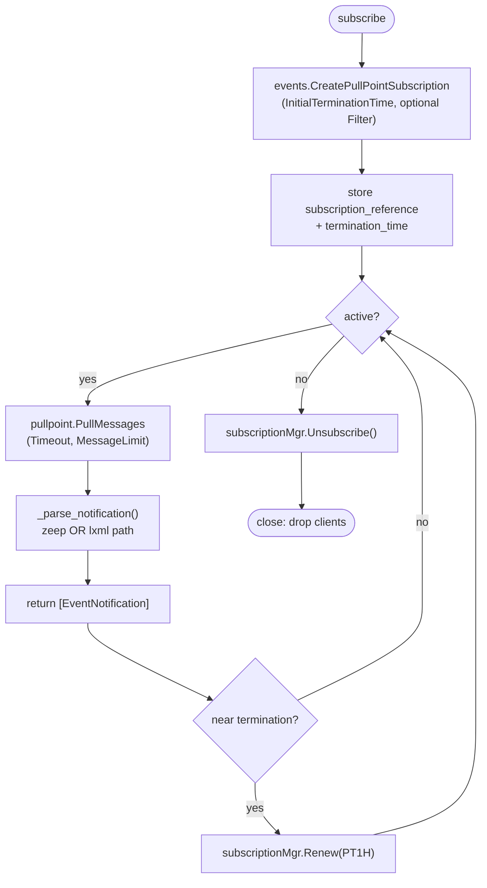
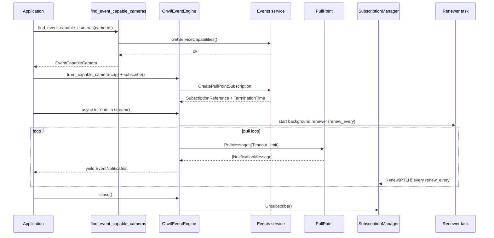

# `event_manager` library — overview

The `event_manager` library implements an **ONVIF Events (PullPoint) engine**.
It is a Python client for the ONVIF Events Service using the **PullPoint**
subscription pattern: instead of opening an inbound HTTP port, notifications are
fetched with long-polling `PullMessages` calls, so the engine works behind NAT
and firewalls.

It builds on two companion libraries:

- [`discovery`](../discovery/README.md) — locates ONVIF cameras on the network.
- [`camera_profiles`](../camera_profiles/README.md) — shares the sync/async
  discovery style used by the capability helpers.

## Layered architecture



### Diagram legend



- **Solid arrow** `-->`: an internal dependency — one module uses, calls or contains another.
- **Dashed arrow** `-.->`: a looser data flow between libraries (e.g. camera descriptors) or a re-export of another library's public API.
- Edge labels (e.g. `re-export`, `Probe / ProbeMatch`, `{hostname, port}`) name the concrete payload or operation.
- A **green** node marks a third-party library that is **not** part of the ONVIF suite (outside the `onvif` folder).

---

## 1. `__init__.py` — package shim

Re-exports the public symbols from `api.py`.

## 2. `api.py` — public surface (simple functions)

Wraps the engine lifecycle in one-line helpers so callers rarely touch the
engine directly:

- `pull_events_once()` — subscribe → pull one batch → close (blocking).
- `stream_events()` — async generator with automatic subscribe / renew / close.
- `watch_events()` — subscribe and invoke a callback per event (sync or async
  callback); defaults to `print_event_type()`.
- `get_supported_event_topics()` — list the event types a camera advertises
  (`GetEventProperties` → parsed topics **with** their Source/Data field schema)
  without opening a subscription.
- Re-exports the data model and capability helpers.

## 3. `model.py` — data model (dataclasses)

| Class | Role |
|-------|------|
| `EventFilter` | Topic-expression filter for `CreatePullPointSubscription` (`expression` + `dialect`, default `ConcreteSet`). |
| `EventNotification` | A parsed `NotificationMessage`: `topic`, `utc_time`, `property_operation` (`Initialized`/`Changed`/`Deleted`), flattened `source`/`data` dicts, plus `raw`. `short()` renders a one-line log form. |
| `EventCapableCamera` | Camera confirmed to expose an Events service; `camera_id` = `"hostname:port"`, `ok` reflects the probe. |
| `SupportedEventTopic` | One event type advertised via `GetEventProperties`: `topic` path, `is_property` flag, and `source`/`data` maps of `{field_name: type}` describing the notification payload (e.g. `data={"IsMotion": "xsd:boolean"}`). |

## 4. `capabilities.py` — event-capable camera discovery

Filters a discovery sweep down to cameras that answer
`GetServiceCapabilities()` on their Events endpoint:

- `is_event_capable()` — boolean probe (any error → `False`).
- `_probe()` — same check but returns an `EventCapableCamera` carrying the error.
- `find_event_capable_cameras()` — sync generator.
- `find_event_capable_cameras_async()` — async generator (accepts sync **or**
  async camera sources).

## 5. `engine.py` — `OnvifEventEngine` (PullPoint lifecycle)

One engine per camera, managing the full subscription lifecycle. Blocking
methods each have an `*_async` variant offloading to a worker thread; the engine
is safe for use from a single asyncio loop (not for parallel multi-thread calls).

- **Construction**: direct, or `from_capable_camera()`; context-manager support.
- **Lifecycle**: `subscribe` (`CreatePullPointSubscription`), `pull`
  (`PullMessages` long-poll), `renew` (extend `TerminationTime`), `unsubscribe`,
  `close`.
- **Streaming**: `stream()` async generator that keeps pulling and
  auto-renews in the background (`renew_every`); `stream_to_callback()`.
- **Introspection**: `get_service_capabilities`, `get_event_properties`,
  `get_supported_event_topics` (parses the `GetEventProperties` `TopicSet` +
  `MessageDescription` into `SupportedEventTopic` items — topic path plus the
  Source/Data field names and types, e.g.
  `tns1:RuleEngine/CellMotionDetector/Motion` with `data={"IsMotion": "xsd:boolean"}`).
- **Parsing**: `_parse_notification()` handles both the zeep-object path
  (standard cameras) and the lxml-Element path (vendor cameras returning raw
  XML), flattening `Source`/`Data` `SimpleItem` lists into dicts.

A subtle detail: the PullPoint binding only exposes `PullMessages`; `Renew` and
`Unsubscribe` live on the `SubscriptionManagerBinding` at the per-subscription
reference URL. onvif-zeep has no factory for it, so the engine builds that
`ONVIFService` manually (`_subscription_manager_service`).

### Flow chart — PullPoint subscription lifecycle



### Sequence chart — discover → subscribe → stream with auto-renew



---

## Public API reference

The public API is defined in `api.py` and re-exported by `__init__.py`.

### Data model

| Type | Description |
|---|---|
| EventNotification | Parsed ONVIF NotificationMessage (topic, source, data, timestamp, operation). |
| EventFilter | Topic-expression filter descriptor used for PullPoint subscription requests. |
| EventCapableCamera | Camera descriptor confirmed to expose ONVIF Events service. |

### Functions

| Function | Signature | Input arguments | Return values | Description |
|---|---|---|---|---|
| is_event_capable | is_event_capable(hostname: str, port: int, username: str = "", password: str = "", verbose: bool = False) -> bool | hostname, port, username, password, verbose | bool | Quick probe that returns True if camera responds to Events GetServiceCapabilities. |
| find_event_capable_cameras | find_event_capable_cameras(cameras: Iterable[dict], username: str = "", password: str = "", verbose: bool = False) -> Iterator[EventCapableCamera] | cameras (iterable of descriptors), username, password, verbose | Iterator[EventCapableCamera] | Reads camera descriptors and yields only event-capable cameras (sync). |
| find_event_capable_cameras_async | find_event_capable_cameras_async(cameras: Iterable[dict] \| AsyncIterable[dict], username: str = "", password: str = "", verbose: bool = False) -> AsyncIterator[EventCapableCamera] | cameras (sync or async source), username, password, verbose | AsyncIterator[EventCapableCamera] | Async variant that accepts both sync and async camera sources. |
| pull_events_once | pull_events_once(hostname: str, port: int, username: str = "", password: str = "", verbose: bool = False, timeout: str = "PT30S", limit: int = 100, termination_time: str = "PT1H", topic_filter: EventFilter \| None = None) -> list[EventNotification] | hostname, port, credentials, timeout, limit, termination_time, topic_filter | list[EventNotification] | Simplest sync call: subscribe, pull one batch, and close automatically. |
| stream_events | stream_events(hostname: str, port: int, username: str = "", password: str = "", verbose: bool = False, timeout: str = "PT30S", limit: int = 100, termination_time: str = "PT1H", topic_filter: EventFilter \| None = None, renew_every: float \| None = 300.0) -> AsyncIterator[EventNotification] | hostname, port, credentials, pull settings, optional filter, renew_every | AsyncIterator[EventNotification] | Simplest async stream with automatic subscribe/renew/close lifecycle. |

## Usage examples

### 1) Find event-capable cameras (sync)

```python
from dlstreamer.onvif.discovery import discover_onvif_cameras
from dlstreamer.onvif.event_manager import find_event_capable_cameras

for cap in find_event_capable_cameras(
    discover_onvif_cameras(),
    username="admin",
    password="secret",
):
    print(cap.camera_id)
```

### 2) Find event-capable cameras (async)

```python
import asyncio
from dlstreamer.onvif.discovery import discover_onvif_cameras_async
from dlstreamer.onvif.event_manager import find_event_capable_cameras_async

async def main():
    async for cap in find_event_capable_cameras_async(
        discover_onvif_cameras_async(),
        username="admin",
        password="secret",
    ):
        print(cap.camera_id)

asyncio.run(main())
```

### 3) Pull one batch of events (sync)

```python
from dlstreamer.onvif.event_manager import pull_events_once

notes = pull_events_once(
    hostname="10.0.0.15",
    port=80,
    username="admin",
    password="secret",
    timeout="PT5S",
    limit=20,
)

for note in notes:
    print(note.short())
```

### 4) Stream events continuously (async)

```python
import asyncio
from dlstreamer.onvif.event_manager import stream_events

async def main():
    async for note in stream_events(
        hostname="10.0.0.15",
        port=80,
        username="admin",
        password="secret",
        timeout="PT10S",
        limit=50,
    ):
        print(note.short())

asyncio.run(main())
```

## Advanced engine (non-public API)

For full PullPoint lifecycle control (subscribe, pull, renew, unsubscribe, stream),
use the engine module directly:

```python
from dlstreamer.onvif.event_manager.engine import OnvifEventEngine
```

Use the engine only when you need manual lifecycle control
(explicit subscribe / renew / unsubscribe steps).

## Data contracts

Input camera descriptor format:

```python
{"hostname": "10.0.0.15", "port": 80}
```

Event-capable camera format:

```python
{
    "hostname": "10.0.0.15",
    "port": 80,
    "error": None,
    "camera_id": "10.0.0.15:80",
    "ok": True,
}
```

## Notes

- Capability detection uses ONVIF Events GetServiceCapabilities.
- Public API is intentionally simple (functions + dataclasses).
- For camera discovery, use dlstreamer.onvif.discovery.
