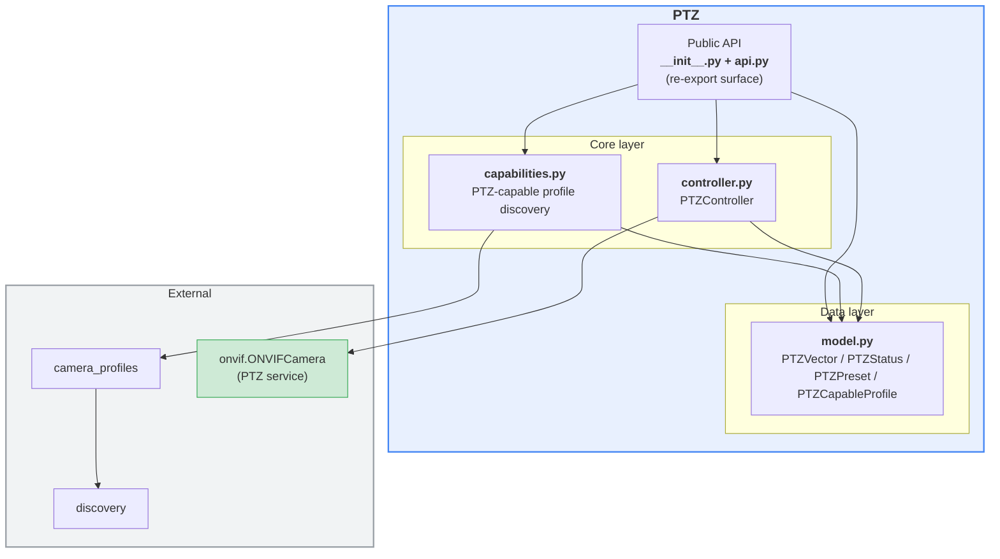
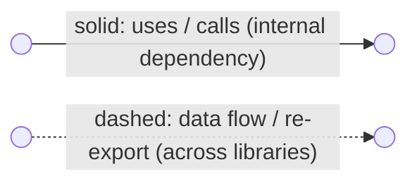
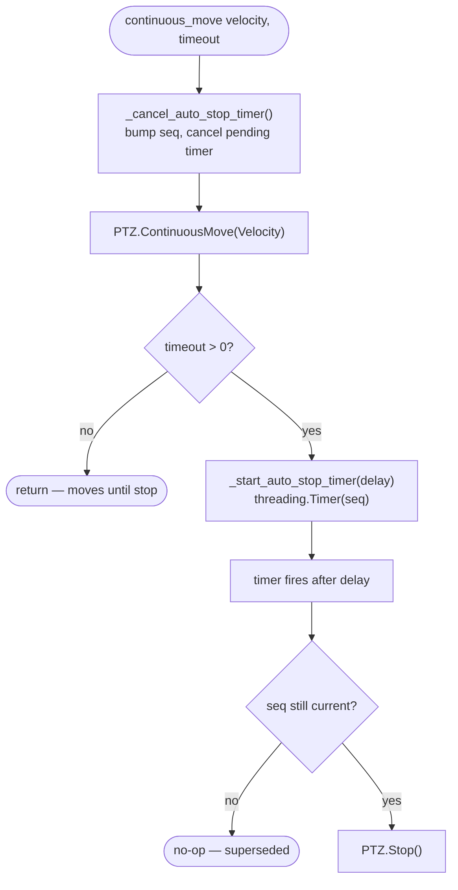
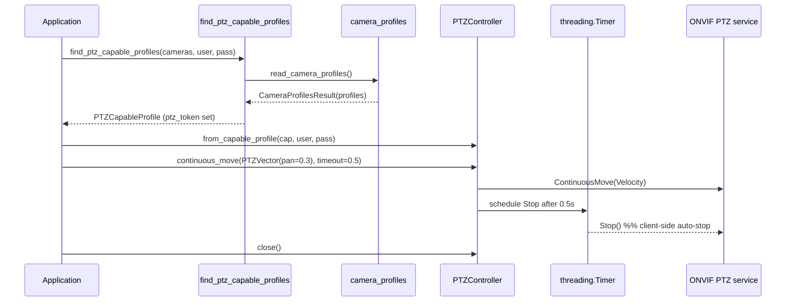

# `ptz` library — overview

The `ptz` library implements **PTZ (Pan-Tilt-Zoom) control** for ONVIF cameras
that expose profiles conforming to the ONVIF PTZ Service ver 2.0 WSDL. It does
two things: discovers which profiles are PTZ-capable, and drives the camera
through a controller.

It builds on two companion libraries:

- [`discovery`](../discovery/README.md) — locates ONVIF cameras on the network.
- [`camera_profiles`](../camera_profiles/README.md) — reads media profiles; PTZ
  uses the profile's `ptz_token` to filter out non-PTZ profiles.

## Layered architecture



### Diagram legend



- **Solid arrow** `-->`: an internal dependency — one module uses, calls or contains another.
- **Dashed arrow** `-.->`: a looser data flow between libraries (e.g. camera descriptors) or a re-export of another library's public API.
- Edge labels (e.g. `re-export`, `Probe / ProbeMatch`, `{hostname, port}`) name the concrete payload or operation.
- A **green** node marks a third-party library that is **not** part of the ONVIF suite (outside the `onvif` folder).

---

## 1. `__init__.py` — package shim

Re-exports the public symbols from `api.py`.

## 2. `api.py` — public surface

Declares the module docstring and re-exports the data model, capability helpers
(`is_ptz_profile`, `find_ptz_capable_profiles[_async]`) and the `PTZController`.

## 3. `model.py` — data model (dataclasses)

| Class | Role |
|-------|------|
| `PTZVector` | Pan/tilt/zoom vector; serializes to ONVIF Position (`as_position_dict`) or Velocity (`as_velocity_dict`). Meaning depends on move type (velocity vs coordinate). |
| `PTZStatus` | Snapshot from `GetStatus`: `position`, `pan_tilt_move_status`, `zoom_move_status`, `error`, `utc_time`. |
| `PTZPreset` | A saved preset: `token`, `name`, optional `position`. |
| `PTZCapableProfile` | A discovered profile confirmed to support PTZ; exposes `camera_id` = `"hostname:port"`. |

## 4. `capabilities.py` — PTZ-capable profile discovery

Consumes camera descriptors, reads their profiles through `camera_profiles`, and
keeps only PTZ-capable ones:

- `is_ptz_profile(profile)` — True when the profile carries a non-empty
  `ptz_token`.
- `_to_capable(result)` — extracts every PTZ profile from a
  `CameraProfilesResult` into `PTZCapableProfile` objects.
- `find_ptz_capable_profiles()` — sync generator.
- `find_ptz_capable_profiles_async()` — async generator (accepts sync **or**
  async camera sources, so it can pipe from `discover_onvif_cameras_async`).

## 5. `controller.py` — `PTZController`

One instance per `(camera, profile_token)` pair. Wraps an
`onvif.ONVIFCamera` client plus its PTZ service (created **lazily** and reused).
Every synchronous method has an `*_async` variant that offloads the blocking
SOAP call via `asyncio.to_thread`.

- **Construction**: direct, or `from_capable_profile(PTZCapableProfile)`.
- **Read**: `get_status`, `get_presets`, `get_configurations`, `get_nodes`.
- **Movement**: `continuous_move`, `relative_move`, `absolute_move`, `stop`.
- **Presets**: `set_preset`, `goto_preset`, `remove_preset`.
- **Home**: `home_supported`, `goto_home`, `set_home`.
- **Lifecycle**: `close()` / context manager (`with PTZController(...)`).

**Client-side auto-stop**: `continuous_move(timeout=...)` does *not* send the
SOAP `Timeout` field (several cameras reject fractional `xs:duration`). Instead
it schedules a background `threading.Timer` that issues `Stop` after the delay.
A monotonically increasing sequence number invalidates stale timers so
back-to-back moves behave correctly.

### Flow chart — continuous_move with client-side auto-stop



### Sequence chart — discover PTZ profile → move → stop



---

## Public API reference

The public API is defined in `api.py` and re-exported by `__init__.py`.

### Data model

| Type | Description |
|---|---|
| PTZVector | Pan/tilt/zoom vector used in PTZ operations. |
| PTZStatus | Snapshot of PTZ state (position, move status, error, time). |
| PTZPreset | Named PTZ preset entry. |
| PTZCapableProfile | Camera profile descriptor confirmed to support PTZ. |

### Functions

| Function | Signature | Input arguments | Return values | Description |
|---|---|---|---|---|
| is_ptz_profile | is_ptz_profile(**profile: ONVIFProfile**) -> bool | profile (media profile) | bool | Returns True if the profile contains PTZ configuration. |
| find_ptz_capable_profiles | find_ptz_capable_profiles(**cameras: Iterable[dict], username: str = "", password: str = ""**, verbose: bool = False) -> Iterator[PTZCapableProfile] | cameras (iterable of camera descriptors), username, password, verbose | Iterator[PTZCapableProfile] | Reads camera profiles and yields only PTZ-capable profiles (sync). |
| find_ptz_capable_profiles_async | find_ptz_capable_profiles_async(cameras: Iterable[dict] \| AsyncIterable[dict], username: str = "", password: str = "", verbose: bool = False) -> AsyncIterator[PTZCapableProfile] | cameras (sync or async camera source), username, password, verbose | AsyncIterator[PTZCapableProfile] | Async variant that yields PTZ-capable profiles from sync or async sources. |

### Controller class (public API)

| Function | Signature | Input arguments | Return values | Description |
|---|---|---|---|---|
| PTZController (class) | PTZController(hostname: str, port: int, profile_token: str, username: str = "", password: str = "") | hostname, port, profile_token, username, password | PTZController instance | Controller for a single `(camera, profile_token)` pair. |
| PTZController.from_capable_profile | PTZController.from_capable_profile(profile: PTZCapableProfile, username: str = "", password: str = "") -> PTZController | profile, username, password | PTZController | Builds a controller directly from PTZCapableProfile. |
| PTZController.continuous_move | continuous_move(velocity: PTZVector, timeout: float \| None = None) -> None | velocity, timeout | None | Starts continuous move with velocity vector; optional auto-stop timeout. |
| PTZController.relative_move | relative_move(translation: PTZVector, speed: PTZVector \| None = None) -> None | translation, speed | None | Moves relatively from the current position. |
| PTZController.absolute_move | absolute_move(position: PTZVector, speed: PTZVector \| None = None) -> None | position, speed | None | Moves to an absolute PTZ position. |
| PTZController.stop | stop(pan_tilt: bool = True, zoom: bool = True) -> None | pan_tilt, zoom | None | Stops pan/tilt and/or zoom motion. |
| PTZController.goto_preset | goto_preset(preset_token: str, speed: PTZVector \| None = None) -> None | preset_token, speed | None | Moves camera to a saved preset. |
| PTZController.goto_home | goto_home(speed: PTZVector \| None = None) -> None | speed | None | Moves camera to home position. |
| PTZController.home_supported | home_supported() -> bool | - | bool | True when the PTZ node advertises `HomeSupported`; check before `goto_home`/`set_home`. |

## Usage examples

### 1) Find PTZ-capable profiles (sync)

```python
from dlstreamer.onvif.discovery import discover_onvif_cameras
from dlstreamer.onvif.ptz import find_ptz_capable_profiles

for cap in find_ptz_capable_profiles(
    discover_onvif_cameras(),
    username="admin",
    password="secret",
):
    print(cap.camera_id, cap.profile_name, cap.profile_token)
```

### 2) Find PTZ-capable profiles (async)

```python
import asyncio
from dlstreamer.onvif.discovery import discover_onvif_cameras_async
from dlstreamer.onvif.ptz import find_ptz_capable_profiles_async

async def main():
    async for cap in find_ptz_capable_profiles_async(
        discover_onvif_cameras_async(),
        username="admin",
        password="secret",
    ):
        print(cap.camera_id, cap.profile_token)

asyncio.run(main())
```

### 3) PTZ movement (public controller)

```python
from dlstreamer.onvif.ptz import find_ptz_capable_profiles, PTZController, PTZVector

caps = list(find_ptz_capable_profiles([{"hostname": "192.168.1.10", "port": 80}], "admin", "secret"))
if caps:
    ctrl = PTZController.from_capable_profile(caps[0], "admin", "secret")
    ctrl.continuous_move(PTZVector(pan=0.3, tilt=0.0, zoom=0.0), timeout=0.5)
    ctrl.stop()
    ctrl.close()
```

## Data contracts

Input camera descriptor format:

```python
{"hostname": "10.0.0.15", "port": 80}
```

PTZ-capable profile format:

```python
{
    "hostname": "10.0.0.15",
    "port": 80,
    "profile_token": "Profile_1",
    "profile_name": "MainStream",
    "ptz_configuration_token": "PTZConf_1",
    "ptz_node_token": "PTZNode_1",
    "camera_id": "10.0.0.15:80",
}
```

## Notes

- PTZ capability detection depends on profile data returned by camera_profiles.
- Camera movement methods are available through the public `PTZController` API.
- For camera discovery, use dlstreamer.onvif.discovery.
