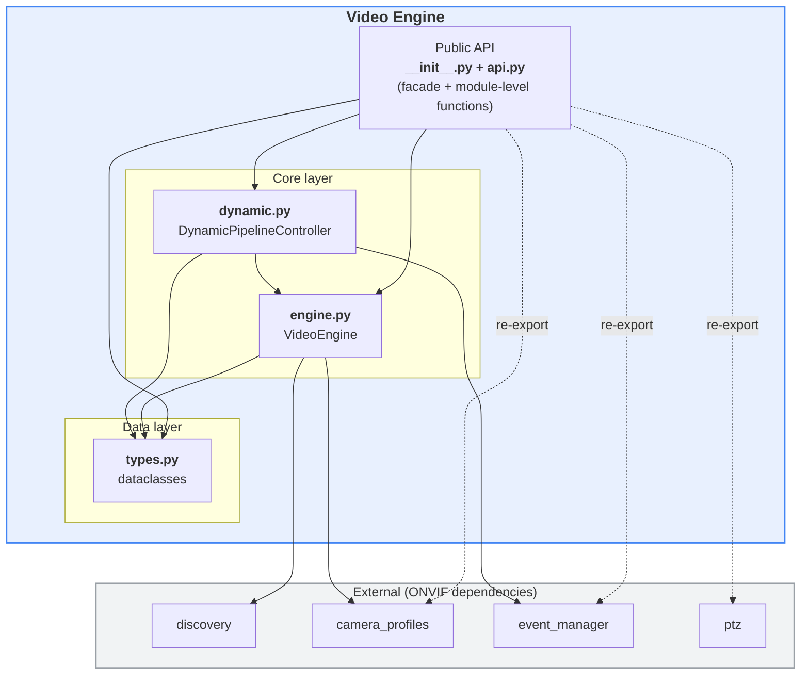
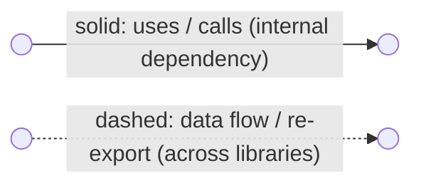
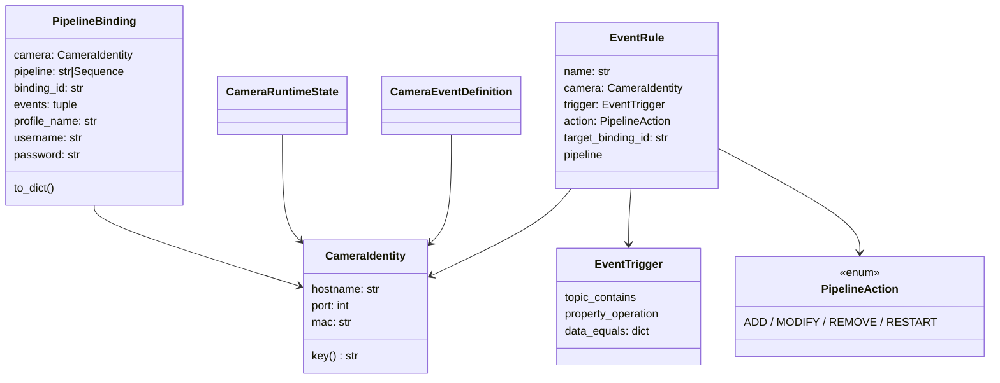
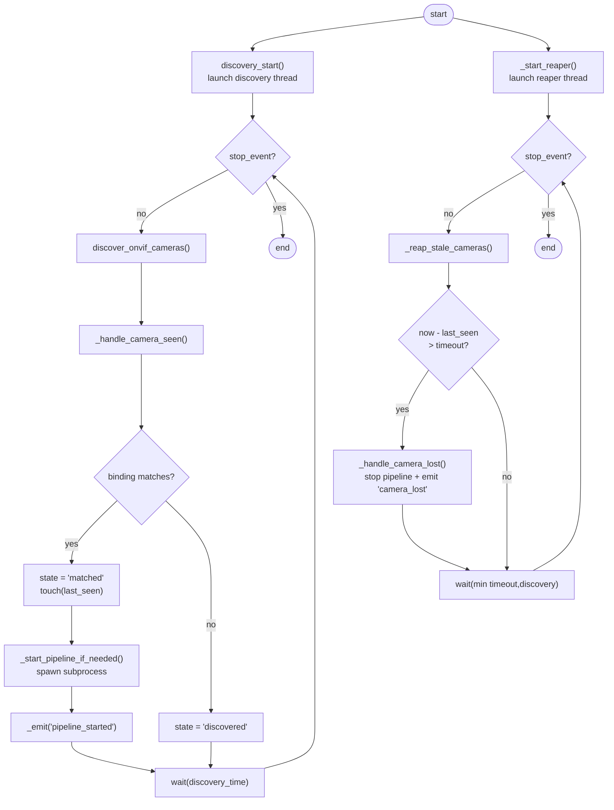
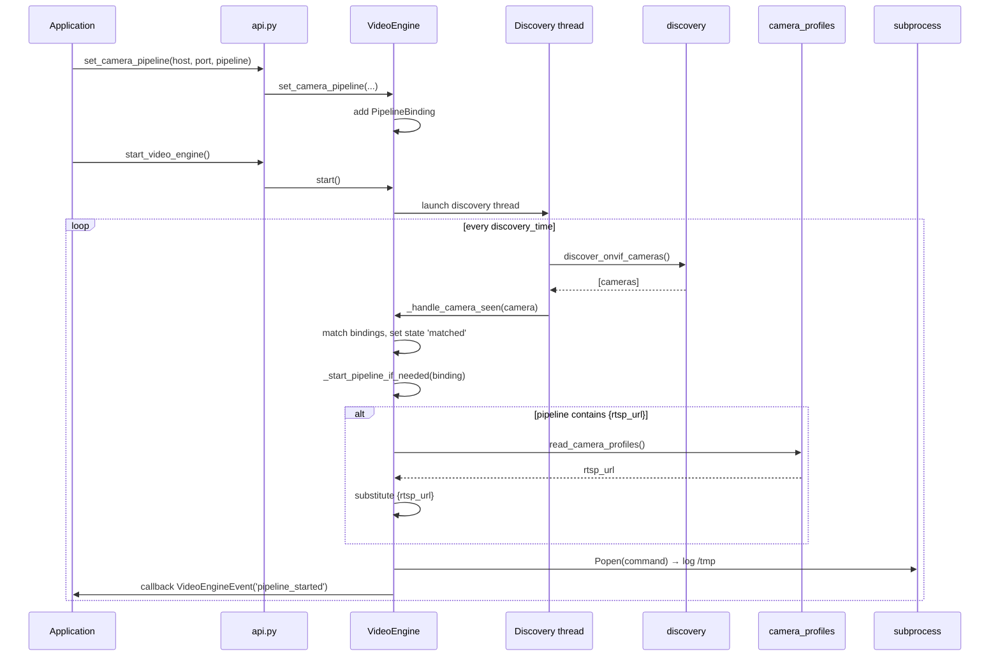
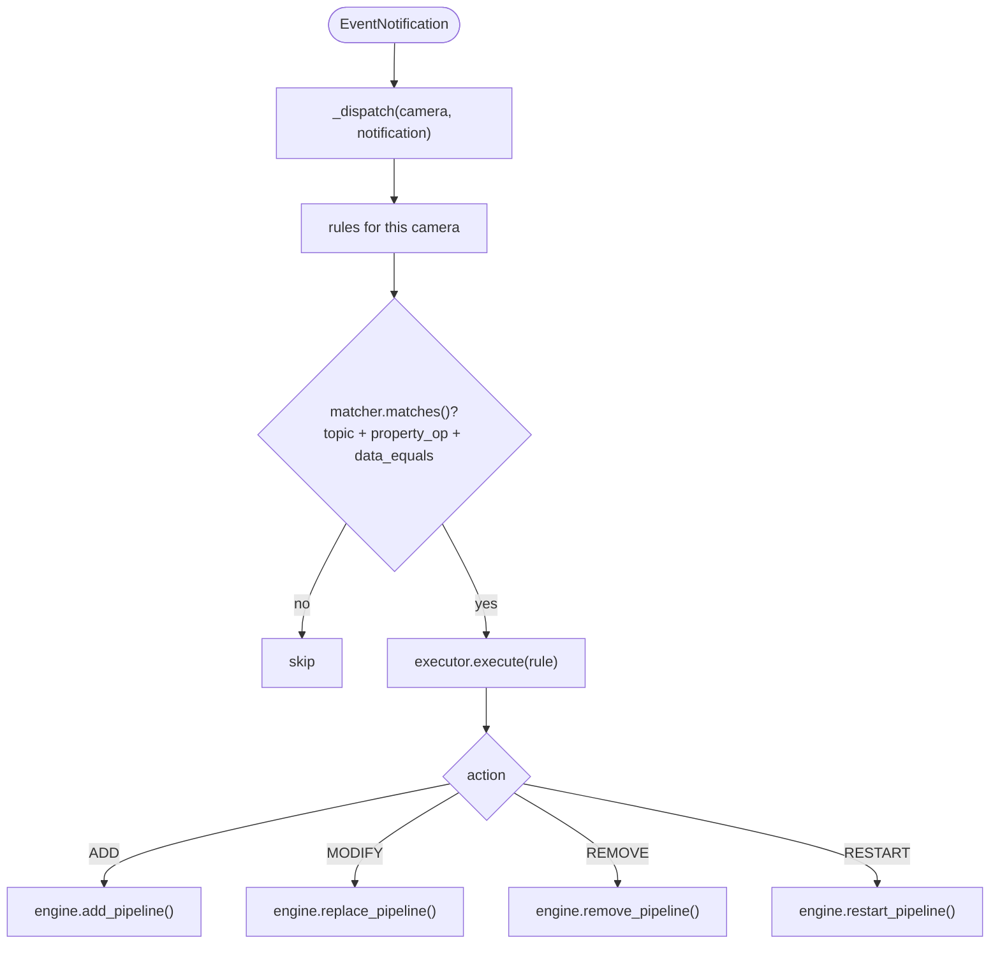
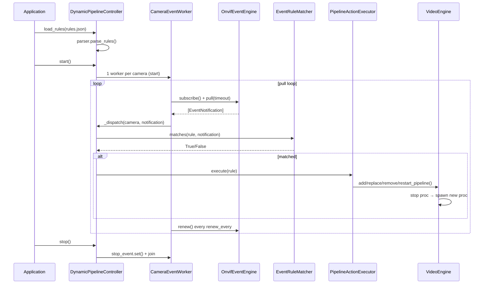
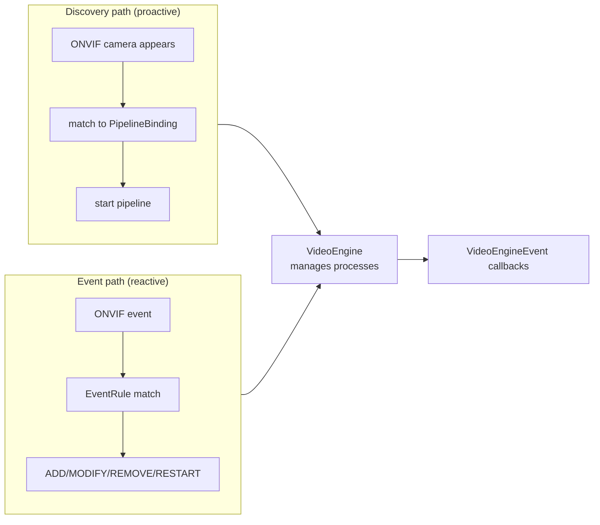

# `video_engine` library — overview

The `video_engine` library orchestrates the full lifecycle: **ONVIF camera
discovery → matching against configuration (static bindings or dynamic
templates) → launching DL Streamer pipelines → dynamic, event-driven changes**.

## Layered architecture



### Diagram legend



- **Solid arrow** `-->`: an internal dependency — one module uses, calls or contains another.
- **Dashed arrow** `-.->`: a looser data flow between libraries (e.g. camera descriptors) or a re-export of another library's public API.
- Edge labels (e.g. `re-export`, `Probe / ProbeMatch`, `{hostname, port}`) name the concrete payload or operation.

---

## 1. `__init__.py` — package shim

A minimal file that re-exports everything from `api.py`. This lets users write
`from dlstreamer.onvif.video_engine import ...` instead of reaching into `api`.
It follows the repository convention (public API in `api.py`, re-exported via
`__init__.py`).

---

## 2. `types.py` — data models (pure dataclasses)

All objects are `@dataclass`, most of them `frozen=True` (immutable). They carry
no business logic — only data and light normalization.

| Class | Role |
|-------|------|
| `CameraIdentity` | Normalized camera key (`hostname:port:MAC`). MAC normalized to uppercase with `:` |
| `PipelineBinding` | Association of a pipeline with a camera (+ `binding_id`, events, profile, optional `username`/`password` for RTSP-URL resolution) |
| `CameraRuntimeState` | Live camera state (`discovered`/`matched`, `last_seen`, assigned bindings, cached `profiles_snapshot`, `template_binding_ids`) |
| `VideoEngineEvent` | Callback payload emitted by the engine |
| `CameraEventDefinition` | ONVIF event definition attached to a camera |
| `PipelineAction` | Enum: `ADD`, `MODIFY`, `REMOVE`, `RESTART` |
| `EventTrigger` | Notification-matching condition (logical AND of fields) |
| `EventRule` | Binds an `EventTrigger` → `PipelineAction` on a specific binding |
| `CameraMatcher` | Opt-in template predicate: matches a camera by `hostname`/`port`/`mac`/`mac_prefix`/`subnet` (CIDR) |
| `PipelineTemplate` | Opt-in recipe (`matcher` + placeholder pipeline + `profile_selector`) auto-instantiated into a `PipelineBinding` on every matching camera |
| `CameraProfileSnapshot` | Cached ONVIF media profiles for one camera (`profiles`, `fetched_at`, `error`) |

Helper functions: `as_camera_identity()` (builds an identity from a dict/object),
`pipeline_list()` (normalizes a pipeline given as a string/list),
`as_camera_matcher()` / `as_pipeline_template()` (build matcher/template from a
dict), and `select_profile()` (pick a profile by `"first"` or `"name=<value>"`).



---

## 3. `api.py` — public facade

It creates a **single shared singleton** `_DEFAULT_ENGINE = VideoEngine()` and
exposes module-level functions that delegate to it (procedural style). It also
re-exports the entire `camera_profiles`, `ptz`, and `event_manager` libraries.

API groups:
- **Factory / lifecycle**: `create_video_engine`, `get_video_engine`, `start_video_engine`, `stop_video_engine`, `destroy_video_engine`
- **Discovery**: `discovery_start/stop`
- **Configuration**: `setTimeout/getTimeout`, `setDiscoveryTime/getDiscoveryTime`, `load_config`, `save_config`
- **Pipeline management**: `list_camera_pipeline_pairs`, `get_pipeline_for_camera`, `set_camera_pipeline`
- **Auto-templates / auto-profile-fetch** (opt-in): `enable_auto_profile_fetch`, `add_pipeline_template`, `remove_pipeline_template`, `list_pipeline_templates`, `as_pipeline_template`
- **Events**: `set_camera_event`, `list_camera_events`
- **Callbacks**: `register_callback`, `unregister_callback`
- **State**: `get_active_cameras`, `get_active_pipelines`
- **Dynamic control**: `create_dynamic_controller`

---

## 4. `engine.py` — `VideoEngine` (runtime core)

At the heart is a thread-safe class (protected by `threading.RLock`) with two
background threads:

- **Discovery thread** (`_discovery_loop`) — periodically discovers ONVIF
  cameras, matches them to bindings, and starts pipelines.
- **Reaper thread** (`_reaper_loop`) — removes "stale" cameras (no `last_seen`
  within `timeout`) and stops their pipelines.

Pipelines are launched as processes (`subprocess.Popen`), logging to
`/tmp/video_engine_pipeline_*.log`. It supports the `{rtsp_url}` placeholder,
resolved from the camera profile (`camera_profiles.read_camera_profiles`) using
the binding's `username`/`password` (or the engine defaults set with
`set_default_credentials`).

### Flow chart — discovery and reaper loops



### Sequence chart — camera discovery and pipeline start



Pipeline mutation methods (also used by the dynamic layer): `add_pipeline`
(idempotent), `remove_pipeline`, `replace_pipeline` (stop→swap→start), and
`restart_pipeline`.

### Static camera-pipeline bindings (JSON)

`VideoEngine.load_config(path, pipeline_library=...)` loads **static** bindings
from a JSON file whose `pipelines` key is a **list**, each entry carrying a
`camera` identity. To keep a **single source of pipeline definitions**, a binding
references a pipeline by id via `pipeline_ref`, resolved against the pipeline
library (`video_engine_pipelines.json`). An inline `pipeline` is still accepted
for standalone configs. On discovery, a camera matching `hostname`/`port` (and
`mac` when both sides have one) auto-starts its bound pipeline.

```json
{
  "pipelines": [
    {
      "binding_id": "cam1_main",
      "camera": { "hostname": "10.91.106.65", "port": 2020, "mac": "AA:BB:CC:DD:EE:FF" },
      "profile_name": "MainStream",
      "pipeline_ref": "lab_cam1_main",
      "events": [], "username": "", "password": ""
    }
  ]
}
```

> Note the key collision: the **static bindings** file uses `pipelines` as a
> **list**, while the dynamic **pipeline library** (section 5) uses `pipelines`
> as a **mapping** `id → pipeline`. They are parsed by different loaders, but the
> bindings resolve their `pipeline_ref` against that same library — the single
> source of pipeline definitions.

### Auto-templates and auto-profile-fetch (opt-in)

Templates auto-instantiate bindings for cameras not known ahead of time. A
`PipelineTemplate` pairs a `CameraMatcher` (`hostname`/`port`/`mac`/`mac_prefix`/
`subnet`) with a placeholder pipeline. On a match, the engine renders a
`PipelineBinding` with a deterministic `binding_id` (`tpl:<id>:<camera>:<profile>`)
and starts it; when the camera goes stale the template binding is stopped and
removed.

- Register in code: `add_pipeline_template(...)` / `remove_pipeline_template(id)` /
  `list_pipeline_templates()`.
- Or from the same config file via an optional `templates` list (parsed by
  `load_config`).
- Placeholders: `{rtsp_url}`, `{hostname}`, `{port}`, `{mac}`, `{profile_name}`.
- Profiles are fetched (and cached with a TTL) only when auto-profile-fetch is on;
  templates whose pipeline needs `{rtsp_url}`/`{profile_name}` enable it
  implicitly, otherwise call `enable_auto_profile_fetch(True, ttl_seconds=...)`.
  Identity-only templates never touch the network.
- `profile_selector` picks the media profile: `"first"` (default) or
  `"name=<value>"`.

```json
{
  "templates": [
    {
      "template_id": "any-h264-main",
      "matcher": { "subnet": "10.91.106.0/24" },
      "profile_selector": "name=MainStream",
      "pipeline": ["gst-launch-1.0", "rtspsrc", "location={rtsp_url}", "!", "..."],
      "username": "admin", "password": "r00tme", "auto_start": true
    }
  ]
}
```

---

## 5. `dynamic.py` — event-driven dynamic control

Implements a **restart-based strategy (Option A)**: "modifying" a pipeline means
stopping the process and spawning a new one. Responsibilities are split across 5
small classes (single responsibility):

| Class | Responsibility |
|-------|----------------|
| `EventRuleParser` | Deserialize rules from dict/JSON → `EventRule`; resolves `pipeline_ref` against the pipeline library |
| `EventRuleMatcher` | Pure (stateless) matching of a notification against a trigger |
| `PipelineActionExecutor` | Map `PipelineAction` → `VideoEngine` call |
| `CameraEventWorker` | Thread pulling ONVIF events for a **single** camera |
| `DynamicPipelineController` | Orchestration: groups rules per camera, runs workers, dispatch |

### Configuration files (two-file model)

Pipeline definitions and the camera/event bindings live in **separate** files so a
pipeline is defined once and referenced by id:

- **Pipeline library** (`video_engine_pipelines.json`) — a mapping of
  `id → pipeline` (command list or string). **No camera information.**
  Loaded with `DynamicPipelineController.load_pipeline_library(path)`.

  ```json
  { "pipelines": {
      "move_detected_ball_test": [
        "gst-launch-1.0", "-v", "videotestsrc", "pattern=ball", "!",
        "videoconvert", "!", "gvawatermark",
        "displ-cfg=ff-custom-txt='Move detected'", "!",
        "videoconvert", "!", "autovideosink"
      ]
  } }
  ```

- **Rules** (`video_engine_event_mapping.json`) — cameras + triggers + a `pipeline_ref`
  pointing at a pipeline in the library (an inline `pipeline` is still accepted).
  Loaded with `DynamicPipelineController.load_rules(path)` after the library.

  ```json
  {
    "name": "run-ball-test-on-motion",
    "camera": { "hostname": "10.91.106.65", "port": 2020 },
    "trigger": { "data_equals": { "IsMotion": "true" } },
    "action": "add",
    "target_binding_id": "move_detected_ball_test",
    "pipeline_ref": "move_detected_ball_test",
    "username": "admin", "password": "r00tme"
  }
  ```

**Credentials**: each rule/binding may carry its own `username`/`password` (used
for event subscription and `{rtsp_url}` resolution). When omitted, the engine and
controller fall back to defaults set via `set_default_credentials(user, pass)`.

### Flow chart — rule dispatch



### Sequence chart — from ONVIF event to pipeline change



---

## Data-flow summary



**Key idea:** `VideoEngine` is the execution layer (processes, threads, state),
while `DynamicPipelineController` is a rule layer on top of it. Both share the
models from `types.py`, and `api.py` ties everything together into a simple,
functional public interface.
