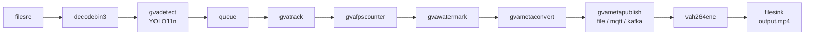

# Metadata Publishing Sample (Python)

This sample demonstrates how to use DL Streamer's `gvametaconvert` and `gvametapublish` elements
to publish inference metadata to a file, MQTT broker, or Kafka broker. It is the DL Streamer
equivalent of [NVIDIA DeepStream test4](https://github.com/NVIDIA-AI-IOT/deepstream_python_apps/tree/master/apps/deepstream-test4).

> **Original prompt:** Analyze the DeepStream sample application from
> https://github.com/NVIDIA-AI-IOT/deepstream_python_apps/tree/master/apps/deepstream-test4.
> Create a similar sample application for DL Streamer.

## What It Does

1. **Detects** vehicles and persons in each video frame using a YOLO11n model (`gvadetect`)
2. **Tracks** detected objects across frames (`gvatrack`)
3. **Counts** objects per frame in a pad probe callback and prints summary to stdout
4. **Converts** inference metadata to JSON (`gvametaconvert`)
5. **Publishes** JSON metadata to file, MQTT, or Kafka (`gvametapublish`)
6. **Writes** an annotated output video with watermarked results (`gvawatermark`)



### Key Differences from DeepStream test4

| DeepStream test4 | DL Streamer metapublish |
|---|---|
| `nvinfer` (NVIDIA GPU) | `gvadetect` (Intel GPU/CPU/NPU) |
| `nvmsgconv` + `nvmsgbroker` (sink — requires `tee`) | `gvametaconvert` + `gvametapublish` (transform — no `tee` needed) |
| `nvstreammux` for batching | Built-in batching in `gvadetect` |
| `pyds` metadata API | Standard GstAnalytics metadata API |
| `nvtracker` | `gvatrack` |
| `nvdsosd` | `gvawatermark` |

## Prerequisites

- DL Streamer installed on the host, or a DL Streamer Docker image
- Intel Edge AI system with integrated GPU/NPU (or set `--device CPU`)

### Install Python Dependencies

> **Note:** `export_requirements.txt` includes heavy ML frameworks (PyTorch,
> Ultralytics), needed only for one-time model conversion.
> `requirements.txt` contains only lightweight runtime dependencies.

```bash
python3 -m venv .metapublish-export-venv
source .metapublish-export-venv/bin/activate
pip install -r export_requirements.txt
```

## Prepare Video and Models (One-Time Setup)

### Download Video

Download the sample video to a local directory:

```bash
mkdir -p videos
curl -L -o videos/person-bicycle-car-detection.mp4 \
    https://github.com/intel-iot-devkit/sample-videos/raw/master/person-bicycle-car-detection.mp4
```

Alternatively, use any local video file and pass it via `--input`.

### Export Models

The export script downloads the YOLO11n model and converts it to OpenVINO IR format.
Converted models are saved under `models/`.

```bash
python3 export_models.py
```

## Running the Sample

### Output to File (default)

```bash
python3 metapublish.py --input videos/person-bicycle-car-detection.mp4
```

Pretty-printed JSON output is written to `results/results.jsonl`. Annotated video is saved to `results/output.mp4`.

### Output to File (compact JSON Lines)

```bash
python3 metapublish.py --input videos/person-bicycle-car-detection.mp4 --schema-type 1
```

### Output to MQTT

Before running, start an MQTT broker:

```bash
docker run -d --rm --name dlstreamer_mqtt -p 1883:1883 eclipse-mosquitto:1.6
```

Subscribe to the topic in another terminal:

```bash
mosquitto_sub -h localhost -t dlstreamer
```

Run the sample:

```bash
python3 metapublish.py --input videos/person-bicycle-car-detection.mp4 \
    --method mqtt --address localhost:1883 --topic dlstreamer
```

### Output to Kafka

Before running, start Kafka (e.g. with Docker Compose). Then run:

```bash
python3 metapublish.py --input videos/person-bicycle-car-detection.mp4 \
    --method kafka --address localhost:9092 --topic dlstreamer
```

### Headless Mode (no video output)

```bash
python3 metapublish.py --input videos/person-bicycle-car-detection.mp4 --no-display
```

### Running in Docker

```bash
docker run --init --rm \
    -u "$(id -u):$(id -g)" \
    -e PYTHONUNBUFFERED=1 \
    -v "$(pwd)":/app -w /app \
    --device /dev/dri \
    --group-add $(stat -c "%g" /dev/dri/render*) \
    intel/dlstreamer:2026.1.0-20260505-weekly-ubuntu24 \
    python3 metapublish.py --input videos/person-bicycle-car-detection.mp4
```

## How It Works

### Pipeline Construction

The application constructs a GStreamer pipeline using `Gst.parse_launch()`:

```
filesrc → decodebin3 → gvadetect → queue → gvatrack →
gvafpscounter → gvawatermark → gvametaconvert → gvametapublish →
videoconvert → vah264enc → h264parse → mp4mux → filesink
```

Unlike DeepStream's `nvmsgbroker` (a sink element), DL Streamer's `gvametapublish` is a
**pass-through transform** that publishes metadata while forwarding buffers downstream.
This eliminates the need for a `tee` to split the stream between display and publishing.

### Pad Probe — Object Counting

A pad probe is attached to the `gvawatermark` sink pad to count detected objects per frame.
It uses the standard GstAnalytics metadata API to iterate over detection results:

```python
rmeta = GstAnalytics.buffer_get_analytics_relation_meta(buffer)
for mtd in rmeta:
    if isinstance(mtd, GstAnalytics.ODMtd):
        category = GLib.quark_to_string(mtd.get_obj_type())
        obj_counter[category] = obj_counter.get(category, 0) + 1
```

### Metadata Publishing

`gvametaconvert` converts inference metadata into JSON format. `gvametapublish` then
sends that JSON to the configured output:

- **file** — writes to a local file or stdout
- **mqtt** — publishes to an MQTT broker (e.g. Eclipse Mosquitto)
- **kafka** — publishes to a Kafka broker

## See Also

- [Metadata Publishing CLI Sample](../../gst_launch/metapublish/) — GStreamer command-line version
- [Converting DeepStream to DL Streamer](../../../../docs/user-guide/dev_guide/converting_deepstream_to_dlstreamer.md)
