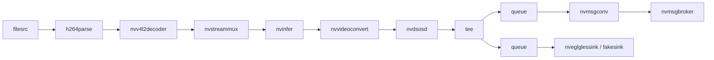
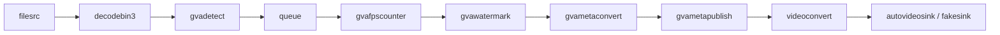

# DeepStream Test4 → DL Streamer Conversion

This sample is a DL Streamer equivalent of NVIDIA's
[deepstream-test4](https://github.com/NVIDIA-AI-IOT/deepstream_python_apps/tree/master/apps/deepstream-test4)
application. It demonstrates how to detect objects in a video stream and publish
detection metadata to a file, Kafka, or MQTT broker — the same workflow as the
original DeepStream sample, but running on Intel hardware with OpenVINO.

> **Coding Agent Prompt:**
> Analyze the DeepStream sample application at
> https://github.com/NVIDIA-AI-IOT/deepstream_python_apps/tree/master/apps/deepstream-test4.
> Create an equivalent sample application for DL Streamer.

## What It Does

1. **Decodes** an input video file (H.264/H.265/MP4) using hardware-accelerated `decodebin3`
2. **Detects** objects (vehicles, persons, bicycles) using a YOLO11n model (`gvadetect`)
3. **Counts** detected objects per class via a pad probe callback (every 30 frames)
4. **Overlays** bounding boxes and labels on each frame (`gvawatermark`)
5. **Converts** detection metadata to JSON (`gvametaconvert`)
6. **Publishes** the JSON to a file, Kafka, or MQTT (`gvametapublish`)
7. **Displays** the annotated video or discards it (`autovideosink` / `fakesink`)

## Pipeline Diagrams

### DeepStream test4 Pipeline



### DL Streamer Equivalent Pipeline



> **Key structural difference:** DeepStream's `nvmsgbroker` is a **sink** element, so a `tee`
> is required to split the stream between message publishing and video display. DL Streamer's
> `gvametapublish` is a **pass-through transform** — it publishes metadata and forwards buffers
> downstream, so no `tee` is needed. The pipeline is fully linear.

## Conversion Reference

### Element Mapping Table

| # | DeepStream Element | DL Streamer Element | Reason for Change |
|---|---|---|---|
| 1 | `filesrc` | `filesrc` | Standard GStreamer element — no change needed |
| 2 | `h264parse` | *(absorbed by `decodebin3`)* | `decodebin3` auto-selects demuxer + parser + decoder |
| 3 | `nvv4l2decoder` | `decodebin3` | NVIDIA-specific HW decoder → GStreamer auto-decoder with Intel VA-API HW acceleration |
| 4 | `nvstreammux` | *(removed)* | DeepStream-specific batching mux. DL Streamer handles batching inside inference elements via `batch-size` property |
| 5 | `nvinfer` (primary mode) | `gvadetect` | NVIDIA TensorRT inference → OpenVINO inference. Config file replaced by `model` and `device` properties |
| 6 | `nvvideoconvert` | `videoconvert` | NVIDIA-specific GPU format conversion → standard GStreamer CPU conversion (or `vapostproc` for GPU) |
| 7 | `nvdsosd` (on-screen display) | `gvawatermark` | NVIDIA OSD → DL Streamer overlay renderer. Reads GstAnalytics metadata automatically |
| 8 | `tee` + 2× `queue` | *(removed)* | No tee needed — `gvametapublish` is pass-through, not a sink |
| 9 | `nvmsgconv` | `gvametaconvert` | DeepStream schema converter → DL Streamer JSON metadata converter. Generates JSON/JSON-Lines from GstAnalytics metadata |
| 10 | `nvmsgbroker` (sink) | `gvametapublish` (transform) | DeepStream message sink (requires tee) → DL Streamer pass-through publisher. Supports file, Kafka, and MQTT backends |
| 11 | `nveglglessink` / `nv3dsink` | `autovideosink` | NVIDIA display sinks → GStreamer auto-selected display sink |
| 12 | `fakesink` | `fakesink` | Standard GStreamer element — no change needed |

### Application Logic Mapping Table

| Feature | DeepStream test4 | DL Streamer Equivalent | Notes |
|---|---|---|---|
| **Pipeline construction** | Programmatic (`Gst.ElementFactory.make` + manual linking for each element) | `Gst.parse_launch` with pipeline string | DL Streamer prefers parse_launch for simpler code; programmatic creation also supported |
| **Pad probe** | `osd_sink_pad_buffer_probe` on `nvdsosd` sink pad | `watermark_sink_pad_probe` on `gvawatermark` sink pad | Same GStreamer probe mechanism, different element name |
| **Metadata iteration** | `pyds.gst_buffer_get_nvds_batch_meta()` → batch_meta → frame_meta_list → obj_meta_list (nested while loops) | `GstAnalytics.buffer_get_analytics_relation_meta()` → iterate `ODMtd` entries (for loop) | DL Streamer uses standard GstAnalytics API — no vendor SDK (pyds) needed. Per-frame (not per-batch) |
| **Object counting** | Counts by `PGIE_CLASS_ID_*` constants (0–3) | Counts by COCO label strings (`car`, `person`, `bicycle`, etc.) mapped to Vehicle/Person/TwoWheeler | YOLO11n uses COCO 80-class labels; DeepStream uses 4-class TrafficCamNet IDs |
| **Message metadata** | Manual `NvDsEventMsgMeta` allocation + `NvDsVehicleObject` / `NvDsPersonObject` attachment via `extMsg` | Automatic — `gvametaconvert` reads GstAnalytics metadata and generates JSON | No manual metadata construction needed in DL Streamer |
| **Message publishing** | `nvmsgconv` → `nvmsgbroker` (sink, needs tee) with `proto-lib`, `conn-str`, `config` | `gvametaconvert` → `gvametapublish` (transform, inline) with `method`, `address`, `topic` | Simpler — no protocol adaptor library path needed |
| **CLI parsing** | `OptionParser` with `-i`, `-p`, `-c`, `--conn-str`, `-s`, `-t`, `--no-display` | `argparse` with `-i`, `-m`, `--address`, `-t`, `-s`, `--no-display`, `--device` | `-p` (proto-lib) removed — DL Streamer uses built-in Kafka/MQTT support. `--device` added for inference device selection |
| **Schema types** | 0 = Full (separate JSON per object), 1 = Minimal (multiple objects per payload) | 0 = Pretty JSON (`json-indent=4`), 1 = JSON-Lines (compact, one line per frame) | Different schema formats but same dual-mode concept |
| **Event loop** | `GLib.MainLoop` with `bus_call` signal handler | `bus.timed_pop_filtered` loop with SIGINT → EOS handler | DL Streamer uses explicit loop for cleaner control flow |
| **Display toggle** | `--no-display` → `fakesink` | `--no-display` → `fakesink` | Same approach |
| **Protocol backends** | Kafka, MQTT, AMQP, Azure IoT, Redis (via adaptor libraries at `/opt/nvidia/deepstream/`) | File, Kafka, MQTT (via `gvametapublish method=` property) | DL Streamer has built-in support — no external adaptor libraries |

### Model Comparison Table

| Aspect | DeepStream test4 | DL Streamer Equivalent | Rationale |
|---|---|---|---|
| **Model** | ResNet-18 TrafficCamNet (pruned) | YOLO11n (Ultralytics) | TrafficCamNet is NVIDIA-proprietary (`.etlt` format, requires TensorRT). YOLO11n is open-source, widely used, and exports directly to OpenVINO IR |
| **Framework** | TensorRT (NVIDIA GPU) | OpenVINO (Intel GPU/CPU/NPU) | Platform-native inference runtime for Intel hardware |
| **Model format** | `.onnx` → TensorRT `.engine` (auto-generated) | `.pt` → OpenVINO IR `.xml` + `.bin` (via Ultralytics export) | OpenVINO IR is the standard format for DL Streamer inference elements |
| **Quantization** | FP16 (network-mode=2 in config) | INT8 (via `model.export(int8=True)`) | INT8 provides better performance on Intel hardware; NNCF handles calibration |
| **Classes** | 4 classes: Vehicle, TwoWheeler, Person, Roadsign | 80 COCO classes (superset includes car, truck, bus, person, bicycle, motorcycle) | COCO classes are a superset — the probe callback maps them to equivalent DeepStream categories |
| **Config file** | `dstest4_pgie_config.txt` (INI-style with model paths, thresholds, cluster settings) | CLI arguments (`--device GPU`, `--threshold 0.5`) + model auto-discovery | DL Streamer configures inference via element properties, not config files |
| **Export script** | None (pre-built model included with DeepStream SDK) | `export_models.py` (downloads `.pt`, exports to OpenVINO IR with INT8) | One-time setup script; exported model is cached in `models/` |
| **Conversion steps** | Download SDK → model auto-converted to TensorRT engine on first run | `pip install ultralytics` → `python3 export_models.py` → cached `.xml` + `.bin` | Explicit export step separates model preparation from runtime |

## Prerequisites

- DL Streamer Docker image or host installation
- Intel system with integrated GPU (or set `--device CPU`)

### Install Python Dependencies

> **Note:** `export_requirements.txt` includes Ultralytics + CPU-only PyTorch,
> needed only for one-time model export. `requirements.txt` is empty (runtime
> uses only system GStreamer bindings).

```bash
python3 -m venv .dlstreamer-test4-export-venv
source .dlstreamer-test4-export-venv/bin/activate
pip install -r export_requirements.txt
```

## Prepare Video and Models (One-Time Setup)

### Download Video

Download a sample traffic video with vehicles and pedestrians:

```bash
mkdir -p videos
curl -L -o videos/sample.mp4 \
    "https://github.com/intel-iot-devkit/sample-videos/raw/master/person-bicycle-car-detection.mp4"
```

Alternatively, use any local video file and pass it via `--input`.

### Export Models

The export script downloads YOLO11n and converts it to OpenVINO IR format with INT8 quantization.
Converted models are saved under `models/`. This may take several minutes on first run.

```bash
python3 export_models.py
```

## Running the Sample

### Basic Usage (file output)

```bash
python3 dlstreamer_test4.py -i videos/sample.mp4 --no-display
```

### With Docker

```bash
docker run --init --rm \
    -u "$(id -u):$(id -g)" \
    -e PYTHONUNBUFFERED=1 \
    -v "$(pwd)":/app -w /app \
    --device /dev/dri \
    --group-add $(stat -c "%g" /dev/dri/render*) \
    intel/dlstreamer:2026.1.0-20260505-weekly-ubuntu24 \
    python3 dlstreamer_test4.py -i videos/sample.mp4 --no-display
```

### Publish to Kafka

```bash
python3 dlstreamer_test4.py -i videos/sample.mp4 \
    -m kafka --address localhost:9092 -t dlstreamer --no-display
```

### Publish to MQTT

```bash
python3 dlstreamer_test4.py -i videos/sample.mp4 \
    -m mqtt --address localhost:1883 -t dlstreamer --no-display
```

## Command-Line Arguments

| Argument | Default | Description |
|---|---|---|
| `-i`, `--input` | *(required)* | Input video file path or `rtsp://` URI |
| `-m`, `--method` | `file` | Publish method: `file`, `kafka`, or `mqtt` |
| `--address` | auto | Broker address (`host:port`) or file path. Defaults: kafka=`localhost:9092`, mqtt=`localhost:1883`, file=`results/results.jsonl` |
| `-t`, `--topic` | `dlstreamer` | Message topic for kafka/mqtt |
| `-s`, `--schema-type` | `0` | Message schema: 0 = pretty JSON, 1 = JSON-Lines (compact) |
| `--no-display` | `false` | Disable video display (use `fakesink`) |
| `--device` | `GPU` | Inference device: `GPU`, `CPU`, or `NPU` |

## Output

Results are written to the `results/` directory:

- `results/results.jsonl` — detection metadata in JSON or JSON-Lines format
- Console output — per-frame object counts (Vehicle, Person, TwoWheeler) every 30 frames, plus FPS from `gvafpscounter`

## How It Works

### Step 1 — Model Export (one-time)

`export_models.py` downloads YOLO11n from Ultralytics and exports it to OpenVINO IR
with INT8 quantization via NNCF. The exported model (`.xml` + `.bin`) is cached in `models/`.

### Step 2 — Pipeline Construction

The application builds a linear GStreamer pipeline using `Gst.parse_launch`:

```
filesrc → decodebin3 → gvadetect → queue → gvafpscounter → gvawatermark →
gvametaconvert → gvametapublish → videoconvert → autovideosink/fakesink
```

Key design choice: unlike DeepStream test4 which uses a `tee` to split between
`nvmsgbroker` (sink) and display, DL Streamer's `gvametapublish` is a pass-through
transform that publishes metadata and forwards buffers downstream — no branching needed.

### Step 3 — Pad Probe (Object Counting)

A pad probe on the `gvawatermark` sink pad counts detected objects per class every
30 frames, matching the DeepStream test4 reporting frequency. The probe uses
GstAnalytics metadata (`ODMtd` entries) instead of DeepStream's `pyds` batch metadata.

### Step 4 — Metadata Publishing

`gvametaconvert` converts GstAnalytics detection metadata to JSON format.
`gvametapublish` publishes the JSON to the configured backend (file/Kafka/MQTT).
This replaces DeepStream's `nvmsgconv` + `nvmsgbroker` pair.
