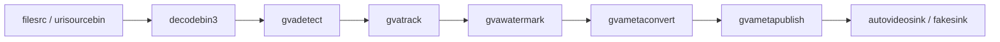

# Metadata Publishing Sample (Python)

This sample demonstrates how to use `gvametaconvert` and `gvametapublish` elements in a Python application to publish detection metadata to a file, Kafka, or MQTT message broker. It is the DL Streamer equivalent of the [NVIDIA DeepStream deepstream-test4](https://github.com/NVIDIA-AI-IOT/deepstream_python_apps/tree/master/apps/deepstream-test4) sample.

> **Prompt:** Analyze the DeepStream sample application from
> https://github.com/NVIDIA-AI-IOT/deepstream_python_apps/tree/master/apps/deepstream-test4.
> Create a similar sample application for DL Streamer.

## What It Does

1. **Decodes** video from a file or URI (`decodebin3`)
2. **Detects** persons, vehicles, and bikes using the `person-vehicle-bike-detection-2004` model (`gvadetect`)
3. **Tracks** detected objects across frames (`gvatrack`)
4. **Overlays** bounding boxes and labels on the video (`gvawatermark`)
5. **Converts** inference metadata to JSON (`gvametaconvert`)
6. **Publishes** JSON metadata to file, Kafka, or MQTT (`gvametapublish`)
7. **Displays** the annotated video or sends to `fakesink` (`autovideosink` / `fakesink`)



### Key Differences from DeepStream test4

| Feature | DeepStream test4 | DL Streamer metapublish |
|---------|-----------------|------------------------|
| Detection | `nvinfer` (NVIDIA) | `gvadetect` (OpenVINO) |
| Message conversion | `nvmsgconv` (DeepStream-specific schema) | `gvametaconvert` (standard JSON) |
| Message broker | `nvmsgbroker` (**sink** element) | `gvametapublish` (**transform** — passes buffers downstream) |
| Pipeline topology | Requires `tee` to split display and publish branches | **No `tee` needed** — publish element is inline |
| Batch processing | `nvstreammux` batch multiplexer | Not needed — DL Streamer handles batching in inference elements |
| Metadata API | `pyds.NvDsFrameMeta`, `NvDsObjectMeta` | Standard GStreamer `GstAnalytics` metadata |
| Object tracking | Not included in test4 | `gvatrack` included for cross-frame tracking |

## Prerequisites

- DL Streamer installed on the host, or a DL Streamer Docker image
- Intel platform with CPU or integrated GPU
- Pre-trained `person-vehicle-bike-detection-2004` model (from Open Model Zoo)

### Download Models

Set `MODELS_PATH` and download the required models:

```bash
export MODELS_PATH=~/intel/dl_streamer/models
./samples/download_omz_models.sh person-vehicle-bike-detection-2004
```

## Running the Sample

### Basic Usage — Publish to Console (stdout)

```bash
python3 metapublish.py -i /path/to/video.mp4
```

### Publish to File

```bash
python3 metapublish.py -i /path/to/video.mp4 \
    -p file --conn-str /tmp/output.json
```

### Publish to MQTT Broker

```bash
python3 metapublish.py -i /path/to/video.mp4 \
    -p mqtt --conn-str localhost:1883 -t dlstreamer
```

### Publish to Kafka Broker

```bash
python3 metapublish.py -i /path/to/video.mp4 \
    -p kafka --conn-str localhost:9092 -t dlstreamer
```

### Headless Mode (no display)

```bash
python3 metapublish.py -i /path/to/video.mp4 \
    -p mqtt --conn-str localhost:1883 --no-display
```

### Using GPU for Inference

```bash
python3 metapublish.py -i /path/to/video.mp4 --device GPU
```

### Using a URI Source

```bash
python3 metapublish.py \
    -i https://github.com/intel-iot-devkit/sample-videos/raw/master/person-bicycle-car-detection.mp4 \
    -p file --conn-str /tmp/results.json
```

## Command-Line Arguments

| Argument | Default | Description |
|----------|---------|-------------|
| `-i`, `--input` | *(required)* | Path to input video file, URI, or RTSP stream |
| `-p`, `--method` | `file` | Publishing method: `file`, `kafka`, or `mqtt` |
| `--conn-str` | *(auto)* | Connection string: file path for `file`, `host:port` for `kafka`/`mqtt` |
| `-t`, `--topic` | `dlstreamer` | Topic name for Kafka/MQTT |
| `-s`, `--schema-type` | `0` | JSON format: `0` = pretty-print, `1` = JSON Lines |
| `-c`, `--cfg-file` | `None` | Path to MQTT JSON config file (for TLS, etc.) |
| `--no-display` | `False` | Disable video display |
| `--device` | `CPU` | Inference device: `CPU`, `GPU`, `AUTO` |
| `--model` | *(auto)* | Path to detection model `.xml` file |
| `--model-proc` | *(auto)* | Path to model-proc `.json` file |
| `--tracking-type` | `short-term-imageless` | Tracking algorithm type |
| `--detection-interval` | `1` | Run detection every Nth frame |

## Output

The sample prints per-frame object counts to the console:

```
PTS=1000000000 Vehicle Count=3 Person Count=2 Bike Count=1
PTS=1033333333 Vehicle Count=3 Person Count=2 Bike Count=1
```

When publishing to file, JSON output contains detection metadata with bounding boxes, labels, and confidence scores for each detected object.

## See Also

- [Metadata Publishing CLI Sample](../../gst_launch/metapublish/) — command-line equivalent
- [Vehicle Pedestrian Tracking Sample](../../gst_launch/vehicle_pedestrian_tracking/) — tracking with classification
- [Converting DeepStream to DL Streamer](../../../../docs/user-guide/dev_guide/converting_deepstream_to_dlstreamer.md) — conversion guide
- [gvametaconvert element](../../../../docs/user-guide/elements/gvametaconvert.md)
- [gvametapublish element](../../../../docs/user-guide/elements/gvametapublish.md)
