# DeepStream LPR Conversion — License Plate Recognition

A DL Streamer C++ application converted from the
[NVIDIA DeepStream `deepstream_lpr_app`](https://github.com/NVIDIA-AI-IOT/deepstream_tao_apps/tree/master/apps/tao_others/deepstream_lpr_app).
Detects license plates in video and recognizes plate text using Intel hardware acceleration.

> Analyze the DeepStream sample application at
> https://github.com/NVIDIA-AI-IOT/deepstream_tao_apps/tree/master/apps/tao_others/deepstream_lpr_app.
> Create an equivalent sample application for DL Streamer. Verify an output of created sample application.
> Verify an output of created sample application. Read input video from a file (https://videos.pexels.com/video-files/2103099/2103099-uhd_2560_1440_30fps.mp4)
>
> In the generated README, include a detailed conversion reference:
> - Side-by-side diagrams comparing the DeepStream and DL Streamer pipelines with marking with colors the same functional elements
> - Element mapping table explaining each substitution and why the change was made
> - Application logic table covering probes, callbacks, metadata handling, and CLI parsing
> - Model comparison table showing the original model vs. the chosen replacement, format conversion steps, and rationale for the selection

## What It Does

1. **Detects** license plates in each video frame using YOLOv11 (`gvadetect`)
2. **Tracks** detected plates across frames (`gvatrack`)
3. **Recognizes** text on detected plates using PaddleOCR (`gvaclassify`)
4. **Prints** recognized plate text and per-frame statistics to stdout (pad probe callback)
5. **Publishes** structured JSONL results (`gvametapublish`)
6. **Writes** an annotated output video with bounding boxes and recognized text (`gvawatermark`)

## Pipeline Comparison

### DeepStream Pipeline (Original)

```mermaid
graph LR
    subgraph Input["🟦 Input / Decode"]
        A1[filesrc] --> A2[qtdemux]
        A2 --> A3[h264parse]
        A3 --> A4["nvv4l2decoder"]
    end
    subgraph Mux["🟦 Batch Mux"]
        A4 --> B1["nvstreammux"]
    end
    subgraph Inference["🟩 Inference Chain"]
        B1 --> C1["nvinfer<br/>PGIE: TrafficCamNet"]
        C1 --> C2["nvtracker"]
        C2 --> C3["nvdsanalytics"]
        C3 --> C4["nvinfer<br/>SGIE0: LPDNet"]
        C4 --> C5["nvinfer<br/>SGIE1: LPRNet"]
    end
    subgraph Output["🟧 Output"]
        C5 --> D1["nvmultistreamtiler"]
        D1 --> D2["nvvideoconvert"]
        D2 --> D3["nvdsosd"]
        D3 --> E1["filesink / fakesink"]
    end

    style A1 fill:#4a90d9,color:#fff
    style A2 fill:#4a90d9,color:#fff
    style A3 fill:#4a90d9,color:#fff
    style A4 fill:#4a90d9,color:#fff
    style B1 fill:#4a90d9,color:#fff
    style C1 fill:#5cb85c,color:#fff
    style C2 fill:#5cb85c,color:#fff
    style C3 fill:#5cb85c,color:#fff
    style C4 fill:#5cb85c,color:#fff
    style C5 fill:#5cb85c,color:#fff
    style D1 fill:#e67e22,color:#fff
    style D2 fill:#e67e22,color:#fff
    style D3 fill:#e67e22,color:#fff
    style E1 fill:#e67e22,color:#fff
```



### DL Streamer Pipeline (Converted)

```mermaid
graph LR
    subgraph Input["🟦 Input / Decode"]
        A1[filesrc] --> A2["decodebin3"]
    end
    subgraph Inference["🟩 Inference Chain"]
        A2 --> C1["gvadetect<br/>YOLOv11 LP Detection"]
        C1 --> C2["gvatrack"]
        C2 --> C5["gvaclassify<br/>PaddleOCR"]
    end
    subgraph Output["🟧 Output"]
        C5 --> D1["gvafpscounter"]
        D1 --> D3["gvawatermark"]
        D3 --> D4["gvametaconvert"]
        D4 --> D5["gvametapublish"]
        D5 --> D6["videoconvert"]
        D6 --> D7["vah264enc"]
        D7 --> D8["h264parse"]
        D8 --> D9["mp4mux"]
        D9 --> E1["filesink"]
    end

    style A1 fill:#4a90d9,color:#fff
    style A2 fill:#4a90d9,color:#fff
    style C1 fill:#5cb85c,color:#fff
    style C2 fill:#5cb85c,color:#fff
    style C5 fill:#5cb85c,color:#fff
    style D1 fill:#e67e22,color:#fff
    style D3 fill:#e67e22,color:#fff
    style D4 fill:#e67e22,color:#fff
    style D5 fill:#e67e22,color:#fff
    style D6 fill:#e67e22,color:#fff
    style D7 fill:#e67e22,color:#fff
    style D8 fill:#e67e22,color:#fff
    style D9 fill:#e67e22,color:#fff
    style E1 fill:#e67e22,color:#fff
```



**Legend:**
🟦 Blue = Input / Decode — 🟩 Green = AI Inference & Tracking — 🟧 Orange = Output / Overlay / Encode

---

## Conversion Reference

### Element Mapping Table

| DeepStream Element | DL Streamer Element | Function | Why Changed |
|---|---|---|---|
| `filesrc` | `filesrc` | Read video file | Same standard GStreamer element — no change |
| `qtdemux` + `h264parse` + `nvv4l2decoder` | `decodebin3` | Demux and decode video | `decodebin3` auto-selects the best decoder (including VA-API HW decode on Intel), replacing three NVIDIA-specific elements with one |
| `nvstreammux` | *(removed)* | Batch frames from multiple sources | DL Streamer inference elements handle batching internally via `batch-size` property — no separate muxer needed |
| `nvinfer` (PGIE: TrafficCamNet) | `gvadetect` | Primary object detection | DL Streamer uses `gvadetect` with OpenVINO models. Single element replaces car+plate two-stage detection with a unified LP detector |
| `nvinfer` (SGIE0: LPDNet) | *(merged into `gvadetect`)* | License plate detection | YOLOv11 LP model detects plates directly — no separate car-then-plate cascade needed |
| `nvinfer` (SGIE1: LPRNet) | `gvaclassify` | License plate text recognition (OCR) | `gvaclassify` runs PaddleOCR on each detected plate ROI, replacing NVIDIA's proprietary LPRNet |
| `nvtracker` | `gvatrack` | Object tracking across frames | DL Streamer's zero-term-imageless tracker provides equivalent functionality |
| `nvdsanalytics` | *(removed)* | ROI counting / line crossing | Not needed for basic LPR. Analytics metadata was only used for optional counting in the original |
| `nvmultistreamtiler` | *(removed)* | Tile multiple streams into one view | Single-stream pipeline — tiling not needed. For multi-stream, use `vacompositor` |
| `nvvideoconvert` | `videoconvert` | Pixel format conversion | Standard GStreamer element replaces NVIDIA-specific converter |
| `nvdsosd` | `gvawatermark` | Draw bounding boxes and text overlays | DL Streamer's `gvawatermark` renders GstAnalytics metadata (ODMtd, ClsMtd) |
| *(not present)* | `gvafpscounter` | FPS measurement | Added for performance monitoring (DeepStream measured FPS in the probe callback) |
| *(not present)* | `gvametaconvert` + `gvametapublish` | Metadata → JSON Lines file | Added for structured output. DeepStream only printed to stdout |
| *(not present)* | `vah264enc` + `h264parse` + `mp4mux` | HW-accelerated video encoding | Added to produce annotated output video. DeepStream used fakesink by default |
| `queue` × 10 | `queue` × 2 | Thread decoupling | DL Streamer pipeline is simpler; fewer queues needed |

### Application Logic Table

| Aspect | DeepStream (`deepstream_lpr_app.cpp`) | DL Streamer (`deepstream_lpr_app.cpp`) |
|---|---|---|
| **Pipeline construction** | Programmatic: 20+ `gst_element_factory_make()` calls, manual `gst_element_link_many()`, manual pad request/link for muxer | `gst_parse_launch()` with a single pipeline string — ~10× less boilerplate |
| **CLI parsing** | YAML config file via `nvds_parse_*()` functions (`nvds_parse_source_list`, `nvds_parse_gie`, `nvds_parse_tracker`) | `--input`, `--device`, `--threshold`, `--output-video`, `--output-json` flags via simple `argc/argv` parsing |
| **Multi-source support** | Loop over `g_list` of sources, create per-source elements, request muxer sink pads | Single source; extend by adding parallel `Gst.parse_launch` branches with `model-instance-id` sharing |
| **Inference config** | Separate `.txt` config files for each `nvinfer` (PGIE, SGIE0, SGIE1), parsed via `nvds_parse_gie()` | Inline pipeline properties: `model=<path> device=GPU batch-size=4` |
| **Pad probe (OSD sink)** | `osd_sink_pad_buffer_probe`: iterates `NvDsBatchMeta` → `NvDsFrameMeta` → `NvDsObjectMeta` → `NvDsClassifierMeta` → `NvDsLabelInfo`. Counts vehicles, persons, plates. Adds `NvDsDisplayMeta` for text overlay | `watermark_sink_pad_buffer_probe`: iterates `GstAnalyticsRelationMeta` → `GstAnalyticsODMtd` → `GstAnalyticsClsMtd`. Counts plates, prints recognized text. No manual display meta needed (gvawatermark handles it) |
| **Pad probe (analytics)** | `nvdsanalytics_src_pad_buffer_probe`: iterates `NvDsAnalyticsFrameMeta` for ROI/line-crossing counts | *(removed)* — analytics metadata not needed for core LPR |
| **Performance measurement** | `perf_measure` struct: manual `g_get_monotonic_time()` diff in probe, prints average FPS at end | Same `PerfMeasure` struct + `gvafpscounter` element for periodic FPS reporting |
| **Bus message handler** | `bus_call()` callback via `gst_bus_add_watch()` in a `GMainLoop` | `run_pipeline()`: `gst_bus_timed_pop_filtered()` poll loop (no GMainLoop dependency) |
| **Dynamic pad linking** | `cb_new_pad()` for qtdemux → h264parse linking via `g_signal_connect("pad-added")` | Not needed — `decodebin3` handles pad negotiation internally |
| **Signal handling** | None (relies on GMainLoop + bus_call for EOS) | SIGINT → `gst_element_send_event(EOS)` for graceful shutdown |
| **Device selection** | `cudaGetDevice()` / `cudaGetDeviceProperties()` for GPU detection, YAML-configured inference plugin type (`nvinfer` vs `nvinferserver`) | Filesystem checks (`/dev/dri/renderD128`, `/dev/accel/accel0`) with automatic NPU→GPU→CPU fallback |
| **Output modes** | Configurable via YAML: fakesink (perf test), filesink (video), nv3dsink/nveglglessink (display) | `--display` flag: `autovideosink` (display) or `vah264enc → filesink` (default) |

### Model Comparison Table

| Role | DeepStream Model | DL Streamer Model | Format Conversion | Rationale |
|---|---|---|---|---|
| **Primary detection (PGIE)** | [TrafficCamNet](https://ngc.nvidia.com/catalog/models/nvidia:tao:trafficcamnet) — detects cars, persons, two-wheelers, roadsigns. NVIDIA TAO INT8 TensorRT engine | [YOLOv11s LP Detection](https://huggingface.co/morsetechlab/yolov11-license-plate-detection) — detects license plates directly | `.pt` → OpenVINO IR INT8 via `ultralytics.YOLO.export(format="openvino", int8=True)` | Replaces the two-stage cascade (car detection → plate detection) with a single-stage plate detector. YOLOv11 is state-of-the-art for object detection and available with OpenVINO export. No NVIDIA-proprietary TAO format dependency |
| **Secondary detection (SGIE0)** | [LPDNet](https://ngc.nvidia.com/catalog/models/nvidia:tao:lpdnet) — detects license plate regions within car bounding boxes. NVIDIA TAO INT8 TensorRT engine | *(merged into primary detection)* | — | The YOLOv11 model detects plates directly in the full frame, eliminating the need for a separate car→plate cascade. This simplifies the pipeline and reduces latency |
| **OCR recognition (SGIE1)** | [LPRNet](https://ngc.nvidia.com/catalog/models/nvidia:tao:lprnet) — recognizes characters on license plates. NVIDIA TAO FP16 TensorRT engine. Requires `nvinfer_custom_lpr_parser` for CTC decoding | [PaddleOCR PP-OCRv5 Server Rec](https://huggingface.co/PaddlePaddle/PP-OCRv5_server_rec) — general-purpose OCR with 18K+ character support | PIR → ONNX (via `paddle2onnx`) → OpenVINO IR FP16 (via `ovc --compress_to_fp16`) | PaddleOCR v5 provides state-of-the-art OCR accuracy with support for multilingual plates. No custom parser plugin needed — `gvaclassify` handles the output natively. Supports both Latin and CJK characters out of the box |

---

## Prerequisites

- DL Streamer Docker image (`intel/dlstreamer:latest`)
- Intel system with integrated GPU (Intel Core Ultra or newer recommended)
- Host: `g++`, `pkg-config`, GStreamer development headers (for building outside Docker)

### Install Python Dependencies (for model export)

> **Note:** `export_requirements.txt` includes heavy ML frameworks (PyTorch,
> Ultralytics, PaddlePaddle), needed only for one-time model conversion.

```bash
python3 -m venv .lpr-export-venv
source .lpr-export-venv/bin/activate
pip install -r export_requirements.txt
```

## Prepare Video and Models (One-Time Setup)

### Download Video

Download a traffic video for testing:

```bash
mkdir -p videos
curl -L -o videos/traffic.mp4 \
    -H "Referer: https://www.pexels.com/" \
    -H "User-Agent: Mozilla/5.0 (X11; Linux x86_64) AppleWebKit/537.36" \
    "https://videos.pexels.com/video-files/2103099/2103099-uhd_2560_1440_30fps.mp4"
```

Alternatively, use any local video file and pass it via `--input`.

This sample uses a video file from [Pexels](https://www.pexels.com/video/traffic-flow-in-the-highway-2103099/) by Soly Moses.

### Export Models

The export script downloads the AI models and converts them to OpenVINO IR format.
Converted models are saved under `models/`. This may take several minutes.

```bash
source .lpr-export-venv/bin/activate
python3 export_models.py
```

## Building

### Option 1: Build with host GStreamer (recommended for development)

```bash
export PKG_CONFIG_PATH="/path/to/gstreamer-bin/lib/pkgconfig:$PKG_CONFIG_PATH"
g++ -std=c++17 -O2 -o deepstream-lpr-app deepstream_lpr_app.cpp \
    $(pkg-config --cflags --libs gstreamer-1.0 gstreamer-analytics-1.0 glib-2.0)
```

### Option 2: Build with CMake

```bash
mkdir -p build && cd build
cmake ..
make -j$(nproc)
```

## Running the Sample

Run inside the DL Streamer Docker container:

```bash
docker run --init --rm \
    -u "$(id -u):$(id -g)" \
    -v "$(pwd)":/app -w /app \
    --device /dev/dri \
    --group-add $(stat -c "%g" /dev/dri/render*) \
    intel/dlstreamer:latest \
    ./deepstream-lpr-app --input videos/traffic.mp4
```

### Advanced Usage

```bash
# Use CPU inference
./deepstream-lpr-app --input videos/traffic.mp4 --device CPU

# Display output in a window (requires X11 forwarding)
./deepstream-lpr-app --input videos/traffic.mp4 --display

# Custom output paths
./deepstream-lpr-app --input videos/traffic.mp4 \
    --output-video results/custom.mp4 \
    --output-json results/custom.jsonl

# Adjust detection threshold
./deepstream-lpr-app --input videos/traffic.mp4 --threshold 0.6
```

## How It Works

### STEP 1 — Model Export (one-time)

`export_models.py` downloads and converts two models:

1. **YOLOv11s License Plate Detector** from HuggingFace → OpenVINO IR INT8
2. **PaddleOCR PP-OCRv5 Server Rec** from HuggingFace → PIR → ONNX → OpenVINO IR FP16

### STEP 2 — Pipeline Construction

The C++ application builds a GStreamer pipeline string and launches it with `gst_parse_launch()`:

```
filesrc → decodebin3 →
gvadetect (LP detection, GPU) → queue →
gvatrack (zero-term-imageless) →
gvaclassify (OCR, GPU) → queue →
gvafpscounter → gvawatermark →
gvametaconvert → gvametapublish (JSON Lines) →
videoconvert → vah264enc → h264parse →
mp4mux (fragmented) → filesink
```

### STEP 3 — Pad Probe Callback

A pad probe on the `gvawatermark` sink pad mirrors the DeepStream `osd_sink_pad_buffer_probe`:
- Iterates `GstAnalyticsRelationMeta` to find detection and classification metadata
- Prints recognized plate text with confidence scores
- Counts plates per frame and tracks total plates across the video
- Measures FPS using monotonic timestamps

## Command-Line Arguments

| Argument | Default | Description |
|---|---|---|
| `--input` | *(required)* | Path to input video file or rtsp:// URI |
| `--device` | `GPU` | Inference device (`GPU`, `CPU`, `NPU`) |
| `--output-video` | `results/output.mp4` | Annotated output video path |
| `--output-json` | `results/results.jsonl` | JSON Lines metadata output path |
| `--threshold` | `0.5` | Detection confidence threshold |
| `--display` | `false` | Show output in a display window |

## Output

Results are written to the `results/` directory:

- `output.mp4` — annotated output video with bounding boxes and recognized plate text
- `results.jsonl` — structured JSON Lines with detection coordinates, OCR text, and confidence scores

Console output includes per-frame plate counts and recognized text:
```
Plate License: BP63LYH (confidence: 0.99)
Frame Number = 1111  License Plate Count = 1
```

## Coding Agent Analytics

| Phase | Time |
|-------|------|
| AI reasoning (analysis, pipeline design, code generation) | ~4 min |
| Environment setup (pip install, model export, Docker pull) | ~6 min |
| Debug and validation (build, run, fix API, re-run) | ~5 min |
| User wait time | 0 min |
| **Total activity time** | **~15 min** |
