# License Plate Recognition

A DL Streamer Python application that detects license plates in video using YOLOv11
and recognizes the text on each plate using PaddleOCR, optimized for Intel Core Ultra 3 processors.

> Develop a Python application that implements license plate recognition pipeline:
> - Read input video from a file (https://github.com/open-edge-platform/edge-ai-resources/raw/main/videos/ParkingVideo.mp4) but also allow remote IP cameras
> - Run YOLOv11 (https://huggingface.co/morsetechlab/yolov11-license-plate-detection) for object detection and PaddleOCR (https://huggingface.co/PaddlePaddle/PP-OCRv5_server_rec) model for character recognition
> - Output license plate text for each detected object as JSON file
> - Annotate video stream and store it as an output video file
>
> Generate vision AI processing pipeline optimized for Intel Core Ultra 3 processors. Save source code in license_plate_recognition directory, including README.md with setup instructions. Follow instructions in README.md to run the application and check if it generates the expected output.

## What It Does

1. **Detects** license plates in each video frame using YOLOv11 (`gvadetect`)
2. **Recognizes** text on detected plates using PaddleOCR (`gvaclassify`)
3. **Publishes** structured JSONL results with plate text (`gvametapublish`)
4. **Writes** an annotated output video with bounding boxes and recognized text (`gvawatermark`)

```mermaid
graph LR
    A[filesrc / rtspsrc] --> B[decodebin3]
    B --> C[gvadetect<br/>YOLOv11 LP Detection]
    C --> D[queue]
    D --> E[gvaclassify<br/>PaddleOCR Recognition]
    E --> F[queue]
    F --> G[gvafpscounter]
    G --> H[gvawatermark]
    H --> I[gvametaconvert]
    I --> J[gvametapublish<br/>JSON Lines]
    J --> K[videoconvert]
    K --> L[vah264enc]
    L --> M[h264parse]
    M --> N[mp4mux]
    N --> O[filesink]
```



## Prerequisites

- DL Streamer Docker image (weekly build)
- Intel Edge AI system with integrated GPU (Intel Core Ultra 3 or newer)

### Install Python Dependencies

> **Note:** `export_requirements.txt` includes heavy ML frameworks (PyTorch,
> Ultralytics, PaddlePaddle), needed only for one-time model conversion.
> `requirements.txt` contains only lightweight runtime dependencies.

```bash
python3 -m venv .lpr-export-venv
source .lpr-export-venv/bin/activate
pip install -r export_requirements.txt
```

## Prepare Video and Models (One-Time Setup)

Before running the application, download the input video and export the required models.
This step is performed once; subsequent application runs reuse the prepared assets.

### Download Video

Download the sample parking video:

```bash
mkdir -p videos
curl -L -o videos/ParkingVideo.mp4 \
    "https://github.com/open-edge-platform/edge-ai-resources/raw/main/videos/ParkingVideo.mp4"
```

Verify it downloaded correctly:
```bash
file videos/ParkingVideo.mp4 | grep -q "ISO Media" && echo "OK" || echo "FAILED - got HTML instead of video"
```

Alternatively, use any local video file and pass it via `--input`.

### Export Models

The export script downloads the YOLOv11 license plate detection model and PaddleOCR
recognition model, then converts them to OpenVINO IR format. Converted models are
saved under `models/`.

```bash
source .lpr-export-venv/bin/activate
python3 export_models.py
```

## Running the Sample

Pull the latest DL Streamer Docker image:

```bash
docker pull intel/dlstreamer:2026.1.0-20260505-weekly-ubuntu24
```

Run the application inside Docker:

```bash
docker run --init --rm \
    -u "$(id -u):$(id -g)" \
    -e PYTHONUNBUFFERED=1 \
    -v "$(pwd)":/app -w /app \
    --device /dev/dri \
    --group-add $(stat -c "%g" /dev/dri/render*) \
    intel/dlstreamer:2026.1.0-20260505-weekly-ubuntu24 \
    python3 license_plate_recognition.py --input videos/ParkingVideo.mp4
```

On systems with NPU (Intel Core Ultra), add NPU access:

```bash
docker run --init --rm \
    -u "$(id -u):$(id -g)" \
    -e PYTHONUNBUFFERED=1 \
    -v "$(pwd)":/app -w /app \
    --device /dev/dri \
    --group-add $(stat -c "%g" /dev/dri/render*) \
    --device /dev/accel \
    --group-add $(stat -c "%g" /dev/accel/accel*) \
    intel/dlstreamer:2026.1.0-20260505-weekly-ubuntu24 \
    python3 license_plate_recognition.py --input videos/ParkingVideo.mp4 --ocr-device NPU
```

## How It Works

### STEP 1 — Video Download and Model Export (one-time)

Download the input video and convert models to OpenVINO IR format (see "Prepare Video and Models" above).

- **YOLOv11** (`license-plate-finetune-v1s.pt`) is exported via Ultralytics with INT8 quantization
- **PaddleOCR** (`PP-OCRv5_server_rec`) is converted via paddle2onnx → ovc (PIR → ONNX → OpenVINO IR FP16)

### STEP 2 — DL Streamer Pipeline Construction

The application constructs a GStreamer pipeline combining detection, OCR classification,
metadata publishing, and video encoding:

```python
pipe = (
    f'{source} ! decodebin3 caps="video/x-raw(ANY)" ! '
    f'gvadetect model="{detect_model}" device={detect_device} batch-size=4 ! queue ! '
    f'gvaclassify model="{ocr_model}" device={ocr_device} batch-size=4 ! queue ! '
    f'gvafpscounter ! gvawatermark ! '
    f'gvametaconvert ! gvametapublish file-format=json-lines file-path="{output_json}" ! '
    f'videoconvert ! vah264enc ! h264parse ! mp4mux fragment-duration=1000 ! '
    f'filesink location="{output_video}"'
)
```

### STEP 3 — Pipeline Execution

`gvadetect` runs YOLOv11 to find license plate bounding boxes. `gvaclassify` runs
PaddleOCR on each detected region to recognize text. `gvawatermark` overlays bounding
boxes and recognized text on the video. `gvametapublish` writes detection and
classification metadata as JSON Lines.

## Command-Line Arguments

| Argument | Default | Description |
|---|---|---|
| `--input` | `videos/ParkingVideo.mp4` | Path to input video file or rtsp:// URI |
| `--detect-device` | `GPU` | Device for license plate detection inference |
| `--ocr-device` | `GPU` | Device for OCR classification inference |
| `--output-video` | `results/output.mp4` | Output annotated video path |
| `--output-json` | `results/results.jsonl` | Output JSON Lines metadata path |
| `--threshold` | `0.5` | Detection confidence threshold |

## Output

Results are written to the `results/` directory:

- `output.mp4` — annotated output video with license plate bounding boxes and recognized text
- `results.jsonl` — structured JSON Lines with detection coordinates and OCR text for each frame
