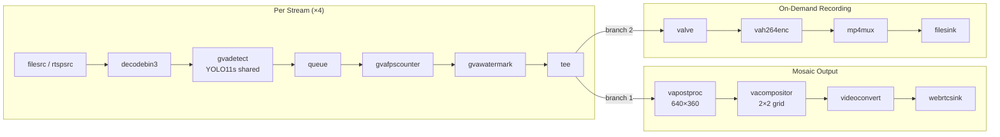

# Multi-Stream Compose

Multi-camera video analytics with composite WebRTC output and on-demand recording.

> Create an application that analyzes video streams from multiple RTSP camera sources.
> For each stream run AI analytics to detect objects and overlay annotations.
> Allow a user to dynamically start/stop recording of a selected annotated input stream to a local disk.
> Merge output from multiple streams and send combined output to a remote display over WebRTC.

## What It Does

1. **Ingests** 4 video streams (file or RTSP) in a single GStreamer pipeline
2. **Detects** objects in each stream using a shared YOLO11s model (`gvadetect`) with cross-stream batching
3. **Annotates** each stream with bounding boxes and labels (`gvawatermark`)
4. **Composites** all annotated streams into a 2×2 mosaic (`vacompositor`, GPU-accelerated)
5. **Streams** the composite mosaic to a remote display via WebRTC (`webrtcsink`)
6. **Records** a selected stream on demand via stdin commands (`valve` + `vah264enc` + `mp4mux`)



The pipeline uses the following elements:

* __filesrc / rtspsrc__ — Read video from local file or RTSP camera
* __decodebin3__ — Decode video stream (hardware-accelerated)
* __gvadetect__ — DL Streamer inference element for YOLO object detection
* __gvawatermark__ — Overlay bounding boxes and labels on video frames
* __vacompositor__ — GPU-accelerated compositor merging streams into a 2×2 mosaic
* __webrtcsink__ — Stream composite output via WebRTC with built-in signaling server
* __valve__ — Conditionally gate per-stream recording flow
* __vah264enc__ — Hardware H.264 encoding for recordings
* __mp4mux__ — Fragmented MP4 container for robust recording output

## Prerequisites

- DL Streamer installed on the host, or a DL Streamer Docker image
- Intel Core Ultra system with integrated GPU (or set `--device CPU`)

### Install Python Dependencies

> **Note:** `export_requirements.txt` includes heavy ML frameworks (PyTorch,
> Ultralytics), needed only for one-time model conversion.

```bash
python3 -m venv .multi-stream-compose-venv
source .multi-stream-compose-venv/bin/activate
pip install -r export_requirements.txt
```

## Prepare Video and Models (One-Time Setup)

### Download Video

Download a sample traffic video for testing:

```bash
mkdir -p videos
curl -L -o videos/sample_traffic.mp4 \
    -H "Referer: https://www.pexels.com/" \
    -H "User-Agent: Mozilla/5.0 (X11; Linux x86_64) AppleWebKit/537.36" \
    "https://videos.pexels.com/video-files/2053100/2053100-hd_1920_1080_30fps.mp4"
```

Alternatively, use any local video file or RTSP URI via `--input`.

### Export Models

```bash
python3 export_models.py
```

## Running the Sample

### Run in Docker (recommended)

```bash
WEEKLY_TAG=2026.1.0-20260505-weekly-ubuntu24

docker run --init --rm -it \
    -v "$(pwd)":/app -w /app \
    --device /dev/dri \
    --group-add $(stat -c "%g" /dev/dri/render*) \
    --network host \
    intel/dlstreamer:${WEEKLY_TAG} \
    python3 multi_stream_compose.py
```

### Run with custom inputs

```bash
python3 multi_stream_compose.py \
    --input rtsp://cam1:554/stream rtsp://cam2:554/stream \
    --num-streams 4 \
    --device GPU
```

### Interactive Commands

While the pipeline is running, type commands on stdin:

| Command | Description |
|---------|-------------|
| `record <N>` | Start recording annotated stream N (0-based index) |
| `stop` | Stop recording the current stream |
| `quit` | Graceful pipeline shutdown |

### WebRTC Output

Open `http://localhost:8080/` in a browser to view the composite mosaic.
The WebRTC signaling server runs on port 8443 (configurable with `--webrtc-port`).

### Command-line Arguments

| Argument | Default | Description |
|----------|---------|-------------|
| `--input` | `videos/sample_traffic.mp4` | Video file paths or RTSP URIs (space-separated) |
| `--num-streams` | `4` | Number of streams in the mosaic |
| `--device` | `GPU` | Inference device (GPU, NPU, CPU) |
| `--webrtc-port` | `8443` | WebRTC signalling server port |
| `--loop` | `0` | Loop count: 0=infinite, N=play N times |
