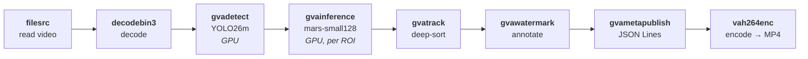

# People Detection & Tracking with Deep SORT

Detects and tracks people in video using YOLO26m for detection and Deep SORT algorithm
with Mars-Small-128 re-identification model for robust multi-object tracking.

> Create a bash script that detects and tracks (use deep sort algorithm) people on video stream.
> - Read input video from a file (https://videos.pexels.com/video-files/18552655/18552655-hd_1280_720_30fps.mp4)
> - Use YOLO26m model for people detection
> - Use Mars-Small-128 model for re-identification
> - Annotate video stream and store it as an output video file
>
> Generate vision AI processing pipeline optimized for Intel Core Ultra 3 processors.
> Save source code in people_detection_tracking directory, including README.md with setup instructions.
> Follow instructions in README.md to run the application and check if it generates the expected output.

This sample uses a video file from [Pexels](https://www.pexels.com/video/18552655/).

## What It Does

1. **Decodes** input video from a local file (`filesrc` → `decodebin3`)
2. **Detects** people in each frame using YOLO26m (`gvadetect`)
3. **Extracts** 128-dimensional appearance features per detected person using Mars-Small-128 (`gvainference`)
4. **Tracks** people across frames using Deep SORT algorithm with Kalman filter + cosine distance matching (`gvatrack`)
5. **Annotates** video frames with bounding boxes and tracking IDs (`gvawatermark`)
6. **Publishes** detection metadata as JSON Lines (`gvametaconvert` → `gvametapublish`)
7. **Encodes** and saves the annotated output video (`vah264enc` → `mp4mux` → `filesink`)



The pipeline uses the following elements:

* **filesrc** — GStreamer element that reads video from a local file
* **decodebin3** — GStreamer element that auto-selects the best decoder (hardware-accelerated when available)
* **gvadetect** — DL Streamer inference element that runs YOLO26m object detection
* **gvainference** — DL Streamer inference element that extracts 128-dim appearance features per detected person ROI using Mars-Small-128
* **gvatrack** — DL Streamer tracking element using Deep SORT algorithm (Kalman filter + cosine distance + IoU matching)
* **gvawatermark** — DL Streamer element that overlays bounding boxes and tracking IDs on video frames
* **gvametaconvert** / **gvametapublish** — DL Streamer elements for metadata serialization to JSON Lines
* **vah264enc** — Intel VA-API hardware H.264 encoder
* **mp4mux** — GStreamer element that packages the encoded stream into MP4 container

## Prerequisites

- DL Streamer Docker image (weekly build recommended)
- Intel Core Ultra 3 processor (or any Intel system with integrated GPU)

### Install Python Dependencies

> **Note:** `export_requirements.txt` includes heavy ML frameworks (PyTorch,
> Ultralytics), needed only for one-time model conversion.

```bash
python3 -m venv .people-detection-tracking-export-venv
source .people-detection-tracking-export-venv/bin/activate
pip install -r export_requirements.txt
```

## Prepare Video and Models (One-Time Setup)

### Download Video

Download the sample video to a local directory:

```bash
mkdir -p videos
curl -L -o videos/people.mp4 \
    -H "Referer: https://www.pexels.com/" \
    -H "User-Agent: Mozilla/5.0 (X11; Linux x86_64) AppleWebKit/537.36" \
    "https://videos.pexels.com/video-files/18552655/18552655-hd_1280_720_30fps.mp4"
```

Alternatively, use any local video file and pass it via the first argument.

### Export Models

The export script downloads the AI models and converts them to OpenVINO IR format.
Converted models are saved under `models/`. This may take several minutes depending on model size and network speed.

```bash
source .people-detection-tracking-export-venv/bin/activate
python3 export_models.py
```

This exports:
- **YOLO26m** — Object detection model (OpenVINO IR INT8) → `models/yolo26m_openvino/`
- **Mars-Small-128** — Person re-identification model (OpenVINO IR FP32) → `models/mars-small128/`

## Running the Sample

### Run in Docker (recommended)

```bash
docker run --init --rm \
    -u "$(id -u):$(id -g)" \
    -v "$(pwd)":/app -w /app \
    --device /dev/dri \
    --group-add $(stat -c "%g" /dev/dri/render*) \
    intel/dlstreamer:2026.1.0-weekly-ubuntu24 \
    bash people_detection_tracking.sh
```

### Run on Host (with DL Streamer installed)

```bash
bash people_detection_tracking.sh
```

### Custom Input and Device

```bash
bash people_detection_tracking.sh /path/to/video.mp4 GPU
```

## Command-Line Arguments

| Argument | Position | Default | Description |
|---|---|---|---|
| `INPUT` | 1 | `videos/people.mp4` | Path to input video file |
| `DEVICE` | 2 | `GPU` | Inference device (`CPU` or `GPU`) |

## Output

Results are written to the `results/` directory:

- `people_detection_tracking-<video>.mp4` — Annotated output video with bounding boxes and tracking IDs
- `people_detection_tracking-<video>.jsonl` — Structured JSON Lines with detection and tracking metadata
