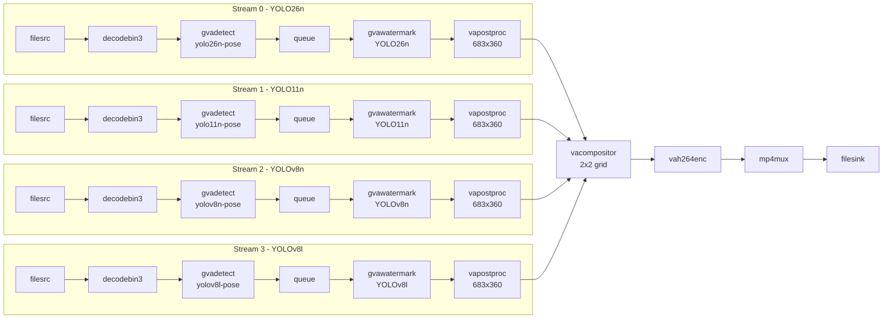

# Pose Estimation Compose

Multi-stream pose estimation pipeline that runs four different YOLO pose models
(YOLO26n, YOLO11n, YOLOv8n, YOLOv8l) in parallel, each processing the same input
video, and composites the annotated outputs into a single 2×2 mosaic video.

> Create a bash script that analyzes four video streams.
> For each stream run AI analytics to detect people and perform pose estimation and overlay annotations.
> - Read input video from a file (https://videos.pexels.com/video-files/8039289/8039289-hd_1366_720_25fps.mp4) for each stream
> - Use YOLO26n, Yolo11n, Yolov8n, Yolov8l models for pose estimation
> - Annotate each video stream with keypoints and instead of labels add custom, well visible text with the model name
> - Merge output from multiple streams and store combined output to an output file.
>
> Generate vision AI processing pipeline optimized for Intel Core Ultra 3 processors.
> Save source code in pose_estimation_compose directory, including README.md with setup instructions.
> Follow instructions in README.md to run the application and check if it generates the expected output.

This sample uses a video file from [Pexels](https://www.pexels.com/videos/).

## What It Does

1. **Decodes** the input video four times (one per stream)
2. **Detects** people and estimates pose keypoints using a different YOLO pose model per stream (`gvadetect`)
3. **Annotates** each stream with keypoints and a custom model-name label (`gvawatermark`)
4. **Scales** each stream to tile size via GPU (`vapostproc`)
5. **Composites** all four streams into a 2×2 grid (`vacompositor`)
6. **Encodes** the mosaic to H.264 and saves as MP4 (`vah264enc` → `mp4mux` → `filesink`)



The pipeline uses the following elements:

* **filesrc** — reads the input video from a local file
* **decodebin3** — decodes the video stream (hardware-accelerated when available)
* **gvadetect** — DL Streamer inference element running YOLO pose estimation models
* **gvawatermark** — overlays keypoints and custom model-name text on each stream
* **vapostproc** — GPU-accelerated scaling to tile resolution
* **vacompositor** — GPU-accelerated compositing of four streams into a 2×2 mosaic
* **vah264enc** — hardware H.264 encoding
* **mp4mux** — MP4 container muxing with fragmented output
* **filesink** — writes the final composited video to disk

## Prerequisites

- DL Streamer installed on the host, or a DL Streamer Docker image
- Intel Core Ultra 3 (or other Intel platform with integrated GPU)

### Install Python Dependencies (for model export only)

```bash
python3 -m venv .pose-export-venv
source .pose-export-venv/bin/activate
pip install -r export_requirements.txt
```

## Prepare Video and Models (One-Time Setup)

### Download Video

Download the sample video to a local directory:

```bash
mkdir -p videos
curl -L -o videos/pedestrians.mp4 \
    -H "Referer: https://www.pexels.com/" \
    -H "User-Agent: Mozilla/5.0 (X11; Linux x86_64) AppleWebKit/537.36" \
    "https://videos.pexels.com/video-files/8039289/8039289-hd_1366_720_25fps.mp4"
```

Alternatively, use any local video file and pass it as the first argument to the script.

### Export Models

The export script downloads the four YOLO pose models and converts them to OpenVINO IR format (INT8).
Converted models are saved under `models/`. This may take several minutes on first run.

```bash
source .pose-export-venv/bin/activate
python3 export_models.py
```

## Running the Sample

### Option 1: Run with Docker (recommended)

```bash
docker run --init --rm \
    -u "$(id -u):$(id -g)" \
    -v "$(pwd)":/app -w /app \
    --device /dev/dri \
    --group-add $(stat -c "%g" /dev/dri/render*) \
    intel/dlstreamer:latest \
    bash pose_estimation_compose.sh
```

### Option 2: Run on host (requires DL Streamer installed)

```bash
bash pose_estimation_compose.sh
```

### Custom input and device

```bash
bash pose_estimation_compose.sh /path/to/video.mp4 GPU results/output.mp4
```

## Command-Line Arguments

| Argument | Position | Default | Description |
|---|---|---|---|
| `INPUT` | 1 | `videos/pedestrians.mp4` | Path to input video file |
| `DEVICE` | 2 | `GPU` | Inference device (`CPU`, `GPU`) |
| `OUTPUT` | 3 | `results/pose_estimation_compose.mp4` | Path to output composited video |

## Output

Results are written to the `results/` directory:

- `pose_estimation_compose.mp4` — composited 2×2 mosaic video with pose keypoints from all four YOLO models, each labeled with its model name
