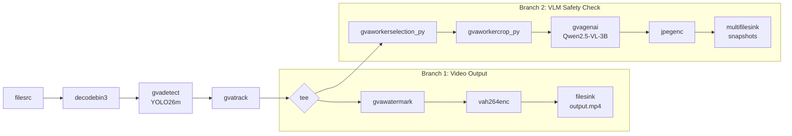

# Safety Compliance Monitor

Monitor safety compliance at a construction site using DL Streamer with YOLO detection, object tracking, and VLM-based safety verification.

> Create an application to monitor safety compliance at a construction site:
> - Process video input (file path or RTSP URI)
> - Detect workers (persons) using a YOLO model and track them across frames to maintain identity
> - Select frames where a new worker appears or where a tracked worker has not been checked for a predefined duration
> - For each selected worker, crop a tight region around their bounding box (with margin) and scale to a fixed resolution suitable for the VLM
> - Send the cropped single-worker image to a VLM model with a prompt to verify safety-rule compliance:
>   "There is a worker in the center of an image. Answer two questions:
>    Is the worker wearing a helmet? (WEARING / NOT_WEARING / UNCERTAIN)
>    Is the worker secured with a safety harness or line? (SECURED / NOT_SECURED / UNCERTAIN)
>    Reply with exactly one word for each question, separated by a slash. Nothing else."
> - Save an annotated cropped image for each VLM check, log VLM prompts and responses in a JSON file
> - Generate alerts only for clear violations (NOT_WEARING / NOT_SECURED); treat UNCERTAIN responses as compliant
>
> Validate the application using:
> - Input video: https://www.pexels.com/video/high-rise-workers-on-skyscraper-scaffold-28750724/
> - YOLO26m model for worker (person) detection
> - Qwen2.5-VL-3B-Instruct model for safety compliance verification
> - Run VLM checks on new worker detections or every 30 seconds for tracked workers
>
> Expected results for the test video:
> - 4 workers visible, all properly secured with safety harnesses
> - 3 workers wearing helmets, 1 worker without a helmet — alert generated

This sample uses a video file from [Pexels](https://www.pexels.com/video/high-rise-workers-on-skyscraper-scaffold-28750724/).

## What It Does

1. **Detects** workers (persons) in each video frame using a YOLO26m model (`gvadetect`)
2. **Tracks** detected workers across frames to maintain identity (`gvatrack`)
3. **Selects** frames for VLM check when a new worker appears or recheck interval elapses (`gvaworkerselection_py`)
4. **Crops** the selected worker region with margin and scales to VLM input resolution (`gvaworkercrop_py`)
5. **Verifies** safety compliance (helmet + harness) via VLM (`gvagenai` with Qwen2.5-VL-3B)
6. **Generates alerts** for clear violations (NOT_WEARING / NOT_SECURED)
7. **Saves** annotated output video, cropped worker snapshots, and JSON compliance log



## Prerequisites

- DL Streamer installed on the host, or a DL Streamer Docker image
- Intel Edge AI system with integrated GPU (or set device arguments to `CPU`)

### Install Python Dependencies

> **Note:** `export_requirements.txt` includes heavy ML frameworks (PyTorch,
> Ultralytics), needed only for one-time model conversion.
> `requirements.txt` contains only lightweight runtime dependencies.

```bash
python3 -m venv .safety-compliance-export-venv
source .safety-compliance-export-venv/bin/activate
pip install -r export_requirements.txt
```

## Prepare Video and Models (One-Time Setup)

### Download Video

Download the sample video:

```bash
mkdir -p videos
curl -L -o videos/construction_workers.mp4 \
    -H "Referer: https://www.pexels.com/" \
    -H "User-Agent: Mozilla/5.0 (X11; Linux x86_64) AppleWebKit/537.36" \
    "https://www.pexels.com/download/video/28750724/"
```

### Export Models

```bash
source .safety-compliance-export-venv/bin/activate
python3 export_models.py
```

## Running the Sample

```bash
python3 safety_compliance.py --input videos/construction_workers.mp4
```

### Advanced Usage

```bash
python3 safety_compliance.py \
    --input /path/to/video.mp4 \
    --detect-device GPU \
    --vlm-device GPU \
    --recheck-interval 30 \
    --threshold 0.5
```

## How It Works

### STEP 1 — Video Download and Model Export (one-time)

Download the input video and convert models to OpenVINO IR format (see above).

### STEP 2 — DL Streamer Pipeline Construction

The application constructs a two-branch GStreamer pipeline:
- **Branch 1** renders watermarked detections and encodes to MP4
- **Branch 2** selects workers for VLM safety checks, crops them, runs VLM inference, and saves annotated snapshots

### Custom Element: `gvaworkerselection_py`

Tracks detected persons via their tracking IDs. Selects a worker for VLM check when:
- A new (previously unseen) worker appears
- A tracked worker has not been checked for the configured recheck interval (default 30s)

Only one worker is selected per frame to avoid overwhelming the VLM.

### Custom Element: `gvaworkercrop_py`

Crops the selected worker's bounding box region with a 15% margin and scales it to 224×336 (portrait orientation for Qwen2.5-VL tile size). Preserves aspect ratio with letterboxing.

### VLM Safety Check

The cropped worker image is sent to Qwen2.5-VL-3B-Instruct with a structured prompt asking about helmet and harness status. Responses are parsed and alerts generated for clear violations only (NOT_WEARING / NOT_SECURED). UNCERTAIN responses are treated as compliant.

## Command-Line Arguments

| Argument | Default | Description |
|---|---|---|
| `--input` | `videos/construction_workers.mp4` | Path to input video file or rtsp:// URI |
| `--detect-device` | `GPU` | Device for YOLO detection inference |
| `--vlm-device` | `GPU` | Device for VLM inference |
| `--threshold` | `0.5` | Detection confidence threshold |
| `--recheck-interval` | `30` | Seconds between VLM rechecks for tracked workers |
| `--output-video` | `results/output.mp4` | Output video path |
| `--output-json` | `results/vlm_checks.json` | VLM checks JSON log path |

## Output

Results are written to the `results/` directory:

- `output.mp4` — annotated output video with watermarked worker detections and alert overlays
- `vlm_checks.json` — structured JSON with all VLM check results, alerts, and timestamps
- `safety_check_*.jpeg` — annotated cropped worker snapshots from each VLM check
