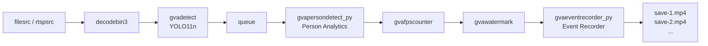

# Smart NVR — Event-Based Smart Video Recording

An intelligent video surveillance application that detects people in camera view
and automatically records video segments only when a person is present. Output
files are sequentially numbered (save-1.mp4, save-2.mp4, ...) for each
continuous person presence event.

> Develop a vision AI application that implements an event-based smart video recording pipeline:
> - Read input video from an RTSP camera, but allow also video file input
> (use https://www.pexels.com/video/a-man-wearing-a-face-mask-walks-into-a-building-9492063/ for testing)
> - Run an AI model to detect people in camera view
> - Trigger recording of a video stream to a local file when a person is detected and stop recording when person is out of view
> - Output a sequence of files: save-1, save-2, save-3, ... for each sequence when a person is visible
>
> Optimize the application for Intel Core Ultra 3 processors. Save source code in smart_nvr directory, generate README.md with setup instructions. Validate the application works as expected and generate performance numbers (fps).

This sample uses a video file from [Pexels](https://www.pexels.com/video/a-man-wearing-a-face-mask-walks-into-a-building-9492063/) by Casey Whalen.

## What It Does

1. **Reads** video from a local file or RTSP camera stream (`filesrc` / `rtspsrc`)
2. **Decodes** the video stream (`decodebin3`)
3. **Detects** people in each frame using a YOLO11n model (`gvadetect`)
4. **Analyzes** detection results to determine person presence (`gvapersondetect_py` — custom element)
5. **Records** video segments when a person is visible (`gvaeventrecorder_py` — custom element)
6. **Overlays** bounding boxes on the video (`gvawatermark`)
7. **Measures** pipeline throughput (`gvafpscounter`)



The pipeline uses the following elements:

* **filesrc** / **rtspsrc** — Read video from a local file or RTSP camera
* **decodebin3** — Decode video stream (uses hardware decode when available)
* **gvadetect** — DL Streamer inference element running YOLO11n person detection on GPU
* **gvapersondetect_py** — Custom Python element that analyzes detection metadata for person presence with configurable cooldown
* **gvafpscounter** — Measures and prints FPS throughput
* **gvawatermark** — Overlays detection bounding boxes on video frames
* **gvaeventrecorder_py** — Custom Python Bin element that records video segments to numbered files when person is detected

## Prerequisites

- DL Streamer installed on the host, or a DL Streamer Docker image
- Intel Core Ultra 3 processor (or other Intel platform with integrated GPU)

### Install Python Dependencies

> **Note:** `export_requirements.txt` includes heavy ML frameworks (PyTorch,
> Ultralytics), needed only for one-time model conversion.
> `requirements.txt` contains only lightweight runtime dependencies.

```bash
python3 -m venv .smart_nvr-export-venv
source .smart_nvr-export-venv/bin/activate
pip install -r export_requirements.txt
```

## Prepare Video and Models (One-Time Setup)

### Download Video

Download the sample video to a local directory:

```bash
mkdir -p videos
curl -L -o videos/person_walking.mp4 \
    -H "Referer: https://www.pexels.com/" \
    -H "User-Agent: Mozilla/5.0 (X11; Linux x86_64) AppleWebKit/537.36" \
    "https://videos.pexels.com/video-files/9492063/9492063-hd_1920_1080_30fps.mp4"
```

Alternatively, use any local video file and pass it via `--input`.

### Export Models

The export script downloads the YOLO11n model and converts it to OpenVINO IR format with INT8 quantization.
Converted models are saved under `models/`. This may take several minutes on first run.

```bash
source .smart_nvr-export-venv/bin/activate
python3 export_models.py
```

## Running the Sample

Once the video and models are prepared (see above), run the application:

### With Docker (recommended)

```bash
WEEKLY_TAG=$(cat /tmp/dlstreamer_weekly_tag.txt 2>/dev/null || echo "2026.1.0-weekly-ubuntu24")
docker run --init --rm \
    -u "$(id -u):$(id -g)" \
    -e PYTHONUNBUFFERED=1 \
    -v "$(pwd)":/app -w /app \
    --device /dev/dri \
    --group-add $(stat -c "%g" /dev/dri/render*) \
    intel/dlstreamer:${WEEKLY_TAG} \
    python3 smart_nvr.py --input videos/person_walking.mp4
```

### Native

```bash
python3 smart_nvr.py --input videos/person_walking.mp4
```

### With RTSP Camera

```bash
python3 smart_nvr.py --input rtsp://camera-ip:554/stream
```

## How It Works

### STEP 1 — Model Export (one-time)

The `export_models.py` script downloads YOLO11n from HuggingFace and exports it
to OpenVINO IR format with INT8 quantization for optimal performance on Intel GPUs.

### STEP 2 — Pipeline Construction

The application constructs a GStreamer pipeline combining DL Streamer inference
elements with custom Python components:

```python
pipeline = Gst.parse_launch(
    f"filesrc location={video} ! decodebin3 ! "
    f"gvadetect model={model} device=GPU batch-size=4 ! queue ! "
    f"gvapersondetect_py cooldown=15 ! gvafpscounter ! gvawatermark ! "
    f"gvaeventrecorder_py location=results/save")
```

### Custom Element: `gvapersondetect_py`

A `GstBase.BaseTransform` element that inspects analytics metadata on each frame:
- Checks for `person` label in `ODMtd` (object detection metadata)
- Maintains a cooldown counter to avoid rapid start/stop toggling
- Drops frames without person detections (after cooldown expires)

### Custom Element: `gvaeventrecorder_py`

A `Gst.Bin` element that manages an internal recording sub-pipeline:
- Creates `appsrc → videoconvert → vah264enc → h264parse → mp4mux → filesink`
- Starts a new sub-pipeline when person is detected (frame arrives)
- Stops and finalizes recording when frames stop arriving (person left view)
- Uses fragmented MP4 (`fragment-duration=1000`) for robust output

## Command-Line Arguments

| Argument | Default | Description |
|---|---|---|
| `--input` | `videos/person_walking.mp4` | Path to input video file or `rtsp://` URI |
| `--device` | `GPU` | Inference device (GPU, NPU, or CPU) |
| `--output` | `results/save` | Base path for output files (→ save-1.mp4, save-2.mp4, ...) |
| `--threshold` | `0.5` | Detection confidence threshold |
| `--cooldown` | `15` | Frames to keep recording after person leaves view |
| `--loop` | `1` | Number of times to loop input video (0 = infinite) |

## Output

Results are written to the `results/` directory:

- `save-1.mp4`, `save-2.mp4`, ... — Video segments recorded when a person was visible
- FPS throughput printed to stdout via `gvafpscounter`
