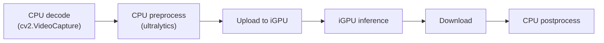
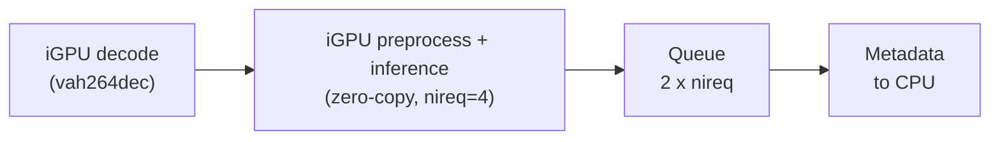
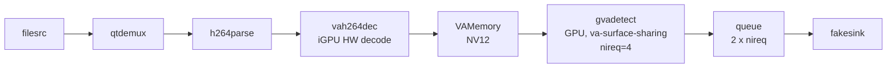

# DL Streamer E2E Performance

This benchmarking sample showcases **significantly higher throughput** on
Intel(R) Core(TM) Ultra 200/300 series processors through DL Streamer compared to the traditional deployment approach where OpenCV is used for preprocessing and OpenVINO for inference, as shown in the
[OpenVINO YOLO26 notebook](https://github.com/openvinotoolkit/openvino_notebooks/blob/latest/notebooks/yolov26-optimization/yolov26-object-detection.ipynb)
– same YOLO26s INT8 model, same video, same iGPU for inference.

The OpenCV + OpenVINO baseline mirrors the notebook code with the only
change being `device='intel:gpu'` to run inference on iGPU (the notebook
defaults to CPU). The DL Streamer pipeline runs decode, preprocessing, and
inference entirely on the iGPU with zero-copy pipelining.

## What DL Streamer does differently

### 1. Pipelining

DL Streamer runs pipeline stages in separate threads, so they overlap: while the
iGPU compute engine infers on frame N, the iGPU video engine is already decoding
frame N+1 and preprocessing is happening in parallel. In this sample, decode,
preprocessing, and inference all run on the iGPU; only the final detection
metadata is handed to the CPU.

By contrast, the OpenCV + OpenVINO path runs the stages sequentially: decode and
preprocessing on the CPU, then inference on the iGPU (`device='intel:gpu'`), then
postprocessing back on the CPU. Each frame finishes one stage before the next
begins, so the CPU and iGPU mostly take turns rather than working at the same
time.

### 2. Hardware video decoding on iGPU

DL Streamer decodes H.264 video on the iGPU fixed-function video engine and the
decoded frame stays in GPU memory, ready for inference on the same device.

### 3. Zero-copy inference on iGPU

DL Streamer preprocesses and infers directly on the GPU-resident frame, so the
data stays in GPU memory across stages. With four async inference requests
(`nireq=4`), the compute engine is kept continuously busy.

### Approach comparison

**OpenCV + OpenVINO** (notebook approach) – CPU decode, sync iGPU inference:

This path processes one frame at a time and crosses the CPU/iGPU boundary on
every frame. Stage by stage:

- **Decode** – `cv2.VideoCapture.read()` decodes the frame on the CPU into a new
  system-memory NumPy array (BGR).
- **Preprocess** – ultralytics letterboxes/resizes, converts BGR→RGB and
  HWC→CHW, and normalizes the frame. Each step produces new system-memory
  arrays, so the input tensor is a fresh host allocation per frame.
- **Upload** – before inference the OpenVINO GPU plugin copies that
  system-memory input tensor into iGPU memory (a host→device transfer for every
  frame).
- **Inference** – runs on the iGPU.
- **Download** – the output tensor is copied back from iGPU memory to a
  system-memory buffer (a device→host transfer for every frame).
- **Postprocess** – decoding boxes/NMS runs on the CPU over that downloaded
  result.

Because the stages run sequentially and synchronously, the iGPU is idle while
the CPU decodes/preprocesses/postprocesses, and the CPU waits while the iGPU
infers.



**DL Streamer** – iGPU decode, zero-copy, pipelined (nireq=4):

Every stage up to inference runs on the iGPU and the frame stays in GPU memory
the whole way through, so there are no per-frame copies between system and GPU
memory. `vah264dec` decodes on the iGPU video engine; preprocessing and
inference then run on the same GPU-resident surface (zero-copy). With four
in-flight inference requests (`nireq=4`), the GPU keeps working on the next
frames while earlier ones finish, and only the lightweight detection metadata
is handed back to the CPU at the end.



## Example run
```
$ python3 perf_comparison.py

Running OpenCV + OpenVINO pipeline (notebook approach, iGPU inference) ...

Running DL Streamer pipeline (iGPU decode, zero-copy, async nireq=4) ...

----------------------------------------------------------------
  DL Streamer advantage: higher throughput
----------------------------------------------------------------
```
The exact numbers depend on your hardware and setup, so run the sample to see
the throughput on your own machine. The takeaway running the full decode-to-inference pipeline through DL Streamer alone delivers higher throughput than the traditional two-tool flow (OpenCV for preprocessing, OpenVINO for inference).

The OpenCV + OpenVINO path uses the notebook's synchronous inference approach,
changed only to use iGPU (`device='intel:gpu'`). DL Streamer builds on top of
the same model and device by adding hardware video decode, zero-copy VA surface
sharing, async inference (nireq=4), and GStreamer pipelining.

### Detection output

Both pipelines save annotated frames with bounding boxes to `output/`. The
OpenCV + OpenVINO path draws the overlay with ultralytics `result.plot()`, while
the DL Streamer path uses the `gvawatermark` element.

**OpenCV + OpenVINO:**


**DL Streamer:**


## System requirements

- Linux (Ubuntu 22.04 / 24.04)
- Intel(R) Core(TM) Ultra series processor with integrated GPU
- DL Streamer 2026.0.0
  ([installation guide](https://docs.openedgeplatform.intel.com/dev/edge-ai-libraries/dlstreamer/get_started/install/install_guide_ubuntu.html))
- Python 3.10 or later

If any Python packages are missing:
```
pip install openvino opencv-python numpy ultralytics
```
`ultralytics` is only needed for the one-time model export on first run.

## File structure

| File | Description |
|---|---|
| `perf_comparison.py` | Main entry point, shared infrastructure, runs both pipelines |
| `opencv_openvino.py` | OpenCV + OpenVINO path (mirrors the notebook) |
| `dlstreamer.py` | DL Streamer path (iGPU, zero-copy, pipelined) |

## Usage

```
python3 perf_comparison.py
```

| Argument | Default | Description |
|---|---|---|
| `--video` | auto-download people.mp4 | path to H.264 input video |
| `--model` | auto-export YOLO26s INT8 | path to OpenVINO IR directory |
| `--measure-frames` | 200 | frames included in the benchmark after warmup |
| `--warmup` | 50 | warmup frames |
| `--runs` | 3 | repeated runs |

## DL Streamer pipeline


