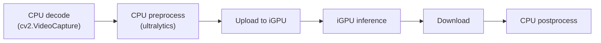
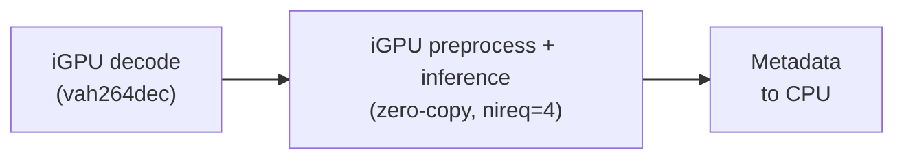
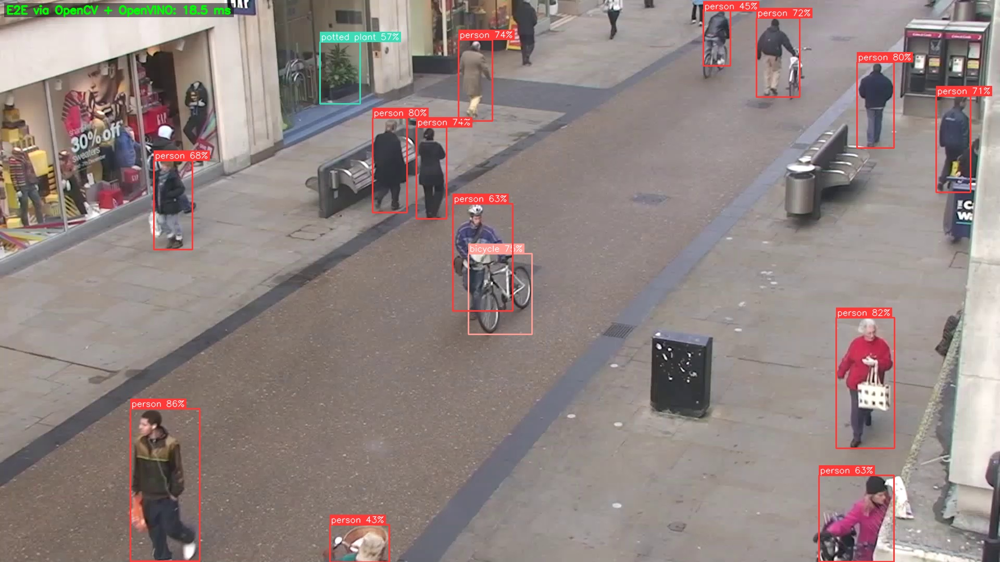
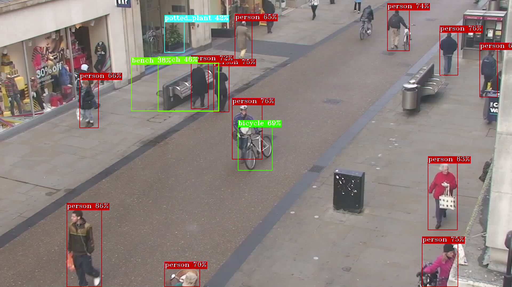
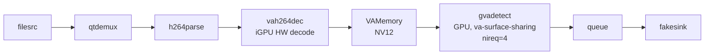

# DL Streamer E2E Performance

This benchmarking sample showcases **up to ~2.3x higher throughput** on
Intel(R) Core(TM) Ultra 200/300 series processors through DL Streamer compared to the
OpenCV + OpenVINO approach used in the
[OpenVINO YOLO26 notebook](https://github.com/openvinotoolkit/openvino_notebooks/blob/latest/notebooks/yolov26-optimization/yolov26-object-detection.ipynb)
– same YOLO26s INT8 model, same video, same iGPU for inference.

The OpenCV + OpenVINO baseline mirrors the notebook code with the only
change being `device='intel:gpu'` to run inference on iGPU (the notebook
defaults to CPU). The DL Streamer pipeline runs decode, preprocessing, and
inference entirely on the iGPU with zero-copy pipelining.

## What DL Streamer does differently

### 1. Pipelining

DL Streamer runs pipeline stages in separate threads. While the iGPU compute
engine infers on frame N, the video engine is already decoding frame N+1.
The OpenCV + OpenVINO approach processes each frame sequentially on CPU.

### 2. Hardware video decoding on iGPU

DL Streamer decodes H.264 video on the iGPU fixed-function video engine. The
decoded frame stays in GPU memory. The notebook approach uses OpenCV
`cv2.VideoCapture` which decodes on CPU.

### 3. Zero-copy inference on iGPU

DL Streamer preprocesses and infers directly on the GPU-resident frame. Data
never leaves GPU memory. With four async inference requests (`nireq=4`), the
compute engine is continuously busy. The notebook approach uploads a
system-memory tensor to the iGPU before each inference and downloads the
result after.

### 4. GPU-accelerated overlay

DL Streamer draws bounding boxes directly on GPU-resident frames via
`gvawatermark`, avoiding CPU-side rendering.

### Pipeline comparison

**OpenCV + OpenVINO** (notebook approach) – CPU decode, sync iGPU inference:



**DL Streamer** – iGPU decode, zero-copy, pipelined (nireq=4):



## Example run

```
$ python3 perf_comparison.py

OpenCV + OpenVINO (notebook approach, iGPU inference)
  run 1: 63.4 fps  15.8 ms/frame  (200 frames)
  run 2: 65.2 fps  15.3 ms/frame  (200 frames)
  run 3: 60.8 fps  16.4 ms/frame  (200 frames)

DLStreamer (iGPU decode, zero-copy, async nireq=4)
  run 1: 148.8 fps  6.7 ms/frame  (200 frames)
  run 2: 146.3 fps  6.8 ms/frame  (200 frames)
  run 3: 148.6 fps  6.7 ms/frame  (200 frames)

----------------------------------------------------------------
  OpenCV+OV (iGPU) :    63.2 fps   15.8 ms/frame
  DLStreamer (iGPU):   147.9 fps    6.8 ms/frame
----------------------------------------------------------------
  DLStreamer advantage: up to 134% higher throughput
----------------------------------------------------------------
```

The OpenCV + OpenVINO path uses the notebook's synchronous inference approach,
changed only to use iGPU (`device='intel:gpu'`). DL Streamer adds hardware
video decode, zero-copy VA surface sharing, async inference (nireq=4), and
GStreamer pipelining on top.

For detailed per-element pipeline latency, DL Streamer provides a built-in
[latency tracer](https://docs.openedgeplatform.intel.com/dev/edge-ai-libraries/dlstreamer/dev_guide/latency_tracer.html).

*Intel(R) Core(TM) Ultra 9 285H, iGPU Arc Graphics, Ubuntu 24.04,
kernel 6.17, OpenVINO 2026.1, Intel DL Streamer latest.*

### Detection output

Both pipelines save annotated frames with bounding boxes to `output/`:

**OpenCV + OpenVINO:**



**DL Streamer:**



## System requirements

- Linux (Ubuntu 22.04 / 24.04)
- Intel(R) Core(TM) Ultra series processor with integrated GPU
- DL Streamer latest
  ([installation guide](https://dlstreamer.github.io/get_started/install/install_guide_ubuntu.html))
- Python 3.10 or later

If any Python packages are missing:
```
pip install openvino opencv-python numpy ultralytics
```
`ultralytics` is only needed for the one-time model export on first run.

## File structure

| File | Description |
|---|---|
| `perf_comparison.py` | Main entry point, shared infrastructure, runs both pipelines |
| `opencv_openvino.py` | OpenCV + OpenVINO path (mirrors the notebook) |
| `dlstreamer.py` | DL Streamer path (iGPU, zero-copy, pipelined) |

## Usage

```
python3 perf_comparison.py
```

| Argument | Default | Description |
|---|---|---|
| `--video` | auto-download people.mp4 | path to H.264 input video |
| `--model` | auto-export YOLO26s INT8 | path to OpenVINO IR directory |
| `--frames` | 200 | measured frames per run |
| `--warmup` | 50 | warmup frames |
| `--runs` | 3 | repeated runs |

## DL Streamer pipeline


