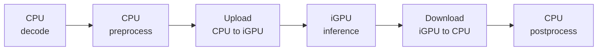
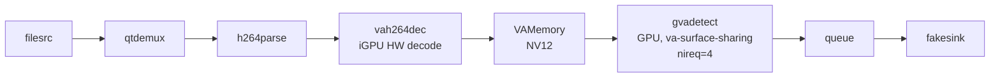

# DL Streamer E2E Performance

This benchmarking sample showcases **up to ~2x higher throughput** on Intel
Arrow Lake / Panther Lake (ARL/PTL) integrated GPU (iGPU) through DL Streamer
compared to an OpenCV + OpenVINO approach – same YOLO26s INT8 model, same
video, same setup for inference.

This sample references the
[OpenVINO YOLO26 notebook](https://github.com/openvinotoolkit/openvino_notebooks/blob/latest/notebooks/yolov26-optimization/yolov26-object-detection.ipynb)
inference approach as the baseline, adding GPU inference step for fair
comparison. Both pipelines run inference on the iGPU. The difference is how
video is decoded, how frames reach the GPU, and how the pipeline is scheduled.

## What DL Streamer does differently

### 1. Pipelining

DL Streamer runs pipeline stages in separate threads. While the iGPU compute
engine infers on frame N, the video engine is already decoding frame N+1.
The OpenCV + OpenVINO approach processes each frame sequentially.

### 2. Hardware video decoding on iGPU

DL Streamer decodes H.264 video on the iGPU fixed-function video engine. The
decoded frame stays in GPU memory. OpenCV `cv2.VideoCapture` decodes on the
CPU, producing a system-memory numpy array that must be uploaded to the iGPU.

### 3. Zero-copy inference

DL Streamer preprocesses (resize, normalize, color-convert) and infers
directly on the decoded GPU-resident frame. The data never leaves GPU memory.
With four async inference requests (`nireq=4`), the compute engine is
continuously busy.

The OpenCV + OpenVINO pipeline uploads a system-memory tensor to the iGPU
before every inference and downloads the result after.

### 4. GPU-accelerated overlay

DL Streamer draws bounding boxes directly on GPU-resident frames, avoiding
CPU-side rendering.

### Pipeline comparison

**OpenCV + OpenVINO** – sequential, one frame at a time:



**DL Streamer** – pipelined, multiple frames in flight:


## Example run

```
$ python3 perf_comparison.py

OpenCV + OpenVINO pipeline (iGPU inference)
  run 1: 76.6 fps  e2e=13.1 ms  (200 frames)
  run 2: 78.7 fps  e2e=12.7 ms  (200 frames)
  run 3: 77.0 fps  e2e=13.0 ms  (200 frames)

DLStreamer pipeline (iGPU decode, zero-copy, async inference)
  run 1: 148.4 fps  e2e=6.7 ms  (207 frames)
  run 2: 147.4 fps  e2e=6.8 ms  (207 frames)
  run 3: 146.9 fps  e2e=6.8 ms  (206 frames)

----------------------------------------------------------------
  OpenCV+OV  :    77.4 fps   e2e = 12.9 ms
  DLStreamer :   147.6 fps   e2e = 6.8 ms
----------------------------------------------------------------
  DLStreamer advantage on ARL/PTL:
  Up to 91% higher throughput, 48% lower e2e latency

  Detection output: output/
----------------------------------------------------------------
```

E2E time is measured as the wall-clock interval between consecutive frames
at the pipeline output. For the OpenCV + OpenVINO pipeline, this includes
CPU decode + preprocess + GPU inference + postprocess, executed sequentially.
For DL Streamer, these stages overlap due to pipelining, so the e2e time per
frame is lower than the inference-only time of the OpenCV + OpenVINO pipeline.

*Intel Core Ultra 9 285H (Arrow Lake-P), iGPU Arc Graphics, Ubuntu 24.04,
kernel 6.17, OpenVINO 2026.1, Intel DL Streamer latest.*

### Detection output

Both pipelines save annotated frames with bounding boxes to `output/`:

**OpenCV + OpenVINO:**


**DL Streamer:**


## System requirements

- Linux (Ubuntu 22.04 / 24.04)
- Intel platform with integrated GPU (Arrow Lake, Panther Lake, Meteor Lake)
- DL Streamer latest
  ([installation guide](https://dlstreamer.github.io/get_started/install/install_guide_ubuntu.html))
- Python 3.10 or newer

If any Python packages are missing:
```
pip install openvino opencv-python numpy ultralytics
```
`ultralytics` is only needed for the one-time model export on first run.

## File structure

| File | Description |
|---|---|
| `perf_comparison.py` | Main entry point, runs both pipelines and prints comparison |
| `opencv_openvino.py` | OpenCV + OpenVINO execution path (comparable to the notebook) |
| `dlstreamer.py` | DL Streamer execution path |
| `common.py` | Shared infrastructure: model/video prep, YOLO pre/postprocessing, visualization |

## Usage

```
python3 perf_comparison.py
```

| Argument | Default | Description |
|---|---|---|
| `--video` | auto-download people.mp4 | path to H.264 input video |
| `--model` | auto-export YOLO26s INT8 | path to OpenVINO IR (.xml) |
| `--frames` | 200 | measured frames per run |
| `--warmup` | 50 | warmup frames |
| `--runs` | 3 | repeated runs |

## DL Streamer pipeline


