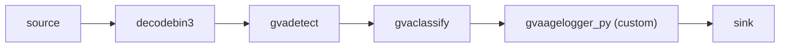
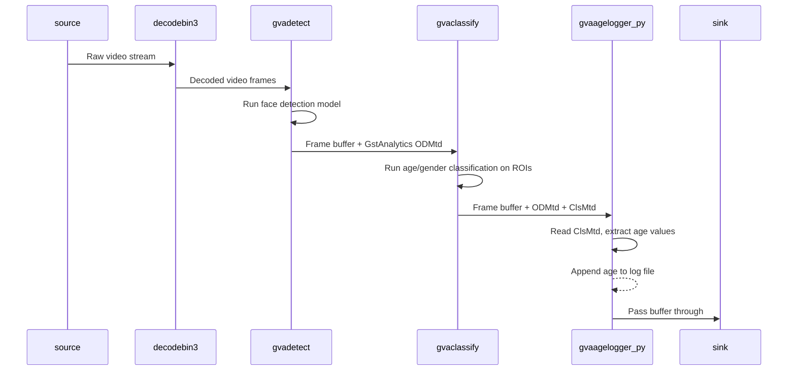

# Python Element Sample - Face Detection and Classification

This sample demonstrates how to replace `gvapython`-based post-processing with standard DLStreamer elements (`gvadetect`, `gvaclassify`) and a custom GStreamer Python element (`gvaagelogger_py`) for age logging.

> **NOTE**: This sample is a converted version of the original [gvapython face_detection_and_classification](../../gvapython/face_detection_and_classification/README.md) sample. The `gvapython` elements have been replaced with standard DLStreamer elements and a standalone GStreamer Python element.

See [smart_nvr](../../../python/smart_nvr/) sample as reference for custom Python element pattern.

## How It Works

The original `gvapython` sample used three `gvapython` elements with custom Python callbacks to:
1. Parse SSD detection output into bounding boxes
2. Parse age/gender classification output into labels
3. Log detected ages to a file

The converted sample replaces these with standard DLStreamer elements and one custom Python element:



* **gvadetect** — replaces `gvainference` + `gvapython(ssd_object_detection.py)`. Handles face detection model post-processing (SSD output parsing) internally.
* **gvaclassify** — replaces `gvainference` + `gvapython(age_gender_classification.py)`. Handles age/gender model post-processing using model-proc file. Produces GstAnalytics classification metadata (ClsMtd).
* **gvaagelogger_py** — replaces `gvapython(age_logger.py)`. Custom Python element that reads GstAnalytics ClsMtd metadata and logs age values to a file.

Data flow between pipeline elements:



Configurable element properties (via gst-launch-1.0):
* `log-file-path` - Path to the age log file (default: "/tmp/age_log.txt")

### Key Differences from gvapython Approach

| gvapython (old) | Python element (new) |
|---|---|
| `gvainference` + `gvapython` for SSD post-proc | `gvadetect` (built-in post-processing) |
| `gvainference` + `gvapython` for age/gender post-proc | `gvaclassify` with model-proc |
| `gvapython class=AgeLogger function=log_age` | `gvaagelogger_py` custom element |
| Uses `gstgva.VideoFrame` / `Tensor` API | Uses `GstAnalytics` metadata API |
| 3 separate `gvapython` elements | 1 custom Python element |
| Requires PYTHONPATH to gstgva | Self-contained plugin |

## Models

The sample uses by default the following pre-trained models from OpenVINO™ Toolkit [Open Model Zoo](https://github.com/openvinotoolkit/open_model_zoo):
*   __face-detection-adas-0001__ is primary detection network for finding faces
*   __age-gender-recognition-retail-0013__ age and gender estimation on detected faces

> **NOTE**: Before running samples (including this one), run script `download_omz_models.sh` once (the script located in `samples` top folder) to download all models required for this and other samples.

## Prerequisites

The GStreamer Python plugin (`libgstpython.so`) must be available in `GST_PLUGIN_PATH`. The sample shell script automatically adds the local `plugins/` directory to `GST_PLUGIN_PATH`.

## Running

Before running, ensure the DL Streamer environment is properly configured and that the required models have been downloaded (see [Models](#models)).

```sh
./face_detection_and_classification.sh [INPUT_VIDEO] [DEVICE] [SINK_ELEMENT]
```

The sample takes three command-line *optional* parameters:
1. [INPUT_VIDEO] to specify input video file.
   The input could be
   * local video file
   * web camera device (ex. `/dev/video0`)
   * RTSP camera (URL starting with `rtsp://`) or other streaming source (ex URL starting with `http://`)

   If parameter is not specified, the sample by default streams video example from HTTPS link (utilizing `urisourcebin` element) so requires internet connection.

2. [DEVICE] to specify device for detection and classification. Default CPU.
   Please refer to OpenVINO™ toolkit documentation for supported devices.
   https://docs.openvinotoolkit.org/latest/openvino_docs_IE_DG_supported_plugins_Supported_Devices.html

3. [SINK_ELEMENT] to choose output mode:
   * display - render (default)
   * fps - FPS only
   * json - write metadata to output.json
   * display-and-json - render and write metadata
   * file - render to file

Age values are logged to `/tmp/age_log.txt` (configurable via `log-file-path` property on `gvaagelogger_py`).

Examples:
```sh
# Default: stream from HTTPS, CPU detection, display mode
./face_detection_and_classification.sh

# Local video file, CPU, FPS mode
./face_detection_and_classification.sh /path/to/video.mp4 CPU fps

# Web camera, GPU, display mode
./face_detection_and_classification.sh /dev/video0 GPU display

# RTSP camera, CPU, JSON output
./face_detection_and_classification.sh rtsp://192.168.1.100:554/stream CPU json
```

## Sample Output

The sample:
* Prints gst-launch-1.0 full command line into console
* Starts the command and either visualizes video with bounding boxes and age/gender labels or prints FPS
* Logs detected ages to `/tmp/age_log.txt`

## See also
* [Samples overview](../../../README.md)
* [Smart NVR sample (reference for custom Python elements)](../../../python/smart_nvr/README.md)
