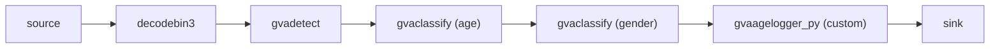
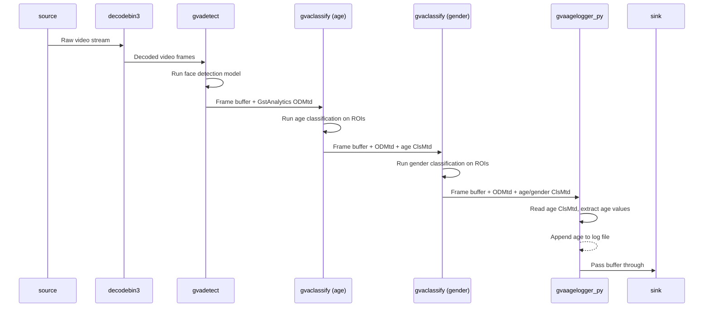

# Python Element Sample - Face Detection and Classification

This sample demonstrates how to replace `gvapython`-based post-processing with standard DLStreamer elements (`gvadetect`, `gvaclassify`) and a custom GStreamer Python element (`gvaagelogger_py`) for age logging. Faces are detected, then classified for **age** and **gender** in two chained `gvaclassify` stages.


See [smart_nvr](../../../python/smart_nvr/) sample as reference for custom Python element pattern.

## Overview

This document describes:
* the pipeline architecture and data flow ([How It Works](#how-it-works))
* the models used and where they are stored ([Models](#models))
* environment requirements ([Prerequisites](#prerequisites))
* how to run the sample and available options ([Running](#running))
* what to expect on the console and on disk ([Sample Output](#sample-output))

## How It Works

The pipeline detects faces and runs two chained classification stages on the detected ROIs — first for age, then for gender — and finally logs detected age labels to a file using a custom Python element:



* **gvadetect** — replaces `gvainference` + `gvapython(ssd_object_detection.py)`. Handles face detection model post-processing internally.
* **gvaclassify (age)** — runs the age model on detected ROIs and produces GstAnalytics classification metadata (ClsMtd) with age-group labels (e.g. `20-29`, `30-39`).
* **gvaclassify (gender)** — runs the gender model on the same ROIs and adds another ClsMtd entry with `Female` / `Male` labels.
* **gvaagelogger_py** — replaces `gvapython(age_logger.py)`. Custom Python element that reads age ClsMtd metadata and logs age values to a file.

Data flow between pipeline elements:



Configurable element properties (via gst-launch-1.0):
* `log-file-path` - Path to the age log file (default: "/tmp/age_log.txt")


## Models

The sample uses pre-trained models downloaded from [Hugging Face](https://huggingface.co/) and exported to OpenVINO™ IR format on first run:
* __[arnabdhar/YOLOv8-Face-Detection](https://huggingface.co/arnabdhar/YOLOv8-Face-Detection)__ — face detection (used by `gvadetect`)
* __[dima806/fairface_age_image_detection](https://huggingface.co/dima806/fairface_age_image_detection)__ — age estimation (used by the first `gvaclassify`, reshaped to static `[1,3,224,224]`)
* __[dima806/fairface_gender_image_detection](https://huggingface.co/dima806/fairface_gender_image_detection)__ — gender classification (used by the second `gvaclassify`, reshaped to static `[1,3,224,224]`)

Download and conversion are handled automatically by [`prepare_models.py`](prepare_models.py), which is invoked from the sample shell script. Models are cached after the first run, so subsequent runs reuse the existing files.

### Model storage location

* If the `MODELS_PATH` environment variable is set, models are stored in `$MODELS_PATH/face_detection_and_classification/`.
* Otherwise models are stored in a `models/` subdirectory inside the sample folder (next to `prepare_models.py`).


## Prerequisites

The GStreamer Python plugin (`libgstpython.so`) must be available in `GST_PLUGIN_PATH`. The sample shell script automatically adds the local `plugins/` directory to `GST_PLUGIN_PATH`.

Install Python dependencies required by [`prepare_models.py`](prepare_models.py):

```sh
python3 -m pip install --upgrade pip
python3 -m pip install -r requirements.txt
```

## Running

Before running, ensure the DL Streamer environment is properly configured. Models are downloaded automatically on first run (see [Models](#models)).

```sh
./face_detection_and_classification.sh [INPUT_VIDEO] [DEVICE] [SINK_ELEMENT]
```

The sample takes three command-line *optional* parameters:
1. [INPUT_VIDEO] to specify input video file.
   The input could be
   * local video file
   * web camera device (ex. `/dev/video0`)
   * RTSP camera (URL starting with `rtsp://`) or other streaming source (ex URL starting with `http://`)

   If parameter is not specified, the sample by default streams video example from HTTPS link (utilizing `urisourcebin` element) so requires internet connection.

2. [DEVICE] to specify device for detection and classification (used for both age and gender models). Default CPU.
   Please refer to OpenVINO™ toolkit documentation for supported devices.
   https://docs.openvinotoolkit.org/latest/openvino_docs_IE_DG_supported_plugins_Supported_Devices.html

3. [SINK_ELEMENT] to choose output mode:
   * display - render (default)
   * fps - FPS only
   * json - write metadata to output.json
   * display-and-json - render and write metadata
   * file - render to file

Age values are logged to `/tmp/age_log.txt` (configurable via `log-file-path` property on `gvaagelogger_py`).

Examples:
```sh
# Default: stream from HTTPS, CPU detection, display mode
./face_detection_and_classification.sh

# Same source explicitly specified, CPU, FPS-only mode (no display required)
./face_detection_and_classification.sh \
    https://github.com/intel-iot-devkit/sample-videos/raw/master/head-pose-face-detection-female-and-male.mp4 \
    CPU fps

# Same source, CPU, write metadata to output.json
./face_detection_and_classification.sh \
    https://github.com/intel-iot-devkit/sample-videos/raw/master/head-pose-face-detection-female-and-male.mp4 \
    CPU json

# Local video file (replace with an existing path on your machine), CPU, file output
./face_detection_and_classification.sh <MP4_FILE_PATH> CPU file


# Web camera (requires a connected /dev/videoN device and a display)
./face_detection_and_classification.sh /dev/video0 GPU display

# RTSP camera (replace the URL with your actual stream)
./face_detection_and_classification.sh rtsp://<camera-host>:554/<stream-path> CPU json
```

## Sample Output

The sample:
* Prints gst-launch-1.0 full command line into console
* Starts the command and either visualizes video with bounding boxes and age + gender labels or prints FPS
* Logs detected ages to `/tmp/age_log.txt`

## See also
* [Samples overview](../../../README.md)

