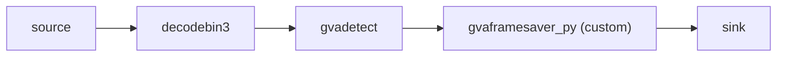
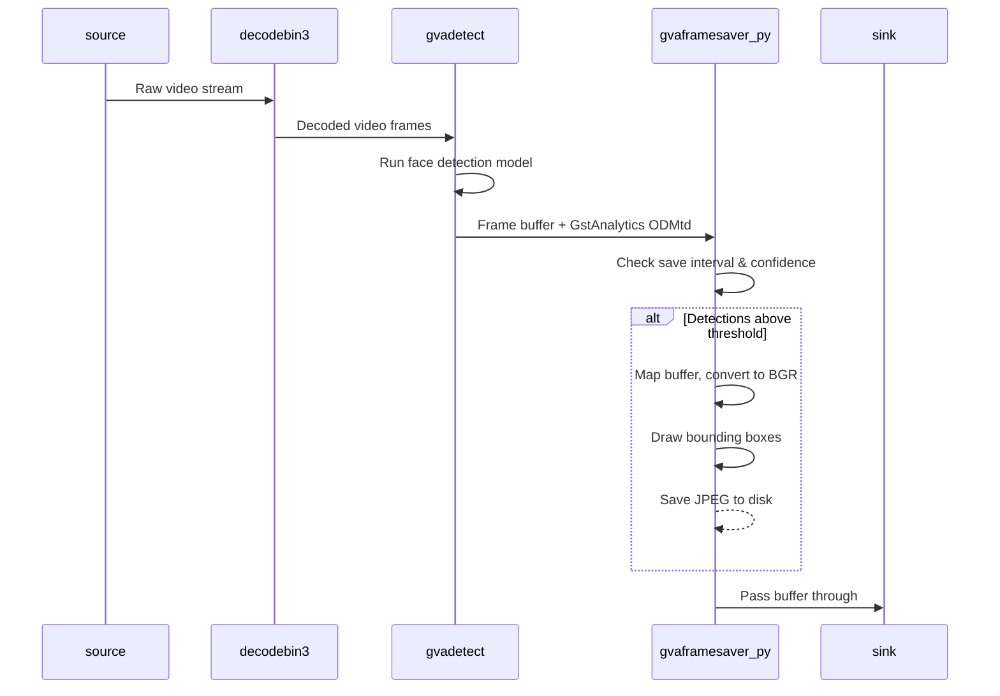

# Python Element Sample - Save Frames with ROI Only

This sample demonstrates a custom GStreamer Python element (`gvaframesaver_py`) that saves video frames containing detected objects. It replaces the previous `gvapython`-based approach with a proper GStreamer element using GstAnalytics metadata API.

See [smart_nvr](../../../python/smart_nvr/) sample as reference for custom Python element pattern.

## Overview

This document describes:
* the pipeline architecture and data flow ([How It Works](#how-it-works))
* the models used and where they are stored ([Models](#models))
* environment requirements ([Prerequisites](#prerequisites))
* how to run the sample and available options ([Running](#running))
* what to expect on the console and on disk ([Sample Output](#sample-output))

## How It Works

The pipeline uses `gvadetect` for object detection and `gvaframesaver_py` custom Python element for saving frames:



The custom `gvaframesaver_py` element (`plugins/python/gvaFrameSaver.py`):
* Reads GstAnalytics detection metadata (ODMtd) from each buffer
* Saves frames to disk when objects are detected above confidence threshold
* Draws bounding boxes and labels on saved images
* Rate-limits saves to avoid excessive disk I/O
* Works with multiple video formats (NV12, I420, BGR, BGRA, BGRX)

Data flow between pipeline elements:



Configurable element properties (via gst-launch-1.0):
* `output-dir` - Directory for saved frames (default: "saved_frames")
* `save-interval` - Minimum seconds between saves (default: 2.0)
* `min-confidence` - Minimum detection confidence threshold (default: 0.5)

## Models

The sample uses a pre-trained face detection model downloaded from [Hugging Face](https://huggingface.co/) and exported to OpenVINO™ IR format on first run:
* __[arnabdhar/YOLOv8-Face-Detection](https://huggingface.co/arnabdhar/YOLOv8-Face-Detection)__ — face detection (used by `gvadetect`)

Download and conversion are handled automatically by [`prepare_models.py`](prepare_models.py), which is invoked from the sample shell script. The model is cached after the first run, so subsequent runs reuse the existing files.

### Model storage location

* If the `MODELS_PATH` environment variable is set, the model is stored in `$MODELS_PATH/save_frames_with_ROI_only/`.
* Otherwise the model is stored in a `models/` subdirectory inside the sample folder (next to `prepare_models.py`).


## Prerequisites

The GStreamer Python plugin (`libgstpython.so`) must be available in `GST_PLUGIN_PATH`. The sample shell script automatically adds the local `plugins/` directory to `GST_PLUGIN_PATH`.

If Python requirements are not installed yet:

```sh
python3 -m pip install --upgrade pip
python3 -m pip install opencv-python-headless numpy
```

## Running

Before running, ensure the DL Streamer environment is properly configured. The model is downloaded automatically on first run (see [Models](#models)).

```sh
./save_frames_with_roi.sh [INPUT_VIDEO] [DEVICE] [SINK_ELEMENT]
```

The sample takes three command-line *optional* parameters:
1. [INPUT_VIDEO] to specify input video file.
   The input could be
   * local video file
   * web camera device (ex. `/dev/video0`)
   * RTSP camera (URL starting with `rtsp://`) or other streaming source (ex URL starting with `http://`)

   If parameter is not specified, the sample by default streams video example from HTTPS link (utilizing `urisourcebin` element) so requires internet connection.

2. [DEVICE] to specify device for detection. Default GPU.
   Please refer to OpenVINO™ toolkit documentation for supported devices.
   https://docs.openvinotoolkit.org/latest/openvino_docs_IE_DG_supported_plugins_Supported_Devices.html

3. [SINK_ELEMENT] to choose between render mode and fps throughput mode:
   * fps - FPS only (default)
   * display - render

Custom element properties can be set by modifying the pipeline in the shell script, e.g.:
```sh
gvaframesaver_py output-dir=/tmp/detections save-interval=1.0 min-confidence=0.7
```

Examples:
```sh
# Default: stream from HTTPS, GPU detection, FPS mode
./save_frames_with_roi.sh

# Local video file, CPU detection, FPS mode
./save_frames_with_roi.sh /path/to/video.mp4 CPU fps

# Web camera, GPU detection, display mode
./save_frames_with_roi.sh /dev/video0 GPU display

# RTSP camera, CPU detection, display mode
./save_frames_with_roi.sh rtsp://192.168.1.100:554/stream CPU display
```

## Sample Output

The sample:
* Prints gst-launch-1.0 full command line into console
* Starts the command and visualizes video with bounding boxes around detected faces or prints out fps
* Saves frames with detections to the `saved_frames` directory (created automatically)
* Prints status message for each saved frame

Example output in console:
```
Saved: saved_frames/frame_00000.jpg
Saved: saved_frames/frame_00001.jpg
Saved: saved_frames/frame_00002.jpg
```

## See also
* [Samples overview](../../../README.md)

