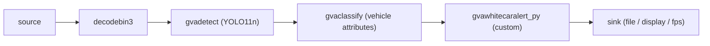
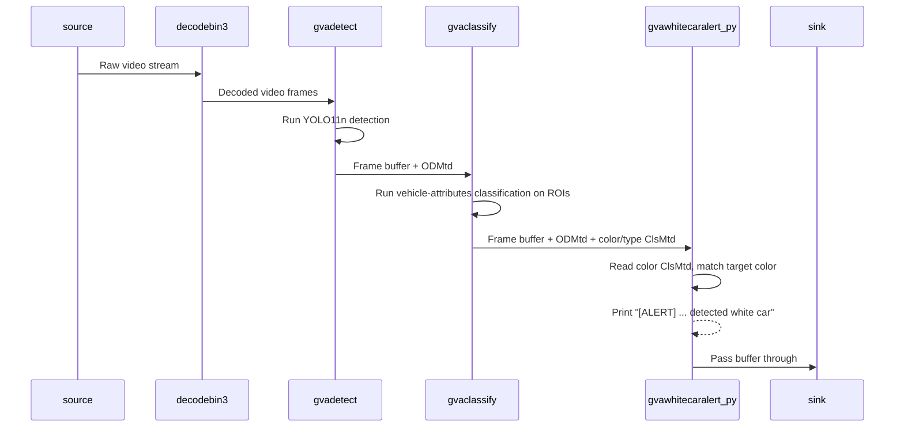

# Python Element Sample - White Car Alert

This sample demonstrates how to add a custom GStreamer Python element
(`gvawhitecaralert_py`) to a DL Streamer pipeline that **prints a terminal
notification whenever a car of a given color (default: white) is detected**.

Objects are detected with `gvadetect` (YOLO11n), their attributes (color and
type) are recognized with `gvaclassify`
(`vehicle-attributes-recognition-barrier-0039`), and the custom Python element
reads the resulting classification metadata to emit alerts.

## Overview

This document describes:
* the pipeline architecture and data flow ([How It Works](#how-it-works))
* the models used ([Models](#models))
* environment requirements ([Prerequisites](#prerequisites))
* how to run the sample and available options ([Running](#running))
* what to expect on the console ([Sample Output](#sample-output))

## How It Works



* **gvadetect** — detects objects (vehicles, persons, …) and produces
  GstAnalytics detection metadata (`ODMtd`). On GPU it uses
  `pre-process-backend=va-surface-sharing` for zero-copy pre-processing.
* **gvaclassify** — runs `vehicle-attributes-recognition-barrier-0039` on the
  detected ROIs and produces two classification metadata (`ClsMtd`) entries per
  vehicle:
  * **color** — one of `white`, `gray`, `yellow`, `red`, `green`, `blue`, `black`
  * **type** — one of `car`, `van`, `truck`, `bus`
* **gvawhitecaralert_py** — custom Python element. It reads the color `ClsMtd`,
  and when the top color label matches the configured `color` property above the
  confidence threshold, it prints an alert line to the terminal. Metadata passes
  through unchanged, so downstream elements (`gvawatermark`, encoder, …) still
  work.

Data flow between pipeline elements:



Configurable element properties (via `gst-launch-1.0`):
* `color` — vehicle color to alert on (default: `white`). One of the model's
  color labels.
* `min-confidence` — minimum color-classification confidence to trigger an alert
  (default: `0.5`).
* `alert-interval` — minimum stream-time seconds between consecutive alerts, to
  avoid flooding the terminal (default: `1.0`; set `0` to alert on every frame).

## Models

The sample uses the standard DL Streamer models:
* __yolo11n__ — object detection (used by `gvadetect`), stored at
  `$MODELS_PATH/public/yolo11n/FP16/yolo11n.xml`.
* __vehicle-attributes-recognition-barrier-0039__ — vehicle color/type
  classification (used by `gvaclassify`), stored at
  `$MODELS_PATH/intel/vehicle-attributes-recognition-barrier-0039/FP16/...`.

Download them with the helper scripts if not present:

```sh
${DLSTREAMER_DIR}/samples/download_public_models.sh yolo11n
${DLSTREAMER_DIR}/samples/download_omz_models.sh
```

## Prerequisites

The GStreamer Python plugin (`libgstpython.so`) must be available in
`GST_PLUGIN_PATH`. The sample shell script automatically adds the local
`plugins/` directory to `GST_PLUGIN_PATH`.

Ensure the DL Streamer environment is configured (the `MODELS_PATH` and,
optionally, `RESULTS_DIR` environment variables). The default input video is
downloaded over HTTPS, so an internet connection is required unless a local
input path is provided.

Install Python dependencies:

```sh
python3 -m pip install --upgrade pip
python3 -m pip install -r requirements.txt
```

## Running

```sh
./white_car_alert.sh [INPUT_VIDEO] [DEVICE] [OUTPUT] [COLOR]
```

The sample takes four *optional* parameters:
1. **[INPUT_VIDEO]** — input video source. Can be a local file, a web camera
   device (e.g. `/dev/video0`), or a streaming URL (`rtsp://`, `http://`, …).
   Default: a public sample video downloaded over HTTPS via `urisourcebin`
   (`https://github.com/intel-iot-devkit/sample-videos/raw/master/car-detection.mp4`),
   so an internet connection is required unless a local path is provided.
2. **[DEVICE]** — device for detection and classification (e.g. `CPU`, `GPU`,
   `GPU.0`). Default: `GPU`.
3. **[OUTPUT]** — output mode:
   * `file` — encode annotated video to
     `$RESULTS_DIR/white_car_alert_<input>_<device>.mp4` (default)
   * `display` — render to screen
   * `fps` — print FPS only
4. **[COLOR]** — vehicle color to alert on (default: `white`).

Example (run on GPU, encode annotated video to a file, alert on white cars):

```sh
./white_car_alert.sh "" GPU file white
```

## Sample Output

While the pipeline runs, the terminal shows an alert line each time a car of the
requested color is detected (throttled to at most once per `alert-interval`
seconds of stream time):

```
[ALERT] t=  2.10s: detected white car (color confidence: 0.91)
[ALERT] t=  3.20s: detected white car (count: 2) (color confidence: 0.88)
```

In `file` mode the annotated video (bounding boxes + labels via `gvawatermark`)
is written to `$RESULTS_DIR`. In `fps` mode only the frame rate is reported.
