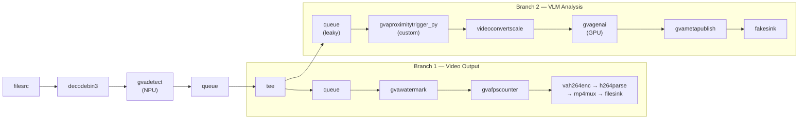

# CV-Triggered VLM — Proximity-Based Vision Language Model Inference

A command-line pipeline that runs object detection on video and triggers a Vision Language Model (VLM)
query only when two object classes are detected in close proximity for a sustained period.
This enables efficient VLM usage by processing only relevant frames rather than every frame.

> Create a command-line sample application that implements the following pipeline:
> 
> read video file -> object detection (NPU) -> split -> overlay -> encode to local video file
>                                                 \-> proximity trigger -> VLM -> text file (JSON) + JPEG snapshot per analyzed frame
> 
> The pipeline should be launched using the gst-launch-1.0 command.
> 
> The proximity trigger is a custom Python GStreamer element with the following logic:
> - Properties: classA (string), classB (string), distance between object centers (in pixels), number of frames
> - The element checks whether objects of classA and classB are both present in a frame with a center-to-center distance <= the distance threshold
> - The proximity condition must hold for the specified number of consecutive frames before triggering
> - When triggered, the element passes one frame to the VLM; otherwise all frames are dropped
> - Frames should also be dropped if the VLM cannot accept a new frame (i.e. the downstream queue is full)
> 
> Create a generic pipeline where a user can configure different models and input videos.
> 
> Use the following settings for validation:
> a) input video: https://www.pexels.com/video/aerial-view-of-pedestrians-at-crosswalk-in-city-37247586/
>    direct download: https://www.pexels.com/download/video/37247586
> b) object detection model: yolov11s
> c) proximity element config: classA="person", classB="bicycle", distance=150, frames=10
> d) VLM model: InternVL3_5-2B
> e) VLM prompt: "Are people riding on bicycles? Answer yes or no."

The pipeline uses YOLOv11s for object detection on NPU and InternVL3_5-2B as the VLM on GPU.
The custom `gvaproximitytrigger_py` element monitors detection metadata and fires when
person–bicycle proximity is sustained, sending one frame to the VLM for classification.
A leaky queue before the VLM branch ensures frames are dropped when the VLM is busy.

This sample uses a video from [Pexels](https://www.pexels.com/video/aerial-view-of-pedestrians-at-crosswalk-in-city-37247586/).

## What It Does

1. **Reads** video from a local file or URI
2. **Detects** objects using YOLOv11s on NPU via `gvadetect`
3. **Splits** the stream into two branches with `tee`
4. **Branch 1:** Overlays detections with `gvawatermark`, encodes to H.264, and saves annotated video
5. **Branch 2:** Filters frames with `gvaproximitytrigger_py`, runs VLM inference with `gvagenai`, and publishes results to a JSONL file



* **filesrc** — Reads video from a local file
* **decodebin3** — Decodes the video stream
* **gvadetect** — Runs YOLOv11s object detection on NPU
* **gvaproximitytrigger_py** — Custom element that passes one frame when classA and classB objects are in proximity for N consecutive frames
* **gvagenai** — Runs InternVL3_5-2B VLM inference on the triggered frame
* **gvametapublish** — Writes VLM output to a JSONL file
* **gvawatermark** — Overlays detection bounding boxes on video
* **vah264enc** — Hardware H.264 encoding

## Prerequisites

- DL Streamer installed on the host, or a DL Streamer Docker image
- Intel Edge AI system with integrated GPU and NPU

### Install Python Dependencies

> **Note:** `export_requirements.txt` includes heavy ML frameworks (PyTorch,
> Ultralytics), needed only for one-time model conversion.

```bash
python3 -m venv .cv_triggered_vlm-venv
source .cv_triggered_vlm-venv/bin/activate
pip install -r export_requirements.txt
```

## Prepare Video and Models (One-Time Setup)

### Download Video

```bash
mkdir -p videos
curl -L -o videos/pedestrians.mp4 \
    -H "Referer: https://www.pexels.com/" \
    -H "User-Agent: Mozilla/5.0 (X11; Linux x86_64) AppleWebKit/537.36" \
    "https://www.pexels.com/download/video/37247586"
```

### Export Models

The export script downloads YOLOv11s and InternVL3_5-2B, then converts them to OpenVINO IR format.
This may take several minutes on first run.

```bash
source .cv_triggered_vlm-venv/bin/activate
PYTHONPATH= python3 export_models.py
```

> **Note:** `PYTHONPATH=` clears any system OpenVINO paths (e.g. from a host system)

## Running the Sample

### With Docker (recommended)

```bash
docker run --init --rm \
    -u "$(id -u):$(id -g)" \
    -e PYTHONUNBUFFERED=1 \
    -v "$(pwd)":/app -w /app \
    --device /dev/dri \
    --group-add $(stat -c "%g" /dev/dri/render*) \
    --device /dev/accel \
    --group-add $(stat -c "%g" /dev/accel/accel*) \
    intel/dlstreamer:latest \
    bash cv_triggered_vlm.sh videos/pedestrians.mp4
```

### Native

```bash
bash cv_triggered_vlm.sh videos/pedestrians.mp4
```

### Custom Configuration

Override defaults via environment variables or positional arguments:

```bash
# Different classes and models
CLASS_A=car CLASS_B=truck PROXIMITY_DISTANCE=50 PROXIMITY_FRAMES=5 \
    bash cv_triggered_vlm.sh videos/traffic.mp4 GPU GPU

# Custom VLM prompt
VLM_PROMPT="Describe the interaction between the two objects." \
    bash cv_triggered_vlm.sh videos/pedestrians.mp4
```

## How It Works

### STEP 1 — Object Detection

The pipeline reads the input video and runs YOLOv11s object detection on NPU using `gvadetect`.
Detection results (bounding boxes, class labels, confidence scores) are attached to each frame
as GstAnalytics metadata.

### STEP 2 — Stream Splitting

A `tee` element splits the stream into two branches:
- **Branch 1** applies watermark overlay and encodes the annotated video to an MP4 file
- **Branch 2** feeds frames through the proximity trigger to the VLM

### STEP 3 — Proximity Trigger (Custom Element)

The `gvaproximitytrigger_py` element (`plugins/python/gvaProximityTrigger.py`) implements:

1. Reads GstAnalytics `ODMtd` metadata from each frame
2. Computes center-to-center distances between all classA and classB object pairs
3. If any pair is within `distance` pixels, increments a consecutive-frame counter
4. When the counter reaches `frames`, passes **one frame** downstream and resets
5. All other frames are silently dropped (`GST_BASE_TRANSFORM_FLOW_DROPPED`)

A `queue leaky=downstream max-size-buffers=1` before the trigger ensures frames are dropped
when the VLM is still processing a previous frame.

### STEP 4 — VLM Inference

`gvagenai` runs the InternVL3_5-2B model on GPU with `chunk-size=1` (one frame at a time).
The pre-configured prompt asks the VLM to classify the scene. Results are published as
JSON lines via `gvametapublish`.

## Command-Line Arguments

| Argument | Default | Description |
|---|---|---|
| `$1` (positional) | `videos/pedestrians.mp4` | Input video file path or URI |
| `$2` (positional) | `NPU` | Device for object detection |
| `$3` (positional) | `GPU` | Device for VLM inference |
| `DETECT_MODEL` (env) | `models/yolo11s_openvino/yolo11s.xml` | Path to detection model |
| `VLM_MODEL` (env) | `models/InternVL3_5-2B` | Path to VLM model directory |
| `VLM_PROMPT` (env) | `Are people riding on bicycles? Answer yes or no.` | VLM query prompt |
| `CLASS_A` (env) | `person` | First object class for proximity check |
| `CLASS_B` (env) | `bicycle` | Second object class for proximity check |
| `PROXIMITY_DISTANCE` (env) | `30` | Max center-to-center distance in pixels |
| `PROXIMITY_FRAMES` (env) | `10` | Consecutive frames required to trigger |

## Output

Results are written to the `results/` directory:

* `results/output.mp4` — Annotated video with detection overlays
* `results/vlm_output.jsonl` — VLM inference results in JSON lines format
