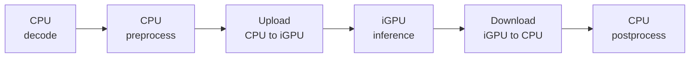
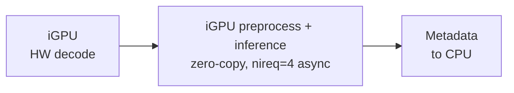
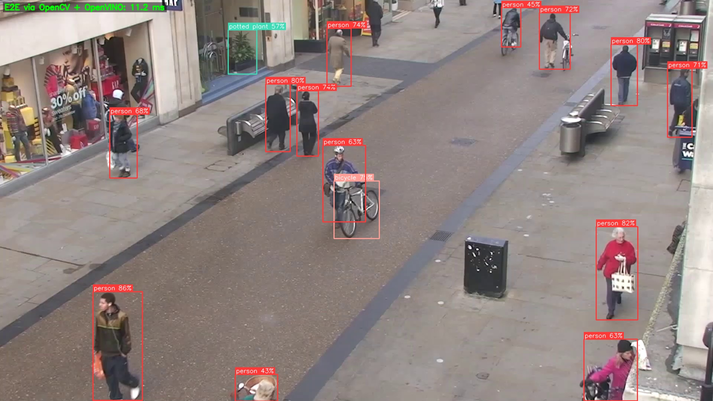
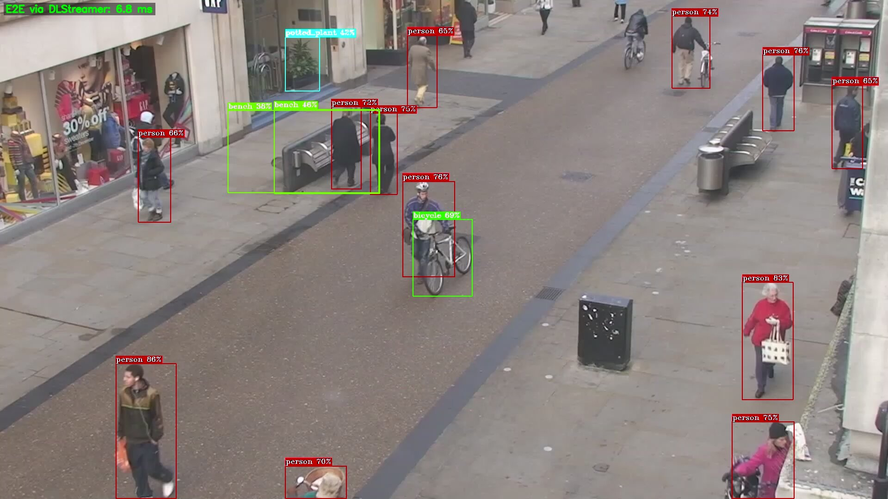
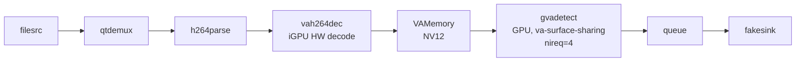

# DLStreamer Performance Advantages in Object Detection

This benchmarking sample showcases **up to ~2x higher throughput** on Intel
Arrow Lake / Panther Lake (ARL/PTL) integrated GPU (iGPU) through DL Streamer
compared to a traditional OpenCV + OpenVINO approach – same YOLO26s INT8
model, same video, same setup for inference.

This sample references the
[OpenVINO YOLO26 notebook](https://github.com/openvinotoolkit/openvino_notebooks/blob/latest/notebooks/yolov26-optimization/yolov26-object-detection.ipynb)
inference approach as the baseline, adding GPU inference step for fair
comparison. Both pipelines run inference on the iGPU.
The difference is how video is decoded, how frames reach the GPU, and how
the pipeline is scheduled.

## What Intel DLStreamer Does Differently

### 1. Pipelining

Intel DLStreamer runs pipeline stages in separate threads. While the iGPU
compute engine infers on frame N, the video engine is already decoding frame
N+1. The OpenCV + OpenVINO approach processes each frame sequentially.

### 2. Hardware video decoding on iGPU

Intel DLStreamer decodes H.264 video on the iGPU fixed-function video engine.
The decoded frame stays in GPU memory. OpenCV `cv2.VideoCapture` decodes on
the CPU, producing a system-memory numpy array that must be uploaded to the
iGPU before inference.

### 3. Zero-copy inference

Intel DLStreamer preprocesses (resize, normalize, color-convert) and infers
directly on the decoded GPU-resident frame. The data never leaves GPU memory.
With four async inference requests (`nireq=4`), the compute engine is
continuously busy.

The OpenCV + OpenVINO pipeline uploads a system-memory tensor to the iGPU
before every inference and downloads the result after.

### 4. GPU-accelerated overlay

Intel DLStreamer draws bounding boxes directly on GPU-resident frames,
avoiding CPU-side rendering.

### Pipeline comparison

**OpenCV + OpenVINO** – sequential, one frame at a time:



**Intel DLStreamer** – pipelined, multiple frames in flight:



## Example run

```
$ python3 perf_comparison.py

Traditional pipeline (OpenCV decode, OpenVINO iGPU inference)
  run 1: 77.9 fps  e2e=12.8 ms  infer=9.2 ms  (200 frames, 2644 det)
  run 2: 79.3 fps  e2e=12.6 ms  infer=9.2 ms  (200 frames, 2644 det)
  run 3: 79.2 fps  e2e=12.6 ms  infer=9.1 ms  (200 frames, 2644 det)

DLStreamer pipeline (iGPU decode, zero-copy, async inference)
  run 1: 148.4 fps  e2e=6.7 ms  infer=6.7 ms  (207 frames)
  run 2: 148.3 fps  e2e=6.7 ms  infer=6.7 ms  (207 frames)
  run 3: 147.0 fps  e2e=6.8 ms  infer=6.8 ms  (207 frames)

----------------------------------------------------------------
  Traditional :    76.6 fps   e2e = 13.1 ms   infer = 9.2 ms
  DLStreamer   :   146.9 fps   e2e = 6.8 ms   infer = 6.8 ms
----------------------------------------------------------------
  DLStreamer advantage on ARL/PTL:
  Up to 92% higher throughput, 48% lower e2e latency
----------------------------------------------------------------
```

Intel DLStreamer end-to-end (e2e) time per frame (6.8 ms) is lower than the
inference-only time in the OpenCV + OpenVINO pipeline (9.2 ms) because
decode, preprocess, and inference overlap.

*Intel Core Ultra 9 285H (Arrow Lake-P), iGPU Arc Graphics, Ubuntu 24.04,
kernel 6.17, OpenVINO 2026.1, GStreamer 1.26.*

### Detection output

Both pipelines save annotated frames with bounding boxes to `output/`:

**OpenCV + OpenVINO:**



**DLStreamer:**



## System requirements

- Linux (Ubuntu 22.04 / 24.04)
- Intel platform with integrated GPU (Arrow Lake, Panther Lake, Meteor Lake)
- Kernel 6.8 or newer
- Intel DLStreamer with GStreamer 1.24 or newer
  ([installation guide](https://dlstreamer.github.io/get_started/install/install_guide_ubuntu.html))
- Python 3.10 or newer

If any Python packages are missing:
```
pip install openvino opencv-python numpy ultralytics
```
`ultralytics` is only needed for the one-time model export on first run.

## Usage

```
python3 perf_comparison.py
```

| Argument | Default | Description |
|---|---|---|
| `--video` | auto-download people.mp4 | path to H.264 input video |
| `--model` | auto-export YOLO26s INT8 | path to OpenVINO IR (.xml) |
| `--frames` | 200 | measured frames per run |
| `--warmup` | 50 | warmup frames |
| `--runs` | 3 | repeated runs |

## Intel DLStreamer pipeline


