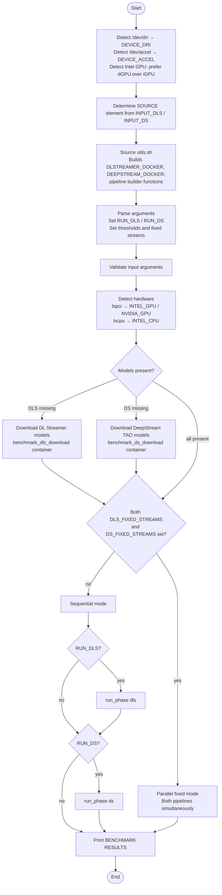
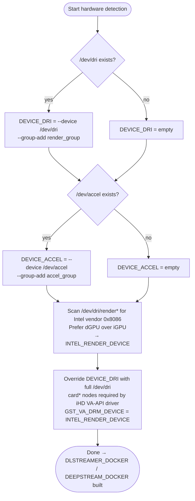
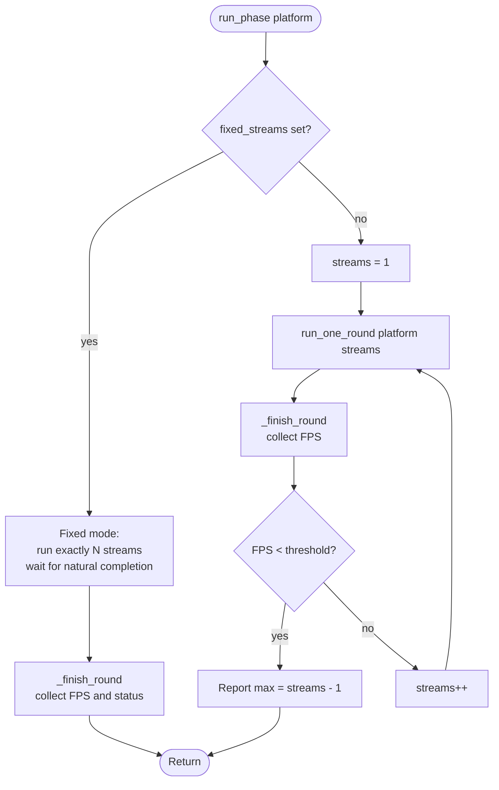
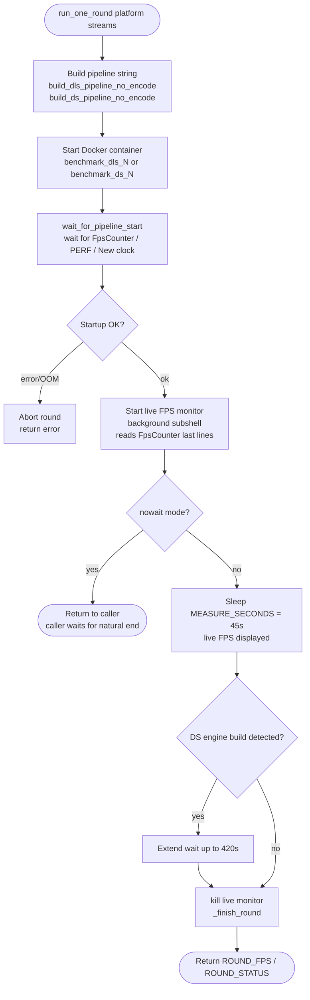
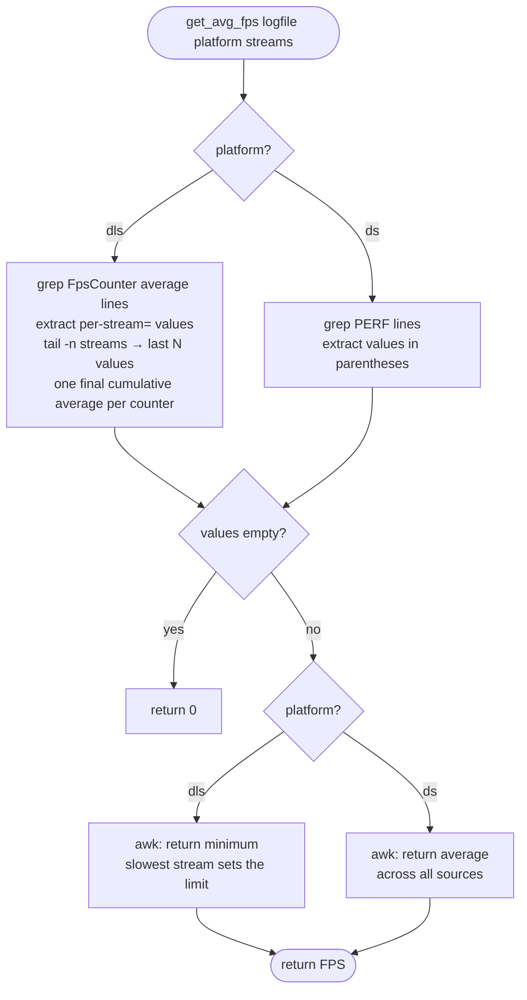

# Coexistence Benchmark

Copyright (C) 2026 Intel Corporation  
SPDX-License-Identifier: MIT

## Overview

`coexistance_benchmark.sh` is a benchmark script that measures the (potantial) maximum number of concurrent video analytics streams that can be executed on a system equipped with a combination of Intel and NVIDIA hardware.

The script automatically detects available hardware and runs the appropriate inference pipeline:

| Detected hardware | Pipeline used |
|---|---|
| Intel GPU | DL Streamer (via VA-API) |
| Intel NPU | DL Streamer (via NPU backend) |
| Intel CPU | DL Streamer (via OpenCV backend) |
| NVIDIA GPU | DeepStream |
| Intel GPU + NVIDIA GPU | Both simultaneously |
| Intel NPU + NVIDIA GPU | Both simultaneously |
| Intel CPU + NVIDIA GPU | Both simultaneously |

The use case is **License Plate Recognition (LPR)**:
- **DL Streamer pipeline**: YOLOv8 license plate detector → PP-OCRv4 text recognizer
- **DeepStream pipeline**: TrafficCamNet (vehicle detection) → LPDNet (plate detection) → LPRNet (plate recognition)

Both pipelines run inside Docker containers.

## Requirements

- Docker installed and running
- At least one of:
  - Intel GPU with VA-API support (Intel Arc, Iris Xe, etc.)
  - Intel NPU (`/dev/accel`)
  - Intel CPU
  - NVIDIA GPU with CUDA support
- `lspci`, `lscpu` available on the host
- `DISPLAY` environment variable set (X11 forwarding for Docker)
- Internet access for first-run model download

## Files

| File | Description |
|---|---|
| `coexistance_benchmark.sh` | Main benchmark script |
| `utils.sh` | Shared variables (Docker commands, GStreamer pipeline definitions, validation functions) |

## Usage

```bash
./coexistance_benchmark.sh <INPUT_DLS> <INPUT_DS> LPR [OPTIONS]
```

### Arguments

| Argument | Description | Example |
|---|---|---|
| `<INPUT_DLS>` | Input video for DL Streamer — local file path, `rtsp://` URL, or `https://` URL | `video_dls.mp4` |
| `<INPUT_DS>` | Input video for DeepStream — local file path, `rtsp://` URL, or `https://` URL | `video_ds.mp4` |
| `LPR` | Pipeline mode — currently only `LPR` is supported | `LPR` |

### Options

| Option | Description | Default |
|---|---|---|
| `--dls-only` | Run DL Streamer only (skip DeepStream) | both platforms |
| `--ds-only` | Run DeepStream only (skip DL Streamer) | both platforms |
| `--dls-fps-threshold=N` | Minimum acceptable per-stream FPS for DL Streamer | `30` |
| `--ds-fps-threshold=N` | Minimum acceptable per-source FPS for DeepStream | `30` |
| `--dls-streams=N` | Run exactly N streams on DL Streamer (skip benchmark loop) | benchmark mode |
| `--ds-streams=N` | Run exactly N streams on DeepStream (skip benchmark loop) | benchmark mode |

### Examples

Benchmark both platforms (first Deep Leearning Streamer, next DeepStream):
```bash
./coexistance_benchmark.sh video_dls.mp4 video_ds.mp4 LPR
```

DL Streamer only:
```bash
./coexistance_benchmark.sh video_dls.mp4 video_ds.mp4 LPR --dls-only
```

Fixed streams (both platforms simultaneously, no benchmark loop):
```bash
./coexistance_benchmark.sh video_dls.mp4 video_ds.mp4 LPR --dls-streams=5 --ds-streams=3
```

Custom FPS threshold:
```bash
./coexistance_benchmark.sh video_dls.mp4 video_ds.mp4 LPR --dls-fps-threshold=30
```

RTSP stream:
```bash
./coexistance_benchmark.sh rtsp://192.168.1.10:8554/stream rtsp://192.168.1.10:8554/stream LPR
```

### Logging output to a file

To save everything displayed on screen to a log file while still seeing it in the terminal:
```bash
./coexistance_benchmark.sh video_dls.mp4 video_ds.mp4 LPR 2>&1 | tee <LOG_FILE.LOG>
```

## First-run Setup (Automatic)

On first run the script automatically downloads all required models inside Docker containers. This requires an internet connection and may take several minutes.

Download containers use dedicated names (`benchmark_dls_download`, `benchmark_ds_download`) separate from benchmark containers.

### DL Streamer models (downloaded when Intel hardware detected)

| Model | Purpose | Saved to |
|---|---|---|
| `yolov8_license_plate_detector` | Detects license plates in the frame | `./public/` |
| `ch_PP-OCRv4_rec_infer` | Recognizes text on detected plates | `./public/` |

Downloaded via `intel/dlstreamer:latest` container.

### DeepStream / TAO models (downloaded when NVIDIA GPU detected)

Clones [deepstream_tao_apps](https://github.com/NVIDIA-AI-IOT/deepstream_tao_apps) into `./deepstream_tao_apps/` and downloads:

| Model | Purpose | Saved to |
|---|---|---|
| `resnet18_trafficcamnet_pruned.onnx` | Vehicle detection (primary detector) | `./deepstream_tao_apps/models/trafficcamnet/` |
| `LPDNet_usa_pruned_tao5.onnx` | License plate detection (secondary) | `./deepstream_tao_apps/models/LPD_us/` |
| `us_lprnet_baseline18_deployable.onnx` | License plate recognition | `./deepstream_tao_apps/models/LPR_us/` |

Also compiles the custom LPR parser plugin (`nvinfer_custom_lpr_parser`) inside the container using `make`.

Downloaded via `nvcr.io/nvidia/deepstream:8.0-samples-multiarch` container.

## Output

Default benchmark mode uses `fakesink` output — the benchmark measures pure inference/decode throughput.

## Execution Flow

### Overall script flow



### Hardware detection and Docker setup



### run_phase — benchmark loop



### run_one_round — single measurement round



### FPS measurement — get_avg_fps



> **Note:** Steps detecting `/dev/dri`, `/dev/accel` and INPUT sources must happen before sourcing `utils.sh` because `utils.sh` expands `${DEVICE_DRI}`, `${DEVICE_ACCEL}`, and `${SOURCE_INTEL}` / `${SOURCE_NVIDIA}` at source time when building Docker command strings and pipeline definitions.

