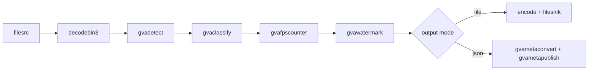

# Face Detection and Classification

This sample demonstrates how to run face detection and age classification in a GStreamer pipeline using pre-exported OpenVINO™ IR models.

The pipeline combines `gvadetect` for face detection with `gvaclassify` for age estimation, annotates results with `gvawatermark`, and outputs either annotated video or JSON metadata.



## Prerequisites

### Install DLStreamer

#### Option A: Docker image (recommended)

Pull the latest DLStreamer image and start an interactive container with GPU access:

```sh
docker pull intel/dlstreamer:latest
docker run --init -it --rm \
    --device /dev/dri \
    --group-add $(stat -c "%g" /dev/dri/render*) \
    intel/dlstreamer:latest
cd /opt/intel/dlstreamer/samples/gstreamer/python/face_detection_and_classification
```

> Note: install Docker Engine if not already available (see [Docker installation guide](https://docs.docker.com/engine/install/)).
> All subsequent commands run inside this container shell.

#### Option B: Native installation

Install DLStreamer on the host (see [DLStreamer Installation Guide](../../../../docs/user-guide/install/install_guide_index.md)).

```sh
cd samples/gstreamer/python/face_detection_and_classification
```

## Download Video

Download example video file:

```sh
curl -L -o input.mp4 "https://videos.pexels.com/video-files/18553046/18553046-hd_1280_720_30fps.mp4"
```

## Prepare Models

This sample uses two models from Hugging Face:

- **Face detection:** `arnabdhar/YOLOv8-Face-Detection` (Ultralytics YOLO format)
  - Prepare with [Ultralytics conversion](../../../../scripts/download_models/README.md#2-ultralytics-conversion)
  
- **Age classification:** `dima806/fairface_age_image_detection` (Hugging Face Transformers)
  - Prepare with [Hugging Face model conversion](../../../../scripts/download_models/README.md#1-hugging-face-conversion)

## Install Dependencies

Create and activate a virtual environment:

```sh
python3 -m venv .face_det_cls_venv
source .face_det_cls_venv/bin/activate
```

Install dependencies:

```sh
pip install -r requirements.txt
```

> Note: Dependencies are pinned in [requirements.txt](requirements.txt) for reproducible installs.

## Run Sample Application

```sh
python3 face_detection_and_classification.py \
    --input input.mp4 \
    --device GPU \
    --output file \
    --det-model models/public/arnabdhar_YOLOv8-Face-Detection/FP16/arnabdhar_YOLOv8-Face-Detection.xml \
    --cls-model models/public/dima806_fairface_age_image_detection/FP16/dima806_fairface_age_image_detection.xml
```

If `--input` is omitted, the script downloads and uses a default video automatically.

Run `python3 face_detection_and_classification.py --help` to see all available options.

## Output Modes

Control output with `--output` (default: `file`):

| Mode | Description |
|---|---|
| `file` | Annotates frames with detection boxes and age labels, encodes to MP4 with suffix `_output.mp4` |
| `json` | Writes inference results as JSON Lines (one record per frame) to `output.json` |

**File output (default):**
```sh
python3 face_detection_and_classification.py \
    --input input.mp4 \
    --device GPU \
    --output file \
    --det-model models/public/arnabdhar_YOLOv8-Face-Detection/FP16/arnabdhar_YOLOv8-Face-Detection.xml \
    --cls-model models/public/dima806_fairface_age_image_detection/FP16/dima806_fairface_age_image_detection.xml
```

Produces `input_output.mp4` with annotated detections and age classification.

**JSON metadata:**
```sh
python3 face_detection_and_classification.py \
    --input input.mp4 \
    --device CPU \
    --output json \
    --det-model models/public/arnabdhar_YOLOv8-Face-Detection/FP32/arnabdhar_YOLOv8-Face-Detection.xml \
    --cls-model models/public/dima806_fairface_age_image_detection/FP32/dima806_fairface_age_image_detection.xml
```

Outputs `output.json` in JSON Lines format for downstream processing.

## How It Works

The sample constructs a GStreamer pipeline that:

1. **Decodes** video frames with `decodebin3`
2. **Detects** faces using `gvadetect` with the YOLOv8 model
3. **Classifies** detected faces using `gvaclassify` with the fairface model
4. **Renders** detection boxes and age labels with `gvawatermark`
5. **Outputs** either annotated video (file mode) or JSON metadata (json mode)

The pipeline automatically handles model loading, inference, and metadata aggregation.
