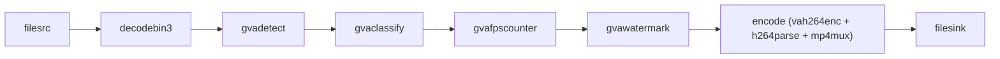

# Face Detection and Classification

This sample demonstrates how to run face detection and classification in a GStreamer pipeline using pre-exported OpenVINO™ IR models.

## How It Works

The sample expects the detection and classification models to be prepared before launch. The model preparation step is done outside the script, in the same style as the Smart NVR sample: download the model, export it to OpenVINO IR, and then pass the resulting `.xml` paths to the sample.

**STEP 1 — Download and prepare the face detection model**
Download the YOLOv8 face detector from Hugging Face and export it to OpenVINO IR using the [Ultralytics conversion](https://github.com/open-edge-platform/dlstreamer/blob/main/scripts/download_models/README.md#2-ultralytics-conversion).

**STEP 2 — Download and prepare the classification model**
Fetch the face age classifier from Hugging Face and export it to OpenVINO IR using the [Hugging Face model conversion](https://github.com/open-edge-platform/dlstreamer/blob/main/scripts/download_models/README.md#1-hugging-face-conversion).

**STEP 3 — Download example video file**
Download video from https://videos.pexels.com/video-files/2431853/2431853-hd_1920_1080_25fps.mp4.

**STEP 4 — Build and run the pipeline**
Use GStreamer and DL Streamer elements to build a pipeline, run inference with `gvadetect` and `gvaclassify`, annotate frames with `gvawatermark`, and encode the output to MP4.



If no input video is provided, a default video is downloaded and used automatically.

## Models

This demo uses the following models from Hugging Face:

* Face detection: `arnabdhar/YOLOv8-Face-Detection`
* Classification: `dima806/fairface_age_image_detection`

## Reproducible setup

This project pins all dependencies in [requirements.txt](requirements.txt) for deterministic installs.

## Download Video and Prepare Models

Download the sample video before running the pipeline:

```sh
curl -L -o input.mp4 "https://videos.pexels.com/video-files/18553046/18553046-hd_1280_720_30fps.mp4"
```

This sample expects `arnabdhar/YOLOv8-Face-Detection` as an OpenVINO IR detection model (for example FP16 or INT8) prepared with [Ultralytics conversion](https://github.com/open-edge-platform/dlstreamer/blob/main/scripts/download_models/README.md#2-ultralytics-conversion).

This sample expects `dima806/fairface_age_image_detection` as an OpenVINO IR classification model prepared with [Hugging Face model conversion](https://github.com/open-edge-platform/dlstreamer/blob/main/scripts/download_models/README.md#1-hugging-face-conversion).

Prepare the OpenVINO artifacts before running the sample and pass their `.xml` paths to the application with `--det-model` and `--cls-model`.

The exact export commands depend on the exported model layout and precision you want to use. After the model artifacts are created, pass them as paths to the sample.

### Install

1. Create and activate a virtual environment:
```code
   python3 -m venv .face_det_cls_venv
   source .face_det_cls_venv/bin/activate
   ```

2. Install dependencies:
```code
   pip install -r requirements.txt
   ```

If you need to update dependencies, regenerate the pinned versions in [requirements.txt](requirements.txt) from a known-good environment.

## Running

The sample accepts input, device, output, and model paths:

```code
python3 face_detection_and_classification.py \
      --input INPUT \
      --device DEVICE \
      --output OUTPUT \
      --det-model DETECTION_MODEL_XML \
      --cls-model CLASSIFICATION_MODEL_XML
```

* `--input` - local video file. Omit to download and use the default video.
* `--device` - inference device, `CPU`, `GPU` or `NPU` (default: `GPU`).
* `--output` - output mode (default: `file`):
   * `file` - annotate frames and encode an MP4 saved alongside the input with the suffix `_output.mp4`.
   * `json` - write deterministic inference results as JSON Lines to `output.json` in the working directory.
* `--det-model` - path to the face-detection OpenVINO model `.xml` file.
* `--cls-model` - path to the classification OpenVINO model `.xml` file.

Examples:

```code
# Default video, GPU, encode annotated MP4
python3 face_detection_and_classification.py \
      --det-model /path/to/YOLOv8-Face-Detection/model.xml \
      --cls-model /path/to/fairface_age_image_detection/model.xml

# Local file on CPU, write json-lines to output.json
python3 face_detection_and_classification.py \
      --input /path/to/video.mp4 \
      --device CPU \
      --output json \
      --det-model /path/to/YOLOv8-Face-Detection/model.xml \
      --cls-model /path/to/fairface_age_image_detection/model.xml
```

## Sample Output

In `file` mode the script produces an output video annotated with detections and classification
results. In `json` mode it writes one json-lines record per frame to `output.json`.
