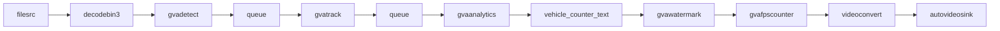

# Vehicle Counter with gvaanalytics Tripwires

This sample demonstrates how to use the DLStreamer `gvaanalytics` element with tripwires to count vehicles crossing a virtual line in both directions.
The pipeline detects vehicles, tracks them across frames, and counts how many cross the tripwire from left-to-right and right-to-left.

A custom GStreamer element displays the crossing counters as a single-line watermark text overlay.

## Pipeline Architecture



The pipeline stages implement the following functions:

* __filesrc__ - reads video from a local file
* __decodebin3__ - decodes video into individual frames
* __gvadetect__ - runs AI inference for object detection on each frame
* __gvatrack__ - tracks detected objects across frames (required for tripwire detection)
* __gvaanalytics__ - analyzes object trajectories and detects tripwire crossings
* __vehicle_counter_text__ - custom element that counts crossings and adds watermark text
* __gvawatermark__ - renders detection results and watermark text on frames
* __autovideosink__ - renders the video stream to the display

## How It Works

### Step 1 - Detection and Tracking

The pipeline first detects vehicles using `gvadetect`, then passes the results through `gvatrack` to maintain consistent object IDs across frames.

### Step 2 - Tripwire Analytics

The `gvaanalytics` element is configured with `tripwire-config.json`, which defines a vertical line at the middle of the frame (x=320 for 640x360).
As tracked objects cross this virtual line, the element generates `TripwireMtd` (tripwire metadata) events with direction information (1 = left-to-right crossing, -1 = right-to-left crossing).

### Step 3 - Custom Counter Element

The `vehicle_counter_text` custom element (a GstBaseTransform) monitors the analytics metadata stream, counts tripwire crossings, and attaches watermark text metadata.
The text is displayed as a single line showing: `L→R: X | R→L: Y | Total: Z`

### Step 4 - Watermark Rendering

The `gvawatermark` element renders the text overlay and detection bounding boxes on the video frames.

### Step 5 - Pipeline Execution

The application sets the pipeline to `PLAYING` state and processes messages until the input video completes.

## Tripwire Configuration

The `tripwire-config.json` file defines a vertical virtual line at the middle of the frame (x=320 for 640x360 resolution) where vehicles are counted:

```json
{
  "tripwires": [
    {
      "id": "vertical",
      "points": [
        {"x": 320, "y": 0},
        {"x": 320, "y": 360}
      ]
    }
  ]
}
```

The x-coordinate is set to 320 pixels (middle of 640px width). Adjust for different resolutions:
- 1920x1080: x=960
- 1280x720: x=640
- 640x360: x=320

Direction tracking:
- **direction = 1**: Vehicle crossing from left to right (crosses x=320 left-to-right)
- **direction = -1**: Vehicle crossing from right to left (crosses x=320 right-to-left)

## Custom Element Architecture

This sample follows the same architecture as [watermark_meta](../watermark_meta/) sample:

1. **Custom GStreamer Element** - A `GstBaseTransform` element (`vehicle_counter_text`) that processes analytics metadata
2. **Parse Launch Pipeline** - Pipeline constructed using `Gst.parse_launch()` for simplicity and readability
3. **Element Registration** - Custom element is registered at runtime for use in the pipeline string

The `vehicle_counter_text` element:
- Monitors tripwire crossing events from `gvaanalytics`
- Counts vehicles crossing left-to-right and right-to-left
- **Filters detections by vehicle type** (configurable via `vehicle-types` property)
- Displays a single-line text overlay: `L→R: X | R→L: Y | Total: Z`
- Uses `DLStreamerWatermarkMeta.text_meta_add()` for professional text rendering with:
  - Cyan color (RGB: 0, 255, 255) for good visibility
  - Font size 0.6 (scaled for 640x360 resolution)
  - White background for text readability

### Vehicle Type Filtering

The element includes a `vehicle-types` property to filter which object types are counted:

```bash
# Count only cars, buses, and trucks (excludes persons, bicycles, etc.)
vehicle_counter_text vehicle-types=car,bus,truck

# Count all vehicles
vehicle_counter_text vehicle-types=car,bus,truck,motorcycle

# Customize for your use case
vehicle_counter_text vehicle-types=car,truck
```

The property accepts a comma-separated list of object class names returned by the detection model. Objects not in this list are ignored by the counter.

## Running the Sample

### Setup

The sample requires a video file and an object detection model. Download sample assets:

```sh
cd <python/gvaanalytics_tripwire directory>
export MODELS_PATH=${PWD}
wget https://videos.pexels.com/video-files/1192116/1192116-sd_640_360_30fps.mp4
../../../download_public_models.sh yolo11n
```

> **Note:** This may take several seconds depending on your network speed.

### Execution

You can run the sample using the provided shell script (easiest) or directly with Python.

**Using the shell script**:
```sh
./vehicle_counter.sh
```

This uses default settings: downloads the test video, uses YOLO11n model, and saves output to `/tmp/vehicle_counter_output.mp4`.

You can also customize the input, model, and output:
```sh
./vehicle_counter.sh file:///path/to/video.mp4 /path/to/model.xml /path/to/output.mp4
```

**Using Python directly**:
```sh
# Display output on screen
python3 ./vehicle_counter.py file:///path/to/video.mp4 ${MODELS_PATH}/public/yolo11n/FP16/yolo11n.xml

# Save output to file (H.264 MP4)
python3 ./vehicle_counter.py file:///path/to/video.mp4 ${MODELS_PATH}/public/yolo11n/FP16/yolo11n.xml output.mp4
```

The video stream displays with:
- Vehicle detection bounding boxes
- A horizontal line indicating the tripwire
- A counter showing vehicles crossing (left-to-right and right-to-left, filtered by vehicle type)
- Console output for each detected crossing

The sample saves output to file by default.

## Customization

### Save Output to File

The sample supports optional video file output with H.264 encoding:

```sh
# Save the analyzed video with detection and counter overlays
python3 ./vehicle_counter.py file:///path/to/input.mp4 model.xml output.mp4
```

The output file will contain:
- Vehicle detection bounding boxes
- Tripwire line visualization
- Live vehicle crossing counters overlaid as text
- All analytics metadata preserved

This is useful for reviewing results, sharing with others, or archiving analyzed footage.

### Filter by Vehicle Types

The sample is pre-configured to count only **cars**, **buses**, and **trucks**. To customize:

Edit `vehicle_counter.py` and change the pipeline:

```python
# Count only cars and trucks (exclude buses)
f"vehicle_counter_text vehicle-types=car,truck ! "

# Count all detected objects
f"vehicle_counter_text vehicle-types=car,bus,truck,motorcycle,bicycle,person ! "

# Count only trucks
f"vehicle_counter_text vehicle-types=truck ! "
```

The object type names depend on your detection model's class labels. Common classes include:
- Vehicles: `car`, `truck`, `bus`, `motorcycle`, `bicycle`
- People: `person`
- Animals: `dog`, `cat`, `bird`, etc.

### Adjust Tripwire Position

Edit `tripwire-config.json` to change the line position or add additional tripwires for counting in different directions.

### Change Tracking Type

Modify the `tracking-type` property in `vehicle_counter.py`

### Filter by Object Type

Extend the probe callback to check object categories and count only specific vehicle types (cars, trucks, etc.)

## See Also

* [gvaanalytics documentation](../../../../docs/user-guide/elements/gvaanalytics.md)
* [Samples overview](../../README.md)
