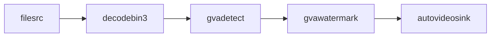

# Hello DL Streamer

This sample demonstrates how to build a Python application that processes video files and displays detected objects.


The sample creates the following DL Streamer pipeline:



The pipeline stages implement the following functions:

* __filesrc__ - reads video from a local file
* __decodebin3__ - decodes video into individual frames
* __gvadetect__ - runs AI inference for object detection on each frame
* __gvawatermark__ - overlays object bounding boxes on frames
* __autovideosink__ - renders the video stream to the display

The sample also inserts `queue` and `videoconvert` elements to adapt interfaces between stages. The resulting behavior is similar to [hello_dlstreamer.sh](../../scripts/hello_dlstreamer.sh).

## How It Works

### Step 1 - Pipeline Construction

The application creates a GStreamer `pipeline` object using one of two methods:

* [Option A](./hello_dlstreamer.py): Use `gst_parse_launch` to construct the pipeline from a string (default).
    ```code
    pipeline = Gst.parse_launch(...)
    ```

* [Option B](./hello_dlstreamer.py): Use GStreamer API calls to create, configure, and link individual elements.
    ```code
    element = Gst.ElementFactory.make(...)
    element.set_property(...)
    pipeline.add(element)
    element.link(next_element)
    ```

Both methods produce equivalent pipelines.

### Step 2 - Adding a Custom Probe

The application registers a custom callback on the sink pad of the `gvawatermark` element. The callback is invoked for each buffer pushed to the pad.

```code
watermarksinkpad = watermark.get_static_pad("sink")
watermarksinkpad.add_probe(watermark_sink_pad_buffer_probe, ...)
```

The callback inspects `GstAnalytics` metadata from `gvadetect`, counts detected objects by category, and attaches a classification string to the frame.

### Step 3 - Pipeline Execution

The application sets the pipeline to `PLAYING` state and processes messages until input completes.

```code
pipeline.set_state(Gst.State.PLAYING)
terminate = False
while not terminate:
    msg = bus.timed_pop_filtered(...)
    ... set terminate=TRUE on end-of-stream message
pipeline.set_state(Gst.State.NULL)
```

## Running the Sample

The sample requires a video file and an object detection model. Download sample assets:

```sh
cd <python/hello_dlstreamer directory>
export MODELS_PATH=${PWD}
wget https://videos.pexels.com/video-files/1192116/1192116-sd_640_360_30fps.mp4
../../../download_public_models.sh yolo11n coco128
```

> **Note:** This may take several seconds depending on your network speed.

The sample displays output on a local desktop by default. Run it on the host or use X11 forwarding.

Launch the application:

```sh
python3 ./hello_dlstreamer.py 1192116-sd_640_360_30fps.mp4 public/yolo11n/INT8/yolo11n.xml
```

The video stream displays with object detection annotations, including bounding boxes and class labels.

## See Also

* [Samples overview](../../README.md)

