# Loitering Detection 

This sample demonstrate how to build a simple loitering detector with custom video analytics using DLStreamer elements.
It detects and track the dwell time of people in the specified region in the scene.


It leverages the gvaanalytic element in DLStreamer for people-in-region detection and the python plugin framework to track and watermark the video.

## Pipeline Architecture

```mermaid
graph LR
  A[urisourcebin] --> B[decodebin3]
  B --> C[gvadetect]
  C --> D[queue]
  D --> E[gvatrack]
  E --> F[queue]
  F --> G[gvaanalytics]
  G --> H[queue]
  H --> I[loitering_watermark]
  I --> J[queue]
  J --> K[gvawatermark]
  K --> L[gvafpscounter]
  L --> M[queue]
  M --> N[vah264enc]
  N --> O[h264parse]
  O --> P[mp4mux]
  P --> Q[filesink]
```


The pipeline stages implement the following functions:

* __unisourcebin__ - reads video from a URI
* __decodebin3__ - decodes video into individual frames
* __gvadetect__ - runs AI inference for object detection on each frame
* __gvatrack__ - tracks detected objects across frames (required for tripwire detection)
* __gvaanalytics__ - analyzes object trajectories and in-zone detection
* __loitering_watermark__ - custom element that measure person dwell time and adds watermark text
* __gvawatermark__ - renders detection results and watermark text on frames
* __vah264enc__ - encodes output frames to H.264
* __h264parse__ - parse H.264 
* __mp4mux__ - containerize H.264 buffers in MP4 format
* __filesink__ - store encoded output video in file

## Custom Element Architecture

This sample mirrors the [gvaanalytics_tripwire](../gvaanalytics_tripwire) sample, but changes the custom logic from line crossing to dwell-time monitoring inside analytics zones.

The `loitering_watermark` element is implemented as an in-place `GstBase.BaseTransform` plugin.
For each video buffer, it reads analytics relation metadata produced upstream by `gvadetect`, `gvatrack`, and `gvaanalytics`, then builds a per-person dwell-time state table.

Processing flow:

1. Iterate detected objects (`ODMtd`) and keep only allowed object types (`person`).
2. For each object, read:
  - tracking metadata (`track_id`)
  - zone metadata (`zone_id`)
3. Update an in-memory record (`TinyDB`) keyed by `track_id`:
  - `first_seen_timestamp` when the person first appears in zone
  - `last_seen_timestamp` for the latest observation
  - `dwelling_time` computed as `current_time - first_seen_timestamp`
4. Remove stale records for tracks that are no longer active.
5. If watermarking is enabled, render one dashboard line per active record:
  - normal color when `dwelling_time` is below threshold
  - alert color when `dwelling_time` is greater than or equal to threshold

Runtime properties exposed by the plugin:

- `quiet-mode`: disables text overlay output
- `dashboard-pos`: sets dashboard anchor position as `x,y`
- `loitering-threshold`: dwell-time threshold in seconds used to trigger alert coloring


## Running the Sample

### Install DLStreamer

Install DLStreamer on the host (see [DLStreamer Installation Guide](../../../../docs/user-guide/get_started/install/install_guide_index.md)).

> **Note:** Since this sample is based on Python plugin, be sure to install the the Python dependencies described in Step 4

### Change folder sample folder

```
cd /opt/intel/dlstreamer/samples/python/loitering_detection
```

### Download model from Ultralytics

```
mkdir -p /home/${USER}/models
export MODELS_PATH=/home/${USER}/models
/opt/intel/dlstreamer/samples/download_public_models.sh yolo11s coco128
```

> **Note:** This may take several seconds depending on your network speed.

### Create Python virtual environment
```
python3 -m venv venv --prompt loitering_detection
source venv/bin/activate
python3 -m pip install -U pip
python3 -m pip install -r requirements.txt
```

### Execution

You can run the sample using the provided shell script.

The script accepts positional parameters in this order:

```sh
./loitering_detection.sh [INPUT] [CONFIG_FILE] [MODEL] [DEVICE] [OUTPUT]
```

Parameter details:

- `INPUT`: Input video file path or URL.
  - Default: `https://github.com/open-edge-platform/edge-ai-resources/raw/refs/heads/main/videos/VIRAT_S_000101.mp4`
- `CONFIG_FILE`: Zone configuration file for loitering detection.
  - Default: `./virat_s_000101-config.json`
- `MODEL`: Path to OpenVINO IR XML model used by `gvadetect`.
  - Default: `${MODELS_PATH}/public/yolo11s/FP16/yolo11s.xml`
  - The default is built from the `MODELS_PATH` environment variable (see below).
- `DEVICE`: Inference device for `gvadetect`.
  - Supported values: `CPU`, `GPU`, `NPU`
  - Default: `GPU`
- `OUTPUT`: Output video file name/path.
  - Default: `loitering_detection_output.mp4`

Environment variables:

- `MODELS_PATH`: Base directory for downloaded models; used to construct the default `MODEL` path.
  - Default: `./models`
  - Example: `export MODELS_PATH=/home/${USER}/models`

Example:

```sh
# Use all defaults
./loitering_detection.sh
```


## Video Source
```
Title: A Large-scale Benchmark Dataset for Event Recognition in Surveillance Video
Author: Sangmin Oh, Anthony Hoogs, Amitha Perera, Naresh Cuntoor, Chia-Chih Chen, 
        Jong Taek Lee, Saurajit Mukherjee, J.K. Aggarwal, Hyungtae Lee, Larry Davis, 
        Eran Swears, Xiaoyang Wang, Qiang Ji, Kishore Reddy, Mubarak Shah, Carl Vondrick, 
        Hamed Pirsiavash, Deva Ramanan, Jenny Yuen, Antonio Torralba, Bi Song, Anesco Fong, 
        Amit Roy-Chowdhury, and Mita Desai, 
        in Proceedings of IEEE Computer Vision and Pattern Recognition (CVPR), 2011.
Source: https://viratdata.org/
License: https://data.kitware.com/#collection/56f56db28d777f753209ba9f/folder/56f57e748d777f753209bed6
```

## See also
* [Samples overview](../../README.md)


