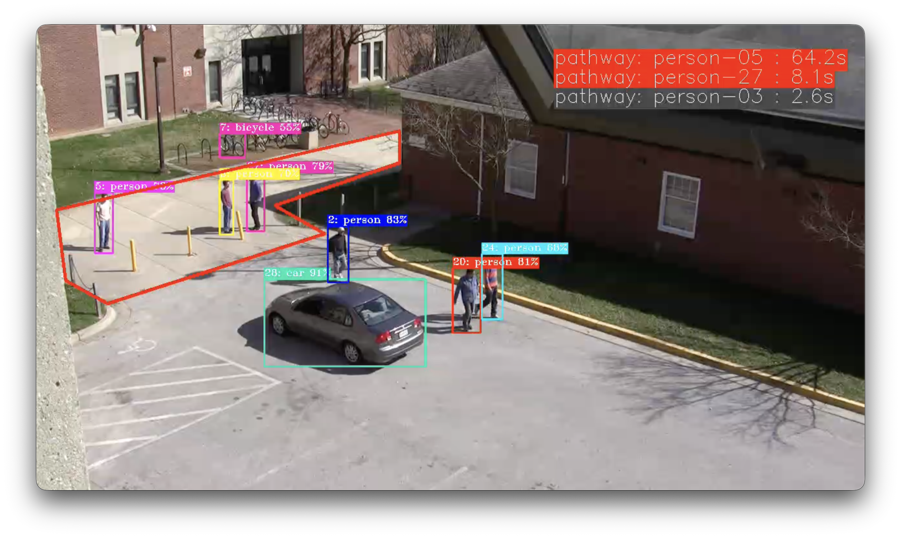

# Loitering Detection 

This sample demonstrates how to build a simple loitering detector with DLStreamer elements and custom video analytics logic.
It detects and tracks dwell time for specified objects in specified scene regions and generates a visual alert when dwell time exceeds a specified threshold.



It leverages the gvaanalytics element in DLStreamer to generate zone and dwell-time metadata, and a Python plugin for threshold checking and rendering dwell-time and alert overlays.

## Pipeline Architecture

```mermaid
graph LR
  A[urisourcebin] --> B[decodebin3]
  B --> C[gvadetect]
  C --> D[queue]
  D --> E[gvatrack]
  E --> F[queue]
  F --> G[gvaanalytics]
  G --> H[queue]
  H --> I[loitering_watermark]
  I --> J[queue]
  J --> K[gvametaconvert]
  K --> L[gvametapublish]
  L --> M[queue]
  M --> N[gvawatermark]
  N --> O[gvafpscounter]
  O --> P[queue]
  P --GPU--> Q[vah264enc]
  Q --> T[h264parse]
  P --CPU--> R[videoconvert]
  R --> S[openh264enc]
  S --> T
  T --> U[mp4mux]
  U --> V[filesink]
```


The pipeline stages implement the following functions:

* __urisourcebin__ - reads video from a URI
* __decodebin3__ - decodes video into individual frames
* __gvadetect__ - runs AI inference for object detection on each frame
* __gvatrack__ - tracks detected objects across frames (required for object-in-zone detection)
* __gvaanalytics__ - analyzes object trajectories, zone presence, and dwell time metadata
* __loitering_watermark__ - custom element that reads dwell metadata and adds watermark text
* __gvametaconvert__ - converts frame metadata to structured JSON
* __gvametapublish__ - writes converted metadata to a JSON output file
* __gvawatermark__ - renders detection results and watermark text on frames
* __vah264enc__ - encodes output frames to H.264
* __videoconvert__ - color space conversion
* __openh264enc__ - encodes output frames to H.264
* __h264parse__ - parses H.264
* __mp4mux__ - containerize H.264 buffers in MP4 format
* __filesink__ - store encoded output video in file

## Custom Element Architecture

This sample mirrors the [gvaanalytics_tripwire](../gvaanalytics_tripwire) sample, but changes the custom logic from line crossing to dwell-time threshold checking inside analytics zones.

The `loitering_watermark` element is implemented as an in-place `GstBase.BaseTransform` plugin.
For each video buffer, it reads analytics relation metadata produced upstream by `gvadetect`, `gvatrack`, and `gvaanalytics`. Since dwell time is computed in `gvaanalytics` and exported as relation metadata `loitering_watermark` is only responsible for threshold checking and result watermarking.

Processing flow:

1. Iterate detected objects (`ODMtd`) and inspect only allowed object types (`car` and `person` by default).
2. For each object, read tracking metadata (`track_id`) and dwell metadata (`zone_id`, `dwell_time`).
3. Build a per-frame in-memory record keyed by `track_id` for overlay rendering.
4. Rebuild the record map on every frame from current metadata.
5. If watermarking is enabled, render one dashboard line per active record:
  - normal color when `dwelling_time` is below threshold
  - alert color when `dwelling_time` is greater than or equal to threshold

## Zone Configuration Parameters Used by This Sample

This sample uses zone-level configuration options from `gvaanalytics`:

- `track-dwell-time`: Enables dwell-time tracking for objects in the zone.
- `object-retention`: Grace period in seconds to keep zone state after an object leaves the zone.

See [virat_s_000101-config.json](virat_s_000101-config.json) for a complete example.

Runtime properties exposed by the plugin:

- `quiet-mode`: disables text overlay output
- `dashboard-pos`: sets dashboard anchor position as `x,y`
- `loitering-threshold`: dwell-time threshold in seconds used to trigger alert coloring (range: 0.0 to 10.0; default: 5.0)


## Running the Sample

### Install DLStreamer

#### Option A: Docker image (recommended)

Pull the latest DLStreamer image and start an interactive container with GPU access:

```sh
export GPU_DEVICE=$([[ -d /dev/dri ]] && echo "--device /dev/dri")
export DEVICE_GRP=$([[ -d /dev/dri ]] && stat -c '--group-add %g' /dev/dri/render*)
export NPU_DEVICE=$([[ -d /dev/accel ]] && echo "--device /dev/accel")

docker run --init -it --rm \
    ${GPU_DEVICE} \
    ${NPU_DEVICE} \
    ${DEVICE_GRP} \
    intel/dlstreamer:latest
```

> Note: install Docker Engine if not already available (see [Docker installation guide](https://docs.docker.com/engine/install/)).
> All subsequent commands run inside this container shell.

#### Option B: Native installation

Install DLStreamer on the host (see [DLStreamer Installation Guide](../../../../docs/user-guide/install/install_guide_index.md)).

### Change to sample folder

```sh
cd /opt/intel/dlstreamer/samples/gstreamer/python/loitering_detection
```

### Prepare Model

This sample expects `yolo11s` in FP16 precision from Ultralytics for object detection.
Use the [Ultralytics model conversion](../../../../scripts/download_models/README.md#2-ultralytics-conversion) to prepare the model.

### Execution

You can run the sample using the provided shell script.
The script accepts positional parameters in this order:

```sh
./loitering_detection.sh [INPUT] [CONFIG_FILE] [MODEL] [DEVICE] [OUTPUT] [JSON_METADATA]
```

Parameter details:

- `INPUT`: Input video file path or URL.
  - Default: `https://github.com/open-edge-platform/edge-ai-resources/raw/refs/heads/main/videos/VIRAT_S_000101.mp4`
- `CONFIG_FILE`: Zone configuration file for loitering detection.
  - Default: `<sample_dir>/virat_s_000101-config.json`
- `MODEL`: Path to OpenVINO IR XML model used by `gvadetect`.
  - Default: `${MODELS_PATH}/public/yolo11s/FP16/yolo11s.xml`
  - The default is built from the `MODELS_PATH` environment variable (see below).
- `DEVICE`: Inference device for `gvadetect`.
  - Supported values: `CPU`, `GPU`, `NPU`
  - Default: `GPU`
- `OUTPUT`: Output video file name/path.
  - Default: `loitering_detection_output.mp4`
- `JSON_METADATA`: Output metadata file path written by `gvametapublish`.
  - Default: `loitering_detection_output.json`

Environment variables:

- `MODELS_PATH`: Base directory for downloaded models; used to construct the default `MODEL` path.
  - Default: `./models`
  - Example: `export MODELS_PATH=/home/${USER}/models`

Example:

```sh
# Use all defaults
./loitering_detection.sh
```


## Video Source
```
Title: A Large-scale Benchmark Dataset for Event Recognition in Surveillance Video
Author: Sangmin Oh, Anthony Hoogs, Amitha Perera, Naresh Cuntoor, Chia-Chih Chen, 
        Jong Taek Lee, Saurajit Mukherjee, J.K. Aggarwal, Hyungtae Lee, Larry Davis, 
        Eran Swears, Xiaoyang Wang, Qiang Ji, Kishore Reddy, Mubarak Shah, Carl Vondrick, 
        Hamed Pirsiavash, Deva Ramanan, Jenny Yuen, Antonio Torralba, Bi Song, Anesco Fong, 
        Amit Roy-Chowdhury, and Mita Desai, 
        in Proceedings of IEEE Computer Vision and Pattern Recognition (CVPR), 2011.
Source: https://viratdata.org/
License: https://data.kitware.com/#collection/56f56db28d777f753209ba9f/folder/56f57e748d777f753209bed6
```

## See also
* [Samples overview](../../../README.md)


