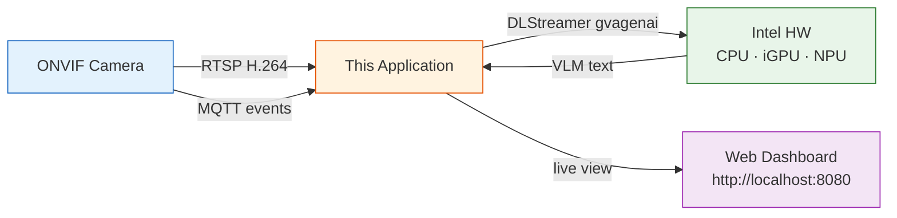

# ONVIF Profile M Analytics Validation Pipeline (VLM Edition)

Receives video from an ONVIF camera via RTSP, runs **Visual Language Model
(VLM)** inference using **Intel DLStreamer** (GStreamer + `gvagenai`) on Intel
hardware (CPU/iGPU/NPU), cross-validates against the camera's own analytics
events received via MQTT, and displays results in a **live web dashboard**.



## Camera Setup

Configure your camera to publish MQTT event notifications to the broker host IP and port, using the topic `onvif/analytics/<SERIAL_NUMBER>`.

The exact configuration steps vary by camera manufacturer — refer to your camera's documentation for instructions on enabling MQTT event publishing.

## Prerequisites

- Python 3.10+
- [Intel DLStreamer](https://github.com/open-edge-platform/dlstreamer) 2026.0.0 or later
- An ONVIF-enabled camera with MQTT events 

**Note:** DLStreamer requires its environment to be sourced before running:

```bash
source /opt/intel/dlstreamer/scripts/setup_dls_env.sh
```

### 1. Install Python dependencies

```bash
pip install -r requirements.txt
```

### Model Setup

Export a VLM model to OpenVINO format (run once):

```bash
pip install optimum-intel openvino
optimum-cli export openvino --model openbmb/MiniCPM-V-2_6 --weight-format int4 MiniCPM-V-2_6
export GENAI_MODEL_PATH=$PWD/MiniCPM-V-2_6
```

Supported models:

| Model | Export command |
|-------|---------------|
| MiniCPM-V 2.6 | `optimum-cli export openvino --model openbmb/MiniCPM-V-2_6 --weight-format int4 MiniCPM-V-2_6` |
| Phi-4-multimodal | `optimum-cli export openvino --model microsoft/Phi-4-multimodal-instruct Phi-4-multimodal` |
| Gemma 3 | `optimum-cli export openvino --model google/gemma-3-4b-it Gemma3` |

### 2. Install and start Mosquitto

```bash
sudo apt update && sudo apt install -y mosquitto mosquitto-clients
sudo systemctl enable mosquitto && sudo systemctl start mosquitto
```

Ensure `/etc/mosquitto/mosquitto.conf` allows local connections:

```text
listener 1883
allow_anonymous true
```

```bash
sudo systemctl restart mosquitto
```

### 3. Configure camera MQTT events

Point your camera's MQTT event settings to the broker running Mosquitto
(e.g. `tcp://<broker-ip>:1883`) with topic `onvif/analytics`. Verify events
arrive:

```bash
mosquitto_sub -h localhost -t "onvif/analytics/#" -v
```

## Quick Start

```bash
# With a real camera:
python3 onvif_camera_analytics_validation.py \
    --camera-ip 192.168.1.100 \
    --model-path ./MiniCPM-V-2_6
```

Then open **http://localhost:8080** in a browser to view the live dashboard.

### Example Output

```
  [   1] cam=3(Human:3) vlm=(Human:1) -> MISMATCH
         VLM: I can see a person walking across the street near a car...
  [   2] cam=3(Human:3) vlm=(Human:1,Vehicle:1) -> MISMATCH
         VLM: There is one person and one car visible in the scene...
  [   3] cam=1(Human:1) vlm=(Human:1) -> OK
         VLM: A single person is standing in the frame...
```

Each line shows the camera-reported object count vs objects extracted from the
VLM text description. `MISMATCH` means they differ; `OK` means they agree.

## CLI Options

| Flag | Default | Description |
|------|---------|-------------|
| `--camera-ip` | `192.168.1.100` | Camera IP address |
| `--onvif-port` | `80` | ONVIF HTTP port |
| `--onvif-user` / `--onvif-pass` | `admin` | ONVIF credentials |
| `--rtsp-uri` | (auto-discovered) | RTSP URI override |
| `--model-path` | `$GENAI_MODEL_PATH` | Path to OpenVINO-exported VLM model directory |
| `--device` | `CPU` | Intel device: `CPU`, `GPU`, `NPU`, `AUTO` |
| `--prompt` | (object listing) | VLM prompt for scene description |
| `--frame-rate` | `1` | VLM frame sampling rate in fps |
| `--chunk-size` | `1` | Frames per VLM inference call |
| `--max-tokens` | `150` | Max tokens for VLM generation |
| `--idle-timeout` | `60` | Stop DLStreamer pipeline after N seconds idle |
| `--mqtt-broker` | `localhost` | MQTT broker address |
| `--mqtt-port` | `1883` | MQTT broker port |
| `--mqtt-topics` | `onvif/analytics ...` | MQTT subscribe topics |
| `--web-port` | `8080` | Web dashboard port |

## MQTT Topics

| Topic | Direction | Format | Description |
|-------|-----------|--------|-------------|
| `onvif/analytics` | IN | JSON or XML | Camera detection events |
| `onvif/analytics/events` | IN | ONVIF XML | Camera event notifications |

## Web Dashboard

The built-in web UI at `http://localhost:8080` shows:

| Panel | Content |
|-------|---------|
| **Camera Frame** | Live JPEG frame from the pipeline (refreshed every 2s) |
| **VLM Description** | Latest natural-language text from the VLM model |
| **Cross-Validation** | Match/mismatch status comparing camera events vs VLM |
| **Latest Event** | Raw MQTT event data from the camera |
| **Stats** | Running totals: events processed, VLM inferences, mismatches |

## Files

| File | Purpose |
|------|---------|
| `onvif_camera_analytics_validation.py` | Main pipeline — CLI, DLStreamer VLM inference, web UI, validation loop |
| `util.py` | ONVIF client, MQTT listener, cross-validation |
| `requirements.txt` | Python dependencies |