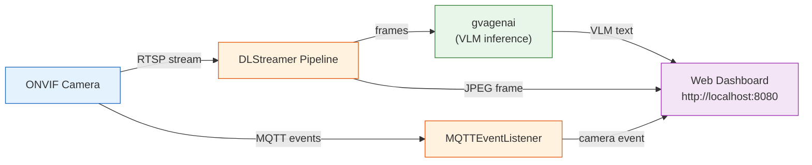
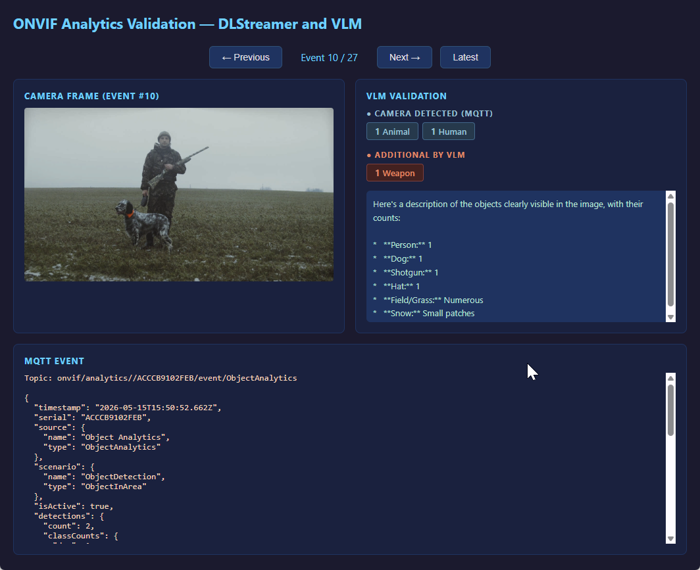
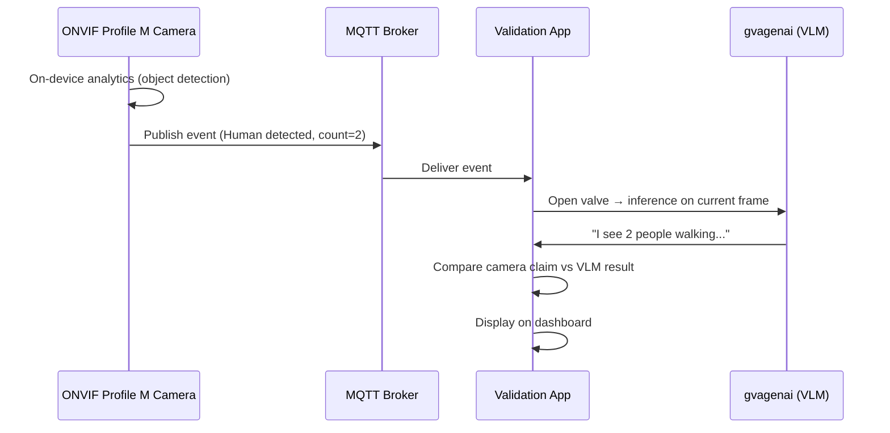

# ONVIF Camera Analytics Validation

Event-driven validation for any **ONVIF-enabled camera**. Connects to an RTSP
stream and an MQTT event broker. Uses DLStreamer's **gvagenai** element to run
continuous **VLM (Visual Language Model)** inference via **OpenVINO GenAI** on
Intel hardware (CPU/iGPU/NPU) directly inside the GStreamer pipeline. When an
MQTT analytics event arrives, pairs it with the latest VLM inference result
and displays everything on a **live web dashboard**.



## Prerequisites

- Python 3.10+
- An ONVIF-enabled camera with MQTT event publishing
- An MQTT broker (e.g. Mosquitto)

## Setup

### 1. Install the MQTT broker

```bash
sudo apt update && sudo apt install -y mosquitto mosquitto-clients
sudo systemctl enable mosquitto && sudo systemctl start mosquitto
```

Ensure `/etc/mosquitto/mosquitto.conf` allows external connections:

```text
listener 1883
allow_anonymous true
```

```bash
sudo systemctl restart mosquitto
```

### 2. Configure camera MQTT events

Point your camera's MQTT settings to `tcp://<broker-ip>:1883` with topic
prefix `onvif/analytics/`. The exact steps vary by manufacturer — refer to
your camera's documentation.

Verify events arrive:

```bash
mosquitto_sub -h localhost -t "onvif/analytics/#" -v
```

### 3. Set up DLStreamer environment

```bash
cd dlstreamer/samples/gstreamer/python/onvif_camera_analytics_validation
source /opt/intel/dlstreamer/scripts/setup_dls_env.sh
```

### 4. Create virtual environment and install dependencies

```bash
python3 -m venv --system-site-packages .venv
source .venv/bin/activate
pip install -r requirements.txt
```

### 5. Export a VLM model (run once)

```bash
pip install optimum-intel nncf
optimum-cli export openvino \
    --model google/gemma-3-4b-it \
    --weight-format int4 \
    --trust-remote-code \
    Gemma3-4B
```

Gemma 3 4B (~3.3 GB in int4) is recommended — compact enough for
**Intel Core Ultra** laptops with good object recognition.

> **Note:** Gated models require a [Hugging Face](https://huggingface.co/)
> account. Accept the license on the model page, then:
> ```bash
> pip install huggingface_hub && huggingface-cli login
> ```

## Quick Start

```bash
python3 onvif_camera_analytics_validation.py \
    --camera-ip 192.168.1.100 \
    --onvif-user root --onvif-pass root \
    --model-path ./Gemma3-4B
```

Open **http://localhost:8080** to view the dashboard.

> If `--rtsp-uri` is omitted, the app discovers the stream URI via ONVIF.
> Common RTSP paths by manufacturer:
>
> | Manufacturer | RTSP URI |
> |---|---|
> | Axis | `rtsp://<IP>:554/axis-media/media.amp` |
> | Hikvision | `rtsp://<IP>:554/Streaming/Channels/101` |
> | Dahua | `rtsp://<IP>:554/live/ch00_0` |

### Example Output


#### CLI
```
  [   1] cam=3(Human:3) vlm=(Human:1) -> MISMATCH
         VLM: I can see a person walking across the street near a car...
  [   2] cam=1(Human:1) vlm=(Human:1) -> OK
         VLM: A single person is standing in the frame...
```

#### Dashboard


## CLI Options

| Flag | Default | Description |
|------|---------|-------------|
| `--camera-ip` | `192.168.1.100` | Camera IP address |
| `--onvif-port` | `80` | ONVIF HTTP port |
| `--onvif-user` / `--onvif-pass` | `admin` | ONVIF credentials |
| `--rtsp-uri` | (auto via ONVIF) | RTSP URI override |
| `--model-path` | `$GENAI_MODEL_PATH` | OpenVINO VLM model directory |
| `--device` | `CPU` | Intel device: `CPU`, `GPU`, `NPU`, `AUTO` |
| `--prompt` | (object listing) | VLM prompt |
| `--frame-rate` | `1` | VLM inference rate (fps) via gvagenai |
| `--max-tokens` | `150` | Max VLM generation tokens |
| `--mqtt-broker` | `localhost` | MQTT broker address |
| `--mqtt-port` | `1883` | MQTT broker port |
| `--mqtt-topics` | `onvif/analytics/#` | MQTT subscribe topics |
| `--web-port` | `8080` | Web dashboard port |

## Web Dashboard

| Panel | Content |
|-------|---------|
| **Camera Frame** | Processed frame captured at the moment of the MQTT event |
| **VLM Description** | VLM text from inference on that frame |
| **MQTT Event** | Raw event data from the camera |
| **Event Navigation** | Previous/Next/Latest buttons to browse event history |

## Files

| File | Purpose |
|------|--------|
| `onvif_camera_analytics_validation.py` | Main app — DLStreamer pipeline with gvagenai, MQTT event pairing, web dashboard |
| `util.py` | ONVIF SOAP client, MQTT listener, event parsing |
| `requirements.txt` | Python dependencies |

## ONVIF Profile M

This application is designed around **ONVIF Profile M** — the metadata and
analytics profile for IP cameras. Profile M standardizes how cameras expose
on-device analytics (object detection, counting, classification) so that
third-party systems can consume and validate them.

### What Profile M Provides

| Capability | Description |
|------------|-------------|
| **Analytics Metadata Streaming** | Camera streams bounding boxes, object types, and counts over RTSP metadata or MQTT |
| **Scene Description** | Standardized object classes (Human, Vehicle, Animal, Face, LicensePlate) |
| **Event Rules** | Camera-side rules that trigger MQTT/WS-Notification events on detection |
| **Geolocation & Counting** | Line-crossing counts, area occupancy, directional tracking |
| **Metadata Configuration** | ONVIF API to query/configure which analytics modules are active |

### How This Application Uses Profile M

1. **Discovery** — Queries ONVIF device capabilities and confirms Profile M support via scope `onvif://www.onvif.org/Profile/M`
2. **Event Subscription** — Listens for Profile M analytics events over MQTT (object detection, counting)
3. **Cross-Validation** — Compares the camera's analytics claims against an independent VLM inference on the same frame
4. **Dashboard** — Displays the camera's reported objects alongside the VLM's independent scene description

### Profile M Event Flow



### Supported Profile M Object Classes

The application recognizes these ONVIF Profile M analytics object types in
MQTT payloads:

- `Human` / `Person` / `People`
- `Vehicle` / `Car` / `Truck` / `Bus`
- `Animal` / `Dog` / `Cat`
- `Face`
- `LicensePlate`

### Verifying Profile M Support

The application auto-detects Profile M during ONVIF discovery. In the startup
output, look for:

```
  Profile M: FOUND
```

If your camera does not advertise Profile M but still publishes object
detection events via MQTT, the application will still work — Profile M
is checked but not strictly required.

## Camera Compatibility

Works with any ONVIF-compliant camera that publishes MQTT events. Supported
MQTT payload formats:

- **JSON** with `objectCount`/`classCounts` fields
- **JSON** with `data.ObjectType`/`data.IsMotion` fields
- **ONVIF XML** (`tt:MetadataStream` with `tt:Object` elements)
- **ONVIF wsnt:NotificationMessage** XML

ONVIF SOAP discovery (device info, capabilities, profiles, stream URI) uses
unauthenticated requests. Cameras requiring WS-Security digest auth may need
the RTSP URI provided manually via `--rtsp-uri`.

> **Note:** Only MQTT events containing **object detection data** (e.g., Human,
> Vehicle, Animal) are processed through VLM inference. Other event types such
> as tamper detection, audio detection, storage alerts, and generic system
> events are intentionally dropped. This ensures VLM inference is only
> triggered when there are identifiable objects in the scene to validate.

## Troubleshooting

### No MQTT events

1. Check broker: `sudo systemctl status mosquitto`
2. Verify config accepts external connections (`listener 1883`, `allow_anonymous true`)
3. Camera must point to the host's real IP (not `localhost`)
4. Test manually: `mosquitto_sub -h localhost -t "onvif/analytics/#" -v`
5. Events only fire on actual motion/objects — walk in front of the camera

### Dashboard shows "Waiting for inference..."

The first VLM inference takes 30–120 seconds on CPU while the model loads.
Check terminal output for errors.

### Dashboard not updating

Requires an MQTT event with object detection data to trigger VLM inference.
Walk in front of the camera to generate events, or send a test event:

```bash
mosquitto_pub -h localhost -t "onvif/analytics/test" \
  -m '{"objectCount":1,"classCounts":{"Human":1},"objects":[{"type":"Human","confidence":0.9}]}'
```

### Port 8080 in use

```bash
fuser -k 8080/tcp
# or use --web-port <port>
```

### GstApp typelib not found

```bash
sudo apt install gir1.2-gst-plugins-base-1.0
```