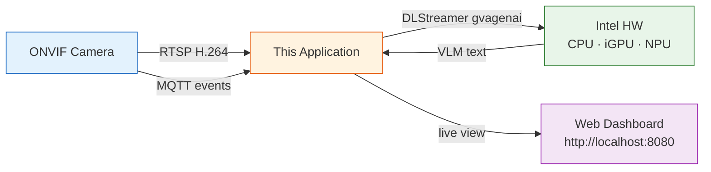

# ONVIF Profile M Analytics Validation Pipeline (VLM Edition)

Receives video from an ONVIF camera via RTSP, runs **Visual Language Model
(VLM)** inference using **Intel DLStreamer** (GStreamer + `gvagenai`) on Intel
hardware (CPU/iGPU/NPU), cross-validates against the camera's own analytics
events received via MQTT, and displays results in a **live web dashboard**.



## Prerequisites

- Python 3.10+
- [Intel DLStreamer](https://github.com/open-edge-platform/dlstreamer) 2026.0.0 or later
- [OpenVINO GenAI](https://docs.openvino.ai/2025/get-started/install-openvino/install-openvino-genai.html)
- An ONVIF-enabled camera with MQTT event support
- A [Hugging Face](https://huggingface.co/) account (required for gated model access)

## Setup

### 1. Install and start the MQTT broker (Mosquitto)

```bash
sudo apt update && sudo apt install -y mosquitto mosquitto-clients
sudo systemctl enable mosquitto && sudo systemctl start mosquitto
```

Ensure `/etc/mosquitto/mosquitto.conf` allows connections from the camera
(external devices):

```text
listener 1883
allow_anonymous true
```

```bash
sudo systemctl restart mosquitto
```

### 2. Configure camera MQTT events

Point your camera's MQTT event settings to the broker host IP
(e.g. `tcp://<broker-ip>:1883`) with topic prefix `onvif/analytics/<Serial_No>`.


The exact configuration steps vary by camera manufacturer — refer to your
camera's documentation for instructions on enabling MQTT event publishing.

For **Axis cameras**, use the camera's web UI (**System → Events → MQTT**).

Verify events arrive:

```bash
mosquitto_sub -h localhost -t "onvif/analytics/#" -v
```

### 3. Set up DLStreamer environment

```bash
source /opt/intel/dlstreamer/scripts/setup_dls_env.sh
```

### 4. Create a Python virtual environment and install dependencies

```bash
python3 -m venv venv
source venv/bin/activate
pip install -r requirements.txt
```

### 5. Model Setup

Some VLM models on Hugging Face are **gated** and require prior approval.
Before exporting, complete these steps:

1. Create a [Hugging Face account](https://huggingface.co/join)
2. Go to the model page (e.g. [openbmb/MiniCPM-V-2_6](https://huggingface.co/openbmb/MiniCPM-V-2_6))
   and accept the license/access agreement if prompted
3. Create an [access token](https://huggingface.co/settings/tokens)
4. Log in from the CLI:

```bash
pip install huggingface_hub
huggingface-cli login
```

Export a VLM model to OpenVINO format (run once):

```bash
pip install optimum-intel openvino
optimum-cli export openvino \
    --model openbmb/MiniCPM-V-2_6 \
    --weight-format int4 \
    --trust-remote-code \
    MiniCPM-V-2_6
export GENAI_MODEL_PATH=$PWD/MiniCPM-V-2_6
```

Supported models:

| Model | Export command |
|-------|---------------|
| MiniCPM-V 2.6 | `optimum-cli export openvino --model openbmb/MiniCPM-V-2_6 --weight-format int4 --trust-remote-code MiniCPM-V-2_6` |
| Phi-4-multimodal | `optimum-cli export openvino --model microsoft/Phi-4-multimodal-instruct --trust-remote-code Phi-4-multimodal` |
| Gemma 3 | `optimum-cli export openvino --model google/gemma-3-4b-it --trust-remote-code Gemma3` |

## Quick Start

```bash
# With a real camera (replace IP, credentials, and RTSP URI for your camera):
python3 onvif_camera_analytics_validation.py \
    --camera-ip 192.168.1.100 \
    --onvif-user root --onvif-pass root \
    --rtsp-uri "rtsp://192.168.1.100:554/axis-media/media.amp" \
    --model-path ./MiniCPM-V-2_6
```

> **Note:** The RTSP URI varies by camera manufacturer. Common examples:
>
> | Manufacturer | RTSP URI |
> |---|---|
> | Axis | `rtsp://<IP>:554/axis-media/media.amp` |
> | Hikvision | `rtsp://<IP>:554/Streaming/Channels/101` |
> | Dahua | `rtsp://<IP>:554/live/ch00_0` |
>
> If `--rtsp-uri` is omitted, the application attempts ONVIF auto-discovery
> and falls back to `rtsp://<camera-ip>:554/stream1`.

Then open **http://localhost:8080** in a browser to view the live dashboard.

### Example Output

```
  [   1] cam=3(Human:3) vlm=(Human:1) -> MISMATCH
         VLM: I can see a person walking across the street near a car...
  [   2] cam=3(Human:3) vlm=(Human:1,Vehicle:1) -> MISMATCH
         VLM: There is one person and one car visible in the scene...
  [   3] cam=1(Human:1) vlm=(Human:1) -> OK
         VLM: A single person is standing in the frame...
```

Each line shows the camera-reported object count vs objects extracted from the
VLM text description. `MISMATCH` means they differ; `OK` means they agree.

## CLI Options

| Flag | Default | Description |
|------|---------|-------------|
| `--camera-ip` | `192.168.1.100` | Camera IP address |
| `--onvif-port` | `80` | ONVIF HTTP port |
| `--onvif-user` / `--onvif-pass` | `admin` | ONVIF credentials |
| `--rtsp-uri` | (auto-discovered) | RTSP URI override |
| `--model-path` | `$GENAI_MODEL_PATH` | Path to OpenVINO-exported VLM model directory |
| `--device` | `CPU` | Intel device: `CPU`, `GPU`, `NPU`, `AUTO` |
| `--prompt` | (object listing) | VLM prompt for scene description |
| `--frame-rate` | `1` | VLM frame sampling rate in fps |
| `--chunk-size` | `1` | Frames per VLM inference call |
| `--max-tokens` | `150` | Max tokens for VLM generation |
| `--idle-timeout` | `60` | Stop DLStreamer pipeline after N seconds idle |
| `--mqtt-broker` | `localhost` | MQTT broker address |
| `--mqtt-port` | `1883` | MQTT broker port |
| `--mqtt-topics` | `onvif/analytics/#` | MQTT subscribe topics |
| `--web-port` | `8080` | Web dashboard port |

## MQTT Topics

The application subscribes to `onvif/analytics/#` by default, which matches
all subtopics including camera serial number prefixes
(e.g. `onvif/analytics/<SERIAL>/...`).

| Topic Pattern | Direction | Format | Description |
|-------|-----------|--------|-------------|
| `onvif/analytics/#` | IN | JSON or XML | Camera detection and analytics events |

## Web Dashboard

The built-in web UI at `http://localhost:8080` shows:

| Panel | Content |
|-------|---------|
| **Camera Frame** | Live JPEG frame from the pipeline (refreshed every 2s) |
| **VLM Description** | Latest natural-language text from the VLM model |
| **Cross-Validation** | Match/mismatch status comparing camera events vs VLM |
| **Latest Event** | Raw MQTT event data from the camera |
| **Stats** | Running totals: events processed, VLM inferences, mismatches |

## Files

| File | Purpose |
|------|---------|
| `onvif_camera_analytics_validation.py` | Main pipeline — CLI, DLStreamer VLM inference, web UI, validation loop |
| `util.py` | ONVIF client, MQTT listener, cross-validation |
| `requirements.txt` | Python dependencies |

## Camera Compatibility

This sample has been **developed and tested with Axis cameras** (e.g. Axis M3065-V).
It includes Axis-specific functionality:

- **VAPIX MQTT event parsing** — Axis cameras publish MQTT events in a JSON
  format with fields like `data.IsMotion`, `data.ObjectType`, and
  `data.IsInside`. The MQTT listener (`util.py`) parses this format
  automatically via the `_parse_vapix_event()` function.
- **Camera MQTT configuration** via VAPIX API
  (`/axis-cgi/mqtt/client.cgi`, `/axis-cgi/mqtt/event.cgi`).

**Other ONVIF-compliant cameras** (Hikvision, Dahua, Bosch, Hanwha, etc.)
should work, but may require modifications:

- **MQTT event format** — Different manufacturers use different JSON or XML
  structures for MQTT events. You may need to add a parser in `util.py`
  `MQTTEventListener._on_message()` to handle your camera's payload format.
  The standard ONVIF XML notification format is already supported.
- **RTSP URI path** — Each manufacturer uses a different path
  (see the Quick Start table above).
- **ONVIF authentication** — Some cameras require WS-Security (digest auth)
  for ONVIF SOAP calls. The current implementation uses unauthenticated SOAP
  requests for discovery, which works for cameras that allow it.

## Troubleshooting

### RTSP stream not connecting (401 Unauthorized)

Credentials must be embedded in the RTSP URI. The application does this
automatically when `--onvif-user` and `--onvif-pass` are provided along with
`--rtsp-uri`. If you still see 401 errors:

```bash
# Verify the stream with ffprobe:
ffprobe -rtsp_transport tcp "rtsp://user:pass@<IP>:554/<path>"
```

### No MQTT events arriving

1. Verify the MQTT broker is running:
   ```bash
   sudo systemctl status mosquitto
   ```
2. Check that the broker accepts external connections
   (`listener 1883` and `allow_anonymous true` in `/etc/mosquitto/mosquitto.conf`).
3. Verify the camera's MQTT client is connected and publishing to the correct
   broker IP (not `localhost` — use the host machine's actual IP as seen from
   the camera's network).
4. Subscribe manually to verify events arrive:
   ```bash
   mosquitto_sub -h localhost -t "onvif/analytics/#" -v
   ```
5. Camera analytics events only fire when there is **actual motion or objects**
   in the camera's field of view. Walk in front of the camera to trigger events.

### Dashboard shows "Waiting for VLM inference..."

- The first VLM inference can take **30–120 seconds** on CPU while the model
  loads. Wait for the first frame to be processed.
- Check the terminal for errors — a `DLStreamer error` message indicates the
  model failed to run (see model-specific issues below).

### Dashboard shows "Waiting..." for Cross-Validation

Cross-validation requires **both** a VLM result **and** an MQTT event from the
camera. If no MQTT events arrive (no motion in scene), cross-validation will
remain in the waiting state. The VLM description panel will still update
independently.

### Port 8080 already in use

```bash
fuser -k 8080/tcp
```

Then restart the application, or use `--web-port <port>` to choose a different port.

### InternVL model reshape error

InternVL models may fail with a reshape error like:
```
[cpu]reshape: the shape of input data conflicts with the reshape pattern
```
This occurs because the vision encoder is traced with a fixed tile count that
doesn't match the RTSP stream resolution. Use **Qwen2.5-VL-3B** or
**MiniCPM-V-2_6** instead.

### GstApp typelib not found

```
ValueError: Namespace GstApp not available
```

Install the GStreamer typelib package:
```bash
sudo apt install gir1.2-gst-plugins-base-1.0
```

### Pipeline stops after idle timeout

If no MQTT events arrive within `--idle-timeout` seconds (default 60), the
DLStreamer pipeline stops to save resources. It restarts automatically when
the next event arrives. Increase with `--idle-timeout 300` or `--idle-timeout 0`
to disable.