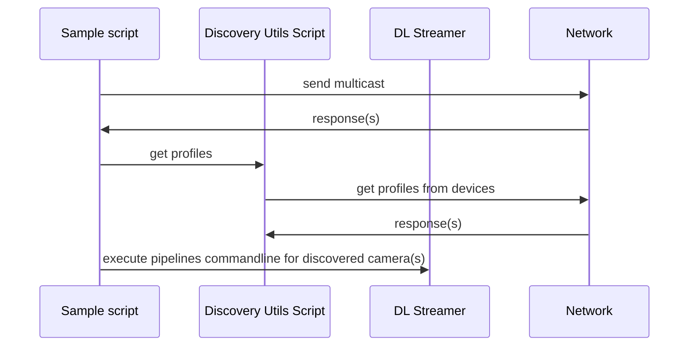

# ONVIF Cameras Detection Sample for DLStreamer


### Overview
This sample demonstrates how to build an application that discovers IP cameras which support ONVIF protocol and based on configuration stored in json file execute DLS pipeline.
### Key Features
- ONVIF cameras discovery: 
    <span style="color: red;">
        TEXT HERE 
    </span>
- DL STREAMER camera/pipeline configuration: based on discovered cameras new DLS pipelines to be executed.


The individual pipeline stages implement the following functions: 
* __ONVIF camera discovery__ script which discovers IP based cameras common with ONVIF protocol.


## How It Works

###  Pipeline creations steps



## Prerequisite
Ensure platform has installed modules listed in the equirements.txt file.
</br>


## Sample execution

#### Command line

```
TBD
```
## Sample Output

The sample:
TBD


## See also
* [Samples overview](../../README.md)