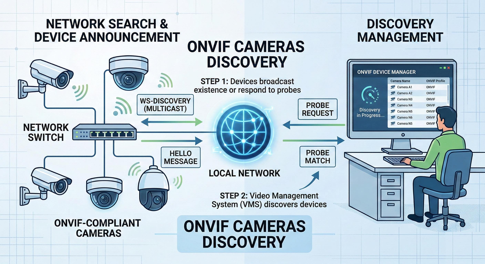

# ONVIF Camera Discovery Sample

## Table of Contents
1. [Overview](#overview)
2. [What Is Included](#what-is-included)
3. [Prerequisites](#prerequisites)
4. [How It Works](#how-it-works)
5. [Configuration](#configuration)
6. [Running The Sample](#running-the-sample)
7. [Module Documentation](#module-documentation)
8. [Usage Examples](#usage-examples)
9. [Troubleshooting](#troubleshooting)

---

## Overview

The sample demonstrates automatic discovery and streaming from ONVIF-compliant
IP cameras using DL Streamer. The application discovers cameras on the local
network, retrieves their streaming profiles, and launches concurrent GStreamer
pipelines for video processing — leveraging modern `VideoEngine` APIs.

### Key Capabilities
- **Automatic Camera Discovery**: Uses WS-Discovery multicast protocol to find ONVIF cameras
- **Profile Extraction**: Retrieves detailed video/audio encoder configurations
- **VideoEngine Integration**: Unified discovery loop, stale-camera handling, and pipeline lifecycle management
- **Concurrent Streaming**: Manages multiple GStreamer pipelines simultaneously
- **Periodic Re-discovery**: Detects added/removed cameras between cycles
- **Verbose Profile Dump**: Optional detailed profile table (via `--verbose` or `config.json`)
- **Graceful Shutdown**: Properly terminates all pipelines on exit
- **Flexible Configuration**: Supports both legacy and new VideoEngine config schemas

### Technology Stack
- **ONVIF Protocol**: Industry-standard IP camera communication protocol
- **WS-Discovery**: Multicast network discovery (SOAP over UDP)
- **GStreamer**: Multimedia framework for video processing
- **VideoEngine**: Modern DL Streamer discovery and pipeline orchestration
- **Python 3.10+**: Core implementation language (asyncio-based)

---

## What Is Included

| File | Description |
|------|-------------|
| `dls_onvif_sample.py` | Entry point — async discovery loop and pipeline launcher |
| `config.json` | Maps camera names to hostname, port, and pipeline definitions |
| `requirements.txt` | Python dependencies for this sample |

All ONVIF and pipeline logic lives in the **`dlstreamer.onvif`** library
(installed as part of the `intel-dlstreamer` Python package):

| Class / Function | Description |
|------|-------------|
| `discover_onvif_cameras_async()` | WS-Discovery async generator for low-level camera discovery |
| `VideoEngine` | Modern orchestrator for discovery loop, camera registry, and pipeline lifecycle |
| `DlsOnvifConfigManager` | Pipeline configuration loader (supports both schemas) |
| `DlsLaunchedPipeline` | GStreamer pipeline lifecycle manager |
| `ONVIFProfile` | ONVIF profile data structure |

---

## Prerequisites

- Python 3.10 or newer
- GStreamer with Python bindings (`python3-gi`, `gir1.2-gst-1.0`)
- Network access to ONVIF cameras on the local subnet
- Valid camera credentials if the device requires authentication

Install the `intel-dlstreamer` Python package (includes `dlstreamer.onvif`):

```bash
pip install https://github.com/open-edge-platform/dlstreamer/releases/download/v2026.2.0/intel_dlstreamer-2026.2.0-py3-none-any.whl
```

Alternatively, if you have DL Streamer installed locally:

```bash
pip install /opt/intel/dlstreamer/python/intel_dlstreamer-*.whl
```

---

## How It Works

### Architecture Overview



The diagram above illustrates the complete ONVIF discovery workflow:
- **Left**: ONVIF-compliant IP cameras on the local network
- **Center**: WS-Discovery multicast protocol (PROBE REQUEST / HELLO MESSAGE)
- **Right**: ONVIF Device Manager receiving and managing discovered cameras
- **Steps**: 
  - **STEP 1**: Cameras broadcast existence or respond to probe requests
  - **STEP 2**: Video Management System (VMS) discovers devices and retrieves profiles

### Discovery Process

1. The sample sends a WS-Discovery probe to `239.255.255.250:3702` via `discover_onvif_cameras_async()`.
2. It parses returned `XAddrs` endpoints and extracts camera hostname and port.
3. `VideoEngine` maintains a registry of discovered cameras.
4. For each discovered camera it creates an entry in the VideoEngine registry.
5. It connects via `ONVIFCamera` and retrieves media profiles with RTSP URIs.
6. It reads the pipeline definition from `config.json` (either legacy or VideoEngine schema).
7. For every profile with an RTSP URL it launches a GStreamer pipeline:

```text
gst-launch-1.0 -e rtspsrc location=<rtsp_url> protocols=tcp latency=100 <pipeline definition from config.json>
```

8. On subsequent discovery cycles, new cameras are added, missing cameras are removed
   (their pipelines stopped), and existing cameras are updated (`last_seen_at`).

If no pipeline is configured for a discovered camera, that camera is skipped.

---

## Configuration

The sample reads `config.json` from the current working directory (or the path
given with `--config-file`).

### Legacy Config Format

**Backward-compatible schema** (named camera objects with `definition` field):

```json
{
    "verbose": true,
    "kitchen": {
        "hostname": "192.168.1.100",
        "port": 8080,
        "definition": " ! rtph264depay ! h264parse ! avdec_h264 ! videoconvert ! autovideosink"
    },
    "living_room": {
        "hostname": "192.168.1.101",
        "port": 8090,
        "definition": " ! rtph264depay ! h264parse ! avdec_h264 ! videoconvert ! autovideosink"
    }
}
```

| Key | Type | Description |
|-----|------|-------------|
| `verbose` | `bool` | Optional. Print detailed profile tables on discovery. |
| `<camera_name>` | `object` | Named camera entry. |
| `hostname` | `str` | Camera IP address (must match WS-Discovery result). |
| `port` | `int` | Camera ONVIF port. |
| `definition` | `str` | GStreamer pipeline fragment appended after `rtspsrc location=<url>`. |

### VideoEngine Config Format

**Alternative schema** (uses `pipelines` key with interpolation):

```json
{
    "verbose": true,
    "pipelines": [
        {
            "name": "kitchen",
            "discovery": {
                "hostname": "192.168.1.100",
                "port": 8080
            },
            "command": "gst-launch-1.0 -e rtspsrc location={url} protocols=tcp latency=100 ! rtph264depay ! h264parse ! avdec_h264 ! videoconvert ! autovideosink"
        },
        {
            "name": "living_room",
            "discovery": {
                "hostname": "192.168.1.101",
                "port": 8090
            },
            "command": "gst-launch-1.0 -e rtspsrc location={url} protocols=tcp latency=100 ! rtph264depay ! h264parse ! avdec_h264 ! videoconvert ! autovideosink"
        }
    ]
}
```

### Configuration Notes

- Use a pipeline fragment (legacy) or full `gst-launch-1.0` command (VideoEngine schema).
- Validate the fragment/command with `gst-launch-1.0` before adding it to the config.
- Cameras discovered but not matching any config entry are skipped.
- The sample auto-detects which schema is used and adapts behavior accordingly.

---

## Running The Sample

### Basic usage

```bash
python dls_onvif_sample.py --username admin --password admin
```

### With verbose profile output

```bash
python dls_onvif_sample.py --username admin --password admin --verbose
```

### With custom config and refresh rate

```bash
python dls_onvif_sample.py \
    --username admin \
    --password admin \
    --config-file /path/to/config.json \
    --refresh-rate 30 \
    --verbose
```

### CLI arguments

| Argument | Default | Description |
|----------|---------|-------------|
| `--username` | `$ONVIF_USER` | ONVIF camera username |
| `--password` | `$ONVIF_PASSWORD` | ONVIF camera password |
| `--refresh-rate` | `60` | Seconds between discovery cycles |
| `--config-file` | `config.json` | Path to pipeline configuration JSON |
| `--verbose` | `false` | Print detailed profile information |

### Behavior

- Discovery runs in a continuous async loop (managed by `VideoEngine`)
- One GStreamer pipeline is started per discovered profile with an RTSP URL
- New cameras are added and stale cameras are removed between cycles
- `verbose` can be enabled via CLI (`--verbose`) or `config.json` (`"verbose": true`)
- `Ctrl+C` gracefully stops all pipelines

---

## Module Documentation

### `dls_onvif_sample.py`

Entry point. Parses CLI arguments, initializes `VideoEngine`,
runs the async discovery loop, and handles graceful shutdown.

### `dlstreamer.onvif` library

All discovery and pipeline logic is provided by the `dlstreamer.onvif` package
(part of `intel-dlstreamer`). Key exports used by this sample:

```python
from dlstreamer.onvif import (
    discover_onvif_cameras_async,
    VideoEngine,
    ONVIFProfile,
    DlsLaunchedPipeline,
    DlsOnvifConfigManager,
)
```

**`discover_onvif_cameras_async()`** — low-level WS-Discovery generator,
yields `{"hostname": str, "port": int}` per camera found.

**`VideoEngine`** — modern high-level orchestrator:
- Runs discovery loop (`discover_cameras_iter()`)
- Manages camera registry and lifecycle
- Handles stale-camera removal
- Launches and monitors GStreamer pipelines
- Supports both legacy and new config schemas

**`DlsOnvifConfigManager`** — loads `config.json`, provides pipeline definitions.

**`DlsLaunchedPipeline`** — manages a single GStreamer pipeline in a dedicated thread.

**`ONVIFProfile`** — container for ONVIF profile data: video source, video encoder, audio encoder, PTZ configuration, and RTSP URL.

---

## Usage Examples

### Pipeline examples for `config.json` (legacy schema)

**Software decoding + display:**
```json
{
    "cam1": {
        "hostname": "192.168.1.100",
        "port": 80,
        "definition": " ! rtph264depay ! h264parse ! avdec_h264 ! videoconvert ! autovideosink"
    }
}
```

**Hardware-accelerated decoding (Intel VA-API):**
```json
{
    "cam1": {
        "hostname": "192.168.1.100",
        "port": 80,
        "definition": " ! rtph264depay ! h264parse ! vah264dec ! vapostproc ! autovideosink"
    }
}
```

**Save to file:**
```json
{
    "cam1": {
        "hostname": "192.168.1.100",
        "port": 80,
        "definition": " ! rtph264depay ! h264parse ! video/x-h264 ! mp4mux ! filesink location=/tmp/camera1.mp4"
    }
}
```

**DL Streamer with object detection:**
```json
{
    "cam1": {
        "hostname": "192.168.1.100",
        "port": 80,
        "definition": " ! rtph264depay ! h264parse ! avdec_h264 ! gvadetect model=/path/to/model.xml ! gvawatermark ! autovideosink"
    }
}
```

### VideoEngine schema examples

**Software decoding + display:**
```json
{
    "pipelines": [
        {
            "name": "cam1",
            "discovery": {
                "hostname": "192.168.1.100",
                "port": 80
            },
            "command": "gst-launch-1.0 -e rtspsrc location={url} protocols=tcp latency=100 ! rtph264depay ! h264parse ! avdec_h264 ! videoconvert ! autovideosink"
        }
    ]
}
```

**Hardware-accelerated decoding:**
```json
{
    "pipelines": [
        {
            "name": "cam1",
            "discovery": {
                "hostname": "192.168.1.100",
                "port": 80
            },
            "command": "gst-launch-1.0 -e rtspsrc location={url} protocols=tcp latency=100 ! rtph264depay ! h264parse ! vah264dec ! vapostproc ! autovideosink"
        }
    ]
}
```

---

## Troubleshooting

| Problem | Solution |
|---------|----------|
| No cameras found | Check multicast routing, firewall rules, and that cameras support ONVIF WS-Discovery |
| Camera discovered but skipped | Add a matching entry (hostname + port) to `config.json` (either schema) |
| `--verbose True` → `unrecognized arguments` | Use `--verbose` without a value (it's a flag) |
| Authentication failures | Confirm `--username` and `--password` are valid for the target camera |
| `ModuleNotFoundError: No module named 'gi'` | Install: `sudo apt install python3-gi gir1.2-gst-1.0` |
| Config schema errors | Ensure JSON syntax is valid; check if using legacy vs VideoEngine schema correctly |
| Pipeline fails to start | Validate pipeline command with `gst-launch-1.0` before adding to config |

---

## License

Copyright (C) 2026 Intel Corporation

SPDX-License-Identifier: MIT

---

## References

- **DL Streamer**: https://github.com/open-edge-platform/dlstreamer
- **ONVIF Specification**: https://www.onvif.org/specs/core/ONVIF-Core-Specification.pdf
- **WS-Discovery**: http://docs.oasis-open.org/ws-dd/discovery/1.1/wsdd-discovery-1.1-spec.html

---

[Deep Learning Streamer (DL Streamer) Python Samples](../README.md)
