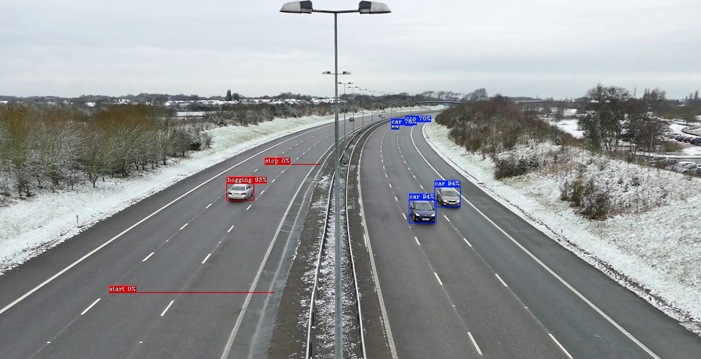

# Smart Network Video Recorder for Lane Hogging Detection

This sample demonstrates how to build a simple Network Video Recorder (NVR) with custom video analytics using DLStreamer elements.
It detects line-hogging events—vehicles driving in outer lanes without a neighboring vehicle—which may be illegal in certain jurisdictions.



The event detection logic is straightforward and designed for demonstration purposes. 
This sample showcases how to integrate custom analytics and custom video storage into a DLStreamer pipeline composed of:

```mermaid
graph LR
        A[filesrc (GStreamer element)] --> B[decodebin3 (GStreamer element)]
        B --> C[gvadetect (DLStreamer element)]
        C --> D[gvaanalytics_py (custom element)]
        D --> E[gvawatermark (DLStreamer element)]
        E --> F[gvarecorder_py (custom element)]
```

The sample uses the following set of pipeline elements: 

* __filesrc__ - GStreamer element that reads the video stream from a local file
* __decodebin3__ - GStreamer element that decodes the video stream into individual frames
* __gvadetect__ - DLStreamer inference element that detects vehicles using the RTDETRv2 model
* __gvaanalytics_py__ - Custom Python element that processes object detection results and identifies lane-hogging vehicles
* __gvawatermark__ - DLStreamer element that renders detection results and custom objects (lane-hogging vehicles) on video frames
* __gvarecorder_py__ - Custom Python element that segments the video into 10-second chunks and stores metadata for each segment 

## Running

### Prerequisites

This sample requires Python libraries beyond the DLStreamer distribution to download the RTDETRv2 model from HuggingFace and implement custom analytics logic. An active network connection is required.

Install dependencies:

```sh
python3 -m venv .smart_nvr_venv
source .smart_nvr_venv/bin/activate
curl -LO https://raw.githubusercontent.com/openvinotoolkit/openvino.genai/refs/heads/releases/2026/0/samples/export-requirements.txt
pip install -r export-requirements.txt -r requirements.txt
```

### Running the Sample

Run the application with no configuration required. It automatically downloads the default video file and detection model:

```sh
python3 ./smart_nvr.py
```

### Inspecting Output

The sample generates output video chunks (*.mp4) and corresponding metadata files (*.txt):

```sh
output-00.txt
output-00.mp4
output-01.txt
output-01.mp4
...
```

Each metadata file contains the detected objects and events for its corresponding video segment:

```sh
Objects: ['car', 'hogging', 'truck']
```

To identify lane-hogging events, search the metadata files for 'hogging' entries, then review the corresponding video segment to observe the detected behavior.

## How It Works

### STEP 1 - Model Download and Conversion

The sample downloads an example video file and the RTDETRv2 object detection model from HuggingFace. 
The RTDETRv2 PyTorch model is converted to OpenVINO IR (with ONNX as an intermediate step) using the standard HuggingFace toolchain.
The sample also downloads the `preprocessor_config.json` file, which DLStreamer inference elements use to configure image preprocessing.

```code
subprocess.run(["optimum-cli", "export", "onnx", "--model", "PekingU/rtdetr_v2_r50vd", 
                                "--task", "object-detection", "--opset", "18", "--width", "640", "--height", "640", "rtdetr_v2_r50vd"],
        check=True)
subprocess.run(["hf", "download", "PekingU/rtdetr_v2_r50vd", "--include", "preprocessor_config.json", "--local-dir", "."], check=True)
subprocess.run(["ovc", "model.onnx"], check=True)
```

The sample skips this step on subsequent runs if the video file and model are already downloaded.

### STEP 2 - DLStreamer Pipeline Construction

The application creates a GStreamer `pipeline` object that combines predefined GStreamer and DLStreamer elements with custom Python elements. 
The pipeline is configured with the downloaded video file and detection model, and uses GPU inference by default.

```code
pipeline = Gst.parse_launch(
                f"filesrc location={video_file} ! decodebin3 ! "
                f"gvadetect model={detection_model} device=GPU batch-size=4 threshold=0.7 ! queue ! "
                f"gvaanalytics_py distance=500 angle=-135,-45 ! gvawatermark displ-cfg=draw-txt-bg=true ! " 
                f"gvarecorder_py location=output.mp4 max-time=10")
```

### STEP 3 - Custom Analytics Element

The `gvaanalytics_py` element is defined in `plugins/python/gvaAnalytics.py`.

This transform element processes GstAnalytics metadata generated by `gvadetect` and adds custom metadata. It implements the following logic:

- Detects cars or trucks crossing outer lanes (defined by the 'zone' polygon)
- For vehicles in the outer lane, checks for neighboring vehicles in the adjacent lane using 'distance' and 'angle' parameters
- Classifies vehicles with no neighboring traffic as lane-hogging and inserts a new "hogging" object into the metadata stream

### STEP 4 - Custom Video File Storage Element

The `gvarecorder_py` element is defined in `plugins/python/gvaRecorder.py`.
It is a bin element that wraps a sequence of GStreamer elements into a sub-pipeline: 

```code
videoconvert -> vah264enc -> h264parse -> splitmuxsink
```

The element registers custom callbacks and signal handlers to process analytics metadata: 

```code
self.get_static_pad("sink").add_probe(Gst.PadProbeType.BUFFER, self.buffer_probe, 0)
self._filesink.get_static_pad("video").add_probe(Gst.PadProbeType.EVENT_DOWNSTREAM, self.event_probe, 0)
self._filesink.connect("format-location", self.format_location_callback, 0)
```

The `buffer_probe` callback collects object categories detected by upstream elements.

The `event_probe` callback handles end-of-stream events to store metadata for the last video segment. 

The `format_location_callback` is invoked when a new video segment starts. It writes the accumulated metadata to a file associated with that segment.

## See also
* [Samples overview](../../README.md)

