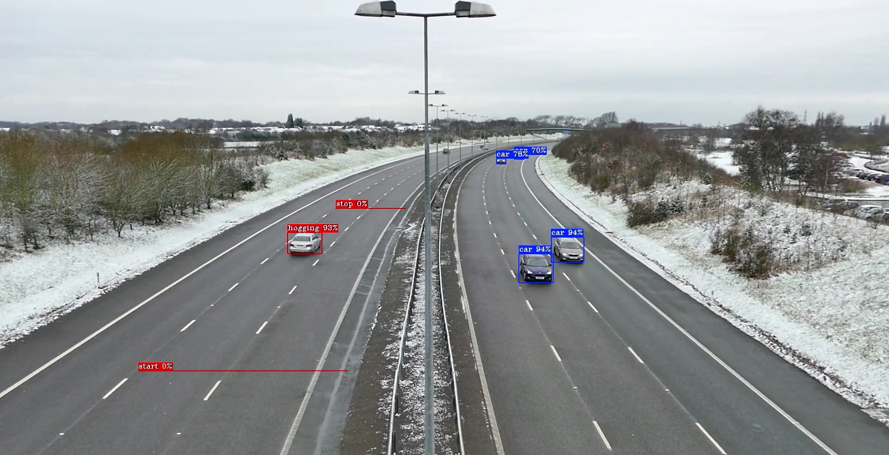
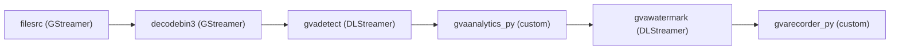

# Smart Network Video Recorder for Lane Hogging Detection

This sample demonstrates how to build a simple Network Video Recorder (NVR) with custom video analytics using DLStreamer elements.
It detects line-hogging events—vehicles driving in outer lanes without a neighboring vehicle—which may be illegal in certain jurisdictions.



The event detection logic is straightforward and designed for demonstration purposes. 
This sample showcases how to integrate custom analytics and custom video storage into a DLStreamer pipeline composed of:


```mermaid
graph LR
        A["filesrc (GStreamer)"] --> B["decodebin3 (GStreamer)"]
        B --> C["gvadetect (DLStreamer)"]
        C --> D["gvaanalytics_py (custom)"]
        D --> E["gvawatermark (DLStreamer)"]
        E --> F["gvarecorder_py (custom)"]
```

The sample uses the following set of pipeline elements: 

* __filesrc__ - GStreamer element that reads the video stream from a local file
* __decodebin3__ - GStreamer element that decodes the video stream into individual frames
* __gvadetect__ - DLStreamer inference element that detects vehicles using the RTDETRv2 model
* __gvaanalytics_py__ - Custom Python element that processes object detection results and identifies lane-hogging vehicles
* __gvawatermark__ - DLStreamer element that renders detection results and custom objects (lane-hogging vehicles) on video frames
* __gvarecorder_py__ - Custom Python element that segments the video into 10-second chunks and stores metadata for each segment 

## Prerequisites

### Prepare Model

Export the RTDETRv2 detection model to OpenVINO IR format (run on host, only needed once).

```sh
python3 -m venv .smart_nvr_venv
source .smart_nvr_venv/bin/activate
pip install -r requirements.txt
mkdir -p models
optimum-cli export onnx --model PekingU/rtdetr_v2_r50vd \
    --task object-detection --opset 18 --width 640 --height 640 models/rtdetr_v2_r50vd
hf download PekingU/rtdetr_v2_r50vd --include preprocessor_config.json --local-dir models/rtdetr_v2_r50vd
ovc models/rtdetr_v2_r50vd/model.onnx --output_model models/rtdetr_v2_r50vd/model
deactivate
```

### Install DLStreamer

#### Option A: Docker image (recommended)

Pull the latest DLStreamer image and start an interactive container with GPU access, mounting the sample directory:

```sh
docker pull intel/dlstreamer:latest
docker run --init -it --rm \
    -v "$(pwd)":/app -w /app \
    --device /dev/dri \
    --group-add $(stat -c "%g" /dev/dri/render*) \
    intel/dlstreamer:latest
```

> Note: install Docker Engine if not already available (see [Docker installation guide](https://docs.docker.com/engine/install/)).
> All subsequent commands run inside this container shell.

#### Option B: Native installation

Install DLStreamer on the host (see [DLStreamer Installation Guide](../../../../docs/user-guide/get_started/install/install_guide_index.md)).

## Run Sample Application

The application automatically downloads the default video file on the first run:

```sh
python3 smart_nvr.py --model models/rtdetr_v2_r50vd/model.xml
```

Run `python3 smart_nvr.py --help` to see available options (input file, device, threshold, etc.).

### Inspecting Output

The sample generates output video chunks (*.mp4) and corresponding metadata files (*.txt):

```sh
output-00.txt
output-00.mp4
output-01.txt
output-01.mp4
...
```

Each metadata file contains the detected objects and events for its corresponding video segment:

```sh
Objects: ['car', 'hogging', 'truck']
```

To identify lane-hogging events, search the metadata files for 'hogging' entries, then review the corresponding video segment to observe the detected behavior.

## How It Works

### DLStreamer Pipeline Construction

The application creates a GStreamer `pipeline` object that combines predefined GStreamer and DLStreamer elements with custom Python elements. 
The pipeline is configured with the downloaded video file and detection model, and uses GPU inference by default.

```code
pipeline = Gst.parse_launch(
                f'filesrc location="{video_file}" ! decodebin3 caps="video/x-raw(ANY)" ! '
                f'gvadetect model="{detection_model}" device={args.device} '
                f'batch-size={args.batch_size} threshold={args.threshold} ! queue ! '
                f'gvaanalytics_py distance=500 angle=-135,-45 ! gvafpscounter ! gvawatermark ! '
                f'gvarecorder_py location="{args.output}" max-time={args.max_time}')
```

### Custom Analytics Element

The `gvaanalytics_py` element is defined in `plugins/python/gvaAnalytics.py`.

This transform element processes GstAnalytics metadata generated by `gvadetect` and adds custom metadata. It implements the following logic:

- Detects cars or trucks crossing outer lanes (defined by the 'zone' polygon)
- For vehicles in the outer lane, checks for neighboring vehicles in the adjacent lane using 'distance' and 'angle' parameters
- Classifies vehicles with no neighboring traffic as lane-hogging and inserts a new "hogging" object into the metadata stream

### Custom Video File Storage Element

The `gvarecorder_py` element is defined in `plugins/python/gvaRecorder.py`.
It is a bin element that wraps a sequence of GStreamer elements into a sub-pipeline: 

```code
videoconvert -> vah264enc -> h264parse -> splitmuxsink
```

The element registers custom callbacks and signal handlers to process analytics metadata: 

```code
self.get_static_pad("sink").add_probe(Gst.PadProbeType.BUFFER, self.buffer_probe, 0)
self._filesink.get_static_pad("video").add_probe(Gst.PadProbeType.EVENT_DOWNSTREAM, self.event_probe, 0)
self._filesink.connect("format-location", self.format_location_callback, 0)
```

The `buffer_probe` callback collects object categories detected by upstream elements.

The `event_probe` callback handles end-of-stream events to store metadata for the last video segment. 

The `format_location_callback` is invoked when a new video segment starts. It writes the accumulated metadata to a file associated with that segment.

## See also
* [Samples overview](../../README.md)

